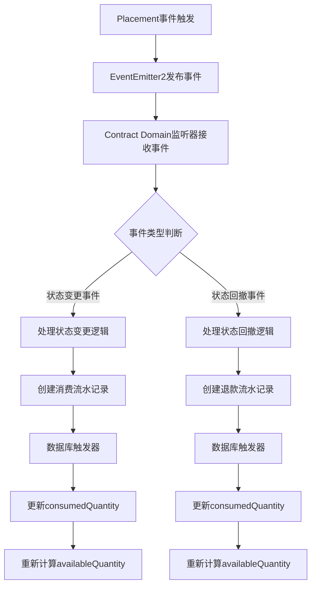
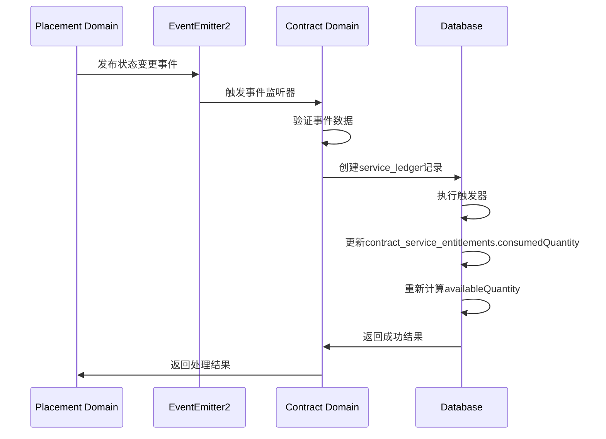
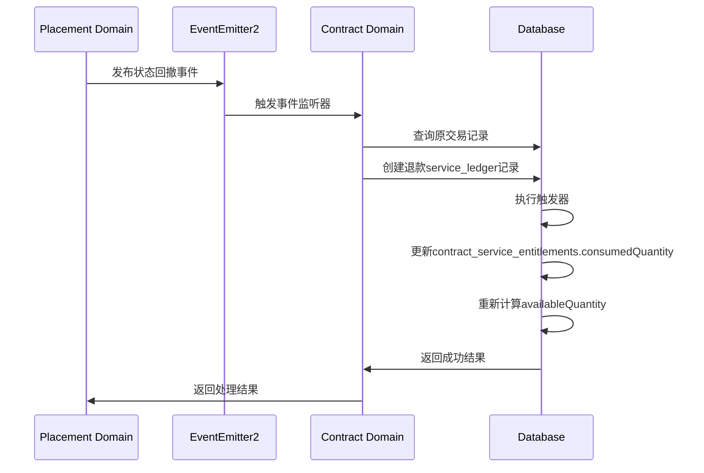

# Placement Domain与Contract Domain集成方案

## 1. 概述

本方案旨在建立Placement Domain与Contract Domain之间的集成机制，确保Placement Domain中的事件能被Contract Domain正确订阅和处理，实现学生服务权益的准确扣除和管理。

## 2. Placement Domain事件类型分析

### 2.1 核心事件类型

| 事件名称 | 事件描述 | 触发时机 |
|---------|---------|---------|
| JOB_APPLICATION_STATUS_CHANGED_EVENT | 投递状态变更事件 | 当投递申请状态转换为新状态时 |
| JOB_APPLICATION_STATUS_ROLLED_BACK_EVENT | 投递状态回撤事件 | 当投递申请状态回撤到上一个状态时 |

### 2.2 权益相关事件触发点

| 事件触发点 | 权益类型 | 触发条件 |
|---------|---------|---------|
| 顾问代投 | Counselor权益 | 当applicationType为PROXY时 |
| 导师内推 | 导师权益 | 当applicationType为REFERRAL时 |
| BD推荐 | BD权益 | 当applicationType为BD时 |

## 3. Contract Domain权益表结构分析

### 3.1 核心权益表

#### 3.1.1 contract_service_entitlements（学生级权益累积表）

| 字段名 | 类型 | 描述 | 关键特性 |
|-------|------|------|---------|
| studentId | UUID | 学生ID | 主键组件 |
| serviceType | VARCHAR | 服务类型 | 主键组件 |
| totalQuantity | INTEGER | 总权益数量 | 从contract_amendment_ledgers累加 |
| consumedQuantity | INTEGER | 已消费数量 | 从service_ledgers累加 |
| heldQuantity | INTEGER | 预占数量 | 从service_holds更新 |
| availableQuantity | INTEGER | 可用数量 | 计算：total - consumed - held |

**设计原则：**
- 学生级别权益累积制
- 跨合同权益自动累加
- 合同终止后权益继续保留
- 仅触发器可更新

#### 3.1.2 service_ledgers（服务消费流水表）

| 字段名 | 类型 | 描述 | 关键特性 |
|-------|------|------|---------|
| studentId | VARCHAR | 学生ID | 外键关联用户表 |
| serviceType | VARCHAR | 服务类型 | 外键关联service_types |
| quantity | INTEGER | 数量变化 | 负数=消费，正数=退款/调整 |
| type | ENUM | 流水类型 | consumption, refund, adjustment |
| source | ENUM | 操作来源 | booking_completed, booking_cancelled, manual_adjustment |
| balanceAfter | INTEGER | 操作后余额 | 用于记录操作后余额 |

**设计原则：**
- 仅允许INSERT，禁止UPDATE/DELETE
- 完整的审计追踪
- 触发器自动更新contract_service_entitlements

## 4. 事件订阅机制

### 4.1 事件订阅配置

- **订阅位置**：在Contract Domain的`events/listeners`目录下创建`placement-event.listener.ts`
- **订阅方式**：使用`@OnEvent()`装饰器订阅Placement Domain事件
- **事件处理**：实现事件处理方法，处理不同类型的Placement事件

### 4.2 事件处理流程

## 5. 权益扣除逻辑与执行流程

### 5.1 权益扣除规则

| 投递类型 | 权益类型 | 扣除数量 | 扣除时机 |
|---------|---------|---------|---------|
| DIRECT | 无 | 0 | 无需扣除 |
| PROXY | Counselor | 1 | 申请提交时 |
| REFERRAL | 学生服务权益 | 1 | 导师评估通过时 |
| BD | BD | 1 | 申请提交时 |

### 5.2 权益扣除执行流程

## 6. 权益回滚/对冲机制

### 6.1 权益回滚规则

| 触发条件 | 对冲类型 | 对冲数量 |
|---------|---------|---------|
| 投递状态回撤 | 退款对冲 | 原扣除数量 |
| 权益扣除错误 | 调整对冲 | 错误扣除数量 |
| 系统异常 | 补偿对冲 | 异常影响数量 |

### 6.2 权益回滚执行流程

## 7. 错误处理与异常管理

### 7.1 错误类型与处理策略

| 错误类型 | 处理策略 |
|---------|---------|
| 权益不足 | 抛出异常，返回403错误 |
| 数据库错误 | 事务回滚，返回500错误 |
| 网络错误 | 重试机制，最多重试3次 |
| 业务逻辑错误 | 抛出异常，返回400错误 |

### 7.2 重试机制

- **事件处理重试**：对失败的事件处理进行重试
- **重试策略**：指数退避策略，最多重试3次
- **死信队列**：超过重试次数的事件进入死信队列
- **人工处理**：死信队列中的事件由人工处理

## 8. 实现步骤

1. **事件监听器实现**：在Contract Domain中创建Placement事件监听器
2. **权益扣除逻辑实现**：实现不同投递类型的权益扣除逻辑
3. **权益回滚机制实现**：实现基于退款流水的权益回滚机制
4. **错误处理实现**：实现完整的错误处理和重试机制
5. **测试验证**：编写单元测试和集成测试验证集成效果
6. **部署上线**：将集成代码部署到生产环境

## 9. 监控与维护

### 9.1 监控指标

- **事件处理成功率**：监控Placement事件的处理成功率
- **权益扣除准确率**：监控权益扣除的准确性
- **服务ledger创建成功率**：监控服务流水记录创建成功率

### 9.2 维护机制

- **日志记录**：详细记录所有事件处理和权益操作
- **异常告警**：对处理失败的事件和异常情况进行告警
- **定期审计**：定期审计权益使用情况
- **版本管理**：对集成接口进行版本管理

## 10. 职责边界

### 10.1 Contract Domain职责

- **权益管理**: 仅负责学生级别的服务权益管理
- **权益范围**: 仅管理服务权益的累积、消费和预占
- **事件处理**: 仅处理与学生服务权益相关的事件
- **数据交互**: 仅通过事件与其他domain进行数据交互

### 10.2 禁止职责

- **导师权益处理**: 禁止处理任何与导师权益相关的业务逻辑
- **交易记录管理**: 禁止管理、存储或维护任何形式的交易记录
- **财务数据处理**: 禁止处理支付记录、结算记录等财务相关数据
- **导师权益分配**: 禁止参与导师权益的分配机制

## 11. 结论

本方案建立了Placement Domain与Contract Domain之间的完整集成机制，严格遵循了Contract Domain的职责范围，仅处理学生服务权益的扣除和管理，不涉及导师权益和交易记录。通过实施本方案，可以确保Placement Domain中的业务流程与Contract Domain中的权益管理实现无缝集成，提高系统的可靠性、准确性和可追溯性。