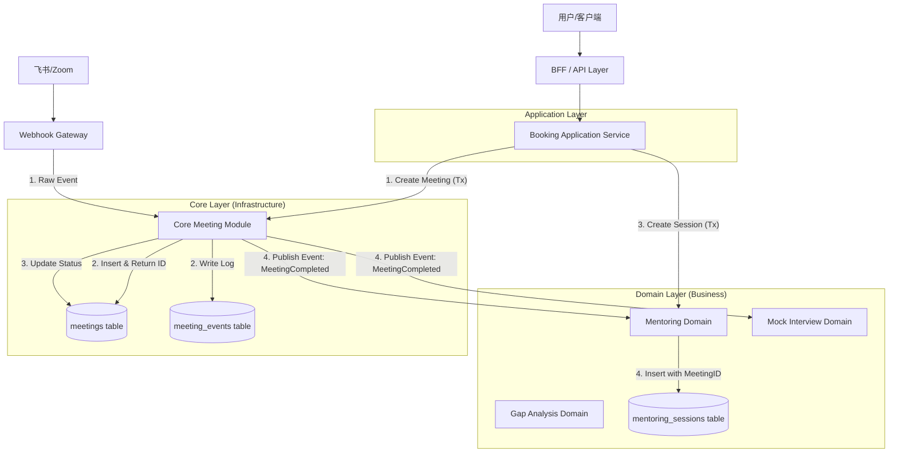
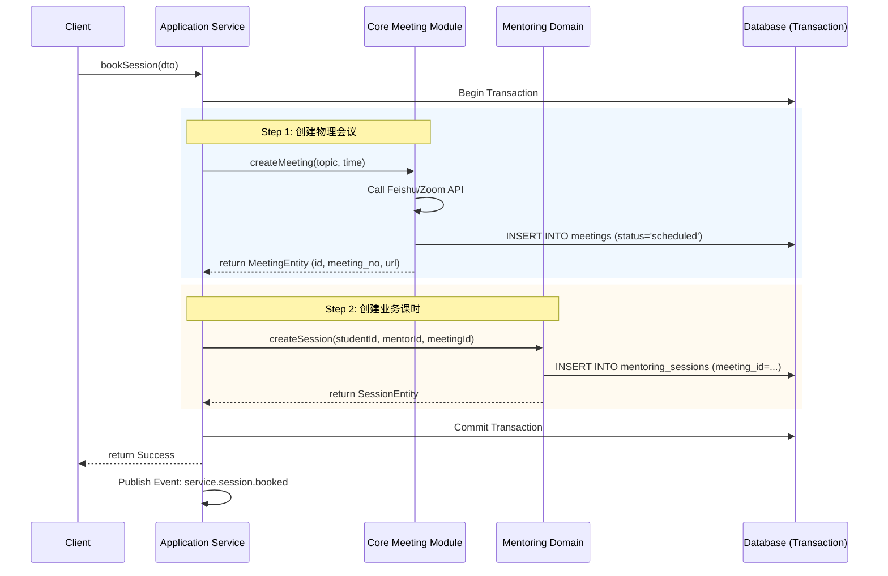
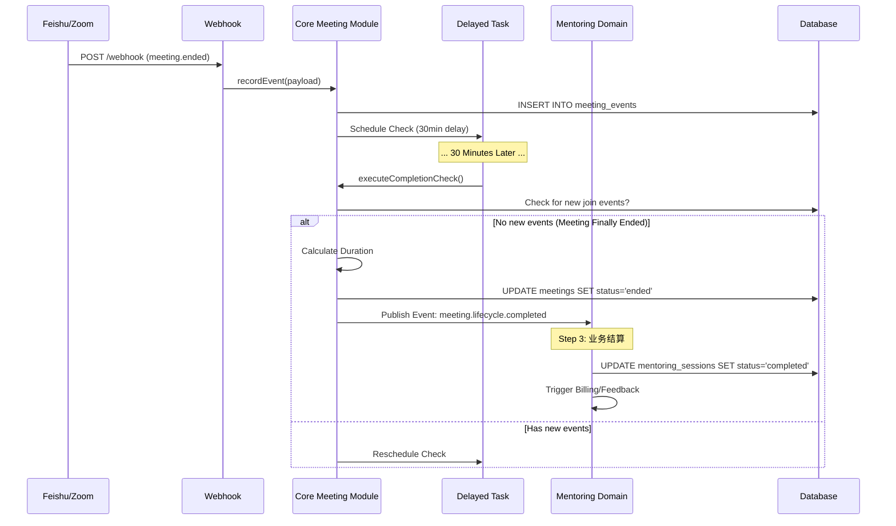

# System Architecture Design v4.0

**文档版本**: v4.0  
**更新日期**: 2025-11-19  
**核心理念**: 领域驱动设计 (DDD) + Table-per-Type 策略 + 事件驱动架构 (EDA)

---

## 🏗️ 1. 架构概览

本系统采用分层架构，核心是将**通用视频会议能力**与**具体业务场景**进行物理和逻辑上的解耦。

### 1.1 核心分层

| 层级 | 模块 | 职责 | 依赖方向 |
| :--- | :--- | :--- | :--- |
| **Application Layer** | `src/application` | 业务编排、事务控制、Command/Query 处理 | 依赖 Domain & Core |
| **Domain Layer (Business)** | `src/domains/services/*` | 核心业务逻辑 (Mentoring, Interview, GapAnalysis) | 依赖 Core |
| **Core Layer (Infrastructure)** | `src/core/meeting` | 通用会议资源管理、生命周期维护、事件溯源 | 不依赖 Domain |
| **Gateway Layer** | `src/core/webhook` | 外部系统适配、消息接收与标准化 | 依赖 Core |

### 1.2 模块交互图



---

## 💾 2. 数据库架构 (Table-per-Type)

采用 **Table-per-Type** 策略，将会议的“物理属性”与“业务属性”分离。

### 2.1 Core Layer (基座)
所有类型的课时都共享这张表。

*   **`meetings` 表**:
    *   `id` (PK), `meeting_no` (Index)
    *   `provider`, `meeting_url`, `recording_url`
    *   `status` (scheduled/active/ended)
    *   `actual_duration` (物理时长)
    *   `meeting_time_list` (时间段)

### 2.2 Domain Layer (业务扩展)
各业务线维护自己的表，通过 `meeting_id` 关联基座。

*   **`mentoring_sessions` 表**:
    *   `id`, `meeting_id` (FK -> meetings.id)
    *   `student_id`, `mentor_id`
    *   `status` (scheduled/completed/cancelled)
    *   `service_duration` (业务时长)
    *   `feedback`, `rating`

*   **`mock_interview_sessions` 表**:
    *   `id`, `meeting_id` (FK -> meetings.id)
    *   `student_id`, `interviewer_id`
    *   `interview_score`, `report_url`

*   **`gap_analysis_sessions` 表**:
    *   `id`, `meeting_id` (FK -> meetings.id)
    *   `analyst_id`, `report_data`

---

## 🔄 3. 关键业务流程

### 3.1 约课流程 (Booking Flow)
**特点**: 强一致性事务，Application Layer 负责编排。



### 3.2 结课流程 (Completion Flow)
**特点**: 事件驱动，最终一致性，Core Layer 负责判定。



---

## 📢 4. 事件契约 (Event Contract)

### 4.1 Core -> Domain
**Event Name**: `meeting.lifecycle.completed`

**Payload**:
```json
{
  "meetingId": "uuid-...",
  "meetingNo": "123456789",
  "actualDuration": 3600,
  "recordingUrl": "https://...",
  "endedAt": "2025-11-19T10:00:00Z",
  "timeList": [...]
}
```

### 4.2 Domain -> Notification
**Event Name**: `service.session.booked`

**Payload**:
```json
{
  "sessionId": "uuid-...",
  "studentId": "uuid-...",
  "mentorId": "uuid-...",
  "startTime": "...",
  "meetingUrl": "..."
}
```

---

## 📌 5. 设计原则总结

1.  **关注点分离**: Core 管“连接”，Domain 管“业务”。
2.  **单向依赖**: Domain 依赖 Core，Core 不依赖 Domain。
3.  **数据一致性**: 创建时使用 DB 事务，结束时使用事件驱动。
4.  **开闭原则**: 新增业务类型 (如公开课) 只需新增 Domain 表和 Listener，无需修改 Core 代码。
