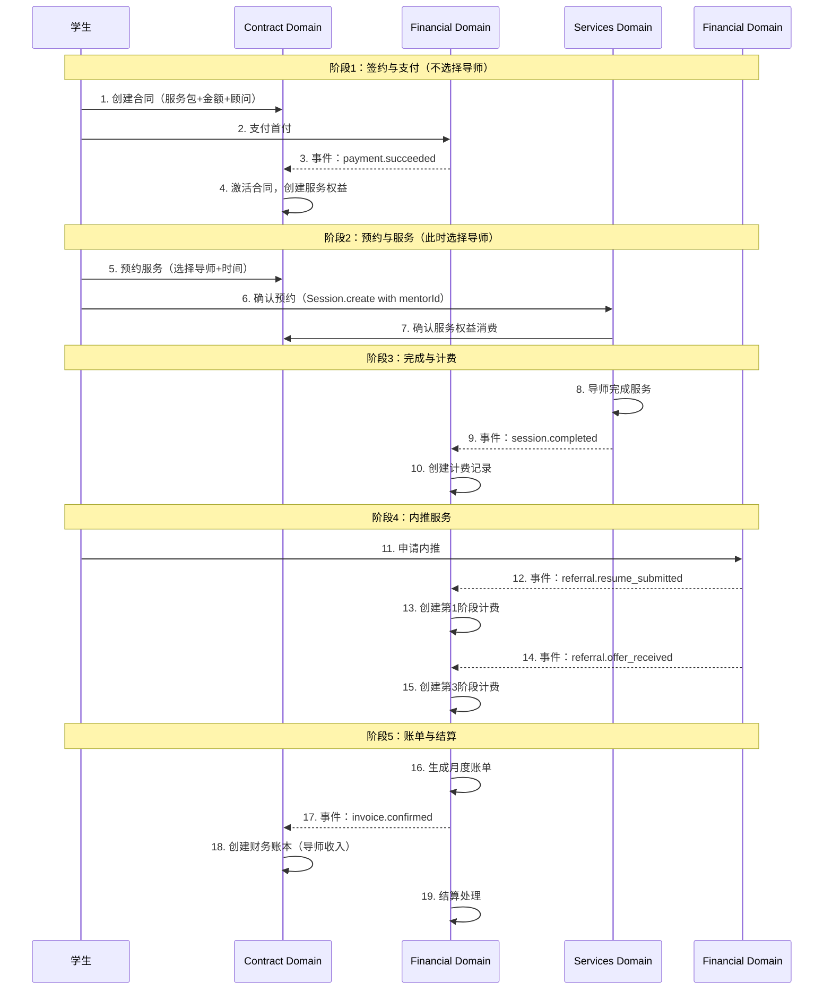
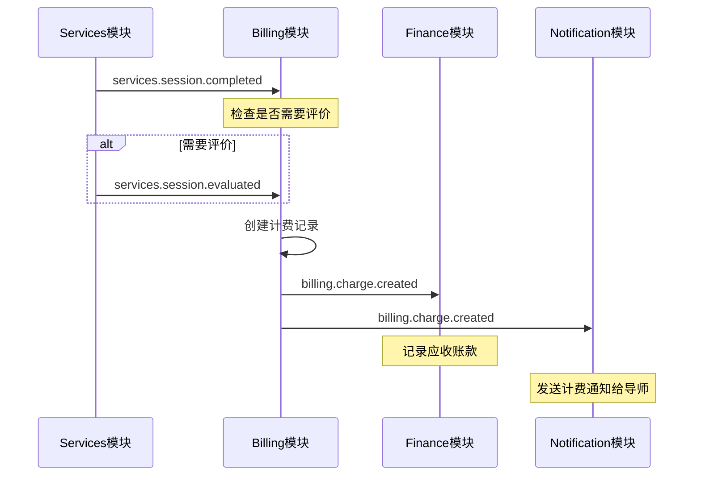
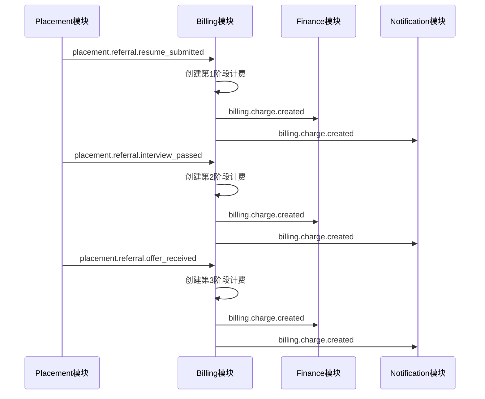
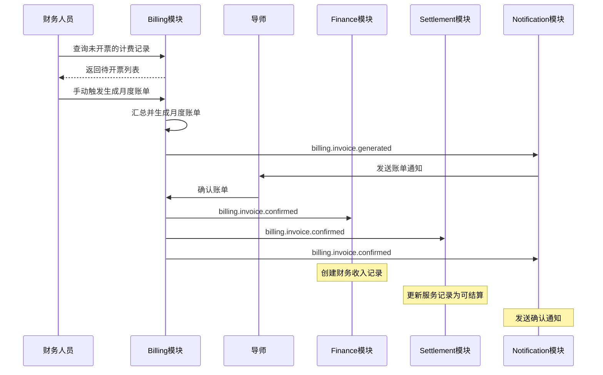
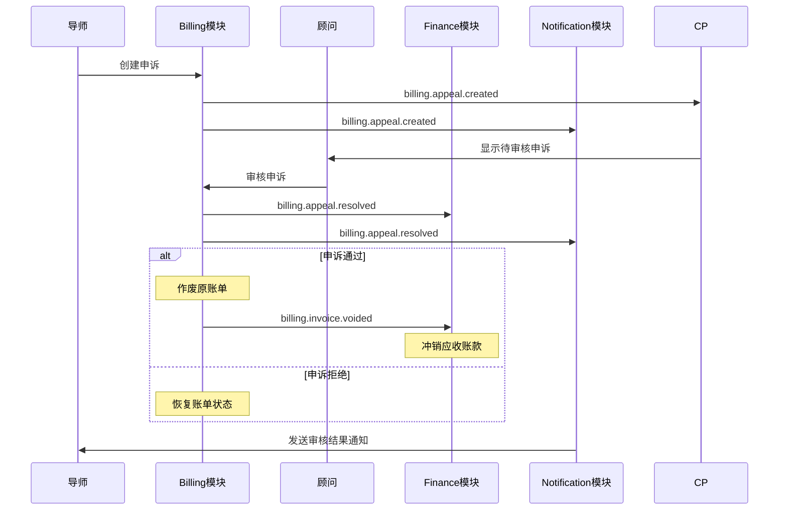

# MentorX 平台计费模块设计文档

> 版本：v2.21
> 创建日期：2025-11-02
> 最后更新：2025-11-04
> 状态：设计阶段（聚焦 Domain Service 接口）
> 负责域：**Catalog Domain** (Service + Service Package + Product) + **Contract Domain** (Contract + Service Consumption Ledger + Service Hold) + **Placement Domain** (Jobs, Applications) + **Financial Domain** (AR + AP：Student Account, Payment, Mentor Billing, Settlement)
>
> **架构说明：**
> - v2.21 架构简化：删除冗余表（student_receivable_ledgers、payment_transactions），统一支付流水（student_payment_ledgers）
> - v2.18 架构优化：明确流水表职责（service_ledgers + mentor_payable_ledgers）
> - v2.18 支付方式重构：学生支付无需指定方式，导师结算支持5种方式（含手续费配置）
> - v2.18 事件命名统一：采用 {domain}.{aggregate}.{action} 格式
> - v2.17 命名优化：简化流水表命名（service_ledgers + mentor_payable_ledgers）
> - v2.16 合同权益来源追溯：支持产品标准权益 + 促成签约额外服务
> - v2.15 Catalog 架构重构：Service → Service Package → Product 清晰分层
> - v2.14 服务消费追溯：Contract Domain 新增服务流水（Append-only）和服务预占（TTL）机制
> - v2.13 统一财务管理：Financial Domain 整合应收（AR）和应付（AP）
> - Financial Domain = 平台所有财务往来（学生付款 + 导师结算）
> - Placement Domain 专注求职服务业务逻辑，不管钱
> - 所有模块采用纯 Domain Service 模式
>

---


> **外部表引用说明：**
> - `users` 表：定义在 Identity Domain (`@domains/identity/users.schema.ts`)
> - `sessions`、`classes` 等服务相关表：定义在 Services Domain (`@domains/services/`)
> - 跨域引用不使用外键约束，通过应用层保证数据完整性（符合DDD原则）

## 📐 核心设计规范

### 💰 金额字段精度规范

| 字段类型 | 精度 | 适用场景 | 示例 |
|---------|------|---------|------|
| `numeric(12, 1)` | 保留1位小数 | **单价字段** | $99.5/小时 |
| `numeric(12, 2)` | 保留2位小数 | **总额字段** | $199.00 |

**设计原因**:
- **单价** (`unitPrice`): 通常不需要精确到分，1位小数足够
- **总额** (`totalAmount`): 必须精确到分，防止累计误差

### 🔗 跨域引用策略（DDD架构）

#### 共享内核表（Shared Kernel）

以下表来自其他 Domain，但作为共享内核可被所有域引用：

- **users 表**: Identity Domain 核心用户表
  - ✅ 所有域都可以直接引用（符合 DDD 共享内核模式）
  - ✅ 允许使用外键约束以保证数据完整性
  - 📍 位置: `@domains/identity/users.schema.ts`

#### 松耦合跨域引用

以下表跨域引用时应**注释外键**，通过应用层保证完整性：

- **sessions 表**: Services Domain 服务会话表
  - ❌ 跨域引用应注释外键（如 mentor_payable_ledgers.sessionId）
  - ✅ 通过应用层验证保证数据完整性
  - 📍 位置: `@domains/services/sessions.schema.ts`

#### 外键策略总结

| 引用类型 | 是否使用外键 | 示例 |
|---------|------------|------|
| 同域引用 | ✅ 使用 | `mentor_payable_ledgers.settlementId` → `settlement_ledgers.id` |
| 共享内核引用 | ✅ 使用 | 所有表引用 `users.id` |
| 跨域业务引用 | ❌ 注释 | `mentor_payable_ledgers.sessionId` → `sessions.id` |

### 🔒 唯一约束说明

> **重要**: `.unique()` 约束会自动创建唯一索引，无需手动添加 `CREATE INDEX`。

当前使用唯一约束的字段：
- `contract_number` - 合同编号
- `payment_number` - 支付编号  
- `settlement_number` - 结算编号
- `appeal_number` - 申诉编号

### 📝 Append-Only 设计模式

以下表采用 **Append-Only** 模式（记录不可修改，仅追加）：

- `service_ledgers` - 学生服务消费流水（Contract Domain）
- `mentor_payable_ledgers` - 导师应付款流水（Financial Domain）
- `student_payment_ledgers` - 学生支付流水（Financial Domain，v2.21新增）

**设计特点**:
- ❌ 记录不可修改，无需 `updatedAt` 字段
- ✅ 支持负数调整记录（如退款、调整）
- ✅ 完整审计追踪（所有历史不可篡改）
- ✅ 余额快照设计（student_payment_ledgers.balanceAfter 记录每次支付后的剩余欠款）

### 📅 版本变更摘要

| 版本 | 日期 | 主要变更 | 影响表 |
|------|------|---------|-------|
| v2.18 | 2025-11 | 架构优化、支付方式重构、事件统一 | 所有流水表、`settlement_ledgers`、`settlement_parameters` |
| v2.17 | 2025-11 | 表重命名、术语统一 | `service_ledgers`, `mentor_payable_ledgers` |
| v2.16 | 2025-10 | 权益追溯、字段新增 | `contract_service_entitlements` 等 |
| v2.15 | 2025-09 | 服务包体系、三级结构 | `services`, `service_packages`, `product_items` |
| v2.14 | 2025-08 | 归档策略、冷热分离 | `jobs_archive`, `service_ledgers_archive` |
| v2.13 | 2025-07 | 基础架构设计 | 所有核心表 |


## 版本历史

**当前版本：v2.21** (2025-11-04)

**主要演进：**
- v2.21: 架构简化（删除student_receivable_ledgers和payment_transactions，重命名payment_ledgers为student_payment_ledgers，新增balanceAfter字段）
- v2.18: 架构优化（明确流水表职责：service_ledgers、mentor_payable_ledgers、student_payment_ledgers）+ 支付方式重构（学生无需指定，导师5种方式含手续费）+ 事件命名统一（{domain}.{aggregate}.{action}）
- v2.17: 流水表命名优化（service_ledgers, mentor_payable_ledgers）
- v2.16: 合同权益来源追溯（新增 source 字段）
- v2.15: Catalog 架构重构（Service → Service Package → Product 三层分离）
- v2.14: 服务流水和服务预占（Append-only + TTL 机制）
- v2.13: 四域架构确立（Catalog, Contract, Placement, Financial）

详细变更历史请查看 Git 提交记录。

---

## 架构总览与域协作

### 四大业务域职责划分（v2.21）

```
┌──────────────────────────────────────────────────────────────────────────────────────┐
│                    MentorX Platform - 业务域架构 (v2.21)                             │
└──────────────────────────────────────────────────────────────────────────────────────┘

┌─────────────────┐  ┌─────────────────┐  ┌─────────────────┐  ┌──────────────────────┐
│ Catalog Domain  │  │ Contract Domain │  │Placement Domain │  │  Financial Domain    │
│  (产品域)       │  │  (合同域)       │  │  (求职域)       │  │   (财务域)           │
├─────────────────┤  ├─────────────────┤  ├─────────────────┤  ├──────────────────────┤
│                 │  │                 │  │                 │  │                      │
│ ✅ Service      │  │ ✅ Contract     │  │ ✅ Job          │  │ 🟢 Payment           │
│   服务定义      │  │   合同生命周期  │  │   职位管理      │  │   · student_payment  │
│   (原子单位)    │  │                 │  │   (冷热分离)    │  │     _ledgers         │
│                 │  │ ✅ Entitlement  │  │                 │  │   学生支付流水       │
│ ✅ Service      │  │   服务权益余额  │  │ ✅ Application  │  │   · balanceAfter     │
│    Package      │  │   · 产品权益 🆕 │  │   申请流程      │  │   欠款余额快照       │
│   服务包        │  │   · 额外服务 🆕 │  │   · 内推        │  │                      │
│   (服务组合)    │  │   · 促销赠送 🆕 │  │   · 代投        │  │ 🔴 Billing           │
│                 │  │   · 补偿服务 🆕 │  │   · 海投        │  │   · mentor_payable   │
│ ✅ Product      │  │                 │  │                 │  │     _ledgers         │
│   产品管理      │  │ ✅ Service      │  │                 │  │   导师应付账款       │
│   定价设置      │  │    Ledger       │  │                 │  │   (Append-only)      │
│   营销标签      │  │   服务流水      │  │                 │  │   · mentor_prices    │
│                 │  │   (Append-only) │  │                 │  │   导师定价配置       │
│                 │  │                 │  │                 │  │                      │
│                 │  │ ✅ Service Hold │  │                 │  │ 🔴 Settlement        │
│                 │  │   服务预占      │  │                 │  │   · settlement_      │
│                 │  │   (TTL机制)     │  │                 │  │     ledgers          │
│                 │  │                 │  │                 │  │   · parameters       │
│                 │  │ ✅ Ledger       │  │                 │  │   · appeals          │
│                 │  │    Archive      │  │                 │  │   导师结算           │
│                 │  │   流水归档      │  │                 │  │                      │
│                 │  │   (冷热分离)    │  │                 │  │                      │
└─────────────────┘  └─────────────────┘  └─────────────────┘  └──────────────────────┘
         │                     │                    │                       │
         │                     │                    │                       │
         └─────────────────────┴────────────────────┴───────────────────────┘
                                        │
                             事件驱动协作 + 服务调用
```

**职责说明：**
- 🔵 **Catalog Domain**（产品域）：Service → Service Package → Product 清晰分层（纯配置域，不发布事件）
- 🟢 **Contract Domain**（合同域）：合同和服务权益管理（v2.16 新增权益来源追溯：产品权益/额外服务/促销/补偿）
- 🟡 **Placement Domain**（求职域）：求职服务业务（职位、申请流程，不涉及计费计算）
- 🟠 **Financial Domain**（财务域）：统一财务管理（应收 + 应付 + 导师定价，平台所有钱的流动）

### 核心数据归属（v2.21）

| 数据实体 | 归属域 | 代码路径 | 职责说明 | 关联关系 |
|---------|-------|---------|---------|---------|
| **services** | Catalog | `@domains/catalog` | **服务定义**（最小原子单位）🆕v2.15 | 被服务包和产品引用 |
| **service_packages** | Catalog | `@domains/catalog` | **服务包**（服务组合）🆕v2.15 | 被产品引用 |
| **service_package_items** | Catalog | `@domains/catalog` | **服务包组成**（关联表）🆕v2.15 | 连接服务包和服务 |
| **products** | Catalog | `@domains/catalog` | 产品定义（面向客户的商品） | Contract引用 |
| **product_items** | Catalog | `@domains/catalog` | **产品项**（产品包含的服务/服务包）🆕v2.15 | 连接产品、服务、服务包 |
| **contracts** | Contract | `@domains/contract` | 合同和服务权益管理 | 引用Product |
| **contract_service_entitlements** | Contract | `@domains/contract` | **服务权益余额**（权益来源追溯）🆕v2.16 | Contract关联，关联ProductItem |
| **service_ledgers** | Contract | `@domains/contract/service-ledger` | **学生服务消费流水**（Append-only）🆕v2.18 | 追踪每次消费，Financial通过接口查询 |
| **service_holds** | Contract | `@domains/contract/service-hold` | **服务预占记录**（TTL）🆕v2.14 | 防止超额预约 |
| **service_ledgers_archive** | Contract | `@domains/contract/service-ledger` | **服务流水归档**（冷热分离）🆕v2.18 | 历史数据归档 |
| **service_ledger_archive_policies** | Contract | `@domains/contract/service-ledger` | **归档策略配置**🆕v2.18 | 归档规则 |
| **student_payment_ledgers** | Financial | `@domains/financial/payment` | **学生支付流水**（含ledgerType和balanceAfter）🆕v2.21 | 触发Contract激活，追踪欠款余额 |
| **mentor_payable_ledgers** | Financial | `@domains/financial/mentor-billing` | **导师应付账款流水**（Append-only，支持负数调整）🆕v2.18 | Settlement关联 |
| **mentor_prices** | Financial | `@domains/financial/mentor-billing` | **导师定价配置**（三种模式） | Billing计算金额 |
| **settlement_ledgers** | Financial | `@domains/financial/settlement` | **导师结算记录**（含结算方式和手续费）🆕v2.18 | MentorPayable关联 |
| **settlement_parameters** | Financial | `@domains/financial/settlement` | **结算参数**（汇率、扣除、手续费率）🆕v2.18 | Settlement计算 |
| **settlement_appeals** | Financial | `@domains/financial/settlement` | **结算申诉**（异议处理） | Settlement关联 |
| **jobs** | Placement | `@domains/placement` | 职位管理（冷热分离+分区） | Application引用 |
| **jobs_archive** | Placement | `@domains/placement` | 归档职位（历史数据） | 归档策略 |
| **job_archive_policies** | Placement | `@domains/placement` | 归档策略配置 | Job归档 |
| **job_applications** | Placement | `@domains/placement` | 求职申请（内推、代投、海投） | 触发Financial计费 |
| **event_outbox** | Infrastructure | `@core/event` | **事件发件箱**（Outbox模式） | 可靠事件发布 |

**说明：**
- 🆕v2.21 标记为 v2.21 新增或调整的表（新增Services Domain，架构对齐优化）
- 🆕v2.18 标记为 v2.18 重命名或修改的表（明确职责边界）
- 🆕v2.17 标记为 v2.17 重命名的表（service_ledgers, mentor_payable_ledgers）
- 🆕v2.16 标记为 v2.16 新增或修改的表
- 🆕v2.15 标记为 v2.15 新增的表
- 🆕v2.14 标记为 v2.14 新增的表

- **v2.21 架构调整（基于数据归属审查）**：
  - ❌ 删除 `student_accounts`（冗余表，功能由student_payment_ledgers.balanceAfter替代）
  - ❌ 删除 `student_receivable_ledgers`（冗余表，功能由student_payment_ledgers.balanceAfter替代）
  - ❌ 删除 `payment_transactions`（简化支付流程）
  - ✅ 明确 `service_ledgers` 访问模式：归属Contract Domain，Financial通过接口查询
  - ✅ 明确 `mentor_prices` 归属：Financial Domain（导师定价是财务数据的一部分）
  - ✅ 重命名 `payment_ledgers` → `student_payment_ledgers`（对称命名）
  - ✅ 恢复 `mentor_payment_ledgers` → `mentor_payable_ledgers`（会计术语：应付账款）

- **核心流水表架构（v2.21）**：
  - **service_ledgers**：学生服务消费流水（Contract Domain，配合预占机制）
  - **mentor_payable_ledgers**：导师应付账款流水（Financial Domain，平台对导师的负债，Append-only）
  - **student_payment_ledgers**：学生支付流水（Financial Domain，学生的支付行为记录，含balanceAfter余额快照）
  - **mentor_prices**：导师定价配置（Financial Domain，计费依据）

- **跨域访问规则（v2.21明确）**：
  - Financial Domain 查询 service_ledgers → 通过 Contract Domain 接口（ServiceLedgerService）
  - 同域访问：Financial Domain 直接访问 mentor_prices（同域数据）
  - 禁止直接跨域数据库访问，保持域边界清晰

- **支付方式重构（v2.18）**：
  - **student_payment_ledgers** 表记录 paymentMethod（支持银行转账、现金、支票等方式）
  - **settlement_ledgers** 表新增 settlementMethod 字段（导师结算需指定5种方式之一）
  - **settlement_parameters** 表新增手续费率配置（按月设置，支持5种结算方式的不同费率）

- **contract_service_entitlements** (v2.16)：新增 `source`、`productItemId`、`addOnReason` 字段，支持区分产品标准权益和额外添加服务

### 跨域协作模式（v2.13 - 事件驱动为主）

#### 模式 1: 服务调用（Service Call） - 仅用于配置域

**Contract → Product**
```
Contract Domain                         Catalog Domain
    │                                       │
    │ 调用: getProductById(productId)       │
    │──────────────────────────────────────▶│
    │                                       │ 查询产品信息
    │◀──────────────────────────────────────│
    │ 返回: Product 对象                    │
    │                                       │
    │ 使用产品信息创建合同和服务权益         │
```

**关键点：**
- Product 是配置域，不发布事件
- Contract 通过直接调用 ProductService 获取产品信息
- Contract 保存 productId，需要时动态查询产品详情

---

#### 模式 2: 事件驱动（Event-Driven） - 业务域主要模式

**AR → Contract**（支付触发合同激活）
```
AR Domain                               Contract Domain
    │                                       │
    │ 发布事件: payment.succeeded           │
    │──────────────────────────────────────▶│
    │                                       │ 监听器处理
    │                                       │ 激活合同
    │                                       │ 初始化服务权益余额
```

**Services → Financial**（服务完成触发计费）
```
Services Domain                         Financial Domain (MentorBilling)
    │                                       │
    │ 发布事件: session.completed           │
    │──────────────────────────────────────▶│
    │                                       │ 监听器处理
    │                                       │ 查询 mentor_prices
    │                                       │ 创建 mentor_payable_ledgers
    │                                       │ (导师计费记录)
```

**Financial (Settlement) → Financial (Billing)**（结算完成更新计费状态）
```
Financial Domain (Settlement)           Financial Domain (MentorBilling)
    │                                       │
    │ 发布事件: settlement.completed        │
    │──────────────────────────────────────▶│
    │                                       │ 监听器处理
    │                                       │ 更新 mentor_payable_ledgers
    │                                       │ settlement_status = 'settled'
```

**Placement Domain → Financial Domain (Billing)**（内推计费）
```
Placement Domain                        Financial Domain (MentorBilling)
    │                                       │
    │ 导师提交简历                           │
    │ 发布事件: application.resume_submitted │
    │──────────────────────────────────────▶│
    │                                       │ 监听器处理
    │                                       │ 查询 mentor_prices (内推定价)
    │                                       │ 创建 mentor_payable_ledgers
    │                                       │ (第1阶段计费)
```

### 关键设计原则（v2.13）

✅ **DO（正确的做法）**

1. **事件优先**：跨域数据变更使用事件通知，而非直接调用
2. **跨域协作用事件**：Placement Domain 和 Financial Domain 通过事件驱动解耦
3. **最终一致性**：通过事件驱动保证各域数据最终一致
4. **职责单一**：每个域只管理自己的核心数据
5. **高内聚**：相关业务（导师计费+内推计费+结算）集中在Financial Domain
6. **角色清晰**：顾问（Counselor）不参与收益分配，仅作为管理和监控角色

❌ **DON'T（错误的做法）**

1. **禁止直接修改跨域数据**：Financial 不能直接写 Contract 的表
2. **禁止循环依赖**：避免 A 依赖 B，B 又依赖 A
3. **禁止绕过事件直接更新**：必须通过事件通知让数据拥有者自己更新
4. **禁止跨域事务**：不使用分布式事务，采用 Saga 模式
5. **禁止顾问收益记录**：顾问不参与收益分配，不应在任何收益相关表中出现

**v2.13 特别说明：**
- ✅ Placement Domain 和 Financial Domain 是独立域，通过事件驱动解耦
- ✅ 内推计费流程：Placement 发布事件 → Financial 监听并处理计费
- ✅ 统一结算：导师服务费和内推费统一在 Financial Domain 结算

---


## 四大业务域接口与事件总览

> **负责范围：** Catalog Domain、Contract Domain、Placement Domain、Financial Domain
> **本章节目的：** 集中展示四个业务域的完整服务接口、事件监听、事件发布清单，以及各角色的业务流程图

### 📊 域职责概览

| 业务域 | 核心职责 | 主要模块 |
|--------|---------|---------|
| **Catalog Domain** | 产品目录管理 | Product |
| **Contract Domain** | 合同和服务权益管理 | Contract、Service Entitlements |
| **Placement Domain** | 求职服务业务 | Job、Application |
| **Financial Domain** | 统一财务管理（AR + AP） | Student Account、Payment、Mentor Billing、Settlement |

---

### 1️⃣ 服务接口清单（按域分类）

> **说明：** 以下接口为各业务域提供的服务方法。

#### Catalog Domain（25个服务方法）

> **说明：** Catalog Domain 管理平台的服务、服务包和产品：
> - **Service**（服务）：最小原子单位，如"简历修改"、"GAP分析"
> - **Service Package**（服务包）：服务的组合，如"求职基础包"
> - **Product**（产品）：面向客户的商品，可包含服务或服务包

**ServiceService** - 服务管理 🆕（7个方法）

> **说明：** 管理平台提供的基础服务：
> - 服务是最小的可售卖单位
> - 服务可被服务包和产品引用
> - 支持多种计费模式（按次、按课节、阶段性等）

| # | 服务方法 | 来源模块 | 方法签名 | 功能 |
|---|---------|---------|---------|------|
| 1 | 创建服务 | ServiceService | `create(dto: CreateServiceDto): Promise<Service>` | 创建新服务 |
| 2 | 更新服务 | ServiceService | `update(id: string, dto: UpdateServiceDto): Promise<Service>` | 更新服务信息 |
| 3 | 查询服务列表 | ServiceService | `search(filter: ServiceFilterDto, pagination?: PaginationDto, sort?: SortDto): Promise<PaginatedResult<Service>>` | 分页查询服务 |
| 4 | 查询服务详情 | ServiceService | `findById(id: string): Promise<Service>` | 查看服务详情 |
| 5 | 启用/禁用服务 | ServiceService | `toggleActive(id: string, isActive: boolean): Promise<Service>` | 启用或禁用服务 |
| 6 | 删除服务 | ServiceService | `remove(id: string): Promise<void>` | 删除服务（需检查引用） |
| 7 | 查询可用服务 | ServiceService | `findActiveServices(): Promise<Service[]>` | 查询所有可用服务 |

**ServicePackageService** - 服务包管理 🆕（7个方法）

> **说明：** 管理服务包（服务的组合）：
> - 服务包由多个服务组成
> - 服务包可被产品引用
> - 支持灵活配置服务数量

| # | 服务方法 | 来源模块 | 方法签名 | 功能 |
|---|---------|---------|---------|------|
| 8 | 创建服务包 | ServicePackageService | `create(dto: CreateServicePackageDto): Promise<ServicePackage>` | 创建服务包 |
| 9 | 更新服务包 | ServicePackageService | `update(id: string, dto: UpdateServicePackageDto): Promise<ServicePackage>` | 更新服务包信息 |
| 10 | 添加服务到包 | ServicePackageService | `addService(packageId: string, dto: AddServiceDto): Promise<void>` | 向服务包添加服务 |
| 11 | 移除包中服务 | ServicePackageService | `removeService(packageId: string, serviceId: string): Promise<void>` | 从服务包移除服务 |
| 12 | 查询服务包列表 | ServicePackageService | `search(filter: PackageFilterDto, pagination?: PaginationDto, sort?: SortDto): Promise<PaginatedResult<ServicePackage>>` | 分页查询服务包 |
| 13 | 查询服务包详情 | ServicePackageService | `findById(id: string): Promise<ServicePackageDetail>` | 查看服务包完整信息（含服务列表） |
| 14 | 删除服务包 | ServicePackageService | `remove(id: string): Promise<void>` | 删除服务包（需检查引用） |

**ProductService** - 产品管理（11个方法）

> **说明：** 产品生命周期管理，包含草稿、上架、下架状态流转：
> - 产品经理创建产品（初始为草稿状态）
> - 产品通过 product_items 关联服务和服务包
> - 支持定时上架和手动上架
> - 提供智能推荐和批量操作功能
> - 支持多维度筛选可见产品：
>   - **学历维度**：本科生、研究生、在职人士
>   - **等级维度**：普通用户、VIP用户、SVIP用户

| # | 服务方法 | 来源模块 | 方法签名 | 功能 |
|---|---------|---------|---------|------|
| 15 | 创建产品 | ProductService | `create(dto: CreateProductDto): Promise<Product>` | 创建产品（草稿状态） |
| 16 | 更新产品草稿 | ProductService | `update(id: string, dto: UpdateProductDto): Promise<Product>` | 更新草稿状态的产品 |
| 17 | 添加产品项 | ProductService | `addItem(productId: string, dto: AddProductItemDto): Promise<void>` | 向产品添加服务或服务包 |
| 18 | 移除产品项 | ProductService | `removeItem(productId: string, itemId: string): Promise<void>` | 从产品移除服务或服务包 |
| 19 | 查询产品列表 | ProductService | `search(filter: ProductFilterDto, pagination?: PaginationDto, sort?: SortDto): Promise<PaginatedResult<Product>>` | 分页查询（支持筛选：status、userType等） |
| 20 | 查询产品详情 | ProductService | `findById(id: string): Promise<ProductDetail>` | 查看产品完整信息（含产品项） |
| 21 | 上架产品 | ProductService | `publish(id: string, dto: PublishProductDto): Promise<Product>` | 立即上架或定时上架 |
| 22 | 下架产品 | ProductService | `unpublish(id: string, reason: string): Promise<Product>` | 下架产品 |
| 23 | 删除草稿产品 | ProductService | `remove(id: string): Promise<void>` | 删除草稿状态的产品 |
| 24 | 批量操作 | ProductService | `batchUpdate(dto: BatchOperationDto): Promise<BatchResult>` | 批量上架/下架 |
| 25 | 推荐产品 | ProductService | `recommend(userId: string): Promise<Product[]>` | 根据用户信息推荐产品 |

> **方法说明：**
> - `search(filter, pagination, sort)` 统一处理所有查询场景：
>   - **filter** - 筛选条件对象：
>     - `status: 'published'` - 查询已上架产品（替代原 findAvailable、browse）
>     - `userType: 'undergraduate' | 'graduate' | 'working'` - 按学历维度筛选
>     - `userLevel: 'normal' | 'vip' | 'svip'` - 按重要性维度筛选
>     - `keyword: string` - 关键词搜索
>   - **pagination** - 分页规则对象（可选，不传则查询全部）：
>     - `page: number` - 页码（从1开始）
>     - `pageSize: number` - 每页数量
>   - **sort** - 排序规则对象（可选）：
>     - `field: string` - 排序字段
>     - `order: 'asc' | 'desc'` - 排序方向
> - 删除了 ProductQueryService，所有查询统一在 ProductService 中
>
> **Schema 字段建议：**
> ```typescript
> // products 表关键字段
> targetUserTypes: ('undergraduate' | 'graduate' | 'working')[];  // 适用的学历类型（可多选）
> ```

### 🔧 通用DTO接口定义

> **说明：** 所有 `search` 方法使用统一的参数结构，便于维护和扩展。

```typescript
// 分页规则对象（可选，不传则查询全部）
interface PaginationDto {
  page: number;      // 页码，从1开始
  pageSize: number;  // 每页数量
}

// 排序规则对象（可选）
interface SortDto {
  field: string;           // 排序字段名
  order: 'asc' | 'desc';   // 排序方向
}

// 分页结果对象
interface PaginatedResult<T> {
  data: T[];           // 数据列表
  total: number;       // 总记录数
  page: number;        // 当前页码
  pageSize: number;    // 每页数量
  totalPages: number;  // 总页数
}
```

**使用示例：**
```typescript
// 查询所有数据（不分页）
const allProducts = await productService.search({ status: 'published' });

// 分页查询
const pagedProducts = await productService.search(
  { status: 'published', userLevel: 'vip' },
  { page: 1, pageSize: 20 },
  { field: 'createdAt', order: 'desc' }
);

// 仅筛选和排序，不分页
const sortedProducts = await productService.search(
  { status: 'published' },
  undefined,
  { field: 'price', order: 'asc' }
);
```

---

#### Financial Domain（20个服务方法）

**PaymentService** - 支付服务

> **说明：** 系统不对接第三方支付平台，采用财务确认模式：
> - 学生在第三方系统（如银行）完成支付
> - 财务在第三方系统确认到账后，在本系统中确认支付
> - 系统发布 payment.succeeded 事件触发后续流程（激活合同等）

| # | 服务方法 | 来源模块 | 方法签名 | 功能 |
|---|---------|---------|---------|------|
| 1 | 创建支付记录 | PaymentService | `create(dto: CreatePaymentDto): Promise<Payment>` | 创建待支付记录 |
| 2 | 查询支付记录 | PaymentService | `search(filter: PaymentFilterDto, pagination?: PaginationDto, sort?: SortDto): Promise<PaginatedResult<Payment>>` | 查询支付历史 |
| 3 | 查询支付详情 | PaymentService | `findById(id: string): Promise<Payment>` | 查看支付详细信息 |
| 4 | 确认支付 | PaymentService | `confirm(paymentId: string, dto: ConfirmPaymentDto): Promise<Payment>` | 财务确认支付已到账 |
| 5 | 申请退款 | PaymentService | `refund(paymentId: string, dto: RefundDto): Promise<Refund>` | 退款处理 |

**SettlementService** - 结算服务

> **说明：** 实时查询和计算模式，无批次处理：
> - 财务实时查看指定月份的待支付明细（基于 mentor_payable_ledgers）
> - 财务设置当月汇率和扣除比例
> - 系统实时计算每个导师的待付金额
> - 财务在第三方系统完成支付后，在本系统中确认

| # | 服务方法 | 来源模块 | 方法签名 | 功能 |
|---|---------|---------|---------|------|
| 6 | 查询待支付明细 | SettlementService | `getPendingLedgers(query: { month: string, mentorId?: string }): Promise<ServiceLedger[]>` | 查询指定月份待支付的服务记录 |
| 7 | 计算结算金额 | SettlementService | `calculateSettlement(dto: CalculateSettlementDto): Promise<SettlementCalculation>` | 实时计算应付金额（含汇率、扣除） |
| 8 | 设置结算参数 | SettlementService | `setParameters(dto: SetParametersDto): Promise<SettlementParameters>` | 设置当月汇率和扣除比例 |
| 9 | 确认支付 | SettlementService | `confirmPayment(dto: ConfirmPaymentDto): Promise<Settlement>` | 财务确认已完成导师支付 |
| 10 | 查询结算记录 | SettlementService | `search(filter: SettlementFilterDto, pagination?: PaginationDto, sort?: SortDto): Promise<PaginatedResult<Settlement>>` | 查询结算历史 |

**AppealService** - 结算申诉服务

> **说明：** 导师结算金额申诉管理：
> - 导师对结算金额有异议时可提交申诉
> - 顾问审核申诉并做出决定
> - 支持申诉状态跟踪和历史记录查询

| # | 服务方法 | 来源模块 | 方法签名 | 功能 |
|---|---------|---------|---------|------|
| 11 | 提交申诉 | AppealService | `createAppeal(dto: CreateAppealDto): Promise<Appeal>` | 对结算金额提出异议 |
| 12 | 查询申诉列表 | AppealService | `search(filter: AppealFilterDto, pagination?: PaginationDto, sort?: SortDto): Promise<PaginatedResult<Appeal>>` | 查询申诉记录 |
| 13 | 查询申诉详情 | AppealService | `findById(id: string): Promise<Appeal>` | 查看申诉完整信息 |
| 14 | 审核申诉 | AppealService | `reviewAppeal(id: string, dto: ReviewAppealDto): Promise<Appeal>` | 批准或拒绝申诉 |

**BillingStatsService** - 计费统计服务

> **说明：** 收入和计费数据统计分析：
> - 统计导师个人收入数据（按时间段）
> - 统计平台整体收入和业务数据
> - 支持多维度数据分析和可视化

| # | 服务方法 | 来源模块 | 方法签名 | 功能 |
|---|---------|---------|---------|------|
| 15 | 查询导师收入统计 | BillingStatsService | `getMentorStats(mentorId: string, period: DateRange): Promise<MentorStats>` | 统计导师收入 |
| 16 | 查询平台收入统计 | BillingStatsService | `getPlatformStats(period: DateRange): Promise<PlatformStats>` | 统计平台整体收入 |

**MentorPricingService** - 导师定价服务

> **说明：** 导师服务价格配置管理：
> - 为不同导师设置不同服务类型的价格
> - 支持价格历史记录和变更追踪
> - 预约时自动检查价格配置完整性
> - 按服务类型分别定价（session、mock_interview等）

| # | 服务方法 | 来源模块 | 方法签名 | 功能 |
|---|---------|---------|---------|------|
| 17 | 查询导师价格配置 | MentorPricingService | `findByMentor(mentorId: string): Promise<MentorPrice[]>` | 查询价格配置 |
| 18 | 设置导师价格 | MentorPricingService | `upsertPrice(mentorId: string, dto: UpsertPriceDto): Promise<MentorPrice>` | 设置/更新价格 |
| 19 | 检查价格配置 | MentorPricingService | `checkPricing(mentorId: string, serviceType: string): Promise<PricingCheckResult>` | 检查价格配置是否完整 |
| 20 | 查询价格历史 | MentorPricingService | `getPriceHistory(mentorId: string, serviceType: string): Promise<PriceHistory[]>` | 查看价格变更历史 |

---

#### Contract Domain - 核心模块（22个服务方法）🆕v2.16

**ContractService** - 合同管理服务 🆕v2.16

> **说明：** 合同全生命周期管理，包含服务权益管理：
> - 顾问创建合同，包含服务包配置和金额设置
> - 监听支付成功事件自动激活合同
> - 管理服务权益余额（各类服务的可用次数）
> - 服务预约时自动扣减权益
> - **v2.16 新增：支持添加额外服务权益（促成签约、促销、补偿）**

| # | 服务方法 | 来源模块 | 方法签名 | 功能 |
|---|---------|---------|---------|------|
| 1 | 创建合同 | ContractService | `create(dto: CreateContractDto): Promise<Contract>` | 创建合同（含服务包、金额、顾问） |
| 2 | 查询合同列表 | ContractService | `search(filter: ContractFilterDto, pagination?: PaginationDto, sort?: SortDto): Promise<PaginatedResult<Contract>>` | 分页查询合同 |
| 3 | 查询合同详情 | ContractService | `findById(id: string): Promise<Contract>` | 查看合同完整信息 |
| 4 | 更新合同 | ContractService | `update(id: string, dto: UpdateContractDto): Promise<Contract>` | 更新合同信息 |
| 5 | 激活合同 | ContractService | `activate(id: string): Promise<Contract>` | 首付完成后激活合同 |
| 6 | 终止合同 | ContractService | `terminate(id: string, reason: string): Promise<Contract>` | 终止合同 |
| 7 | 查询服务权益余额 | ContractService | `getServiceBalance(contractId: string): Promise<ServiceBalance>` | 查看各服务类型剩余次数 |
| 8 | 扣减服务权益 | ContractService | `consumeService(contractId: string, serviceType: string): Promise<void>` | 预约时扣减可用次数 |
| 9 | **添加额外权益** 🆕 | ContractService | `addEntitlement(dto: AddEntitlementDto): Promise<ContractServiceEntitlement>` | 添加额外服务（促成签约、促销、补偿） |

**ServiceLedgerService** - 合同服务流水管理 🆕

> **说明：** 服务流水追踪和余额管理（Append-only）：
> - **Append-only 模式**：只能 INSERT，禁止 UPDATE/DELETE
> - 记录每次服务消费、退款、调整的流水
> - 通过 balanceAfter 快照实现余额对账
> - 支持正负数记账（quantity 可正可负）
> - 提供可用余额计算（总余额 - 活跃预占）

| # | 服务方法 | 来源模块 | 方法签名 | 功能 |
|---|---------|---------|---------|------|
| 10 | 记录服务消费 | ServiceLedgerService | `recordConsumption(dto: RecordConsumptionDto): Promise<ServiceLedger>` | 记录服务消费（quantity < 0） |
| 11 | 记录手动调整 | ServiceLedgerService | `recordAdjustment(dto: RecordAdjustmentDto): Promise<ServiceLedger>` | 手动调整服务余额（需填写原因） |
| 12 | 计算可用余额 | ServiceLedgerService | `calculateAvailableBalance(contractId: string, serviceType: string): Promise<BalanceInfo>` | 计算可用余额（总余额 - 活跃预占） |
| 13 | 查询流水记录 | ServiceLedgerService | `queryLedgers(query: LedgerQueryDto): Promise<PaginatedResult<ServiceLedger>>` | 查询流水（支持跨主表+归档表） |
| 14 | 验证余额对账 | ServiceLedgerService | `verifyBalance(contractId: string, serviceType: string): Promise<BalanceVerificationResult>` | 通过 balanceAfter 快照验证余额正确性 |

**ServiceHoldService** - 服务预占管理 🆕

> **说明：** TTL 机制防止超额预约：
> - 预约时创建预占记录，占用服务权益
> - 默认 TTL 15 分钟（可通过环境变量配置）
> - 服务完成时释放预占，生成消费流水
> - 定时任务自动清理过期预占
> - **粒度：按服务类型预占**（不涉及具体导师时间段）

| # | 服务方法 | 来源模块 | 方法签名 | 功能 |
|---|---------|---------|---------|------|
| 15 | 创建预占 | ServiceHoldService | `createHold(dto: CreateHoldDto): Promise<ServiceHold>` | 创建预占，占用服务权益 |
| 16 | 释放预占 | ServiceHoldService | `releaseHold(holdId: string, reason: string): Promise<ServiceHold>` | 释放预占，生成消费流水 |
| 17 | 清理过期预占 | ServiceHoldService | `cleanupExpiredHolds(): Promise<number>` | 定时清理过期预占 |
| 18 | 查询活跃预占 | ServiceHoldService | `findActiveHolds(contractId: string, serviceType?: string): Promise<ServiceHold[]>` | 查询学生的活跃预占 |
| 19 | 延长预占时间 | ServiceHoldService | `extendHold(holdId: string, additionalMinutes: number): Promise<ServiceHold>` | 延长预占 TTL |

**ServiceLedgerArchiveService** - 流水归档管理 🆕

> **说明：** 冷热分离归档管理：
> - 定期将历史流水（默认 90 天前）归档到 archive 表
> - 支持按合同、服务类型、全局设置不同归档策略
> - 归档后可选择是否删除主表数据（默认保留）
> - 提供跨表查询（主表 + 归档表 UNION ALL）

| # | 服务方法 | 来源模块 | 方法签名 | 功能 |
|---|---------|---------|---------|------|
| 20 | 执行归档任务 | ServiceLedgerArchiveService | `archiveOldLedgers(daysOld?: number): Promise<ArchiveResult>` | 归档历史流水数据 |
| 21 | 查询归档策略 | ServiceLedgerArchiveService | `getArchivePolicy(contractId?: string, serviceType?: string): Promise<ArchivePolicy>` | 查询归档策略（优先级：contract > service_type > global） |
| 22 | 设置归档策略 | ServiceLedgerArchiveService | `setArchivePolicy(dto: SetArchivePolicyDto): Promise<ArchivePolicy>` | 设置归档策略 |
| 23 | 跨表查询流水 | ServiceLedgerArchiveService | `queryLedgersWithArchive(query: LedgerQueryDto): Promise<PaginatedResult<ServiceLedger>>` | 查询主表+归档表（UNION ALL） |

**MentorPayableLedgerService** - 导师服务记录和计费管理

> **说明：** 计费流水管理（Append-only）：
> - **Append-only 模式**：只能 INSERT，禁止 UPDATE/DELETE
> - 监听服务完成事件自动创建计费记录
> - 记录服务类型、时长、导师定价等信息
> - **支持负数调整**：处理 appeal 申诉时，可创建金额为负数的记录调整应付金额
> - 支持导师和学生分别查询服务记录
> - 提供统计分析和报表导出功能

| # | 服务方法 | 来源模块 | 方法签名 | 功能 |
|---|---------|---------|---------|------|
| 9 | 创建计费记录 | MentorPayableLedgerService | `create(dto: CreateMentorPayableLedgerDto): Promise<MentorPayableLedger>` | 服务完成后创建记录和计费 |
| 10 | 查询导师计费记录 | MentorPayableLedgerService | `findByMentor(mentorId: string, query: QueryDto): Promise<PaginatedResult<MentorPayableLedger>>` | 导师查看自己的服务记录 |
| 11 | 查询学生计费记录 | MentorPayableLedgerService | `findByStudent(studentId: string, query: QueryDto): Promise<PaginatedResult<MentorPayableLedger>>` | 学生查看服务消费记录 |
| 12 | 导出服务报表 | MentorPayableLedgerService | `exportReport(query: ReportQueryDto): Promise<Buffer>` | 导出Excel报表 |
| 13 | 统计服务数据 | MentorPayableLedgerService | `getStatistics(query: StatsQueryDto): Promise<ServiceStats>` | 统计服务量、收入等 |
| 14 | 更新结算状态 | MentorPayableLedgerService | `updateSettlementStatus(ids: string[], status: string): Promise<void>` | 结算完成后更新状态 |

**StudentReceivableLedgerService** - 财务账本服务

> **说明：** 学生财务流水账管理：
> - 监听支付和结算事件自动记账
> - 记录学生的收入（付款）和支出（消费、退款）
> - 实时计算账户余额和应收款项
> - 提供完整的财务流水查询和导出

| # | 服务方法 | 来源模块 | 方法签名 | 功能 |
|---|---------|---------|---------|------|
| 15 | 查询学生账本 | StudentReceivableLedgerService | `findByStudent(studentId: string, query: QueryDto): Promise<PaginatedResult<StudentReceivableLedger>>` | 查看财务流水 |
| 16 | 查询当前余额 | StudentReceivableLedgerService | `getBalance(userId: string): Promise<Balance>` | 查看账户余额 |
| 17 | 查询应收明细 | StudentReceivableLedgerService | `getReceivables(studentId: string): Promise<Receivable[]>` | 查看学生应付款项 |
| 18 | 查询付款历史 | StudentReceivableLedgerService | `getPaymentHistory(studentId: string): Promise<Payment[]>` | 查看历史付款记录 |
| 19 | 创建收入记录 | StudentReceivableLedgerService | `createIncome(dto: CreateIncomeDto): Promise<StudentReceivableLedger>` | 学生付款后创建收入记录 |
| 20 | 创建支出记录 | StudentReceivableLedgerService | `createExpense(dto: CreateExpenseDto): Promise<StudentReceivableLedger>` | 导师结算后创建支出记录 |
| 21 | 导出账本报表 | StudentReceivableLedgerService | `exportLedger(userId: string, query: DateRange): Promise<Buffer>` | 导出财务账本 |

---

#### Placement Domain - 求职管理（18个服务方法）

> **说明：** Placement Domain 支持三种求职业务线：
> 1. **内推（Referral）** - 导师推荐学生到目标公司，三阶段计费，需关联合同
> 2. **代投（Proxy）** - 顾问帮学生投递简历，追踪进度，需关联合同（作为服务包的一部分）
> 3. **海投（Direct）** - 学生自己投递，自我管理，无需关联合同（免费功能）
>
> **合同关联说明：**
> - **内推**：属于付费服务，必须关联有效的合同，计费信息记录到 mentor_payable_ledgers
> - **代投**：属于服务包的增值服务，需要关联合同，但不单独计费
> - **海投**：作为平台免费功能提供，不关联合同，无需计费
>
> **职位来源限制：**
> - **内推**：可申请所有来源的职位（crawled、direct_booking、partner）
> - **代投**：可申请所有来源的职位（crawled、direct_booking、partner）
> - **海投**：仅限申请 `crawled` 来源的职位（企业岗位库抓取的岗位）

**ApplicationService** - 统一求职申请管理服务

| # | 服务方法 | 来源模块 | 方法签名 | 功能 |
|---|---------|---------|---------|------|
| 1 | 创建申请 | ApplicationService | `create(dto: CreateApplicationDto): Promise<Application>` | 创建求职申请（dto.type决定类型：referral/proxy/direct） |
| 2 | 查询申请列表 | ApplicationService | `search(filter: ApplicationFilterDto, pagination?: PaginationDto, sort?: SortDto): Promise<PaginatedResult<Application>>` | 分页查询（支持按type、studentId、mentorId、counselorId筛选） |
| 3 | 查询申请详情 | ApplicationService | `findById(id: string): Promise<ApplicationDetail>` | 查看申请完整信息 |
| 4 | 更新申请状态 | ApplicationService | `updateStatus(id: string, dto: UpdateStatusDto): Promise<Application>` | 更新申请进度（submitted/interview/offer/rejected） |
| 5 | 提交简历（内推） | ApplicationService | `submitResume(id: string, dto: SubmitResumeDto): Promise<Application>` | 导师提交学员简历（触发阶段1计费） |
| 6 | 更新面试进度 | ApplicationService | `updateInterviewStage(id: string, dto: InterviewStageDto): Promise<Application>` | 更新面试轮次和结果 |
| 7 | 取消申请 | ApplicationService | `cancel(id: string, reason: string): Promise<Application>` | 取消申请 |
| 8 | 获取申请时间线 | ApplicationService | `getTimeline(id: string): Promise<Timeline[]>` | 查看申请完整时间线 |
| 9 | 添加备注 | ApplicationService | `addNote(id: string, dto: AddNoteDto): Promise<Application>` | 添加申请备注 |
| 10 | 批量更新状态 | ApplicationService | `batchUpdateStatus(ids: string[], status: ApplicationStatus): Promise<void>` | 批量更新申请状态 |
| 11 | 导出申请报表 | ApplicationService | `exportReport(query: ReportQueryDto): Promise<Buffer>` | 导出申请统计报表 |
| 12 | 获取统计数据 | ApplicationService | `getStatistics(query: StatsQueryDto): Promise<ApplicationStats>` | 统计申请数据（成功率、进度分布等） |

> **方法说明：**
> - `create(dto)` 统一处理所有类型的申请创建：
>   - `dto.type: 'referral'` - 内推申请（替代原 createReferral）
>   - `dto.type: 'proxy'` - 代投申请（替代原 createProxy）
>   - `dto.type: 'direct'` - 海投申请（替代原 createDirect）
>   - **业务规则验证**：当 `dto.type === 'direct'` 时，必须验证 `job.source === 'crawled'`，否则抛出异常
> - `search(filter, pagination, sort)` 统一处理所有查询场景：
>   - **filter** - 筛选条件对象：
>     - `studentId` - 学生查自己的申请（替代原 findByStudent）
>     - `mentorId` - 导师查内推申请（替代原 findByMentor）
>     - `counselorId` - 顾问查代投申请（替代原 findByCounselor）
>     - `type: 'referral' | 'proxy' | 'direct'` - 按申请类型筛选
>     - `status` - 按申请状态筛选
>     - `dateRange` - 按时间范围筛选
>   - **pagination** - 分页规则（可选）
>   - **sort** - 排序规则（可选）

> **ApplicationStats 接口定义：**
> ```typescript
> interface ApplicationStats {
>   total: number;              // 总申请数
>   byType: {
>     referral: number;         // 内推数量
>     proxy: number;            // 代投数量
>     direct: number;           // 海投数量
>   };
>   byStatus: {
>     pending: number;          // 待处理
>     submitted: number;        // 已投递
>     interview: number;        // 面试中
>     offer: number;            // 已获Offer
>     rejected: number;         // 已拒绝
>     cancelled: number;        // 已取消
>   };
>   successRate: {
>     referral: number;         // 内推成功率（Offer数 / 总数）
>     proxy: number;            // 代投成功率
>     direct: number;           // 海投成功率
>     overall: number;          // 总体成功率
>   };
>   avgTimeToOffer?: {          // 平均获Offer时长（天）
>     referral: number;
>     proxy: number;
>     direct: number;
>   };
> }
> ```

**JobService** - 职位管理服务

> **说明：** Job 的来源有三种：
> 1. **企业岗位库抓取（crawled）** - 从企业岗位库自动抓取的职位
> 2. **Direct Booking（direct_booking）** - 企业直接对接发布的职位
> 3. **合作伙伴（partner）** - 合作伙伴单位发布的职位
>
> **Schema 字段建议：**
> ```typescript
> // jobs 表关键字段
> source: 'crawled' | 'direct_booking' | 'partner';  // 职位来源
> sourceId?: string;           // 来源标识（企业ID或合作方ID）
> sourceName?: string;         // 来源名称（便于展示）
> isActive: boolean;           // 是否有效（已关闭的职位标记为false）
> closedReason?: string;       // 关闭原因
> ```

| # | 服务方法 | 来源模块 | 方法签名 | 功能 |
|---|---------|---------|---------|------|
| 13 | 发布职位 | JobService | `publish(dto: PublishJobDto): Promise<Job>` | 发布职位信息 |
| 14 | 查询职位列表 | JobService | `search(filter: JobFilterDto, pagination?: PaginationDto, sort?: SortDto): Promise<PaginatedResult<Job>>` | 分页查询（支持筛选：source、isActive、keyword等） |
| 15 | 查询职位详情 | JobService | `findById(id: string): Promise<Job>` | 查看职位详细信息 |
| 16 | 更新职位 | JobService | `update(id: string, dto: UpdateJobDto): Promise<Job>` | 更新职位信息 |
| 17 | 关闭职位 | JobService | `close(id: string, reason: string): Promise<Job>` | 关闭职位招聘 |
| 18 | 推荐职位 | JobService | `recommend(studentId: string): Promise<Job[]>` | 根据学生背景推荐职位（AI驱动） |

> **方法说明：**
> - `search(filter, pagination, sort)` 统一处理所有查询和搜索场景：
>   - **filter** - 筛选条件对象：
>     - `keyword` - 关键词搜索（替代原 search 方法）
>     - `source: 'crawled' | 'direct_booking' | 'partner'` - 按来源筛选
>     - `isActive: boolean` - 只查询有效职位
>   - **pagination** - 分页规则（可选）
>   - **sort** - 排序规则（可选）

---

### 2️⃣ 事件清单（监听 + 发布）

#### Financial Domain - Billing Module

**监听的事件 (Inbound Events)** - 7个

| # | 事件名称 | 来源域 | 触发时机 | 业务处理 | 优先级 |
|---|---------|--------|---------|---------|--------|
| 1 | `services.session.completed` | Services | 服务完成 | 🔴 高 |
| 2 | `services.session.evaluated` | Services | 导师完成评价 | 🔴 高 |
| 3 | `placement.referral.resume_submitted` | Placement | 简历提交成功 | 🔴 高 |
| 4 | `placement.referral.interview_passed` | Placement | 学员通过面试 | 🔴 高 |
| 5 | `placement.referral.offer_received` | Placement | 学员收到Offer | 🔴 高 |
| 6 | `contract.contract.signed` | Sales | 合同签署 | 🟡 中 |
| 7 | `services.class.completed` | Services | 班课完成 | 🔴 高 |

**发布的事件 (Outbound Events)** - 6个

| # | 事件名称 | 订阅者 | 触发时机 | 事件用途 | 优先级 |
|---|---------|--------|---------|---------|--------|
| 1 | `service.ledger.created` | Analytics、Notification | 服务记录创建（Contract Domain发布） | 🟢 低 |
| 2 | `financial.billing.appeal_created` | Notification | 结算申诉创建（导师发起） | 🟡 中 |
| 3 | `financial.billing.appeal_resolved` | Notification | 申诉处理完成（顾问审核后） | 🟡 中 |
| 4 | `financial.billing.pricing_missing` | 管理界面 | 价格配置缺失 | 🟡 中 |
| 5 | `financial.settlement.completed` | **Sales (Service Ledger)、Notification** | 结算完成（款项已发放） | 🔴 高 |

---

#### Contract Domain - 核心模块

**发布的事件 (Outbound Events)**

| # | 事件名称 | 订阅者 | 触发时机 | 事件用途 |
|---|---------|--------|---------|---------|
| 1 | `contract.contract.signed` | **Finance (Billing)**、Notification | 合同签署 | 验证价格配置、通知 |
| 2 | `contract.contract.activated` | Services、Notification | 合同激活（首付完成） | 开通服务权益 |
| 3 | `contract.contract.terminated` | Finance、Services | 合同终止 | 停止服务、清算 |
| 4 | `financial.payment.succeeded` | Financial Ledger、Notification | 支付成功 | 更新应收账款 |
| 5 | `contract.service.consumed` | Service Ledger | 服务消费 | 扣减服务余额 |

**监听的事件 (Inbound Events)**

| # | 事件名称 | 来源域 | 业务处理 |
|---|---------|--------|---------|
| 1 | `services.session.completed` | **Services** | 创建导师服务记录（mentor_payable_ledgers）和计费 |
| 2 | `financial.payment.succeeded` | **Finance (Payment)** | 激活合同，更新服务权益余额 |
| 3 | `financial.settlement.completed` | **Finance (Settlement)** | 更新服务记录结算状态（mentor_payable_ledgers） |

---

#### Services Domain - 服务与会话管理模块

> **说明：** Services Domain 负责服务预约、会话管理、课程管理等核心服务流程

**发布的事件 (Outbound Events)**

| # | 事件名称 | 订阅者 | 触发时机 | 事件用途 |
|---|---------|--------|---------|---------|
| 1 | `services.session.created` | **Notification** | 顾问创建服务预约 | 发送邮件通知学生和导师 |
| 2 | `services.session.completed` | **Sales (Service Ledger)** | 服务完成 | 创建服务记录和计费 |
| 3 | `services.session.evaluated` | **Sales (Service Ledger)** | 服务评价完成 | 触发计费（需评价类型） |
| 4 | `services.session.cancelled` | **Sales、Notification** | 预约取消 | 回滚权益余额、通知相关方 |

**监听的事件 (Inbound Events)**

| # | 事件名称 | 来源域 | 业务处理 |
|---|---------|--------|---------|
| 1 | `contract.contract.activated` | **Sales** | 开通服务权益，允许预约 |
| 2 | `contract.contract.terminated` | **Sales** | 停止服务，取消未来预约 |

**关键事件详情：**

**`services.session.created` 事件负载示例：**
```typescript
{
  sessionId: string;
  studentId: string;
  mentorId: string;
  counselorId: string;  // 发起顾问ID
  serviceType: string;
  scheduledAt: Date;
  duration: number;      // 分钟
  meetingLink?: string;
  status: 'scheduled';
}
```

**事件处理流程：**
1. Notification 模块监听 `services.session.created` 事件
2. 并行发送两封邮件：
   - 学生邮件：包含服务详情、导师信息、会议链接、准备事项
   - 导师邮件：包含服务详情、学生背景、会议链接、服务目标
3. 邮件发送失败不影响预约成功（异步处理）

---

#### Financial Domain - 求职管理模块

> **说明：** Financial Domain 支持三种求职业务线：
> - **内推（Referral）** - 导师推荐学生到目标公司，三阶段计费
> - **代投（Proxy）** - 顾问帮学生投递简历，追踪进度
> - **海投（Direct）** - 学生自己投递，自我管理

**发布的事件 (Outbound Events)**

| # | 事件名称 | 订阅者 | 触发时机 | 事件用途 |
|---|---------|--------|---------|---------|
| **内推专属事件（计费相关）** |
| 1 | `placement.referral.resume_submitted` | **Finance (Billing)** | 导师提交简历 | 阶段性计费：第1阶段 |
| 2 | `placement.referral.interview_passed` | **Finance (Billing)** | 面试通过 | 阶段性计费：第2阶段 |
| 3 | `placement.referral.offer_received` | **Finance (Billing)** | 收到Offer | 阶段性计费：第3阶段 |
| **通用状态事件（所有类型）** |
| 4 | `placement.application.created` | Notification | 申请创建（内推/代投/海投） | 通知相关方 |
| 5 | `placement.application.status_updated` | Notification | 状态更新 | 通知学生、导师或顾问 |
| 6 | `placement.application.interview_scheduled` | Notification | 面试安排 | 通知学生 |
| 7 | `placement.application.offer_recorded` | Notification | Offer记录 | 通知相关方 |
| 8 | `placement.job.published` | Notification | 职位发布 | 通知学生 |

**监听的事件 (Inbound Events)**

| # | 事件名称 | 来源域 | 业务处理 |
|---|---------|--------|---------|
| 1 | `contract.contract.activated` | **Sales** | 开通求职服务权益（内推/代投） |
| 2 | `contract.contract.terminated` | **Sales** | 停止求职服务 |

---

### 3️⃣ 各角色业务流程图

#### 角色1：学生 (Student)

```
┌────────────────────────────────────────────────────────────────────┐
│                        学生完整业务流程                             │
└────────────────────────────────────────────────────────────────────┘

Step 1: 签约（Contract Domain - ContractService）
   学生 → 选择服务包（签约时不选择导师）
        → ContractService.create(dto: CreateContractDto)
        → 生成合同（包含服务包、金额、顾问）

Step 2: 付款（Financial Domain - PaymentService）
   顾问 → 在系统中创建支付记录
        → PaymentService.create(dto: CreatePaymentDto)
        → 生成支付记录（status: pending）

   学生 → 在第三方系统完成支付（银行转账等）

   财务 → 在第三方系统确认到账后，在本系统确认
        → PaymentService.confirm(paymentId, dto)
        → 更新支付状态为 'succeeded'
        → 发布 payment.succeeded 事件

Step 3: 激活合同（Contract Domain）
   Sales 监听 payment.succeeded
        → 更新 Financial Ledger（学生已付）
        → 激活 Contract
        → 初始化 Contract 中的服务权益余额
        → 发布 contract.activated 事件

Step 4: 预约服务（Contract Domain）
   学生 → 选择导师、服务类型和时间（首次确定导师）
        → 检查 Contract 服务权益余额.available >= 1
        → available -= 1

Step 5: 确认预约（Services Domain - Session）
   学生 → 确认预约
        → Session.create(mentorId, studentId, status: scheduled)
        → 占用 Calendar 时间槽
        → Contract.consumed += 1

Step 6: 完成服务（Services Domain - SessionService）
   导师 → 完成服务
        → SessionService.complete(sessionId: string)
        → 发布 session.completed 事件

Step 7: 创建服务记录和计费（Contract Domain - Service Ledger）
   Sales 监听 session.completed
        → 查询 mentor_prices（导师定价）
        → 创建 mentor_payable_ledgers 记录
        → 包含：服务详情、导师ID、学生ID、计费金额
        → 状态: pending (等待账单确认)

Step 8: 求职服务（Financial Domain - ApplicationService）

   场景A：内推服务（导师推荐）
      学生 → 申请导师内推
           → ApplicationService.createReferral(dto: CreateReferralDto)
           → 创建 application (type=referral, status=pending)

      导师 → 提交简历到公司
           → ApplicationService.submitResume(id, dto)
           → 发布 placement.referral.resume_submitted 事件
           → Sales 创建 mentor_payable_ledgers (第1阶段计费)

      学生/导师 → 更新面试进度
           → ApplicationService.updateInterviewStage(id, dto)
           → 面试通过时发布 placement.referral.interview_passed 事件
           → Sales 创建 mentor_payable_ledgers (第2阶段计费)

      学生/导师 → 记录 Offer
           → ApplicationService.recordOffer(id, dto)
           → 发布 placement.referral.offer_received 事件
           → Sales 创建 mentor_payable_ledgers (第3阶段计费)

   场景B：代投服务（顾问辅助）
      学生 → 请求顾问代投
           → 顾问通过后台创建代投申请
           → ApplicationService.createProxy(dto: CreateProxyDto)
           → 创建 application (type=proxy, counselorId=xxx)

      顾问 → 代学生投递简历
           → ApplicationService.updateStatus(id, {status: 'submitted'})
           → 发布 placement.application.status_updated 事件

      学生/顾问 → 更新后续进度
           → ApplicationService.updateInterviewStage(id, dto)
           → ApplicationService.recordOffer(id, dto)
           → 发布相应通知事件（无计费）

   场景C：海投服务（学生自主）
      学生 → 自己投递简历
           → ApplicationService.createDirect(dto: CreateDirectDto)
           → 创建 application (type=direct, status=draft)

      学生 → 标记已投递
           → ApplicationService.updateStatus(id, {status: 'submitted'})

      学生 → 自行管理面试和Offer
           → ApplicationService.updateInterviewStage(id, dto)
           → ApplicationService.recordOffer(id, dto)
           → 发布相应通知事件（无计费）
```

---

#### 角色2：导师 (Mentor)

```
┌────────────────────────────────────────────────────────────────────┐
│                        导师完整业务流程                             │
└────────────────────────────────────────────────────────────────────┘

Step 1: 价格配置（Financial Domain - MentorPricingService）
   导师主管 → 为导师配置服务价格
            → MentorPricingService.upsertPrice(mentorId, dto)
            → 保存到 mentor_prices 表

Step 2: 接受预约（Services Domain - SessionService）
   导师 → 查看预约请求
        → SessionService.confirm(sessionId)
        → 开始服务

Step 3: 完成服务（Services Domain - SessionService）
   导师 → 标记服务完成
        → SessionService.complete(sessionId)
        → 如需评价：SessionService.evaluate(sessionId, dto)
        → 发布 session.completed / session.evaluated 事件

Step 4: 自动计费（Contract Domain - Service Ledger）
   Sales 监听 session.completed
        → 查询 mentor_prices
        → 创建 mentor_payable_ledgers 记录
        → 状态：confirmed（服务完成，可结算）
        → settlement_status：pending

Step 5: 结算处理（Financial Domain - Settlement）
   财务 → 查询指定月份待支付明细
        → SettlementService.getPendingLedgers({ month: '2025-11' })
        → 返回所有 status=confirmed 且未结算的 mentor_payable_ledgers 记录

   财务 → 设置当月结算参数
        → SettlementService.setParameters({ month: '2025-11', exchangeRates, deductions })
        → 保存到 settlement_parameters 表

   财务 → 实时计算每个导师的应付金额
        → SettlementService.calculateSettlement({ mentorId, month })
        → 基于 mentor_payable_ledgers + settlement_parameters 实时计算
        → 返回计算结果（总额、扣除、实付金额）

   财务 → 在第三方系统完成支付后，在本系统确认
        → SettlementService.confirmPayment(dto)
        → 创建 settlement 记录（status: completed）
        → 更新关联 mentor_payable_ledgers.settlement_status = 'settled'
        → 发布 settlement.completed 事件

   注意：导师可通过 /api/mentor/billing/ledger 查询服务记录和结算状态
   如有异议可通过 /api/mentor/billing/appeals 提交结算申诉
```

---

#### 角色3：顾问 (Counselor)

> **⚠️ 重要说明：顾问角色定位**
> - 顾问是**管理和监控角色**，不参与收益分配
> - 顾问的收入由公司直接支付（薪资制），不在本计费系统中记录
> - 顾问主要职责：协助学生签约、审核申诉、监控财务状态

```
┌────────────────────────────────────────────────────────────────────┐
│                        顾问完整业务流程                             │
└────────────────────────────────────────────────────────────────────┘

Step 1: 合同管理（Contract Domain - ContractService）
   顾问 → 协助学生签约
        → ContractService.create(dto: CreateContractDto)
        → 分配导师
        → 配置服务包

Step 2: 创建服务预约（Services Domain - SessionService）
   顾问 → 为学生预约服务
        → 选择学生、导师、服务类型和时间
        → SessionService.createByConselor(dto: CreateSessionDto)
        → 系统自动检查：
             • 学生服务权益余额是否充足
             • 导师时间是否可用（PostgreSQL Range Types）
        → 预约创建成功（状态：scheduled）
        → 自动执行：
             • 扣减学生服务权益余额
             • 占用导师日历时间槽
             • 发送邮件通知学生（包含服务详情和准备事项）
             • 发送邮件通知导师（包含学生背景和服务目标）

   注意：
   - ⚠️ 无需学生和导师确认，预约即生效
   - ⚠️ 邮件通知异步发送，不阻塞预约流程
   - ⚠️ 预约失败时自动回滚权益余额

Step 3: 结算申诉处理（Financial Domain - Billing）
   顾问 → 收到申诉通知
        → /api/counselor/billing/appeals

   查看申诉详情
        → /api/counselor/billing/appeals/:id
        → 查看证据、原因、关联的服务记录

   审核申诉
        → AppealService.reviewAppeal(id, dto)

   情况A：批准申诉
        → 调整 mentor_payable_ledgers 记录（金额或状态）
        → 触发重新结算流程
        → 发布 appeal.resolved 事件

   情况B：拒绝申诉
        → 更新 appeal.status = 'rejected'
        → 通知导师

Step 3: 收入统计（Financial Domain）
   顾问 → 查询导师收入统计
        → /api/counselor/billing/mentors/:id/stats
        → 查看结算统计
        → 监控异常申诉

Step 4: 财务监控（Contract Domain）
   顾问 → 查询学生应收账款（Financial Ledger）
        → 查询导师服务记录和计费（Service Ledger）
        → 对账和审核

Step 5: 代投服务管理（Financial Domain - ApplicationService）
   顾问 → 创建代投申请
        → ApplicationService.createProxy(dto: CreateProxyDto)
        → 为学生创建代投申请（type=proxy）
        → 包含：学生信息、目标职位、简历版本

   顾问 → 代学生投递
        → ApplicationService.updateStatus(id, {status: 'submitted', submittedAt: now()})
        → 记录投递时间和渠道
        → 发布 placement.application.status_updated 事件通知学生

   顾问/学生 → 追踪申请进度
        → ApplicationService.findByCounselor(counselorId, query)
        → 查看所有代投申请的状态
        → 更新面试进度和结果

   顾问/学生 → 更新面试和Offer
        → ApplicationService.updateInterviewStage(id, dto)
        → ApplicationService.recordOffer(id, dto)
        → 协助学生完成整个求职流程
```

---

#### 角色4：导师主管 (Mentor Admin)

```
┌────────────────────────────────────────────────────────────────────┐
│                      导师主管完整业务流程                           │
└────────────────────────────────────────────────────────────────────┘

Step 1: 价格配置（Financial Domain - Billing）
   导师主管 → 为新导师配置价格
            → /api/admin/billing/pricing/mentors/:id

   配置按次计费
            → pricingType: 'per_session'
            → serviceType: 'gap_analysis'
            → unitPrice: 99.0

   配置服务包计费
            → pricingType: 'package'
            → packageSize: 10
            → totalPrice: 800.0

   配置阶段性计费（内推）
            → pricingType: 'staged'
            → stageName: 'resume_submitted'
            → amount: 300.0

Step 2: 价格检查（Financial Domain - Billing）
   导师主管 → 检查价格配置完整性
            → /api/admin/billing/pricing/mentors/:id/check
            → 确保学生约课时能正常计费
            → 验证所有服务类型都有价格配置
            → completeness: 100%

Step 3: 价格调整（Financial Domain - MentorPricingService）
   导师主管 → 根据市场调整价格
            → MentorPricingService.upsertPrice(mentorId, dto)
            → 只影响新签合同
            → 已签合同价格不变
```

---

### 4️⃣ 跨域协作流程图

#### 完整端到端流程（学生视角）



---

## 业务需求总结

### 1. 计费模式

- **按次计费**：单次服务完成后计费（如GAP分析、简历修改、合同促签）
- **服务包计费**：学员购买服务包，预约时扣减次数
- **阶段性计费**：分阶段计费
  - **内部推荐**：简历提交 → 面试 → 拿到offer（三阶段）

### 2. 服务类型

**需要计费的导师服务：**

| 服务类型 | 计费模式 | 是否需要评价 | Session记录 |
|---------|---------|------------|-----------|
| GAP分析 | 按次/服务包 | 可配置 | ✅ 是 |
| 简历修改 | 按次/服务包 | 可配置 | ✅ 是 |
| 推荐信（纸质+网申） | 按次/服务包 | 可配置 | ✅ 是 |
| 班课 | 按课节 | 可配置 | ✅ 是（Class） |
| 内部推荐 | 阶段性 | 可配置 | ✅ 是 |
| 合同促签 | 按次 | 可配置 | ✅ 是 |

**不计费的服务（非导师提供）：**
- **模拟面试**：由AI完成，不需要导师参与，因此不计费

### 3. 核心流程

**服务包扣减流程：**
- 预约时扣减（非服务完成后）
- 余额不足时禁止预约
- 服务包永久有效，暂不支持过期和退款

**计费触发流程：**
- 服务完成后立即生成计费记录
- 根据服务类型配置决定是否需要评价
- 需要评价的服务：导师完成评价后才计费，否则延迟
- 不需要评价的服务：完成即计费

**账单生成与确认流程：**
- 服务完成后实时创建计费记录（billing_charges）
- 财务人员通过查询系统查看上月所有未开票的计费记录
- 财务人员手动触发生成月度账单（billing_invoices），覆盖整个自然月（如2025-11-01至2025-11-30）
- 导师收到账单通知，必须主动确认
- 确认过程中，导师可向顾问申诉有疑议的计费记录

**申诉处理流程：**
- 导师发起申诉（原因：服务未完成、金额有误、重复计费）
- 顾问审核通过后：作废原账单，重新计费
- 生成新的账单供导师确认

**收入记录流程：**
- 导师账单确认后，收入记入导师应付款流水（mentor_payable_ledgers）
- 标记为"待结算"状态（settlement_status = 'pending'）
- 后续的结算操作由独立的结算模块（SettlementModule）负责

### 4. 币种设计

**计费阶段（BillingModule）：**
- 统一使用美元（USD）进行计费
- 所有 billing_charges 和 billing_invoices 的 currency 固定为 'USD'
- 合同约定价统一以美元记录

**结算与支付阶段（SettlementModule）：**
- 支持多币种结算（CNY、USD、EUR等）
- 导师可选择结算币种
- 汇率转换在结算模块中处理

### 5. Payment模块业务需求

#### 5.1 支付场景

**学生支付场景：**
- **合同首付**：签约后支付首付款（如30%），激活合同
- **分期付款**：按约定时间支付后续款项
- **补缴欠款**：学生账户欠款时的补缴
- **服务包续费**：服务包用完后的续费

#### 5.2 支付方式

> **重要说明：** 系统不对接第三方支付平台，采用线下支付+人工确认模式

| 支付方式 | 适用地区 | 确认方式 | 优先级 |
|---------|---------|---------|--------|
| **银行转账** | 全球 | 财务在第三方系统确认到账 | 🔴 高（主要） |
| **现金支付** | 线下 | 财务确认收款 | 🟡 中 |
| **支票** | 部分地区 | 财务确认兑现 | 🟢 低 |

#### 5.3 支付流程

**线下支付流程：**
1. 学生签约后，顾问告知支付金额和收款账户
2. 顾问在系统中创建支付记录（status: pending）
   - PaymentService.create(dto: CreatePaymentDto)
3. 学生在第三方系统完成支付（银行转账/现金等）
4. 财务在第三方系统确认到账后，在本系统中确认支付
   - PaymentService.confirm(paymentId, dto: ConfirmPaymentDto)
   - dto 包含：确认备注、第三方系统参考号等
   - 更新支付记录状态为 `succeeded`
5. 系统发布 `financial.payment.succeeded` 事件
6. Contract Domain 监听事件，激活合同并更新 Financial Ledger

#### 5.4 防重复确认保障

**防止重复确认支付：**
- 每个支付记录只能确认一次
- 状态机保证：`pending → succeeded` 只能发生一次
- 数据库唯一约束防止重复创建相同支付
- 支付编号（paymentNumber）全局唯一

#### 5.5 退款处理

**退款场景：**
- 学生申请退款（合同未激活或未消费服务）
- 顾问审核通过后执行线下退款
- 顾问在系统中记录退款
  - PaymentService.refund(paymentId, dto)
- 更新支付记录状态为 `refunded` 或 `partially_refunded`
- 更新Financial Ledger（创建deduction记录）
- 财务人员线下完成退款操作

---

### 6. Settlement模块业务需求

#### 6.1 结算触发条件

**导师收入可结算的前提：**
1. ✅ 服务已确认（`mentor_payable_ledgers.status = 'confirmed'`）
2. ✅ 导师已确认服务（由导师或导师确认）
3. ✅ 结算状态为待结算（`mentor_payable_ledgers.settlement_status = 'pending'`）
4. ✅ 服务在指定结算月份内

#### 6.2 结算方式

> **重要说明：** 系统不对接第三方支付平台，采用**实时查询+财务确认模式**

| 结算方式 | 适用场景 | 到账时间 | 处理方式 | 优先级 |
|---------|---------|---------|--------|--------|
| **银行转账** | 国内导师 | 1-3个工作日 | 财务在第三方系统完成，本系统确认 | 🔴 高（主要） |
| **国际汇款** | 海外导师 | 3-7个工作日 | 财务在第三方系统完成，本系统确认 | 🟡 中 |
| **现金支付** | 本地导师 | 即时 | 财务确认现场支付 | 🟢 低 |

**结算流程（实时查询模式）：**
1. 财务查询指定月份的待支付明细（基于 mentor_payable_ledgers）
2. 财务设置当月结算参数（汇率、扣除比例）
3. 系统实时计算每个导师的应付金额
4. 财务在第三方系统完成支付
5. 财务在本系统中确认支付并创建结算记录
6. 系统发布 `financial.settlement.completed` 事件
7. 自动更新关联 mentor_payable_ledgers 的 settlement_status = 'settled'

#### 6.3 结算计算公式

```
净结算金额 = 导师总收入 - 平台手续费 - 税费

其中：
- 导师总收入 (grossAmount) = SUM(mentor_payable_ledgers.amount)
  [WHERE status='confirmed' AND settlement_status='pending' AND service_date IN month]
- 平台手续费 (platformFee) = grossAmount × platformFeeRate（如 0.05 表示 5%）
- 税费 (taxAmount) = (grossAmount - platformFee) × taxRate（如 0.10 表示 10%）
- 实付金额 (netAmount) = grossAmount - platformFee - taxAmount
- 结算币种金额 (settlementAmount) = netAmount × exchangeRate
```

**示例：**
```
grossAmount: $2000.00（导师2025年11月服务总收入）
platformFeeRate: 0.05（5%）
platformFee: $100.00
taxRate: 0.10（10%）
taxAmount: $190.00（基于 $1900）
netAmount: $1710.00

如果导师选择人民币结算：
exchangeRate: 7.2000（1 USD = 7.2 CNY）
settlementAmount: ¥12,312.00
```

#### 6.4 实时查询策略

**无批次处理，按需查询：**
- ❌ **不再使用批次**：无定时任务，财务主动查询
- ✅ **按月结算**：财务选择结算月份（如 2025-11）
- ✅ **按导师查询**：支持查看单个导师待支付明细
- ✅ **灵活结算**：可随时对任意导师进行结算，无最小金额限制
- ✅ **参数独立**：每个月的汇率和扣除比例独立设置

**月度结算参数设置：**
- 财务在每月初设置当月参数（settlement_parameters 表）
- 包含：汇率（USD_CNY, USD_EUR等）、平台手续费率、税率
- 参数设置后，所有计算基于该参数
- 结算时参数作为快照保存在 settlement 记录中

#### 6.5 汇率转换

**多币种结算逻辑：**
- 计费阶段统一使用 USD
- 结算时根据导师选择的币种转换
- 汇率来源：**财务手动设置**（在 settlement_parameters 中配置）
- 汇率快照：结算时记录当时汇率，确保历史记录不变
- 转换公式：`settlementAmount = netAmount × exchangeRate`

**支持的币种：**
- USD（美元）- 默认
- CNY（人民币）
- EUR（欧元）
- GBP（英镑）
- 其他币种可扩展

#### 6.6 结算状态机（简化）

```
mentor_payable_ledgers.settlement_status:
    pending（待结算）
        ↓
    settled（已结算）

settlement.status:
    completed（已完成）- 创建时默认状态
        ↓ (可选)
    cancelled（已取消）- 发现错误时取消
```

**说明：**
- Settlement 记录创建时即为 `completed` 状态（财务确认模式）
- 如果发现错误，可将记录状态改为 `cancelled`，关联的 mentor_payable_ledgers 恢复为 `pending`

#### 6.7 异常处理

**常见异常场景：**
- 当月参数未设置（`ParametersNotSetException`）
- 没有待支付记录（`NoPendingLedgersException`）
- 导师收款账户信息缺失

**错误结算处理流程：**
1. 财务发现结算错误（如金额计算错误、转账失败）
2. 在系统中将该 settlement 记录标记为 `cancelled`
3. 系统自动恢复关联 mentor_payable_ledgers 的 settlement_status 为 `pending`
4. 财务修正参数或信息后，重新确认支付
5. 创建新的 settlement 记录

**防止重复结算：**
- mentor_payable_ledgers 的 settlement_status 一旦为 `settled`，不会再次出现在待支付查询中
- 每个 mentor_payable_ledgers 记录只能关联一个有效的 settlement 记录
- 如果 settlement 被取消，mentor_payable_ledgers 才能再次结算

---

## 模块架构设计

### 1. 目录结构（分层架构）

#### Domain 层（业务逻辑，无 Controller）

```
src/domains/finance/
├── billing/                              # 计费模块（新建）
│   ├── billing.module.ts                # ✅ 只导出 Service，不注册 Controller
│   ├── services/                        # 业务逻辑层
│   │   ├── billing.service.ts           # 核心计费逻辑
│   │   ├── charge-calculator.service.ts # 费用计算引擎
│   │   ├── invoice.service.ts           # 账单管理
│   │   ├── appeal.service.ts           # 申诉处理
│   │   └── mentor-pricing.service.ts    # 导师定价管理
│   ├── listeners/                       # 事件监听器
│   │   ├── session-completed.listener.ts
│   │   ├── session-evaluated.listener.ts
│   │   ├── class-completed.listener.ts
│   │   ├── referral-stage.listener.ts       # 内推阶段性计费
│   │   └── contract-signed.listener.ts      # 合同促签按次计费
│   └── repositories/                    # 数据访问层
│       ├── billing-charge.repository.ts
│       ├── billing-invoice.repository.ts
│       ├── billing-appeal.repository.ts
│       └── mentor-price.repository.ts
│
├── payment/                              # 支付模块（纯 Domain Service）
│   ├── payment.module.ts                # 支付模块定义（导出 PaymentService）
│   ├── services/                        # 业务逻辑层
│   │   └── payment.service.ts           # 核心支付逻辑（创建、确认、退款、查询）
│   ├── listeners/                       # 事件监听器
│   │   └── contract-activated.listener.ts  # 监听合同激活事件
│   └── repositories/                    # 数据访问层
│       ├── payment.repository.ts        # 支付记录数据访问
│       └── payment-transaction.repository.ts # 支付事务数据访问
│
└── settlement/                           # 结算模块
    ├── settlement.module.ts             # 结算模块定义
    ├── services/                        # 业务逻辑层
    │   ├── settlement.service.ts        # 核心结算逻辑（查询、计算、确认）
    │   ├── settlement-calculator.service.ts # 结算金额计算（扣除手续费等）
    │   └── settlement-stats.service.ts  # 结算统计服务
    ├── listeners/                       # 事件监听器
    │   └── service-completed.listener.ts   # 监听服务完成，更新 mentor_payable_ledgers
    └── repositories/                    # 数据访问层
        ├── settlement.repository.ts     # 结算记录
        └── settlement-parameters.repository.ts # 结算参数
```

### 2. 模块依赖关系

```
BillingModule (Financial Domain)
  │
  ├── Core Infrastructure Dependencies
  │   ├── DatabaseModule (@database) - Drizzle ORM 数据访问
  │   ├── EventModule (@core/event) - 事件发布/订阅（Outbox Pattern）
  │   └── ObservabilityModule (@core/observability) - OpenTelemetry 追踪
  │
  ├── Contract Domain Dependencies（只读查询）
  │   ├── ContractModule (@domains/contract/contract) - 合同信息
  │   └── ServiceLedgerModule (@domains/contract/service-ledger) - 服务权益余额验证
  │
  │   ❌ StudentReceivableLedgerModule - 不直接依赖，通过事件驱动通信
  │
  ├── Event-Driven Collaboration（事件驱动协作）
  │   ├── SessionModule (@domains/services/session) - 监听 session.completed 事件
  │   ├── ClassModule (@domains/services/class) - 监听 class.completed 事件
  │   ├── ReferralModule (@domains/placement/referral) - 监听 referral.*.submitted 事件
  │   └── StudentReceivableLedgerModule (@domains/contract) - 发布 billing.invoice.confirmed 事件
  │
  └── Provides (导出服务)
      ├── BillingService - 核心计费逻辑
      ├── ChargeCalculatorService - 费用计算引擎
      ├── InvoiceService - 账单管理
      ├── AppealService - 申诉处理
      └── MentorPricingService - 导师价格配置
```

**关键说明：**

1. **Billing Module 的新定位**：
   - 主要负责**导师定价配置**和**结算申诉管理**
   - 不再生成月度账单，结算直接基于 Service Ledger 实时计算
   - 提供价格查询服务供 Contract Domain 创建服务记录时使用

2. **与 Service Ledger 的关系（只读查询）**：
   - Billing Module 通过 `mentor_prices` 提供价格配置
   - Contract Domain 在创建 mentor_payable_ledgers 记录时查询价格
   - ❌ **不直接修改** Service Ledger（由 Contract Domain 负责）
   - ✅ **遵循域边界**：Finance 提供价格数据，Sales 负责服务记录

3. **事件驱动设计**：
   - **监听（Inbound）**：`contract.contract.signed`（验证价格配置）
   - **发布（Outbound）**：`financial.billing.appeal_created`, `financial.billing.appeal_resolved`, `financial.billing.pricing_missing`
   - **可靠性保障**：通过 Outbox Pattern 确保事件不丢失

---

```
PaymentModule (Financial Domain) - 线下支付模式
  │
  ├── Core Infrastructure Dependencies
  │   ├── DatabaseModule (@database) - 支付记录持久化
  │   ├── EventModule (@core/event) - 支付确认事件发布
  │   └── ObservabilityModule (@core/observability) - 支付追踪
  │
  ├── Contract Domain Dependencies（只读查询）
  │   ├── ContractModule (@domains/contract/contract) - 查询合同金额
  │   └── StudentReceivableLedgerModule (@domains/contract) - 查询学生应付金额
  │
  ├── Event-Driven Collaboration（事件驱动协作）
  │   ├── ContractModule (@domains/contract) - 监听 contract.created 事件
  │   └── StudentReceivableLedgerModule (@domains/contract) - 发布 payment.succeeded 事件
  │
  └── Provides (导出服务)
      └── PaymentService - 核心支付逻辑（记录、确认、退款）

```

**关键说明：**

1. **支付流程（财务确认模式）**：
   - 顾问创建支付记录 → PaymentService.create(dto: CreatePaymentDto)
   - 学生在第三方系统完成支付（银行转账/现金等）
   - 财务在第三方系统确认到账后，在本系统确认 → PaymentService.confirm(paymentId, dto: ConfirmPaymentDto)
   - 发布 `financial.payment.succeeded` 事件
   - Contract Domain 监听并更新 Financial Ledger（学生已付金额）

2. **防重复确认保障**：
   - 每个支付记录只能确认一次
   - 状态机保证：pending → succeeded 只能发生一次
   - 支付编号全局唯一

---

```
SettlementModule (Financial Domain) - 实时查询+财务确认模式
  │
  ├── Core Infrastructure Dependencies
  │   ├── DatabaseModule (@database) - 结算记录和参数持久化
  │   ├── EventModule (@core/event) - 结算完成事件发布
  │   └── ObservabilityModule (@core/observability) - 结算追踪
  │
  ├── Contract Domain Dependencies（只读查询）
  │   └── StudentReceivableLedgerModule (@domains/contract) - 查询待结算导师收入（mentor_payable_ledgers）
  │
  ├── Event-Driven Collaboration（事件驱动协作）
  │   ├── BillingModule (@domains/finance/billing) - 监听 billing.invoice.confirmed 事件
  │   └── StudentReceivableLedgerModule (@domains/contract) - 发布 settlement.completed 事件
  │
  └── Provides (导出服务)
      ├── SettlementService - 核心结算逻辑（查询、计算、确认）
      └── SettlementCalculatorService - 结算金额实时计算（汇率、扣除）

```

**关键说明：**

1. **结算流程（导师收款 - 实时查询模式）**：
   - 财务查询指定月份待支付明细 → SettlementService.getPendingLedgers({ month: '2025-11' })
   - 财务设置当月结算参数 → SettlementService.setParameters({ month, exchangeRates, deductions })
   - 系统实时计算每个导师应付金额 → SettlementService.calculateSettlement({ mentorId, month })
   - 财务在第三方系统完成支付后，在本系统确认 → SettlementService.confirmPayment(dto)
   - 创建 settlement 记录（status: completed）
   - 更新关联 mentor_payable_ledgers.settlement_status = 'settled'
   - 发布 `financial.settlement.completed` 事件

2. **实时计算策略**：
   - 无批次处理，按需实时查询和计算
   - 支持按导师、按月份筛选
   - 计算公式：实际到账 = 导师收入 - 平台手续费 - 税费
   - 汇率和扣除比例保存为快照，确保历史记录不变

3. **状态机（简化）**：
   - settlement 只有两种状态：`completed` 或 `cancelled`
   - settlement 记录创建时即为 completed 状态（财务确认模式）

---

### 3. 与 Contract Domain 的交互边界（事件驱动）

Billing Module 与 Contract Domain 通过**事件驱动**模式协作，不直接调用彼此的服务。

#### 3.1 与 Financial Ledger 的交互（事件驱动）

**Financial Ledger 位置**：`src/domains/sales/financial-ledger/`

**协作模式**：**Billing Module 发布事件 → Contract Domain 监听并更新 Financial Ledger**

```
Services Domain                             Financial Domain (Billing)
┌─────────────────────────┐                 ┌──────────────────────────────┐
│                         │                 │                              │
│ 1. 服务完成事件          │                 │ 1. 导师应付款流水            │
│    session.completed    │──✉事件通知────▶│    - mentor_payable_ledgers  │
│    class.completed      │                 │                              │
│                         │                 │ 2. 事件监听器                │
│                         │                 │    @OnEvent                  │
│                         │                 │    ('services.session        │
│                         │                 │     .completed')             │
│                         │                 │                              │
│                         │                 │ 3. 创建计费记录              │
│                         │                 │    - 查询 mentor_prices      │
│                         │                 │    - 创建 mentor_payment     │
│                         │                 │      _ledgers 记录           │
│                         │                 │    - settlement_status       │
│                         │                 │      = 'pending'             │
└─────────────────────────┘                 └──────────────────────────────┘
```

**交互示例（事件驱动）：**

**步骤 1：Billing Module 发布事件**

```typescript
// Settlement Module 在结算完成后发布事件
// src/domains/finance/settlement/services/settlement.service.ts

import { EventEmitter2 } from '@nestjs/event-emitter';

@Injectable()
export class SettlementService {
  private readonly logger = new Logger(SettlementService.name);

  constructor(
    private readonly settlementRepo: SettlementRepository,
    private readonly serviceLedgerService: MentorPayableLedgerService,  // 查询billing_ledgers
    private readonly eventEmitter: EventEmitter2,  // 事件发布器
  ) {}

  async completeSettlement(settlementId: string) {
    this.logger.log(`Completing settlement: ${settlementId}`);

    // 1. 查询结算记录
    const settlement = await this.settlementRepo.findById(settlementId);
    if (!settlement) {
      throw new NotFoundException('Settlement not found');
    }

    // 2. 更新结算状态为已完成
    await this.settlementRepo.update(settlementId, {
      status: 'completed',
      completedAt: new Date(),
    });

    // 3. 查询结算涉及的所有服务记录
    const serviceConsumptionLedgers = await this.serviceLedgerService.findBySettlement(
      settlement.mentorId,
      settlement.periodStart,
      settlement.periodEnd,
    );

    // 4. 发布事件 → Contract Domain 监听并更新 Service Ledger 结算状态
    await this.eventEmitter.emitAsync('financial.settlement.completed', {
      settlementId: settlement.id,
      settlementNumber: settlement.settlementNumber,
      mentorId: settlement.mentorId,
      netAmount: settlement.netAmount,
      serviceLedgerIds: serviceConsumptionLedgers.map(s => s.id),
      completedAt: new Date(),
    });

    this.logger.log(`Event published: settlement.completed for settlement ${settlementId}`);

    return settlement;
  }
}
```

**步骤 2：Contract Domain 监听事件并更新 Service Ledger**

```typescript
// Contract Domain 监听 Settlement 事件
// src/domains/sales/service-ledger/listeners/settlement-completed.listener.ts

import { Injectable, Logger } from '@nestjs/common';
import { OnEvent } from '@nestjs/event-emitter';
import { MentorPayableLedgerService } from '../service-ledger.service';

export interface SettlementCompletedEvent {
  settlementId: string;
  settlementNumber: string;
  mentorId: string;
  netAmount: number;
  serviceLedgerIds: string[];
  completedAt: Date;
}

@Injectable()
export class SettlementCompletedListener {
  private readonly logger = new Logger(SettlementCompletedListener.name);

  constructor(
    private readonly serviceLedgerService: MentorPayableLedgerService,
  ) {}

  @OnEvent('financial.settlement.completed')
  async handleSettlementCompleted(event: SettlementCompletedEvent) {
    this.logger.log(`Handling settlement.completed: ${event.settlementId}`);

    try {
      // 批量更新服务记录的结算状态
      await this.serviceLedgerService.updateSettlementStatus(
        event.serviceLedgerIds,
        {
          settlementStatus: 'settled',
          settledAt: event.completedAt,
          settlementId: event.settlementId,
        },
      );

      this.logger.log(
        `Updated ${event.serviceLedgerIds.length} service records for mentor ${event.mentorId}`,
      );
    } catch (error) {
      this.logger.error(
        `Failed to handle settlement.completed: ${error.message}`,
        error.stack,
      );
      throw error; // 触发重试或DLQ
    }
  }
}
```

**数据流向（事件驱动）：**
```
Step 1: Settlement Module
  创建结算记录并发放款项
  settlement_ledgers.status = 'completed'
  ↓
Step 2: 发布事件
  EventEmitter.emitAsync('financial.settlement.completed', {...})
  ↓
Step 3: Contract Domain 监听器
  @OnEvent('financial.settlement.completed')
  ↓
Step 4: 更新 Service Ledger
  mentor_payable_ledgers.settlement_status = 'settled'
  mentor_payable_ledgers.settled_at = NOW()
  mentor_payable_ledgers.settlement_id = settlementId
```

**关键优势：**

✅ **解耦**：Financial Domain 和 Contract Domain 互不直接依赖
✅ **简化流程**：无需月度账单，直接从服务记录到结算
✅ **可靠性**：事件通过 Outbox Pattern 保证不丢失
✅ **可观测性**：事件流清晰可追踪
✅ **可扩展**：可以轻松添加更多监听器

#### 3.2 与 Service Ledger 的交互

**Service Ledger 位置**：`src/domains/sales/service-ledger/`

**职责分工：**

```
Billing Module (Financial Domain)              Service Ledger (Contract Domain)
┌─────────────────────────┐                 ┌──────────────────────────────┐
│                         │                 │                              │
│ 1. 计费时读取消费数量   │◀───query────────│ 1. 服务权益余额管理          │
│    确认服务已消费       │                 │    - total_quantity          │
│                         │                 │    - consumed_quantity       │
│ 2. 不直接修改           │                 │    - available_quantity      │
│    Service Ledger       │                 │                              │
│    (由Session/Class修改)│                 │ 2. 服务权益管理              │
│                         │                 │    - consumed += 完成数量    │
└─────────────────────────┘                 └──────────────────────────────┘
```

**交互示例：**

```typescript
// Billing Module 读取 Service Ledger 验证服务消费
// src/domains/finance/billing/services/charge-calculator.service.ts

import { MentorPayableLedgerService } from '@domains/contract/service-ledger/service-ledger.service';

@Injectable()
export class ChargeCalculatorService {
  constructor(
    private readonly serviceLedgerService: MentorPayableLedgerService,
    private readonly mentorPriceRepo: MentorPriceRepository,
  ) {}

  async calculateCharge(input: ChargeCalculationInput) {
    // 1. 查询服务账本，验证服务已被消费
    const ledger = await this.serviceLedgerService.findByContract(
      input.contractId,
      input.serviceType,
    );

    if (!ledger) {
      throw new BadRequestException(
        `No service ledger found for contract ${input.contractId}`,
      );
    }

    // 2. 验证消费数量是否足够（只读，不修改）
    if (ledger.consumedQuantity < input.quantity) {
      throw new BadRequestException(
        `Service not consumed: expected ${input.quantity}, actual ${ledger.consumedQuantity}`,
      );
    }

    // 3. 查询导师价格并计算费用
    const mentorPrice = await this.mentorPriceRepo.findOne({
      mentorId: input.mentorId,
      serviceType: input.serviceType,
      pricingType: input.pricingType,
    });

    if (!mentorPrice) {
      throw new BadRequestException('Pricing not found');
    }

    return {
      mentorPriceId: mentorPrice.id,
      pricingType: mentorPrice.pricingType,
      unitPrice: mentorPrice.pricePerSession,
      quantity: input.quantity,
      totalAmount: mentorPrice.pricePerSession * input.quantity,
      currency: 'USD',
    };
  }
}
```

**重要原则：**

✅ **DO（计费模块应该做的）：**
- 读取 Service Ledger 的 `consumed_quantity` 验证服务已消费
- 读取 `available_quantity` 检查服务包余额（用于前端显示）
- 基于消费数量计算应付金额

❌ **DON'T（计费模块不应该做的）：**
- 不直接修改 Service Ledger 的任何字段
- 不管理服务权益的过期时间

**Service Ledger 的更新由谁负责：**
```
Session/Class Module (Services Domain)
  └─ 服务完成时更新
      └─ consumed_quantity += 实际消费数量
```

#### 3.3 完整业务流程

```
Step 1: 学生预约会话
  ├─ SessionModule 创建 Session (status: scheduled)
  ├─ Service Ledger: available -= 1
  └─ CalendarModule 占用时间槽

Step 2: 会话进行和完成
  ├─ SessionModule 标记为 completed
  ├─ Service Ledger: consumed += 1
  └─ EventEmitter 发布 session.completed 事件

Step 3: 计费触发（Billing Module）
  ├─ SessionCompletedListener 监听到事件
  ├─ BillingService.createCharge()
  │   ├─ ChargeCalculator 读取 Service Ledger（验证 consumed）
  │   ├─ 读取 MentorPrice（获取单价）
  │   ├─ 计算 totalAmount = unitPrice × quantity
  │   └─ 创建 billing_charge (status: pending)
  └─ EventEmitter 发布 billing.charge.created 事件

Step 4: 月度账单生成（Billing Module - 财务手动触发）
  ├─ 财务人员查询未开票的 billing_charges
  ├─ 财务人员手动触发 InvoiceService.generateInvoice()
  ├─ 汇总指定期间所有 pending 的 billing_charges
  ├─ 创建 billing_invoice
  │   └─ 更新 billing_charges.invoice_id
  └─ 通知导师确认账单

Step 5: 账单确认（Billing Module → Contract Domain）事件驱动
  ├─ 导师确认账单
  ├─ InvoiceService.confirmInvoice()
  │   ├─ 更新 billing_invoice.status = 'confirmed'
  │   └─ EventEmitter 发布 billing.invoice.confirmed 事件
  │       ├─ payload: { invoiceId, mentorId, totalAmount, charges[] }
  │       └─ 通过 Outbox Pattern 保证可靠性
  │
  └─ Financial Domain 创建导师应付款流水
      └─ MentorPaymentLedgerService.create()
          └─ 创建 mentor_payable_ledgers 记录
              ├─ amount = 导师服务金额
              ├─ settlement_status = 'pending'
              └─ 等待后续结算处理

Step 6: 结算处理（Settlement Module - 实时查询模式）
  ├─ 财务查询待支付明细
  │   └─ SettlementService.getPendingLedgers({ month: '2025-11' })
  │       └─ 查询 mentor_payable_ledgers (status='confirmed', settlement_status='pending')
  │
  ├─ 财务设置当月参数
  │   └─ SettlementService.setParameters({ month, exchangeRates, deductions })
  │       └─ 保存到 settlement_parameters 表
  │
  ├─ 系统实时计算应付金额
  │   └─ SettlementService.calculateSettlement({ mentorId, month })
  │       └─ 返回计算结果（总额、扣除、实付金额）
  │
  ├─ 财务在第三方系统完成支付
  │
  └─ 财务在本系统确认
      └─ SettlementService.confirmPayment(dto)
          ├─ 创建 settlement 记录 (status: completed)
          ├─ 更新 mentor_payable_ledgers.settlement_status = 'settled'
          └─ 发布 settlement.completed 事件
```

#### 3.4 数据库外键关系

```sql
-- mentor_payable_ledgers (Financial) 关联 settlement_ledgers (Financial)
-- 同域关联
ALTER TABLE mentor_payable_ledgers
ADD CONSTRAINT fk_mentor_payable_ledgers_settlement
FOREIGN KEY (settlement_id) REFERENCES settlement_ledgers(id);

-- student_payment_ledgers (Financial) 关联 contracts (Contract)
-- Financial Domain → Contract Domain 跨域引用（建议注释）
-- ALTER TABLE student_payment_ledgers
-- ADD CONSTRAINT fk_student_payment_ledgers_contract
-- FOREIGN KEY (contract_id) REFERENCES contracts(id);
```

**说明（v2.21架构）**：
- `mentor_payable_ledgers` 属于 **Financial Domain**，记录导师应付款流水
- `student_payment_ledgers` 属于 **Financial Domain**，记录学生支付流水
- ✅ 同域外键使用：`mentor_payable_ledgers` → `settlement_ledgers`
- ⚠️ 跨域外键建议注释：`student_payment_ledgers` → `contracts`（通过应用层保证完整性）

---

### 4. 分层设计

```
Controller 层（API端点）
    ↓
Service 层（业务逻辑）
    ↓
Repository 层（数据访问）
    ↓
Database 层（Drizzle ORM）

事件监听器（Event Listeners）
    → 监听领域事件
    → 触发计费逻辑
```

---

## 数据库Schema设计

> **🌍 时区说明：**
>
> 本系统所有时间戳字段统一使用 **UTC（协调世界时）** 存储。
>
> - **数据库层：** 所有 `timestamp` 字段定义为 `timestamp with time zone`（PostgreSQL TIMESTAMPTZ 类型）
> - **应用层：** JavaScript `new Date()` 默认返回UTC时间戳，数据库驱动自动处理时区转换
> - **API层：** 前端根据用户时区显示，后端统一使用UTC处理
> - **最佳实践：** 在代码注释中明确标注时间为UTC，避免混淆
>
> **示例：**
> ```typescript
> // ✅ 正确：使用UTC时间
> chargedAt: new Date(), // UTC时间戳
>
> // ✅ 正确：明确指定UTC
> const now = new Date(); // UTC
>
> // ❌ 避免：在后端使用本地时区
> // const localTime = new Date().toLocaleString('en-US', { timeZone: 'America/New_York' });
> ```

---

### Schema 0: products（产品表）

**文件路径：** `src/database/schema/products.schema.ts`

**域归属：** Catalog Domain（产品目录域）

**职责说明：**
- 定义平台可售卖的产品（面向客户的商品）
- 管理产品的基本信息、定价、目标用户
- 管理产品的生命周期状态（草稿/上架/下架）
- 支持营销标签和定时上下架
- 产品通过 product_items 表关联服务和服务包

**设计原则：**
1. **清晰分层**：产品只管理商品信息，服务内容通过 product_items 关联
2. **可复用**：同一服务或服务包可被多个产品引用
3. **独立管理**：产品、服务、服务包各自独立维护

```typescript
import { pgTable, uuid, varchar, integer, timestamp, text, json, numeric, pgEnum, boolean } from 'drizzle-orm/pg-core';
import { users } from './users.schema';

// 产品状态枚举
export const productStatusEnum = pgEnum('product_status', [
  'draft',        // 草稿
  'active',       // 上架
  'inactive',     // 下架
]);

// 用户类型枚举
export const userTypeEnum = pgEnum('user_type', [
  'undergraduate',  // 本科生
  'graduate',       // 研究生
  'working',        // 在职人士
]);

// 用户等级枚举
export const userLevelEnum = pgEnum('user_level', [
  'normal',   // 普通用户
  'vip',      // VIP用户
  'svip',     // SVIP用户
]);

export const products = pgTable('products', {
  id: uuid('id').defaultRandom().primaryKey(),

  // 基本信息
  name: varchar('name', { length: 500 }).notNull(),
  code: varchar('code', { length: 100 }).notNull().unique(), // 产品编码
  description: text('description'),
  coverImage: varchar('cover_image', { length: 500 }),

  // 目标用户（支持多选）
  targetUserTypes: json('target_user_types').$type<Array<'undergraduate' | 'graduate' | 'working'>>(),

  // 定价信息
  price: numeric('price', { precision: 12, scale: 2 }).notNull(),
  currency: varchar('currency', { length: 3 }).notNull().default('USD'),

  // 有效期（单位：天）
  validityDays: integer('validity_days').notNull(),

  // 营销标签
  marketingLabels: json('marketing_labels').$type<Array<'hot' | 'new' | 'recommended'>>(),

  // 状态管理
  status: productStatusEnum('status').notNull().default('draft'),

  // 定时上下架（可选）
  scheduledPublishAt: timestamp('scheduled_publish_at', { withTimezone: true }),
  scheduledUnpublishAt: timestamp('scheduled_unpublish_at', { withTimezone: true }),

  // 实际上下架时间
  publishedAt: timestamp('published_at', { withTimezone: true }),
  unpublishedAt: timestamp('unpublished_at', { withTimezone: true }),

  // 展示顺序
  sortOrder: integer('sort_order').notNull().default(0),

  // 元数据
  metadata: json('metadata').$type<{
    features?: string[];        // 产品特点
    highlights?: string[];      // 亮点说明
    faqs?: Array<{              // 常见问题
      question: string;
      answer: string;
    }>;
  }>(),

  // 审计字段
  createdAt: timestamp('created_at', { withTimezone: true }).defaultNow().notNull(),
  updatedAt: timestamp('updated_at', { withTimezone: true }).defaultNow().notNull(),
  createdBy: uuid('created_by').notNull().references(() => users.id),
  publishedBy: uuid('published_by').references(() => users.id),
  unpublishedBy: uuid('unpublished_by').references(() => users.id),
});

// 索引
// CREATE INDEX idx_products_status ON products(status);
// CREATE INDEX idx_products_sort_order ON products(sort_order);
// CREATE INDEX idx_products_published_at ON products(published_at);
// CREATE INDEX idx_products_code ON products(code);
// CREATE INDEX idx_products_scheduled_publish ON products(scheduled_publish_at) WHERE status = 'draft';
// CREATE INDEX idx_products_scheduled_unpublish ON products(scheduled_unpublish_at) WHERE status = 'active';

// 约束 (v2.18)
// ALTER TABLE products ADD CONSTRAINT chk_price_positive
// CHECK (price > 0);
//
// ALTER TABLE products ADD CONSTRAINT chk_validity_days_positive
// CHECK (validity_days > 0);
```

**关键设计说明：**
1. **产品内容**：产品包含的服务和服务包通过 product_items 表关联（不再使用 JSON 字段）
2. **目标用户**：支持学历维度（本科/研究生/在职）和等级维度（普通/VIP/SVIP）
3. **定时上下架**：支持定时任务自动上下架产品
4. **营销标签**：支持多个标签，便于前端展示和筛选
5. **状态管理**：草稿 → 上架 → 下架的生命周期管理

---

### Schema 0.1: product_items（产品项表）🆕

**文件路径：** `src/database/schema/product-items.schema.ts`

**域归属：** Catalog Domain（产品目录域）

**职责说明：**
- 定义产品包含的服务或服务包
- 使用 type 字段区分项类型（service 或 service_package）
- 配置每个项的数量和单位
- 支持产品项的展示顺序

**设计原则：**
1. **灵活组合**：产品可以包含服务或服务包
2. **数量配置**：每个产品项独立配置数量
3. **排序支持**：支持产品项的展示顺序

```typescript
import { pgTable, uuid, integer, varchar, pgEnum } from 'drizzle-orm/pg-core';
import { products } from './products.schema';
import { services, serviceUnitEnum } from './services.schema';
import { servicePackages } from './service-packages.schema';

// 产品项类型枚举
export const productItemTypeEnum = pgEnum('product_item_type', [
  'service',          // 直接服务
  'service_package',  // 服务包
]);

export const productItems = pgTable('product_items', {
  id: uuid('id').defaultRandom().primaryKey(),

  // 关联产品
  productId: uuid('product_id').notNull().references(() => products.id, { onDelete: 'cascade' }),

  // 项类型和引用ID
  type: productItemTypeEnum('type').notNull(),
  referenceId: uuid('reference_id').notNull(), // type='service' → services.id
                                                // type='service_package' → service_packages.id

  // 数量配置
  quantity: integer('quantity').notNull(), // 服务次数
  unit: serviceUnitEnum('unit').notNull().default('times'), // 单位

  // 展示顺序
  sortOrder: integer('sort_order').notNull().default(0),

  // 时间戳字段
  createdAt: timestamp('created_at', { withTimezone: true }).defaultNow().notNull(),
  updatedAt: timestamp('updated_at', { withTimezone: true }).defaultNow().notNull(),
});

// 索引
// CREATE INDEX idx_product_items_product_id ON product_items(product_id);
// CREATE INDEX idx_product_items_type ON product_items(type);
// CREATE INDEX idx_product_items_reference_id ON product_items(reference_id);
// CREATE UNIQUE INDEX idx_product_items_unique ON product_items(product_id, type, reference_id);

// 外键约束说明：
// - productId: CASCADE DELETE（产品删除时，自动删除所有关联的产品项）
// - referenceId: 应用层保证引用完整性（因为引用两个不同的表）
```

**关键设计说明：**
1. **类型区分（type）**：
   - `'service'`：直接包含服务，referenceId 指向 services.id
   - `'service_package'`：包含服务包，referenceId 指向 service_packages.id

2. **数量配置**：
   - `quantity`：服务次数（购买后获得的次数）
   - `unit`：单位（times/hours/sessions 等）

3. **唯一约束**：同一产品不能重复包含同一服务或服务包

4. **删除策略**：产品删除时，级联删除所有产品项

**业务示例：**
```typescript
// 产品：VIP全程服务（$5999）
// 产品项1：基础服务包 x1（type='service_package', quantity=1）
// 产品项2：简历修改 x3（type='service', quantity=3）
// 产品项3：模拟面试 x2（type='service', quantity=2）

// 学生购买后获得的服务权益：
// - 基础服务包中的所有服务
// - 3次简历修改
// - 2次模拟面试
```

---

### Schema 1: contracts（合同表）

**文件路径：** `src/database/schema/contracts.schema.ts`

**域归属：** Contract Domain（销售域）

```typescript
import { pgTable, uuid, varchar, integer, timestamp, text, json, numeric, pgEnum } from 'drizzle-orm/pg-core';
import { users } from './users.schema';

// 合同状态枚举
export const contractStatusEnum = pgEnum('contract_status', [
  'draft',       // 草稿
  'active',      // 生效中
  'completed',   // 已完成
  'terminated',  // 已终止
  'suspended',   // 已暂停
]);

export const contracts = pgTable('contracts', {
  id: uuid('id').defaultRandom().primaryKey(),

  // 关联方
  studentId: uuid('student_id').notNull().references(() => users.id),
  counselorId: uuid('counselor_id').references(() => users.id), // 负责顾问
  // 注意：签约时不确定导师，导师在约课时才确定（在sessions表中关联）

  // 合同信息
  contractNumber: varchar('contract_number', { length: 100 }).notNull().unique(),
  title: varchar('title', { length: 500 }),
  description: text('description'),

  // 关联产品（必填）- 引用 Catalog Domain
  productId: uuid('product_id').notNull(), // 关联到 products 表
  // 注意：不使用外键约束，因为 Catalog 是独立域
  // 产品信息通过 ProductService 动态查询

  // 财务信息
  totalAmount: numeric('total_amount', { precision: 12, scale: 2 }).notNull(), // 合同总额（美元）
  paidAmount: numeric('paid_amount', { precision: 12, scale: 2 }).notNull().default('0'), // 已支付金额（美元）
  currency: varchar('currency', { length: 3 }).notNull().default('USD'), // 合同约定价统一使用美元

  // 有效期（从产品复制而来）
  validityDays: integer('validity_days').notNull(), // 服务有效期（天）

  // 状态
  status: contractStatusEnum('status').notNull().default('draft'),

  // 时间
  signedAt: timestamp('signed_at', { withTimezone: true }),
  effectiveAt: timestamp('effective_at', { withTimezone: true }),
  expiresAt: timestamp('expires_at', { withTimezone: true }), // 计算得出：signedAt + validityDays

  // 元数据
  metadata: json('metadata').$type<{
    pdfUrl?: string;
    attachments?: string[];
    terms?: Record<string, any>;
  }>(),

  // 审计字段
  createdAt: timestamp('created_at', { withTimezone: true }).defaultNow().notNull(),
  updatedAt: timestamp('updated_at', { withTimezone: true }).defaultNow().notNull(),
  createdBy: uuid('created_by').references(() => users.id),
  terminatedAt: timestamp('terminated_at', { withTimezone: true }),
  terminationReason: text('termination_reason'),
});

// 索引
// CREATE INDEX idx_contracts_student ON contracts(student_id);
// CREATE INDEX idx_contracts_counselor ON contracts(counselor_id);
// CREATE INDEX idx_contracts_status ON contracts(status);
// CREATE INDEX idx_contracts_product ON contracts(product_id);

// 约束 (v2.18)
// ALTER TABLE contracts ADD CONSTRAINT chk_paid_amount_not_exceed_total
// CHECK (paid_amount <= total_amount);
//
// ALTER TABLE contracts ADD CONSTRAINT chk_total_amount_positive
// CHECK (total_amount > 0);
//
// ALTER TABLE contracts ADD CONSTRAINT chk_expires_after_effective
// CHECK (expires_at IS NULL OR expires_at >= effective_at);
```

---

### Schema 1.1: contract_service_entitlements（合同服务权益余额表）🆕

**文件路径：** `src/database/schema/contract-service-entitlements.schema.ts`

**职责说明：**
- 管理合同中包含的服务权益余额
- 记录每种服务类型的总量、已使用量、可用量
- 支持服务预约时的余额验证和扣减
- **v2.16 新增：区分权益来源（产品标准权益 vs 额外添加服务）**
- **替代原 mentor_payable_ledgers 的服务权益余额功能**

```typescript
import { pgTable, uuid, varchar, integer, timestamp, text, pgEnum } from 'drizzle-orm/pg-core';
import { contracts } from './contracts.schema';
import { productItems } from './product-items.schema';

// 服务类型枚举（与service_ledger保持一致）


// ⚠️ 重要：serviceTypeEnum 应该在单独文件中定义
// 创建 src/database/schema/enums/service-type.enum.ts 统一导入
// 当前仅在此处定义一次，避免重复

//   'gap_analysis', 'resume_review', 'recommendation_letter',
//   'recommendation_letter_online', 'one_on_one_session', 'mock_interview',
//   'group_session', 'workshop', 'class', 'internal_referral',
//   'contract_signing_assistance', 'proxy_application', 'custom_service'
// ]);
//
// 然后在所有Schema中导入：import { serviceTypeEnum } from './enums/service-type.enum';
//
// 注意：mentor_payable_ledgers 不计费 mock_interview（AI服务）


// 🆕 权益来源枚举
export const entitlementSourceEnum = pgEnum('entitlement_source', [
  'product',       // 来自产品定义（标准权益）
  'addon',         // 额外添加（促成签约）
  'promotion',     // 促销活动赠送
  'compensation',  // 补偿（服务质量问题、系统故障等）
]);

export const contractServiceEntitlements = pgTable('contract_service_entitlements', {
  id: uuid('id').defaultRandom().primaryKey(),

  // 关联合同
  contractId: uuid('contract_id').notNull().references(() => contracts.id),
  serviceType: serviceTypeEnum('service_type').notNull(),

  // 🆕 权益来源追溯
  source: entitlementSourceEnum('source').notNull().default('product'),

  // 🆕 关联产品项（仅当 source='product' 时有值）
  productItemId: uuid('product_item_id').references(() => productItems.id),

  // 🆕 额外添加原因（source='addon'/'compensation' 时必填）
  addOnReason: text('add_on_reason'),

  // 服务权益余额（以数量为单位）
  totalQuantity: integer('total_quantity').notNull(), // 购买总量
  consumedQuantity: integer('consumed_quantity').notNull().default(0), // 已消费（服务完成）
  heldQuantity: integer('held_quantity').notNull().default(0), // 预留中（已预约未完成）
  availableQuantity: integer('available_quantity').notNull(), // 可用 = total - consumed - held

  // 单位
  unit: varchar('unit', { length: 50 }).notNull().default('times'), // 'times' | 'hours' | 'sessions'

  // 乐观锁（防止并发问题）
  version: integer('version').notNull().default(1),

  // 过期时间（可选）
  expiresAt: timestamp('expires_at', { withTimezone: true }),

  // 审计字段
  createdAt: timestamp('created_at', { withTimezone: true }).defaultNow().notNull(),
  updatedAt: timestamp('updated_at', { withTimezone: true }).defaultNow().notNull(),
  createdBy: uuid('created_by').references(() => users.id),
  notes: text('notes'),
});

// 索引
// CREATE INDEX idx_contract_service_entitlements_contract ON contract_service_entitlements(contract_id);
// CREATE INDEX idx_contract_service_entitlements_type ON contract_service_entitlements(service_type);
// CREATE INDEX idx_contract_service_entitlements_source ON contract_service_entitlements(source); // 🆕 权益来源索引
// ⚠️ 唯一约束已优化：
// -- 只对product来源的权益做唯一约束
// CREATE UNIQUE INDEX idx_contract_service_entitlements_product_unique 
// ON contract_service_entitlements(contract_id, service_type, product_item_id) 
// WHERE source = 'product';
// 
// -- addon/promotion/compensation 允许同一服务类型的多次添加

// 约束：可用数量必须 >= 0
// ALTER TABLE contract_service_entitlements ADD CONSTRAINT chk_available_quantity CHECK (available_quantity >= 0);
// ALTER TABLE contract_service_entitlements ADD CONSTRAINT chk_quantity_consistency CHECK (available_quantity = total_quantity - consumed_quantity - held_quantity);

// 🆕 约束：source='addon' 或 'compensation' 时，addOnReason 必填
// ALTER TABLE contract_service_entitlements ADD CONSTRAINT chk_addon_reason CHECK (
//   (source NOT IN ('addon', 'compensation')) OR (add_on_reason IS NOT NULL AND length(add_on_reason) > 0)
// );

// 🆕 约束：source='product' 时，productItemId 必填
// ALTER TABLE contract_service_entitlements ADD CONSTRAINT chk_product_item_id CHECK (
//   (source != 'product') OR (product_item_id IS NOT NULL)
// );
```

**使用场景：**

1. **签约时 - 从产品派生标准权益**：
   ```typescript
   // 合同签订时，从 product_items 生成 contract_service_entitlements
   const product = await productService.findById(productId);
   const productItems = await productService.getProductItems(productId);

   for (const item of productItems) {
     if (item.type === 'service') {
       await entitlementService.create({
         contractId,
         serviceType: item.service.serviceType,
         totalQuantity: item.quantity,
         source: 'product',
         productItemId: item.id,
       });
     } else if (item.type === 'service_package') {
       // 展开服务包中的服务
       const packageServices = await servicePackageService.getServices(item.referenceId);
       for (const pkgSvc of packageServices) {
         await entitlementService.create({
           contractId,
           serviceType: pkgSvc.serviceType,
           totalQuantity: pkgSvc.quantity * item.quantity,
           source: 'product',
           productItemId: item.id,
         });
       }
     }
   }
   ```

2. **签约时 - 额外添加服务（促成签约）**：
   ```typescript
   // 销售人员为促成签约，额外赠送2次模拟面试
   await entitlementService.create({
     contractId,
     serviceType: 'mock_interview',
     totalQuantity: 2,
     source: 'addon',
     addOnReason: '促成签约，额外赠送2次模拟面试',
     createdBy: counselorId,
   });
   ```

3. **补偿场景 - 服务质量问题**：
   ```typescript
   // 因服务质量问题，补偿学生1次简历修改
   await entitlementService.create({
     contractId,
     serviceType: 'resume_review',
     totalQuantity: 1,
     source: 'compensation',
     addOnReason: '补偿：导师未按时提交简历修改',
     createdBy: counselorId,
   });
   ```

4. **预约时**：检查 availableQuantity >= 1，然后 availableQuantity -= 1, heldQuantity += 1
5. **确认服务**：heldQuantity -= 1, consumedQuantity += 1
6. **取消预约**：heldQuantity -= 1, availableQuantity += 1

---

### Schema 1.2: service_ledgers（服务流水表）🆕

**文件路径：** `src/database/schema/service-ledgers.schema.ts`

**职责说明：**
- **Append-only 追踪每次服务消费和调整**
- 记录学生每次服务预约、完成、取消、调整的流水
- 通过 balanceAfter 快照实现余额对账
- 支持负数 quantity 记录消费，正数记录增加（调整）
- **禁止 UPDATE/DELETE 操作，保证审计完整性**

**核心设计原则：**
1. **Append-only**：只能 INSERT，禁止 UPDATE/DELETE
2. **正负数记账**：quantity 可正可负，但 balanceAfter 必须 >= 0
3. **余额快照**：每次操作记录 balanceAfter，便于对账审计
4. **冷热分离**：定期归档历史数据到 service_ledgers_archive

```typescript
import { pgTable, uuid, varchar, integer, timestamp, text, json, pgEnum } from 'drizzle-orm/pg-core';
import { contracts } from './contracts.schema';
import { users } from './users.schema';
import { serviceTypeEnum } from './contract-service-entitlements.schema';

// 流水类型枚举
export const serviceLedgerTypeEnum = pgEnum('service_ledger_type', [
  'consumption',      // 服务消费（quantity < 0）
  'refund',          // 退款增加（quantity > 0）
  'adjustment',      // 手动调整（quantity 可正可负）
  'initial',         // 初始化（quantity > 0）
  'expiration',      // 过期扣减（quantity < 0）
]);

// 来源枚举
export const serviceLedgerSourceEnum = pgEnum('service_ledger_source', [
  'booking_completed',    // 预约完成
  'booking_cancelled',    // 预约取消
  'manual_adjustment',    // 手动调整
]);

export const serviceLedgers = pgTable('service_ledgers', {
  id: uuid('id').defaultRandom().primaryKey(),

  // 关联合同和学生
  contractId: uuid('contract_id').notNull().references(() => contracts.id),
  studentId: uuid('student_id').notNull().references(() => users.id),

  // 服务类型
  serviceType: serviceTypeEnum('service_type').notNull(),

  // 数量变化（负数=消费，正数=增加）
  quantity: integer('quantity').notNull(),

  // 流水类型和来源
  type: serviceLedgerTypeEnum('type').notNull(),
  source: serviceLedgerSourceEnum('source').notNull(),

  // 操作后余额（必须 >= 0）
  balanceAfter: integer('balance_after').notNull(), // 快照，用于对账

  // 关联业务记录
  relatedHoldId: uuid('related_hold_id'), // 关联的预占记录
  relatedBookingId: uuid('related_booking_id'), // 关联的预约ID（sessions/classes等）

  // 审计字段
  reason: text('reason'), // 调整原因（manual_adjustment时必填）
  // ⚠️ Append-Only 设计：记录不可修改，无需 updatedAt 字段
  createdAt: timestamp('created_at', { withTimezone: true }).defaultNow().notNull(),
  createdBy: uuid('created_by').notNull().references(() => users.id),
});

// 索引
// CREATE INDEX idx_service_ledgers_contract ON service_ledgers(contract_id);
// CREATE INDEX idx_service_ledgers_student ON service_ledgers(student_id);
// CREATE INDEX idx_service_ledgers_service_type ON service_ledgers(service_type);
// CREATE INDEX idx_service_ledgers_created_at ON service_ledgers(created_at); // 归档查询
// CREATE INDEX idx_service_ledgers_source ON service_ledgers(source);

// 约束：balanceAfter 必须 >= 0
// ALTER TABLE service_ledgers ADD CONSTRAINT chk_balance_after_non_negative CHECK (balance_after >= 0);

// 约束：手动调整时 reason 必填
// ALTER TABLE service_ledgers ADD CONSTRAINT chk_adjustment_reason CHECK (
//   (type != 'adjustment') OR (reason IS NOT NULL AND length(reason) > 0)
// );

// 约束 (v2.18)：不同类型的 quantity 正负校验
// ALTER TABLE service_ledgers ADD CONSTRAINT chk_consumption_quantity_negative
// CHECK (type != 'consumption' OR quantity < 0);
//
// ALTER TABLE service_ledgers ADD CONSTRAINT chk_refund_quantity_positive
// CHECK (type != 'refund' OR quantity > 0);
//
// ALTER TABLE service_ledgers ADD CONSTRAINT chk_initial_quantity_positive
// CHECK (type != 'initial' OR quantity > 0);
//
// ALTER TABLE service_ledgers ADD CONSTRAINT chk_expiration_quantity_negative
// CHECK (type != 'expiration' OR quantity < 0);
```

**使用场景：**
1. **预约完成时**：
   ```typescript
   // quantity = -1, balanceAfter = 剩余余额
   await ledgerService.recordConsumption({
     contractId: '...',
     serviceType: 'one_on_one_session',
     quantity: -1,
     relatedHoldId: '...',
     relatedBookingId: '...',
   });
   ```

2. **手动调整时**（需要提供原因）：
   ```typescript
   await ledgerService.recordAdjustment({
     contractId: '...',
     serviceType: 'resume_review',
     quantity: 2, // 增加2次
     reason: '补偿学生因系统故障导致的服务损失',
     createdBy: counselorId,
   });
   ```

3. **余额对账**：
   ```typescript
   // 通过 balanceAfter 快照，可以快速验证余额是否正确
   const ledgers = await db.query.contractServiceLedgers.findMany({
     where: eq(contractServiceLedgers.contractId, contractId),
     orderBy: asc(contractServiceLedgers.createdAt),
   });

   // 验证每一条记录的 balanceAfter 是否正确
   let expectedBalance = 0;
   for (const ledger of ledgers) {
     expectedBalance += ledger.quantity;
     assert(ledger.balanceAfter === expectedBalance);
   }
   ```

**Append-only 保护（应用层）：**
```typescript
// MentorPayableLedgerService 中禁止 UPDATE/DELETE
class MentorPayableLedgerService {
  async recordLedger(...) {
    // ✅ 只提供 INSERT 方法
    return await this.db.insert(contractServiceLedgers).values(...);
  }

  // ❌ 不提供 update() 方法
  // ❌ 不提供 delete() 方法
}
```

**数据库权限建议：**
```sql
-- 只授予 INSERT 和 SELECT 权限，禁止 UPDATE/DELETE
REVOKE UPDATE, DELETE ON service_ledgers FROM mentorx_app_user;
GRANT INSERT, SELECT ON service_ledgers TO mentorx_app_user;
```

---

### Schema 1.3: service_holds（服务预占表）🆕

**文件路径：** `src/database/schema/contract-service-holds.schema.ts`

**职责说明：**
- **TTL 机制防止超额预约**
- 预约时创建预占记录，占用服务权益
- 服务完成时释放预占，生成消费流水
- 预占超时自动过期，释放权益
- **粒度：按服务类型预占，不涉及具体导师时间段**

**核心设计原则：**
1. **TTL 过期机制**：默认 15 分钟（可通过环境变量配置）
2. **状态管理**：active（生效中）、released（已释放）、expired（已过期）
3. **可用余额计算**：总余额 - 活跃预占数量
4. **自动清理**：定时任务清理过期预占

```typescript
import { pgTable, uuid, varchar, integer, timestamp, pgEnum } from 'drizzle-orm/pg-core';
import { contracts } from './contracts.schema';
import { users } from './users.schema';
import { serviceTypeEnum } from './contract-service-entitlements.schema';

// 预占状态枚举
export const holdStatusEnum = pgEnum('hold_status', [
  'active',       // 生效中（未过期）
  'released',     // 已释放（服务完成或取消）
  'expired',      // 已过期（TTL超时）
]);

export const serviceHolds = pgTable('service_holds', {
  id: uuid('id').defaultRandom().primaryKey(),

  // 关联合同和学生
  contractId: uuid('contract_id').notNull().references(() => contracts.id),
  studentId: uuid('student_id').notNull().references(() => users.id),

  // 服务类型和预占数量
  serviceType: serviceTypeEnum('service_type').notNull(),
  quantity: integer('quantity').notNull().default(1), // 默认预占1个单位

  // 状态管理
  status: holdStatusEnum('status').notNull().default('active'),

  // TTL 过期时间
  expiresAt: timestamp('expires_at', { withTimezone: true }).notNull(),

  // 关联业务记录
  relatedBookingId: uuid('related_booking_id'), // 关联的预约ID（sessions/classes等）

  // 释放信息
  releasedAt: timestamp('released_at', { withTimezone: true }),
  releaseReason: varchar('release_reason', { length: 100 }), // 'completed' | 'cancelled' | 'expired'

  // 审计字段
  createdAt: timestamp('created_at', { withTimezone: true }).defaultNow().notNull(),
  createdBy: uuid('created_by').notNull().references(() => users.id),

  // 时间戳字段
  updatedAt: timestamp('updated_at', { withTimezone: true }).defaultNow().notNull(),
});

// 索引
// CREATE INDEX idx_service_holds_contract ON service_holds(contract_id);
// CREATE INDEX idx_service_holds_student ON service_holds(student_id);
// CREATE INDEX idx_service_holds_service_type ON service_holds(service_type);
// CREATE INDEX idx_service_holds_status ON service_holds(status);
// CREATE INDEX idx_service_holds_expires_at ON service_holds(expires_at); // TTL清理查询
```

**核心逻辑：**
- 可用余额 = 总余额 - 活跃预占数量
- TTL默认15分钟（SERVICE_HOLD_TTL_MINUTES）
- 定时任务清理过期预占

---

### Schema 1.4: service_ledgers_archive（服务流水归档表）🆕

**文件路径：** `src/database/schema/service-ledgers-archive.schema.ts`

**职责说明：**
- **冷热分离：归档历史流水数据**
- 定期将超过保留期（默认90天）的流水数据迁移到归档表
- 保持主表性能，降低查询延迟
- 归档数据仍可通过 UNION ALL 查询访问

```typescript
import { pgTable, uuid, varchar, integer, timestamp, text, json } from 'drizzle-orm/pg-core';
import { serviceLedgerTypeEnum, serviceLedgerSourceEnum } from './contract-service-ledgers.schema';
import { serviceTypeEnum } from './contract-service-entitlements.schema';

// 归档表结构与主表完全一致
export const serviceLedgersArchive = pgTable('service_ledgers_archive', {
  id: uuid('id').primaryKey(), // 保持原ID
  contractId: uuid('contract_id').notNull(),
  studentId: uuid('student_id').notNull(),
  serviceType: serviceTypeEnum('service_type').notNull(),
  quantity: integer('quantity').notNull(),
  type: serviceLedgerTypeEnum('type').notNull(),
  source: serviceLedgerSourceEnum('source').notNull(),
  balanceAfter: integer('balance_after').notNull(),
  relatedHoldId: uuid('related_hold_id'),
  relatedBookingId: uuid('related_booking_id'),
  reason: text('reason'),
  createdAt: timestamp('created_at', { withTimezone: true }).notNull(),
  createdBy: uuid('created_by').notNull(),
  metadata: json('metadata'),

  // 归档信息
  archivedAt: timestamp('archived_at', { withTimezone: true }).defaultNow().notNull(),
});

// 索引（针对归档查询优化）
// CREATE INDEX idx_service_ledgers_archive_contract ON service_ledgers_archive(contract_id);
// CREATE INDEX idx_service_ledgers_archive_student ON service_ledgers_archive(student_id);
// CREATE INDEX idx_service_ledgers_archive_created_at ON service_ledgers_archive(created_at);
```

**查询逻辑：** 使用 UNION ALL 查询主表和归档表

---

### Schema 1.5: service_ledger_archive_policies（归档策略配置表）🆕

**文件路径：** `src/database/schema/service-ledger-archive-policies.schema.ts`

**职责说明：**
- **配置冷热分离的归档策略**
- 支持按合同、服务类型、全局设置不同归档规则
- 控制归档后是否删除主表数据

```typescript
import { pgTable, uuid, integer, boolean, timestamp, text, pgEnum } from 'drizzle-orm/pg-core';
import { contracts } from './contracts.schema';
import { serviceTypeEnum } from './contract-service-entitlements.schema';

// 策略范围枚举
export const archivePolicyScopeEnum = pgEnum('archive_policy_scope', [
  'global',          // 全局默认策略
  'contract',        // 合同级别策略
  'service_type',    // 服务类型级别策略
]);

export const serviceLedgerArchivePolicies = pgTable('service_ledger_archive_policies', {
  id: uuid('id').defaultRandom().primaryKey(),

  // 策略范围
  scope: archivePolicyScopeEnum('scope').notNull(),

  // 关联实体（根据scope不同，可能为空）
  contractId: uuid('contract_id').references(() => contracts.id), // scope='contract'时必填
  serviceType: serviceTypeEnum('service_type'), // scope='service_type'时必填

  // 归档规则
  archiveAfterDays: integer('archive_after_days').notNull().default(90), // 超过N天归档
  deleteAfterArchive: boolean('delete_after_archive').notNull().default(false), // 归档后是否删除主表数据

  // 启用状态
  enabled: boolean('enabled').notNull().default(true),

  // 审计字段
  createdAt: timestamp('created_at', { withTimezone: true }).defaultNow().notNull(),
  updatedAt: timestamp('updated_at', { withTimezone: true }).defaultNow().notNull(),
  createdBy: uuid('created_by'),
  notes: text('notes'),
});

// 索引
// CREATE INDEX idx_service_ledger_archive_policies_scope ON service_ledger_archive_policies(scope);
// CREATE INDEX idx_service_ledger_archive_policies_contract ON service_ledger_archive_policies(contract_id);
// CREATE INDEX idx_service_ledger_archive_policies_service_type ON service_ledger_archive_policies(service_type);

// 约束：每个scope只能有一条记录
// CREATE UNIQUE INDEX idx_service_ledger_archive_policies_unique_global ON service_ledger_archive_policies(scope) WHERE scope = 'global';
// CREATE UNIQUE INDEX idx_service_ledger_archive_policies_unique_contract ON service_ledger_archive_policies(contract_id) WHERE scope = 'contract';
// CREATE UNIQUE INDEX idx_service_ledger_archive_policies_unique_service_type ON service_ledger_archive_policies(service_type) WHERE scope = 'service_type';
```

**策略优先级：** contract > service_type > global

**默认配置：**
- archiveAfterDays: 90
- deleteAfterArchive: false

---

### Schema 2: mentor_payable_ledgers（导师服务记录和计费表）

**文件路径：** `src/database/schema/mentor-payable-ledgers.schema.ts`

**职责说明：**
- **Append-only 模式**：只能 INSERT，禁止 UPDATE/DELETE
- 记录导师完成的每次服务详情
- 记录每次服务的计费金额（基于mentor_prices）
- **支持负数调整**：处理 appeal 申诉时，可创建金额为负数的记录调整应付金额
- 作为月度账单的数据来源
- 作为结算的数据来源
- **仅记录导师服务和计费**（顾问不参与收益分配，不在此表记录）

```typescript
import { pgTable, uuid, varchar, integer, timestamp, text, json, numeric, pgEnum } from 'drizzle-orm/pg-core';
import { contracts } from './contracts.schema';
// sessions表在Services Domain中定义，这里不使用外键约束
import { users } from './users.schema';
// billing_invoices表已废弃（v2.17简化设计）

// 服务类型枚举（仅包含需要计费的导师服务）
// 注意：模拟面试(mock_interview)由AI完成，不需要导师参与，因此不在此枚举中


// ⚠️ 重要：serviceTypeEnum 应该在单独文件中定义
// 创建 src/database/schema/enums/service-type.enum.ts:
//
// export const serviceTypeEnum = pgEnum('service_type', [
//   'gap_analysis', 'resume_review', 'recommendation_letter',
//   'recommendation_letter_online', 'one_on_one_session', 'mock_interview',
//   'group_session', 'workshop', 'class', 'internal_referral',
//   'contract_signing_assistance', 'proxy_application', 'custom_service'
// ]);
//
// 然后在所有Schema中导入：import { serviceTypeEnum } from './enums/service-type.enum';
//
// 注意：mentor_payable_ledgers 不计费 mock_interview（AI服务）

export const serviceTypeEnum = pgEnum('service_type', [
  // 1对1服务（导师提供）
  'gap_analysis',              // GAP分析
  'resume_review',             // 简历修改
  'recommendation_letter',     // 推荐信
  'recommendation_letter_online', // 网申推荐信
  'one_on_one_session',        // 通用1对1辅导

  // 小组服务（导师提供）
  'group_session',             // 小组会话
  'workshop',                  // 工作坊
  'class',                     // 班课

  // 特殊服务（导师提供）
  'internal_referral',         // 内部推荐
  'contract_signing_assistance', // 合同促签

  // 其他
  'custom_service',            // 自定义服务
]);

// 服务状态枚举
export const serviceStatusEnum = pgEnum('service_status', [
  'pending',      // 待确认（等待月度账单确认）
  'confirmed',    // 已确认（导师已确认账单）
  'cancelled',    // 已取消
  'appealed',     // 申诉中
  'refunded',     // 已退款
]);

// 结算状态枚举
// 结算状态枚举（包含处理中状态和最终状态）
export const settlementStatusEnum = pgEnum('settlement_status', [
  'pending',          // 待结算
  'processing',       // 结算中
  'settled',          // 已结算
  'on_hold',          // 冻结
  'failed',           // 结算失败
]);

export const mentorPayableLedgers = pgTable('mentor_payable_ledgers', {
  id: uuid('id').defaultRandom().primaryKey(),

  // 关联
  contractId: uuid('contract_id').notNull().references(() => contracts.id),
  sessionId: uuid('session_id')// .references(() => sessions.id) - 跨域引用，应用层保证完整性, // 可为空（如班课、内推）
  mentorId: uuid('mentor_id').notNull().references(() => users.id),
  studentId: uuid('student_id').notNull().references(() => users.id),
  invoiceId: uuid('invoice_id'), // nullable, v2.17已废弃invoice概念，保留字段用于兼容性 // 关联月度账单（月初生成账单时更新）

  // 服务信息
  serviceType: serviceTypeEnum('service_type').notNull(),
  serviceName: varchar('service_name', { length: 500 }), // 服务名称快照

  // 计费信息
  quantity: integer('quantity').notNull().default(1), // 服务数量（支持负数调整）
  // 正数：正常服务计费
  // 负数：申诉通过后的调整、错误更正等
  adjustmentReason: varchar('adjustment_reason', { length: 500 }), // quantity为负数时必填

  // 金额精度说明：
  // - unitPrice: numeric(12, 1) - 单价保留1位小数（如 $99.5/小时）
  // - totalAmount: numeric(12, 2) - 总额保留2位小数（精确到分，如 $199.00）
  // - 原因：单价通常较简洁，总额需精确计算（单价 × 数量）
  unitPrice: numeric('unit_price', { precision: 12, scale: 1 }).notNull(), // 单价（美元，保留1位小数）
  totalAmount: numeric('total_amount', { precision: 12, scale: 2 }).notNull(), // 总额（美元，保留2位小数）
  currency: varchar('currency', { length: 3 }).notNull().default('USD'), // 统一使用美元

  // 定价来源
  mentorPriceId: uuid('mentor_price_id'), // 关联导师价格表（可选，如果定价规则变化）

  // 阶段信息（用于阶段性计费，如内推）
  stageName: varchar('stage_name', { length: 200 }), // 阶段名称（如"简历提交"、"面试"、"拿到offer"）

  // 服务状态
  status: serviceStatusEnum('status').notNull().default('pending'),

  // 结算状态
  settlementStatus: settlementStatusEnum('settlement_status').notNull().default('pending'),
  settledAt: timestamp('settled_at', { withTimezone: true }),
  settlementId: uuid('settlement_id').references(() => settlement_ledgers.id), // 关联的结算记录

  // 时间
  serviceCompletedAt: timestamp('service_completed_at', { withTimezone: true }).notNull(), // 服务完成时间

  // 备注
  notes: text('notes'),
  metadata: json('metadata').$type<{
    duration?: number; // 服务时长（分钟）
    evaluationScore?: number; // 评价分数
    isAutoCharged?: boolean; // 是否自动计费
  }>(),

  // 审计字段
  // ⚠️ Append-Only 设计：记录不可修改，无需 updatedAt 字段
  createdAt: timestamp('created_at', { withTimezone: true }).defaultNow().notNull(),
  updatedAt: timestamp('updated_at', { withTimezone: true }).defaultNow().notNull(),
  createdBy: uuid('created_by').references(() => users.id),
});

// 索引
// CREATE INDEX idx_billing_ledgers_mentor ON mentor_payable_ledgers(mentor_id);
// CREATE INDEX idx_billing_ledgers_contract ON mentor_payable_ledgers(contract_id);
// CREATE INDEX idx_service_ledger_session ON mentor_payable_ledgers(session_id);
// CREATE INDEX idx_service_ledger_status ON mentor_payable_ledgers(status);
// CREATE INDEX idx_service_ledger_settlement_status ON mentor_payable_ledgers(settlement_status);
// CREATE INDEX idx_service_ledger_invoice ON mentor_payable_ledgers(invoice_id);
// CREATE INDEX idx_service_ledger_completed_at ON mentor_payable_ledgers(service_completed_at);
```

---

### Schema 3: services（服务定义表）

**文件路径：** `src/database/schema/services.schema.ts`

**域归属：** Catalog Domain（产品目录域）

**职责说明：**
- 定义平台提供的基础服务（最小原子单位）
- 服务是构成服务包和产品的基础元素
- 管理服务的计费模式、单位、状态等配置
- 服务可被服务包（service_packages）和产品（products）引用

**设计原则：**
1. **原子性**：服务是最小的可售卖单位
2. **可复用**：同一服务可被多个服务包或产品引用
3. **独立管理**：服务的定义和配置独立于产品

```typescript
import { pgTable, uuid, varchar, text, boolean, timestamp, json, pgEnum } from 'drizzle-orm/pg-core';
import { users } from './users.schema';

// 服务类型枚举


// ⚠️ 重要：serviceTypeEnum 应该在单独文件中定义
// 创建 src/database/schema/enums/service-type.enum.ts:
//
// export const serviceTypeEnum = pgEnum('service_type', [
//   'gap_analysis', 'resume_review', 'recommendation_letter',
//   'recommendation_letter_online', 'one_on_one_session', 'mock_interview',
//   'group_session', 'workshop', 'class', 'internal_referral',
//   'contract_signing_assistance', 'proxy_application', 'custom_service'
// ]);
//
// 然后在所有Schema中导入：import { serviceTypeEnum } from './enums/service-type.enum';
//
// 注意：mentor_payable_ledgers 不计费 mock_interview（AI服务）

export const serviceTypeEnum = pgEnum('service_type', [
  // 1对1服务
  'gap_analysis',                  // GAP分析
  'resume_review',                 // 简历修改
  'recommendation_letter',         // 推荐信
  'recommendation_letter_online',  // 网申推荐信
  'one_on_one_session',           // 通用1对1辅导
  'mock_interview',               // 模拟面试（AI）

  // 小组服务
  'group_session',                // 小组会话
  'workshop',                     // 工作坊
  'class',                        // 班课

  // 特殊服务
  'internal_referral',            // 内推服务
  'contract_signing_assistance',  // 合同促签
  'proxy_application',            // 代投服务

  // 其他
  'custom_service',               // 自定义服务
]);

// 计费模式枚举
export const billingModeEnum = pgEnum('billing_mode', [
  'one_time',     // 按次计费（如简历修改）
  'per_session',  // 按课节计费（如班课）
  'staged',       // 阶段性计费（如内推：简历提交、面试、offer）
  'package',      // 服务包计费（整包售卖）
]);

// 单位枚举
export const serviceUnitEnum = pgEnum('service_unit', [
  'times',        // 次
  'hours',        // 小时
  'sessions',     // 课节
  'stages',       // 阶段
]);

export const services = pgTable('services', {
  id: uuid('id').defaultRandom().primaryKey(),

  // 服务标识
  code: varchar('code', { length: 100 }).notNull().unique(), // 服务编码，如 'resume_review'
  serviceType: serviceTypeEnum('service_type').notNull().unique(),

  // 基本信息
  name: varchar('name', { length: 200 }).notNull(), // 服务名称，如 '简历修改'
  description: text('description'),
  coverImage: varchar('cover_image', { length: 500 }),

  // 计费配置
  billingMode: billingModeEnum('billing_mode').notNull().default('one_time'),
  defaultUnit: serviceUnitEnum('default_unit').notNull().default('times'),

  // 阶段性计费配置（仅当 billingMode = 'staged' 时使用）
  stageConfig: json('stage_config').$type<{
    stages: Array<{
      stageName: string;                              // 阶段名称，如"简历提交"、"面试"、"拿到offer"
      trigger: 'start' | 'milestone' | 'completion'; // 触发时机
      description?: string;
    }>;
  }>(),

  // 服务配置
  requiresEvaluation: boolean('requires_evaluation').default(false), // 是否需要评价后计费
  requiresMentorAssignment: boolean('requires_mentor_assignment').default(true), // 是否需要分配导师

  // 状态管理
  isActive: boolean('is_active').notNull().default(true),

  // 元数据
  metadata: json('metadata').$type<{
    features?: string[];        // 服务特点
    deliverables?: string[];    // 交付物
    duration?: number;          // 预计时长（分钟）
    prerequisites?: string[];   // 前置条件
  }>(),

  // 审计字段
  createdAt: timestamp('created_at', { withTimezone: true }).defaultNow().notNull(),
  updatedAt: timestamp('updated_at', { withTimezone: true }).defaultNow().notNull(),
  createdBy: uuid('created_by').notNull().references(() => users.id),
});

// 索引
// CREATE INDEX idx_services_code ON services(code);
// CREATE INDEX idx_services_service_type ON services(service_type);
// CREATE INDEX idx_services_is_active ON services(is_active);
// CREATE INDEX idx_services_billing_mode ON services(billing_mode);
```

**关键设计说明：**
1. **服务编码（code）**：全局唯一，用于系统内部引用
2. **计费模式（billingMode）**：决定服务如何计费和结算
3. **阶段配置（stageConfig）**：支持内推等多阶段服务的定义
4. **元数据（metadata）**：扩展字段，存储服务的额外信息

---

### Schema 3.1: service_packages（服务包表）🆕

**文件路径：** `src/database/schema/service-packages.schema.ts`

**域归属：** Catalog Domain（产品目录域）

**职责说明：**
- 定义服务包（多个服务的组合）
- 服务包是服务的逻辑分组，便于管理和售卖
- 服务包可被产品（products）引用
- 通过 service_package_items 表关联具体包含的服务

**设计原则：**
1. **组合性**：服务包由多个服务组成
2. **可复用**：同一服务包可被多个产品引用
3. **独立管理**：服务包的定义独立于产品

```typescript
import { pgTable, uuid, varchar, text, boolean, timestamp, json } from 'drizzle-orm/pg-core';
import { users } from './users.schema';

export const servicePackages = pgTable('service_packages', {
  id: uuid('id').defaultRandom().primaryKey(),

  // 服务包标识
  code: varchar('code', { length: 100 }).notNull().unique(), // 服务包编码，如 'basic_package'
  name: varchar('name', { length: 200 }).notNull(), // 服务包名称，如 '求职基础包'
  description: text('description'),
  coverImage: varchar('cover_image', { length: 500 }),

  // 状态管理
  isActive: boolean('is_active').notNull().default(true),

  // 元数据
  metadata: json('metadata').$type<{
    features?: string[];      // 服务包特点
    highlights?: string[];    // 亮点说明
    targetAudience?: string; // 目标用户
  }>(),

  // 审计字段
  createdAt: timestamp('created_at', { withTimezone: true }).defaultNow().notNull(),
  updatedAt: timestamp('updated_at', { withTimezone: true }).defaultNow().notNull(),
  createdBy: uuid('created_by').notNull().references(() => users.id),
});

// 索引
// CREATE INDEX idx_service_packages_code ON service_packages(code);
// CREATE INDEX idx_service_packages_is_active ON service_packages(is_active);
```

**关键设计说明：**
1. **服务包编码（code）**：全局唯一，用于系统内部引用
2. **服务包内容**：通过 service_package_items 表定义包含的服务
3. **状态管理（isActive）**：控制服务包是否可用

---

### Schema 3.2: service_package_items（服务包组成表）🆕

**文件路径：** `src/database/schema/service-package-items.schema.ts`

**域归属：** Catalog Domain（产品目录域）

**职责说明：**
- 定义服务包包含哪些服务
- 记录每个服务在包中的数量和单位
- 支持服务包的灵活组合

**设计原则：**
1. **关联表**：纯关联表，连接 service_packages 和 services
2. **数量配置**：每个服务在包中的数量可独立配置
3. **排序支持**：支持服务在包中的展示顺序

```typescript
import { pgTable, uuid, integer, varchar, primaryKey } from 'drizzle-orm/pg-core';
import { servicePackages } from './service-packages.schema';
import { services, serviceUnitEnum } from './services.schema';

export const servicePackageItems = pgTable('service_package_items', {
  id: uuid('id').defaultRandom().primaryKey(),

  // 关联服务包和服务
  packageId: uuid('package_id').notNull().references(() => servicePackages.id, { onDelete: 'cascade' }),
  serviceId: uuid('service_id').notNull().references(() => services.id, { onDelete: 'restrict' }),

  // 数量配置
  quantity: integer('quantity').notNull(), // 服务次数
  unit: serviceUnitEnum('unit').notNull().default('times'), // 单位

  // 展示顺序
  sortOrder: integer('sort_order').notNull().default(0),

  // 时间戳字段
  createdAt: timestamp('created_at', { withTimezone: true }).defaultNow().notNull(),
  updatedAt: timestamp('updated_at', { withTimezone: true }).defaultNow().notNull(),
});

// 索引
// CREATE INDEX idx_service_package_items_package_id ON service_package_items(package_id);
// CREATE INDEX idx_service_package_items_service_id ON service_package_items(service_id);
// CREATE UNIQUE INDEX idx_service_package_items_package_service ON service_package_items(package_id, service_id);

// 外键约束说明：
// - packageId: CASCADE DELETE（服务包删除时，自动删除关联记录）
// - serviceId: RESTRICT DELETE（服务被引用时，不允许删除）
```

**关键设计说明：**
1. **唯一约束**：同一服务包不能重复包含同一服务
2. **删除策略**：
   - 删除服务包：级联删除所有关联记录
   - 删除服务：如果被引用则拒绝删除
3. **数量和单位**：灵活配置每个服务的数量（如 3 次简历修改）

---

### Schema 4: settlement_appeals（结算申诉记录表）

**文件路径：** `src/database/schema/settlement-appeals.schema.ts`

**职责说明：**
- 记录导师对**结算金额**的申诉（不再基于月度账单）
- 申诉针对特定的结算记录或服务记录
- 顾问审核申诉，调整结算金额

```typescript
import { pgTable, uuid, varchar, timestamp, text, json, numeric } from 'drizzle-orm/pg-core';
import { users } from './users.schema';
import { settlementLedgers } from './settlement_ledgers.schema';
import { mentorPayableLedgers } from './mentor-payable-ledgers.schema';

// 申诉原因枚举
export const appealReasonEnum = pgEnum('appeal_reason', [
  'service_not_completed',  // 服务未完成
  'incorrect_amount',       // 金额有误
  'duplicate_charge',       // 重复计费
  'other',                 // 其他
]);

// 申诉状态枚举
export const appealStatusEnum = pgEnum('appeal_status', [
  'pending',        // 申诉中
  'approved',       // 通过
  'rejected',       // 拒绝
]);

export const settlementAppeals = pgTable('settlement_appeals', {
  id: uuid('id').defaultRandom().primaryKey(),

  // 申诉编号
  appealNumber: varchar('appeal_number', { length: 100 }).notNull().unique(),

  // 关联
  settlementId: uuid('settlement_id').notNull().references(() => settlement_ledgers.id), // 关联结算记录
  billingLedgerId: uuid('billing_ledger_id').references(() => mentorPayableLedgers.id), // 具体哪条服务记录

  // 申诉方
  appealedBy: uuid('appealed_by').notNull().references(() => users.id), // 发起人（导师）

  // 申诉信息
  reason: appealReasonEnum('reason').notNull(),
  description: text('description').notNull(),
  evidenceUrls: json('evidence_urls').$type<string[]>(), // 证据附件

  // 审核信息
  status: appealStatusEnum('status').notNull().default('pending'),
  reviewedBy: uuid('reviewed_by').references(() => users.id), // 审核人（顾问）
  reviewNotes: text('review_notes'),
  reviewedAt: timestamp('reviewed_at', { withTimezone: true }),

  // 处理结果
  resolution: text('resolution'), // 处理结果描述
  adjustedAmount: numeric('adjusted_amount', { precision: 12, scale: 2 }), // 调整后的金额（美元）

  // 审计字段
  createdAt: timestamp('created_at', { withTimezone: true }).defaultNow().notNull(),
  updatedAt: timestamp('updated_at', { withTimezone: true }).defaultNow().notNull(),
});

// 索引
// CREATE INDEX idx_settlement_appeals_settlement ON settlement_appeals(settlement_id);
// CREATE INDEX idx_settlement_appeals_appealed_by ON settlement_appeals(appealed_by);
// CREATE INDEX idx_settlement_appeals_status ON settlement_appeals(status);
```
---

### Schema 5: mentor_prices（导师服务价格表）

**文件路径：** `src/database/schema/mentor-prices.schema.ts`

**说明：**
- 统一管理按次计费、服务包计费、阶段性计费
- 每个导师每个服务类型的价格都不一样
- 通过 `pricingType` 字段区分不同的计费模式

**❗ 重要：定价时机与合同关系**
- **签约时**：基于 Catalog Domain 的产品标准价格确定合同金额，此时不确定导师
- **约课时**：学生选择导师后，系统根据 `mentor_prices` 查询该导师的服务定价
- **计费时**：使用选定导师的 `mentor_prices` 创建 `billing_charge` 记录
- **费用归属**：导师收入来自其定价（mentor_prices），学生支付基于合同金额（Catalog产品价格）
- **差额处理**：导师定价与产品标准价格的差额由平台承担（平台利润或补贴）

```typescript
import { pgTable, uuid, varchar, timestamp, boolean, numeric, integer, text, pgEnum } from 'drizzle-orm/pg-core';
import { users } from './users.schema';
import { serviceTypeEnum } from './service-ledger.schema';

// 定价类型枚举
export const pricingTypeEnum = pgEnum('pricing_type', [
  'per_service',  // 按次计费
  'package',      // 服务包计费
  'staged',       // 阶段性计费
]);

export const mentorPrices = pgTable('mentor_prices', {
  id: uuid('id').defaultRandom().primaryKey(),

  // 关联导师
  mentorId: uuid('mentor_id').notNull().references(() => users.id),

  // 服务类型
  serviceType: serviceTypeEnum('service_type').notNull(),

  // 定价类型
  pricingType: pricingTypeEnum('pricing_type').notNull(),

  // 定价信息

  // 金额精度说明：
  // - unitPrice: numeric(12, 1) - 单价保留1位小数（如 $99.5/小时）
  // - totalAmount: numeric(12, 2) - 总额保留2位小数（精确到分，如 $199.00）
  // - 原因：单价通常较简洁，总额需精确计算（单价 × 数量）
  unitPrice: numeric('unit_price', { precision: 12, scale: 1 }).notNull(), // 单价（美元，保留1位小数）
  currency: varchar('currency', { length: 3 }).notNull().default('USD'), // 定价统一使用美元

  // 服务包计费配置（仅当 pricingType = 'package' 时使用）
  packageName: varchar('package_name', { length: 200 }), // 服务包名称（如"10次包"、"20次包"）
  packageQuantity: integer('package_quantity'), // 服务包数量
  packagePrice: numeric('package_price', { precision: 12, scale: 2 }), // 服务包总价（美元）

  // 阶段性计费配置（仅当 pricingType = 'staged' 时使用）
  stageName: varchar('stage_name', { length: 200 }), // 阶段名称（如"简历提交"、"面试"、"拿到offer"）

  // 描述
  description: text('description'),

  // 状态
  isActive: boolean('is_active').notNull().default(true),
  effectiveFrom: timestamp('effective_from', { withTimezone: true }),
  effectiveUntil: timestamp('effective_until', { withTimezone: true }),
  
  // 价格历史版本控制说明：
  // - effectiveFrom/effectiveUntil 定义价格有效期
  // - active=false 的记录保留作为历史版本
  // - 查询历史价格：WHERE effectiveFrom <= target_date AND (effectiveUntil IS NULL OR effectiveUntil > target_date)
  // - 对账时需要根据服务发生日期查询当时的价格

  // 审计字段
  createdAt: timestamp('created_at', { withTimezone: true }).defaultNow().notNull(),
  updatedAt: timestamp('updated_at', { withTimezone: true }).defaultNow().notNull(),
});

// 索引
// CREATE INDEX idx_mentor_prices_mentor ON mentor_prices(mentor_id);
// CREATE INDEX idx_mentor_prices_service_type ON mentor_prices(service_type);
// CREATE INDEX idx_mentor_prices_pricing_type ON mentor_prices(pricing_type);
// CREATE UNIQUE INDEX idx_mentor_prices_per_service ON mentor_prices(mentor_id, service_type) WHERE is_active = true AND pricing_type = 'per_service';
// CREATE UNIQUE INDEX idx_mentor_prices_package ON mentor_prices(mentor_id, service_type, package_quantity) WHERE is_active = true AND pricing_type = 'package';
// CREATE UNIQUE INDEX idx_mentor_prices_staged ON mentor_prices(mentor_id, service_type, stage_name) WHERE is_active = true AND pricing_type = 'staged';
```

**使用示例：**

**1. 按次计费（GAP分析）**
```typescript
{
  mentorId: "mentor-uuid-1",
  serviceType: "gap_analysis",
  pricingType: "per_service",
  unitPrice: 150.0,
  currency: "USD",
  isActive: true,
}
```

**2. 服务包计费（简历修改10次包）**
```typescript
{
  mentorId: "mentor-uuid-1",
  serviceType: "resume_review",
  pricingType: "package",
  packageName: "10次包",
  packageQuantity: 10,
  packagePrice: 800.00,
  unitPrice: 80.0,  // 平均单价
  currency: "USD",
  isActive: true,
}
```

**3. 阶段性计费（内推三阶段）**

导师需要为内推服务创建三条价格记录：

```typescript
// 阶段：简历提交
{
  mentorId: "mentor-uuid-1",
  serviceType: "internal_referral",
  pricingType: "staged",
  stageName: "简历提交",
  unitPrice: 300.0,
  currency: "USD",
  isActive: true,
}

// 阶段：面试
{
  mentorId: "mentor-uuid-1",
  serviceType: "internal_referral",
  pricingType: "staged",
  stageName: "面试",
  unitPrice: 500.0,
  currency: "USD",
  isActive: true,
}

// 阶段：拿到offer
{
  mentorId: "mentor-uuid-1",
  serviceType: "internal_referral",
  pricingType: "staged",
  stageName: "拿到offer",
  unitPrice: 1200.0,
  currency: "USD",
  isActive: true,
}
```

总计：$300 + $500 + $1200 = $2000

---

### Schema 6: student_payment_ledgers（支付记录表）

**文件路径：** `src/database/schema/student_payment_ledgers.schema.ts`

**说明：**
- 记录学生的所有支付行为（首付、补款、续费等）
- **财务确认模式**，不对接第三方支付平台
- 学生在第三方系统完成支付，财务确认到账后在本系统确认
- 支付确认后触发事件，由Contract Domain更新Financial Ledger

```typescript
import { pgTable, uuid, varchar, timestamp, text, json, numeric, pgEnum } from 'drizzle-orm/pg-core';
import { users } from './users.schema';
import { contracts } from './contracts.schema';

// 支付方式枚举
export const paymentMethodEnum = pgEnum('payment_method', [
  'bank_transfer',    // 银行转账
  'cash',             // 现金
  'cheque',           // 支票
  'other',            // 其他
]);

// 支付状态枚举
export const paymentStatusEnum = pgEnum('payment_status', [
  'pending',          // 待确认（已创建支付记录，等待财务确认）
  'succeeded',        // 支付成功（财务已确认到账）
  'failed',           // 支付失败
  'cancelled',        // 已取消
  'refunded',         // 已退款
  'partially_refunded', // 部分退款
]);

// 支付流水类型枚举（v2.21新增）
export const paymentLedgerTypeEnum = pgEnum('payment_ledger_type', [
  'initial_payment',   // 首付款
  'installment',       // 分期付款
  'final_payment',     // 尾款
  'top_up',            // 补款
  'refund',            // 退款（负数金额）
  'adjustment',        // 调整（可正可负）
]);

export const student_payment_ledgers = pgTable('student_payment_ledgers', {
  id: uuid('id').defaultRandom().primaryKey(),

  // 支付编号（业务流水号）
  paymentNumber: varchar('payment_number', { length: 100 }).notNull().unique(),

  // 关联信息
  studentId: uuid('student_id').notNull().references(() => users.id),
  contractId: uuid('contract_id').notNull().references(() => contracts.id),

  // 流水类型（v2.21新增）
  ledgerType: paymentLedgerTypeEnum('ledger_type').notNull(),

  // 支付金额
  amount: numeric('amount', { precision: 12, scale: 2 }).notNull(), // 支付金额（美元）
  currency: varchar('currency', { length: 3 }).notNull().default('USD'),

  // 余额快照（v2.21新增）
  balanceAfter: numeric('balance_after', { precision: 12, scale: 2 }).notNull(), // 本次支付后的剩余欠款

  // 支付方式
  paymentMethod: paymentMethodEnum('payment_method').notNull(),

  // 确认信息
  confirmedBy: uuid('confirmed_by').references(() => users.id), // 确认人ID（财务）
  confirmedAt: timestamp('confirmed_at', { withTimezone: true }), // 确认时间
  confirmNotes: text('confirm_notes'), // 确认备注

  // 支付状态
  status: paymentStatusEnum('status').notNull().default('pending'),

  // 退款信息
  refundedAmount: numeric('refunded_amount', { precision: 12, scale: 2 }).default('0'), // 已退款金额
  refundedAt: timestamp('refunded_at', { withTimezone: true }),
  refundReason: text('refund_reason'),

  // 失败信息
  failureCode: varchar('failure_code', { length: 100 }),
  failureMessage: text('failure_message'),

  // 时间戳
  createdAt: timestamp('created_at', { withTimezone: true }).defaultNow().notNull(),
  updatedAt: timestamp('updated_at', { withTimezone: true }).defaultNow().notNull(),
  succeededAt: timestamp('succeeded_at', { withTimezone: true }),
  failedAt: timestamp('failed_at', { withTimezone: true }),
  cancelledAt: timestamp('cancelled_at', { withTimezone: true }),

  // 元数据
  metadata: json('metadata').$type<{
    bankName?: string;              // 银行名称
    accountNumber?: string;         // 账号后4位（脱敏）
    transactionRef?: string;        // 银行交易参考号
    receiptUrl?: string;            // 收据URL
    notes?: string;                 // 备注
  }>(),

  // 审计字段
  createdBy: uuid('created_by').references(() => users.id),
  notes: text('notes'),
});

// 索引
// CREATE INDEX idx_payments_student ON student_payment_ledgers(student_id);
// CREATE INDEX idx_payments_contract ON student_payment_ledgers(contract_id);
// CREATE INDEX idx_payments_status ON student_payment_ledgers(status);
// CREATE INDEX idx_payments_created_at ON student_payment_ledgers(created_at);
// CREATE INDEX idx_payments_confirmed_at ON student_payment_ledgers(confirmed_at);
```

**使用示例：**

**合同首付支付（财务确认模式）：**
```typescript
{
  paymentNumber: "PAY-2025-11-00001",
  studentId: "student-uuid-1",
  contractId: "contract-uuid-1",
  ledgerType: "initial_payment",  // v2.21: 首付款
  amount: 3000.00,  // $3,000首付（合同总额$10,000的30%）
  currency: "USD",
  balanceAfter: 7000.00,  // v2.21: 支付后剩余欠款 $7,000
  paymentMethod: "bank_transfer",
  confirmedBy: "finance-staff-uuid-1",
  confirmedAt: new Date("2025-11-03T14:30:00Z"),
  confirmNotes: "已核实银行到账，金额无误",
  status: "succeeded",
  succeededAt: new Date("2025-11-03T14:30:00Z"),
  metadata: {
    bankName: "中国银行",
    accountNumber: "****1234",
    transactionRef: "20251103001234567",
    notes: "学生通过工商银行转账",
  },
}
```

---

### Schema 7: settlement_parameters（结算参数表）

**文件路径：** `src/database/schema/settlement-ledgers.schema.ts`

**说明：**
- 存储每月的结算参数（汇率、扣除比例等）
- 财务在结算前设置当月参数
- 用于实时计算导师待付金额

```typescript
import { pgTable, uuid, varchar, timestamp, text, json, numeric, pgEnum } from 'drizzle-orm/pg-core';

export const settlementParameters = pgTable('settlement_parameters', {
  id: uuid('id').defaultRandom().primaryKey(),

  // 结算月份（格式：YYYY-MM）
  settlementMonth: varchar('settlement_month', { length: 7 }).notNull().unique(),

  // 汇率设置（美元到目标币种）
  exchangeRates: json('exchange_rates').$type<{
    USD_CNY?: number;    // 美元 → 人民币
    USD_EUR?: number;    // 美元 → 欧元
    USD_GBP?: number;    // 美元 → 英镑
    [key: string]: number;
  }>(),

  // 扣除比例
  deductions: json('deductions').$type<{
    platformFeeRate: number;  // 平台手续费率（如 0.05 表示 5%）
    taxRate: number;          // 税费率（如 0.10 表示 10%）
  }>(),

  // 结算方式手续费率配置 (v2.18)
  settlementMethodFeeRates: json('settlement_method_fee_rates').$type<{
    domestic_transfer: number;      // 国内转账手续费率（通常为 0）
    channel_payment: number;        // 渠道一起付手续费率（如 0.02 表示 2%）
    gusto: number;                  // Gusto 手续费率（如 0.03 表示 3%）
    gusto_international: number;    // Gusto-International 手续费率（如 0.05 表示 5%）
    check: number;                  // 支票手续费率（通常为 0）
  }>(),

  // 时间戳
  createdAt: timestamp('created_at', { withTimezone: true }).defaultNow().notNull(),
  updatedAt: timestamp('updated_at', { withTimezone: true }).defaultNow().notNull(),
  createdBy: uuid('created_by').references(() => users.id),
  notes: text('notes'),
});

// 索引
// CREATE INDEX idx_settlement_parameters_month ON settlement_parameters(settlement_month);
```

---

### Schema 8: settlement_ledgers（结算记录表）

**文件路径：** `src/database/schema/settlement-ledgers.schema.ts`

**说明：**
- 记录每次导师结算的确认记录
- **财务确认模式**：财务在第三方系统完成支付后，在本系统确认
- 实时计算应付金额（基于 mentor_payable_ledgers + 结算参数）
- 支持多币种结算（汇率转换）

```typescript
import { pgTable, uuid, varchar, timestamp, text, json, numeric, pgEnum } from 'drizzle-orm/pg-core';
import { users } from './users.schema';

// 注：settlementStatusEnum 已在 mentor_payable_ledgers Schema 中统一定义

// 结算方式枚举 (v2.18)
export const settlementMethodEnum = pgEnum('settlement_method', [
  'domestic_transfer',      // 国内转账
  'channel_payment',        // 渠道一起付
  'gusto',                  // Gusto
  'gusto_international',    // Gusto-International
  'check',                  // 支票
]);

export const settlementLedgers = pgTable('settlement_ledgers', {
  id: uuid('id').defaultRandom().primaryKey(),

  // 结算编号（业务流水号）
  settlementNumber: varchar('settlement_number', { length: 100 }).notNull().unique(),

  // 关联信息
  mentorId: uuid('mentor_id').notNull().references(() => users.id),
  settlementMonth: varchar('settlement_month', { length: 7 }).notNull(), // 结算月份（YYYY-MM）

  // 结算金额（原始金额，美元）
  grossAmount: numeric('gross_amount', { precision: 12, scale: 2 }).notNull(), // 结算总额（美元）

  // 扣除项（快照，来自 settlement_parameters）
  platformFee: numeric('platform_fee', { precision: 12, scale: 2 }).notNull(), // 平台手续费
  platformFeeRate: numeric('platform_fee_rate', { precision: 5, scale: 4 }).notNull(), // 手续费率快照
  taxAmount: numeric('tax_amount', { precision: 12, scale: 2 }).notNull(), // 税费
  taxRate: numeric('tax_rate', { precision: 5, scale: 4 }).notNull(), // 税率快照

  // 结算方式和手续费 (v2.18)
  settlementMethod: settlementMethodEnum('settlement_method').notNull(), // 结算方式
  handlingFee: numeric('handling_fee', { precision: 12, scale: 2 }).notNull().default('0'), // 手续费金额
  handlingFeeRate: numeric('handling_fee_rate', { precision: 5, scale: 4 }), // 手续费率快照

  // 实际结算金额（美元）
  netAmount: numeric('net_amount', { precision: 12, scale: 2 }).notNull(), // 实际结算金额（扣除后）

  // 币种和汇率
  settlementCurrency: varchar('settlement_currency', { length: 3 }).notNull(), // 结算币种
  exchangeRate: numeric('exchange_rate', { precision: 10, scale: 6 }).notNull(), // 汇率快照
  settlementAmount: numeric('settlement_amount', { precision: 12, scale: 2 }).notNull(), // 结算币种金额

  // 关联的服务记录
  billingLedgerIds: json('billing_ledger_ids').$type<string[]>() // v2.17: 结算基于billing_ledgers而非service_ledgers, // 本次结算包含的服务记录ID列表

  // 收款账户信息（快照）
  recipientAccount: json('recipient_account').$type<{
    accountType?: string;       // 账户类型
    accountNumber?: string;     // 账户号（脱敏）
    accountHolder?: string;     // 账户持有人
    bankName?: string;          // 银行名称
    swiftCode?: string;         // SWIFT代码
    routingNumber?: string;     // Routing号码
  }>(),

  // 确认信息
  confirmedBy: uuid('confirmed_by').notNull().references(() => users.id), // 财务确认人
  confirmedAt: timestamp('confirmed_at', { withTimezone: true }).notNull(), // 确认时间
  confirmNotes: text('confirm_notes'), // 确认备注

  // 结算状态
  status: settlementStatusEnum('status').notNull().default('completed'),

  // 时间戳
  createdAt: timestamp('created_at', { withTimezone: true }).defaultNow().notNull(),
  updatedAt: timestamp('updated_at', { withTimezone: true }).defaultNow().notNull(),

  // 审计字段
  createdBy: uuid('created_by').references(() => users.id),
  notes: text('notes'),
});

// 索引
// CREATE INDEX idx_settlements_mentor ON settlement_ledgers(mentor_id);
// CREATE INDEX idx_settlements_month ON settlement_ledgers(settlement_month);
// CREATE INDEX idx_settlements_status ON settlement_ledgers(status);
// CREATE INDEX idx_settlements_confirmed_at ON settlement_ledgers(confirmed_at);

// 约束 (v2.18)
// ALTER TABLE settlement_ledgers ADD CONSTRAINT chk_handling_fee_non_negative
// CHECK (handling_fee >= 0);
```

**结算金额计算示例（v2.18 更新）：**
```typescript
{
  settlementNumber: "STL-2025-11-00001",
  mentorId: "mentor-uuid-1",
  settlementMonth: "2025-11", // 2025年11月

  // 原始金额（来自 mentor_payable_ledgers 汇总，美元）
  grossAmount: 2000.00,  // $2,000导师收入

  // 扣除项（来自 settlement_parameters 当月参数）
  platformFee: 100.00,       // 平台手续费 = 2000 × 5%
  platformFeeRate: 0.0500,   // 5%平台手续费率（快照）
  taxAmount: 190.00,         // 税费 = (2000 - 100) × 10%
  taxRate: 0.1000,           // 10%税率（快照）

  // 结算方式和手续费 (v2.18)
  settlementMethod: 'channel_payment', // 渠道一起付
  handlingFee: 40.00,        // 手续费 = 2000 × 2%
  handlingFeeRate: 0.0200,   // 2%手续费率（快照）

  // 实际结算金额（美元）= 2000 - 100 - 190 - 40 = 1670
  netAmount: 1670.00,

  // 币种转换（导师选择人民币结算）
  settlementCurrency: "CNY",
  exchangeRate: 7.2000,       // 汇率快照：1 USD = 7.2 CNY
  settlementAmount: 12024.00, // 1670 × 7.2 = 12024 CNY

  // 关联的服务记录
  serviceLedgerIds: ["ledger-uuid-1", "ledger-uuid-2", "ledger-uuid-3"],

  // 收款账户信息（快照）
  recipientAccount: {
    accountType: "bank_account",
    accountNumber: "****5678",
    accountHolder: "张三",
    bankName: "招商银行",
  },

  // 财务确认信息
  confirmedBy: "finance-staff-uuid-1",
  confirmedAt: new Date("2025-11-15T15:00:00Z"),
  confirmNotes: "已在第三方系统完成支付，转账参考号：20251115001234567",

  status: "completed",
  createdAt: new Date("2025-11-15T14:30:00Z"),
  updatedAt: new Date("2025-11-15T15:00:00Z"),
}
```

---

### Schema 9: jobs（职位表）

**文件路径：** `src/database/schema/jobs.schema.ts`

**域归属：** Placement Domain（求职域）

**职责说明：**
- 管理平台所有职位信息
- 支持三种职位来源：企业岗位库抓取、Direct Booking、合作伙伴
- 实现冷热数据分离和归档机制
- 支持职位搜索和推荐

```typescript
import { pgTable, uuid, varchar, text, timestamp, boolean, pgEnum, json, index } from 'drizzle-orm/pg-core';

// 职位来源枚举
export const jobSourceEnum = pgEnum('job_source', [
  'crawled',         // 企业岗位库抓取
  'direct_booking',  // Direct Booking
  'partner',         // 合作伙伴
]);

// 职位状态枚举
export const jobStatusEnum = pgEnum('job_status', [
  'active',    // 有效
  'closed',    // 已关闭
  'archived',  // 已归档
]);

export const jobs = pgTable('jobs', {
  id: uuid('id').defaultRandom().primaryKey(),

  // 职位基本信息
  title: varchar('title', { length: 500 }).notNull(),
  company: varchar('company', { length: 200 }).notNull(),
  location: varchar('location', { length: 200 }),
  description: text('description'),
  requirements: text('requirements'),

  // 职位来源
  source: jobSourceEnum('source').notNull(),
  sourceId: varchar('source_id', { length: 100 }), // 来源标识
  sourceName: varchar('source_name', { length: 200 }), // 来源名称

  // 职位状态
  status: jobStatusEnum('status').notNull().default('active'),
  isActive: boolean('is_active').notNull().default(true),
  closedReason: text('closed_reason'),
  closedAt: timestamp('closed_at', { withTimezone: true }),

  // 职位详情
  salaryRange: json('salary_range').$type<{
    min?: number;
    max?: number;
    currency: string;
  }>(),
  employmentType: varchar('employment_type', { length: 50 }), // full-time, part-time, contract
  experienceLevel: varchar('experience_level', { length: 50 }), // entry, mid, senior

  // 元数据
  metadata: json('metadata').$type<{
    benefits?: string[];
    skills?: string[];
    tags?: string[];
  }>(),

  // 审计字段
  createdAt: timestamp('created_at', { withTimezone: true }).defaultNow().notNull(),
  updatedAt: timestamp('updated_at', { withTimezone: true }).defaultNow().notNull(),
  createdBy: uuid('created_by'),
});

// 索引
// CREATE INDEX idx_jobs_source ON jobs(source);
// CREATE INDEX idx_jobs_status ON jobs(status);
// CREATE INDEX idx_jobs_is_active ON jobs(is_active);
// CREATE INDEX idx_jobs_company ON jobs(company);
// CREATE INDEX idx_jobs_created_at ON jobs(created_at);
```

**关键设计说明：**
1. **三种职位来源**：crawled（抓取）、direct_booking（直接预订）、partner（合作伙伴）
2. **冷热数据分离**：活跃职位在主表，历史职位归档到 jobs_archive
3. **职位状态管理**：active（有效）、closed（已关闭）、archived（已归档）
4. **灵活的薪资范围**：使用 JSON 存储最小值、最大值和货币单位

---

### Schema 10: job_applications（求职申请表）

**文件路径：** `src/database/schema/job-applications.schema.ts`

**域归属：** Placement Domain（求职域）

**职责说明：**
- 管理学生的求职申请记录
- 支持三种申请类型：内推、代投、海投
- 追踪申请状态和面试进度
- 触发 Financial Domain 的计费逻辑（内推类型）

```typescript
import { pgTable, uuid, varchar, text, timestamp, pgEnum, json } from 'drizzle-orm/pg-core';
import { users } from './users.schema';
import { jobs } from './jobs.schema';
import { contracts } from './contracts.schema';

// 申请类型枚举
export const applicationTypeEnum = pgEnum('application_type', [
  'referral', // 内推（导师推荐）
  'proxy',    // 代投（顾问代投）
  'direct',   // 海投（学生自投）
]);

// 申请状态枚举
export const applicationStatusEnum = pgEnum('application_status', [
  'pending',    // 待处理
  'submitted',  // 已投递
  'interview',  // 面试中
  'offer',      // 已获Offer
  'rejected',   // 已拒绝
  'cancelled',  // 已取消
]);

export const jobApplications = pgTable('job_applications', {
  id: uuid('id').defaultRandom().primaryKey(),

  // 申请关联
  jobId: uuid('job_id').notNull().references(() => jobs.id),
  studentId: uuid('student_id').notNull().references(() => users.id),

  // 申请类型
  type: applicationTypeEnum('type').notNull(),

  // 角色关联（根据类型）
  mentorId: uuid('mentor_id').references(() => users.id),     // 内推导师（type=referral时必填）
  counselorId: uuid('counselor_id').references(() => users.id), // 代投顾问（type=proxy时必填）

  // 合同关联
  contractId: uuid('contract_id').references(() => contracts.id), // 内推和代投需要关联合同

  // 申请状态
  status: applicationStatusEnum('status').notNull().default('pending'),

  // 简历和材料
  resumeUrl: varchar('resume_url', { length: 500 }),
  coverLetter: text('cover_letter'),

  // 面试进度
  interviewStages: json('interview_stages').$type<Array<{
    stage: number;
    date: Date;
    result: 'pending' | 'passed' | 'failed';
    feedback?: string;
  }>>(),

  // Offer 信息
  offerDetails: json('offer_details').$type<{
    salary?: number;
    currency?: string;
    startDate?: Date;
    benefits?: string[];
  }>(),

  // 备注和时间线
  notes: text('notes'),
  timeline: json('timeline').$type<Array<{
    timestamp: Date;
    event: string;
    actor: string;
    details?: string;
  }>>(),

  // 审计字段
  createdAt: timestamp('created_at', { withTimezone: true }).defaultNow().notNull(),
  updatedAt: timestamp('updated_at', { withTimezone: true }).defaultNow().notNull(),
  submittedAt: timestamp('submitted_at', { withTimezone: true }),
  interviewAt: timestamp('interview_at', { withTimezone: true }),
  offerReceivedAt: timestamp('offer_received_at', { withTimezone: true }),
  cancelledAt: timestamp('cancelled_at', { withTimezone: true }),
});

// 索引
// CREATE INDEX idx_job_applications_job_id ON job_applications(job_id);
// CREATE INDEX idx_job_applications_student_id ON job_applications(student_id);
// CREATE INDEX idx_job_applications_mentor_id ON job_applications(mentor_id);
// CREATE INDEX idx_job_applications_type ON job_applications(type);
// CREATE INDEX idx_job_applications_status ON job_applications(status);
```

**关键设计说明：**
1. **三种申请类型**：
   - **referral（内推）**：mentorId 必填，触发三阶段计费，需要 contractId
   - **proxy（代投）**：counselorId 必填，需要 contractId，不单独计费
   - **direct（海投）**：无需 mentorId/counselorId，无需 contractId
2. **合同关联规则**：内推和代投必须关联有效合同，海投不需要
3. **面试进度跟踪**：使用 JSON 存储多轮面试信息
4. **完整时间线**：记录申请全生命周期的关键时间点

---

### Schema 11: jobs_archive（职位归档表）

**文件路径：** `src/database/schema/jobs-archive.schema.ts`

**域归属：** Placement Domain（求职域）

**职责说明：**
- 存储归档的历史职位数据
- 实现冷热数据分离，提升查询性能
- 支持归档职位的历史查询

```typescript
import { pgTable, uuid, varchar, text, timestamp, boolean, pgEnum, json } from 'drizzle-orm/pg-core';
import { jobSourceEnum, jobStatusEnum } from './jobs.schema';

export const jobsArchive = pgTable('jobs_archive', {
  // 与 jobs 表相同的字段结构
  id: uuid('id').primaryKey(), // 保持原 job_id

  title: varchar('title', { length: 500 }).notNull(),
  company: varchar('company', { length: 200 }).notNull(),
  location: varchar('location', { length: 200 }),
  description: text('description'),
  requirements: text('requirements'),

  source: jobSourceEnum('source').notNull(),
  sourceId: varchar('source_id', { length: 100 }),
  sourceName: varchar('source_name', { length: 200 }),

  status: jobStatusEnum('status').notNull(),
  isActive: boolean('is_active').notNull(),
  closedReason: text('closed_reason'),
  closedAt: timestamp('closed_at', { withTimezone: true }),

  salaryRange: json('salary_range').$type<{
    min?: number;
    max?: number;
    currency: string;
  }>(),
  employmentType: varchar('employment_type', { length: 50 }),
  experienceLevel: varchar('experience_level', { length: 50 }),
  metadata: json('metadata').$type<{
    benefits?: string[];
    skills?: string[];
    tags?: string[];
  }>(),

  createdAt: timestamp('created_at', { withTimezone: true }).notNull(),
  updatedAt: timestamp('updated_at', { withTimezone: true }).notNull(),
  createdBy: uuid('created_by'),

  // 归档元数据
  archivedAt: timestamp('archived_at', { withTimezone: true }).defaultNow().notNull(),
  archivedBy: uuid('archived_by'),
  archiveReason: varchar('archive_reason', { length: 200 }),
});

// 索引
// CREATE INDEX idx_jobs_archive_company ON jobs_archive(company);
// CREATE INDEX idx_jobs_archive_archived_at ON jobs_archive(archived_at);
```

**关键设计说明：**
1. **字段结构与主表一致**：保持 jobs 表的所有字段，便于数据迁移
2. **归档元数据**：额外记录归档时间、归档人、归档原因
3. **保持原 ID**：归档时保持原 job_id，便于关联查询

---

### Schema 12: job_archive_policies（归档策略表）

**文件路径：** `src/database/schema/job-archive-policies.schema.ts`

**域归属：** Placement Domain（求职域）

**职责说明：**
- 定义职位自动归档策略
- 配置归档规则和触发条件

```typescript
import { pgTable, uuid, varchar, integer, boolean, timestamp } from 'drizzle-orm/pg-core';

export const jobArchivePolicies = pgTable('job_archive_policies', {
  id: uuid('id').defaultRandom().primaryKey(),

  // 策略名称
  name: varchar('name', { length: 200 }).notNull().unique(),
  description: varchar('description', { length: 500 }),

  // 归档条件
  daysAfterClosed: integer('days_after_closed').notNull(), // 关闭后多少天归档
  isEnabled: boolean('is_enabled').notNull().default(true),

  // 审计字段
  createdAt: timestamp('created_at', { withTimezone: true }).defaultNow().notNull(),
  updatedAt: timestamp('updated_at', { withTimezone: true }).defaultNow().notNull(),
  createdBy: uuid('created_by'),
});
```

**关键设计说明：**
1. **归档规则**：基于职位关闭后的天数自动归档
2. **策略开关**：isEnabled 字段控制策略是否生效
3. **可扩展性**：未来可以添加更多归档条件字段

**使用示例：**
```typescript
// 创建归档策略：职位关闭后90天自动归档
{
  name: "default-archive-policy",
  description: "职位关闭后90天自动归档到历史表",
  daysAfterClosed: 90,
  isEnabled: true,
}
```

---

### Schema 导出

**更新文件：** `src/database/schema/index.ts`

```typescript
// 现有导出
export * from './users.schema';
export * from './profiles.schema';
export * from './sessions.schema';
export * from './slot-occupancy.schema';

// 计费模块相关（Financial Domain）
export * from './billing-invoices.schema';
export * from './settlement-appeals.schema';
export * from './mentor-prices.schema';

// 销售模块相关（Contract Domain）
export * from './contracts.schema';
export * from './billing-charges.schema';
export * from './service-ledger.schema';
export * from './service-type-config.schema';
export * from './financial-ledger.schema';
```

---


### 📌 跨域外键引用策略

本设计遵循DDD原则，对跨域引用采用以下策略：

**1. 不使用外键约束的场景（应用层保证完整性）：**
- `contracts.productId` → Catalog Domain 的 products
- `mentor_payable_ledgers.sessionId` → Services Domain 的 sessions
- `mentor_payable_ledgers.classId` → Services Domain 的 classes

**原因：**
- 保持域的独立性和松耦合
- 避免跨域的级联删除影响
- 允许不同域独立演进

**2. 使用外键约束的场景（同域或强一致性要求）：**
- `contract_service_entitlements.contractId` → 同域 contracts
- `service_ledgers.contractId` → 同域 contracts
- `mentor_payable_ledgers.mentorPriceId` → 同域 mentor_prices

**实现建议：**
- 跨域引用在应用层使用 Service 调用验证
- 关键业务流程使用事件保证最终一致性
- 定期运行数据一致性检查任务


## 核心业务流程

### 流程0：服务预约发起与通知

> **⚠️ 重要业务规则：服务预约由顾问发起**

```
顾问登录系统
    ↓
选择学生、导师、服务类型和时间
    ↓
检查学生合同服务权益余额
    ↓
【余额不足】→ 返回错误，禁止预约
    ↓
【余额充足】→ 检查导师日历可用性
    ↓
【时间冲突】→ 返回错误，提示选择其他时间
    ↓
【时间可用】→ 创建预约记录（无需确认）
    ↓
预约状态：scheduled（已确认）
    ↓
并行执行：
  1. 扣减学生服务权益余额
  2. 占用导师日历时间槽
  3. 发送邮件通知学生
  4. 发送邮件通知导师
    ↓
预约完成
```

**关键业务规则：**
- ✅ **发起人**：顾问（Counselor）通过后台系统发起预约
- ✅ **无需确认**：预约创建后直接生效，不需要学生和导师确认
- ✅ **自动通知**：预约成功后自动发送邮件给学生和导师
- ✅ **权益扣减**：预约时即扣减学生服务权益（非服务完成后）
- ✅ **日历占用**：使用 PostgreSQL Range Types 防止时间冲突

**邮件通知内容：**
- **学生通知**：服务类型、导师姓名、预约时间、会议链接、准备事项
- **导师通知**：服务类型、学生姓名、预约时间、会议链接、学生背景

**技术实现要点：**
- 使用数据库事务确保原子性（权益扣减 + 日历占用 + 预约创建）
- 使用 PostgreSQL TSTZRANGE 和 EXCLUDE 约束防止双重预订
- 邮件发送采用异步队列（防止邮件发送失败影响预约流程）
- 预约失败时自动回滚权益余额和日历占用

---

### 流程1：服务包预约与扣减

```
用户发起预约请求
    ↓
检查 mentor_payable_ledgers.available_quantity >= 所需数量
    ↓
【余额不足】→ 返回错误，禁止预约
    ↓
【余额充足】→ 扣减可用数量
    ↓
mentor_payable_ledgers.available_quantity -= 所需数量
    ↓
占用日历时段（slot_occupancy）
    ↓
用户确认预约并完成服务
    ↓
mentor_payable_ledgers.used_quantity += 所需数量
    ↓
创建 Session 记录
```

**关键实现点：**
- 使用数据库事务确保原子性
- mentor_payable_ledgers 添加乐观锁（version 字段）

---

### 流程2：服务完成与计费

```
服务完成（Session status: completed）
    ↓
发布领域事件: session.completed
    ↓
BillingListener 监听事件
    ↓
查询 services.requires_evaluation
    ↓
【需要评价】
    ↓
    等待导师完成评价
        ↓
    发布事件: session.evaluated
        ↓
    触发计费
    ↓
【不需要评价】
    ↓
    立即触发计费
    ↓
ChargeCalculatorService.calculate()
    ↓
    1. 从 mentor_prices 查询导师定价
    2. 根据 pricingType 匹配价格记录
    3. 计算总额 = unitPrice × quantity
    ↓
创建 billing_charges 记录 (status: completed, invoice_id: NULL)
    ↓
【计费完成，等待月度账单生成】
```

**关键实现点：**
- 事件驱动架构，解耦 Session 和 Billing
- 计费逻辑封装在 ChargeCalculatorService
- billing_charges 实时创建，但账单（invoice）按月生成
- 未开票的 charges 在月初自动汇总成账单

---

### 流程3：阶段性计费（内推）

**内推服务三阶段计费：**
1. **阶段1：简历提交** - 导师将学员简历提交给目标公司
2. **阶段2：面试** - 学员成功获得面试机会
3. **阶段3：拿到offer** - 学员最终获得公司offer

```
内推服务启动（导师提交学员简历）
    ↓
发布事件: referral.stage_completed
    payload: {
      referralId,
      stageName: "简历提交"
    }
    ↓
BillingListener 监听事件
    ↓
查询 mentor_prices 表
    WHERE mentor_id = ?
    AND service_type = 'internal_referral'
    AND pricing_type = 'staged'
    AND stage_name = '简历提交'
    ↓
创建 billing_charges
    stage_name: "简历提交"
    unit_price: 导师定价（如$300）
    ↓
（月底）生成月度账单
    ↓
导师确认账单
    ↓
记入财务账本（第一阶段收入）
    ↓
━━━━━━━━━━━━━━━━━━━━━━━━━━━━━━━━
学员获得面试机会
    ↓
发布事件: referral.stage_completed
    payload: {
      referralId,
      stageName: "面试"
    }
    ↓
查询 mentor_prices（面试阶段）
    WHERE stage_name = '面试'
    ↓
创建第二笔 billing_charges
    stage_name: "面试"
    unit_price: 导师定价（如$500）
    ↓
（月底）生成账单
    ↓
导师确认 → 记入财务账本
    ↓
━━━━━━━━━━━━━━━━━━━━━━━━━━━━━━━━
学员获得offer
    ↓
发布事件: referral.stage_completed
    payload: {
      referralId,
      stageName: "拿到offer"
    }
    ↓
查询 mentor_prices（拿到offer阶段）
    WHERE stage_name = '拿到offer'
    ↓
创建第三笔 billing_charges
    stage_name: "拿到offer"
    unit_price: 导师定价（如$1200）
    ↓
（月底）生成账单
    ↓
导师确认 → 记入财务账本（第三阶段收入）
```

**关键实现点：**
- 每个导师为内推服务配置三个阶段的价格（分别存储在 mentor_prices 表）
- 每个阶段独立生成 billing_charges 记录
- 支持灵活的阶段定价（每个导师可以设置不同的阶段价格）
- 每个阶段完成后发布领域事件触发计费

---

### 流程4：预约时创建服务预占（Service Hold）🆕

> **核心目标：** 防止超额预约，使用 TTL 机制临时占用服务权益

```
学生/顾问发起服务预约
    ↓
Step 1: 计算可用余额
    ┌─────────────────────────────────────────┐
    │ ServiceLedgerService            │
    │  .calculateAvailableBalance()           │
    │                                         │
    │  1. 查询 contract_service_entitlements │
    │     获取总余额（availableQuantity）      │
    │                                         │
    │  2. 统计活跃预占数量                     │
    │     SELECT SUM(quantity)                │
    │     FROM service_holds         │
    │     WHERE status = 'active'            │
    │       AND expires_at > NOW()           │
    │                                         │
    │  3. 计算可用余额                         │
    │     availableBalance = totalBalance    │
    │                      - activeHolds     │
    └─────────────────────────────────────────┘
    ↓
【可用余额 < 1】→ 返回错误："服务权益余额不足，请联系顾问"
    ↓
【可用余额 >= 1】
    ↓
Step 2: 创建预占记录（TTL 默认 15 分钟）
    ┌─────────────────────────────────────────┐
    │ ServiceHoldService.createHold()        │
    │                                         │
    │  INSERT INTO service_holds    │
    │    contract_id: xxx                     │
    │    student_id: xxx                      │
    │    service_type: 'one_on_one_session'  │
    │    quantity: 1                          │
    │    status: 'active'                     │
    │    expires_at: NOW() + 15 minutes      │
    │    related_booking_id: sessionId       │
    │                                         │
    │  返回 holdId                             │
    └─────────────────────────────────────────┘
    ↓
Step 3: 创建预约记录（Sessions Domain）
    ┌─────────────────────────────────────────┐
    │ 记录 hold_id 到 session.metadata       │
    │ {                                       │
    │   "serviceHoldId": "xxx-xxx-xxx"      │
    │ }                                       │
    └─────────────────────────────────────────┘
    ↓
【预约创建成功】
    ↓
并行操作：
  1. 占用导师日历时间槽（slot_occupancy）
  2. 发送邮件通知学生和导师
    ↓
【预约完成】
```

**关键业务规则：**
- ✅ **TTL 过期时间**：默认 15 分钟（环境变量 `SERVICE_HOLD_TTL_MINUTES`）
- ✅ **可用余额计算**：总余额 - 活跃预占数量（不包括已过期的预占）
- ✅ **预占粒度**：按服务类型预占（如 `one_on_one_session`），不涉及具体导师时间段
- ✅ **防止超额**：预约前检查可用余额，创建预占后立即占用权益
- ✅ **自动过期**：定时任务（每 5 分钟）清理过期预占

**技术实现要点：**
- 使用数据库事务确保原子性（余额检查 + 预占创建）
- 乐观锁防止并发冲突（预占创建失败时返回错误）
- 预占记录关联预约 ID（`related_booking_id`），用于追踪
- 预占过期后自动清理，释放权益

**环境变量配置：**
```bash
# .env
SERVICE_HOLD_TTL_MINUTES=15              # 预占TTL（分钟）
SERVICE_HOLD_CLEANUP_INTERVAL=60        # 清理任务间隔（秒）
```

---

### 流程5：服务完成时释放预占并生成流水 🆕

> **核心目标：** 服务完成时释放预占，生成消费流水（Append-only）

```
服务完成（Session status: completed）
    ↓
发布领域事件: session.completed
    payload: {
      sessionId,
      contractId,
      studentId,
      serviceType: 'one_on_one_session',
      metadata: {
        serviceHoldId: 'xxx-xxx-xxx'
      }
    }
    ↓
Step 1: 释放预占记录
    ┌─────────────────────────────────────────┐
    │ ServiceHoldService.releaseHold()       │
    │                                         │
    │  UPDATE service_holds         │
    │  SET                                    │
    │    status = 'released',                │
    │    released_at = NOW(),                │
    │    release_reason = 'completed'        │
    │  WHERE id = holdId                     │
    └─────────────────────────────────────────┘
    ↓
Step 2: 生成服务流水（Append-only）
    ┌─────────────────────────────────────────┐
    │ ServiceLedgerService           │
    │  .recordConsumption()                  │
    │                                         │
    │  1. 查询当前余额                         │
    │     SELECT available_quantity           │
    │     FROM contract_service_entitlements │
    │     WHERE contract_id = xxx            │
    │       AND service_type = xxx           │
    │                                         │
    │  2. 计算操作后余额                       │
    │     balanceAfter = currentBalance - 1  │
    │                                         │
    │  3. 验证余额不为负                       │
    │     IF balanceAfter < 0:               │
    │       THROW ERROR                      │
    │                                         │
    │  4. INSERT 流水记录（禁止 UPDATE）      │
    │     INSERT INTO                        │
    │       service_ledgers         │
    │       contract_id: xxx                 │
    │       student_id: xxx                  │
    │       service_type: xxx                │
    │       quantity: -1  ← 负数表示消费      │
    │       type: 'consumption'              │
    │       source: 'booking_completed'      │
    │       balance_after: balanceAfter      │
    │       related_hold_id: holdId          │
    │       related_booking_id: sessionId    │
    │       created_by: studentId            │
    │       created_at: NOW()                │
    │                                         │
    │  5. 更新服务权益余额                     │
    │     UPDATE                             │
    │       contract_service_entitlements    │
    │     SET                                 │
    │       consumed_quantity += 1,          │
    │       available_quantity -= 1,         │
    │       version = version + 1  ← 乐观锁   │
    │     WHERE id = xxx                     │
    │       AND version = currentVersion     │
    └─────────────────────────────────────────┘
    ↓
【流水记录创建成功】
    ↓
发布事件: contract.service.consumed
    payload: {
      ledgerId,
      contractId,
      serviceType,
      quantity: -1,
      balanceAfter
    }
    ↓
【完成】
```

**关键业务规则：**
- ✅ **Append-only 模式**：流水表只能 INSERT，禁止 UPDATE/DELETE
- ✅ **正负数记账**：`quantity = -1` 表示消费，`quantity > 0` 表示增加
- ✅ **余额快照**：`balanceAfter` 记录操作后余额，用于对账审计
- ✅ **原子性保证**：使用数据库事务确保流水创建和余额更新的原子性
- ✅ **乐观锁**：`version` 字段防止并发冲突

**异常处理：**
- **预占不存在**：如果 `holdId` 无效，记录警告日志，仍然生成流水
- **余额为负**：抛出异常，回滚事务，不允许余额为负
- **并发冲突**：乐观锁失败时重试最多 3 次

**Append-only 保护机制：**
```typescript
// 应用层：MentorPayableLedgerService 只提供 INSERT 方法
class ServiceLedgerService {
  async recordConsumption(dto: RecordConsumptionDto) {
    // ✅ 只提供 INSERT
    return await this.db.insert(contractServiceLedgers).values({
      ...dto,
      quantity: -1, // 强制为负数
    });
  }

  // ❌ 不提供 update() 方法
  // ❌ 不提供 delete() 方法
}

// 数据库层：权限控制
// REVOKE UPDATE, DELETE ON service_ledgers FROM mentorx_app_user;
// GRANT INSERT, SELECT ON service_ledgers TO mentorx_app_user;
```

**余额对账验证：**
```typescript
// 定时任务：每天验证余额正确性
@Cron('0 3 * * *') // 凌晨3点执行
async verifyBalances() {
  const contracts = await this.contractService.findAll();

  for (const contract of contracts) {
    const ledgers = await this.ledgerService.queryLedgers({
      contractId: contract.id,
      orderBy: 'created_at ASC',
    });

    let expectedBalance = 0;
    for (const ledger of ledgers) {
      expectedBalance += ledger.quantity;
      if (ledger.balanceAfter !== expectedBalance) {
        this.logger.error(`Balance mismatch detected`, {
          contractId: contract.id,
          ledgerId: ledger.id,
          expected: expectedBalance,
          actual: ledger.balanceAfter,
        });
      }
    }
  }
}
```

---

### 流程6：导师收入记录（计费模块职责范围）

**计费模块职责：**

```
服务完成后（如session.completed事件）
    ↓
创建 mentor_payable_ledgers 记录（Financial Domain）
    amount: 导师服务金额
    settlement_status: pending  ← 计费模块责任止于此
    status: confirmed
    ↓
等待结算模块处理
    ↓
【计费模块完成】
```

**后续结算流程（由结算模块 SettlementModule 负责）：**

```
财务查询待支付明细
    ↓
财务设置当月结算参数
    ↓
系统实时计算应付金额
    ↓
财务在第三方系统完成支付
    ↓
财务在本系统确认支付
    ↓
创建 settlement 记录
    ↓
更新 mentor_payable_ledgers.settlement_status = 'settled'
更新 mentor_payable_ledgers.settlement_id
    ↓
通知导师
```

**结算模块关键实现点：**
- 实时查询模式，无批次处理
- 基于 mentor_payable_ledgers 计算待支付金额
- 财务确认模式，不对接第三方支付API
- 结算参数按月独立配置

---

### 流程7：定时清理过期预占（Cron Job）🆕

> **核心目标：** 自动清理过期的服务预占，释放权益

```
定时任务触发（每 5 分钟执行一次）
    ↓
Step 1: 查询过期预占记录
    ┌─────────────────────────────────────────┐
    │ SELECT * FROM service_holds   │
    │ WHERE                                   │
    │   status = 'active'                     │
    │   AND expires_at <= NOW()              │
    │ LIMIT 1000  ← 批量处理，防止超时       │
    └─────────────────────────────────────────┘
    ↓
【无过期记录】→ 结束任务
    ↓
【有过期记录】
    ↓
Step 2: 批量更新预占状态
    ┌─────────────────────────────────────────┐
    │ ServiceHoldService                      │
    │  .cleanupExpiredHolds()                │
    │                                         │
    │  UPDATE service_holds         │
    │  SET                                    │
    │    status = 'expired',                 │
    │    released_at = NOW(),                │
    │    release_reason = 'expired'          │
    │  WHERE                                  │
    │    status = 'active'                   │
    │    AND expires_at <= NOW()             │
    │  RETURNING *                            │
    └─────────────────────────────────────────┘
    ↓
Step 3: 记录清理日志
    ┌─────────────────────────────────────────┐
    │ Logger.log(                             │
    │   `Cleaned up ${count} expired holds`  │
    │ )                                       │
    └─────────────────────────────────────────┘
    ↓
【可选】Step 4: 发送通知（超时提醒）
    ┌─────────────────────────────────────────┐
    │ 如果预占关联了未完成的预约：             │
    │                                         │
    │ 1. 查询 related_booking_id             │
    │ 2. 检查预约状态                         │
    │ 3. 如果预约仍未完成：                   │
    │    - 发送邮件提醒学生                   │
    │    - 发送邮件提醒顾问                   │
    │    - 内容：预约即将过期，请及时完成     │
    └─────────────────────────────────────────┘
    ↓
【完成】
```

**关键业务规则：**
- ✅ **执行频率**：每 5 分钟执行一次（环境变量 `SERVICE_HOLD_CLEANUP_INTERVAL`）
- ✅ **批量处理**：每次最多处理 1000 条记录，防止超时
- ✅ **幂等性**：多次执行不会产生副作用
- ✅ **状态更新**：只更新 `status = 'active'` 且 `expires_at <= NOW()` 的记录
- ✅ **不生成流水**：过期预占不生成消费流水，只释放权益

**技术实现要点：**

```typescript
// src/domains/sales/contract/service-hold/service-hold.cron.ts
import { Injectable, Logger } from '@nestjs/common';
import { Cron, CronExpression } from '@nestjs/schedule';
import { ServiceHoldService } from './service-hold.service';

@Injectable()
export class ServiceHoldCronJob {
  private readonly logger = new Logger(ServiceHoldCronJob.name);

  constructor(
    private readonly holdService: ServiceHoldService,
  ) {}

  @Cron(CronExpression.EVERY_5_MINUTES) // 每5分钟执行
  async handleExpiredHolds() {
    const startTime = Date.now();
    this.logger.log('Starting expired holds cleanup...');

    try {
      const expiredCount = await this.holdService.cleanupExpiredHolds();

      const duration = Date.now() - startTime;
      this.logger.log(
        `Cleaned up ${expiredCount} expired holds in ${duration}ms`
      );

      // 可选：记录指标到监控系统
      this.metricsService.recordGauge(
        'service_holds.expired_cleanup',
        expiredCount,
        { duration }
      );
    } catch (error) {
      this.logger.error('Failed to cleanup expired holds', error);
      // 不抛出异常，避免影响下次执行
    }
  }
}
```

**监控和告警：**
- 记录每次清理的数量和耗时
- 如果清理数量异常（如 > 100），触发告警
- 如果清理失败，记录错误日志并通知开发团队

**环境变量配置：**
```bash
# .env
SERVICE_HOLD_CLEANUP_INTERVAL=300        # 清理任务间隔（秒，默认5分钟）
SERVICE_HOLD_CLEANUP_BATCH_SIZE=1000    # 每次处理的最大记录数
```

---

### 流程8：定时归档历史流水（Cron Job）🆕

> **核心目标：** 冷热分离，归档历史流水数据到归档表

```
定时任务触发（每天凌晨 2 点执行）
    ↓
Step 1: 查询归档策略
    ┌─────────────────────────────────────────┐
    │ ServiceLedgerArchiveService                    │
    │  .getArchivePolicy()                   │
    │                                         │
    │ 查询优先级：                             │
    │   1. contract 级别策略                  │
    │   2. service_type 级别策略              │
    │   3. global 全局策略（默认）             │
    │                                         │
    │ 返回：                                   │
    │   archiveAfterDays: 90                 │
    │   deleteAfterArchive: false            │
    └─────────────────────────────────────────┘
    ↓
Step 2: 查询需要归档的流水
    ┌─────────────────────────────────────────┐
    │ cutoffDate = NOW() - archiveAfterDays  │
    │                                         │
    │ SELECT * FROM service_ledgers │
    │ WHERE                                   │
    │   created_at < cutoffDate              │
    │ LIMIT 10000  ← 批量处理                 │
    └─────────────────────────────────────────┘
    ↓
【无需归档记录】→ 结束任务
    ↓
【有需归档记录】
    ↓
Step 3: 批量插入归档表
    ┌─────────────────────────────────────────┐
    │ 使用数据库事务：                         │
    │                                         │
    │ BEGIN TRANSACTION;                     │
    │                                         │
    │ 1. INSERT INTO                         │
    │      service_ledgers_archive  │
    │    SELECT                               │
    │      *,                                 │
    │      NOW() as archived_at              │
    │    FROM service_ledgers       │
    │    WHERE created_at < cutoffDate       │
    │    LIMIT 10000;                        │
    │                                         │
    │ 2. 如果 deleteAfterArchive = true:     │
    │    DELETE FROM                         │
    │      service_ledgers          │
    │    WHERE created_at < cutoffDate       │
    │    LIMIT 10000;                        │
    │                                         │
    │ COMMIT;                                 │
    └─────────────────────────────────────────┘
    ↓
Step 4: 记录归档日志
    ┌─────────────────────────────────────────┐
    │ Logger.log(                             │
    │   `Archived ${count} ledgers`          │
    │ )                                       │
    │                                         │
    │ 记录到审计日志：                         │
    │   - 归档数量                             │
    │   - 归档时间范围                         │
    │   - 是否删除主表数据                     │
    │   - 执行耗时                             │
    └─────────────────────────────────────────┘
    ↓
【完成】
```

**关键业务规则：**
- ✅ **执行频率**：每天凌晨 2 点执行（环境变量 `LEDGER_ARCHIVE_SCHEDULE`）
- ✅ **归档策略**：默认归档 90 天前的数据（可配置）
- ✅ **批量处理**：每次最多处理 10000 条记录，防止长事务
- ✅ **保留原数据**：默认归档后不删除主表数据（可配置）
- ✅ **事务保证**：插入归档表和删除主表数据在同一事务中

**技术实现要点：**

```typescript
// src/domains/sales/contract/service-ledger/ledger-archive.cron.ts
import { Injectable, Logger } from '@nestjs/common';
import { Cron } from '@nestjs/schedule';
import { ServiceLedgerArchiveService } from './ledger-archive.service';
import { ConfigService } from '@nestjs/config';

@Injectable()
export class LedgerArchiveCronJob {
  private readonly logger = new Logger(LedgerArchiveCronJob.name);

  constructor(
    private readonly archiveService: ServiceLedgerArchiveService,
    private readonly configService: ConfigService,
  ) {}

  @Cron('0 2 * * *') // 每天凌晨2点执行
  async handleArchive() {
    const startTime = Date.now();
    this.logger.log('Starting ledger archival...');

    try {
      const archiveDays = this.configService.get<number>(
        'LEDGER_ARCHIVE_DAYS',
        90
      );

      const result = await this.archiveService.archiveOldLedgers(
        archiveDays
      );

      const duration = Date.now() - startTime;
      this.logger.log(
        `Archived ${result.archived} ledgers, ` +
        `deleted ${result.deleted} records in ${duration}ms`
      );

      // 记录到审计日志
      await this.auditService.log({
        action: 'ledger_archive',
        details: {
          archived: result.archived,
          deleted: result.deleted,
          archiveDays,
          duration,
          cutoffDate: result.cutoffDate,
        },
      });
    } catch (error) {
      this.logger.error('Failed to archive ledgers', error);
      // 发送告警通知
      await this.alertService.send({
        severity: 'error',
        message: 'Ledger archival failed',
        error: error.message,
      });
    }
  }
}
```

**跨表查询支持（主表 + 归档表）：**

```typescript
// 查询时自动合并主表和归档表数据
async queryLedgersWithArchive(query: LedgerQueryDto) {
  const sql = `
    SELECT * FROM service_ledgers
    WHERE contract_id = $1
      AND created_at BETWEEN $2 AND $3

    UNION ALL

    SELECT
      id, contract_id, student_id, service_type, quantity,
      type, source, balance_after, related_hold_id,
      related_booking_id, reason, created_at, created_by,
      metadata, NULL as archived_at
    FROM service_ledgers_archive
    WHERE contract_id = $1
      AND created_at BETWEEN $2 AND $3

    ORDER BY created_at DESC
    LIMIT $4 OFFSET $5
  `;

  return await this.db.execute(sql, [
    query.contractId,
    query.startDate,
    query.endDate,
    query.limit,
    query.offset,
  ]);
}
```

**监控和告警：**
- 记录每次归档的数量、耗时、时间范围
- 如果归档失败，发送告警通知
- 如果归档数量异常（如 > 100000），触发审查

**环境变量配置：**
```bash
# .env
LEDGER_ARCHIVE_DAYS=90                        # 归档天数（默认90天）
LEDGER_ARCHIVE_DELETE_AFTER=false             # 归档后是否删除主表
LEDGER_ARCHIVE_SCHEDULE="0 2 * * *"           # 归档任务执行时间（Cron表达式）
LEDGER_ARCHIVE_BATCH_SIZE=10000               # 每次处理的最大记录数
```

**归档策略管理界面（管理界面）：**
- 查看当前归档策略（全局/合同/服务类型）
- 修改归档天数和删除策略
- 手动触发归档任务
- 查看归档历史记录

---

## 事件接口设计

> **事件驱动架构说明：**
>
> 计费模块（Billing Module）通过事件机制与其他领域模块解耦，遵循发布-订阅模式。
>
> - **事件总线：** 使用 `@nestjs/event-emitter` + RabbitMQ
> - **事件命名规范：** `{domain}.{entity}.{action}` (如 `billing.charge.created`)
> - **事件存储：** 使用 Outbox Pattern 确保事件可靠投递
> - **事件序列化：** JSON格式，包含完整业务上下文

---

### 📥 监听事件清单（Inbound Events Summary）

计费模块需要订阅来自其他领域的 **7个事件**，用于触发计费逻辑。

| # | 事件名称 | 事件来源模块 | 触发时机 | 计费动作 | 优先级 |
|---|---------|------------|---------|---------|-------|
| 1 | `services.session.completed` | Services（服务域） | 一对一辅导会话结束 | 🔴 高 |
| 2 | `services.session.evaluated` | Services（服务域） | 学员对会话进行评价后 | 🔴 高 |
| 3 | `placement.referral.resume_submitted` | Placement（内推域） | 导师成功提交学员简历 | 🔴 高 |
| 4 | `placement.referral.interview_passed` | Placement（内推域） | 学员通过面试 | 🔴 高 |
| 5 | `placement.referral.offer_received` | Placement（内推域） | 学员收到公司Offer | 🔴 高 |
| 6 | `contract.contract.signed` | Sales（销售域） | 导师与学员签署合同 | 🟡 中 |
| 7 | `contract.contract.terminated` | Sales（销售域） | 合同提前终止 | 🟡 中 |

**依赖的外部模块：**
- **Services 模块** - 提供会话完成和评价事件
- **Placement 模块** - 提供内推各阶段事件
- **Sales 模块** - 提供合同生命周期事件

**事件监听器文件：**
```
src/domains/finance/billing/listeners/
├── session-completed.listener.ts       # 处理事件 1, 2
├── referral-stage.listener.ts          # 处理事件 3, 4, 5
└── contract-lifecycle.listener.ts      # 处理事件 6, 7
```

---

### 📤 发布事件清单（Outbound Events Summary）

计费模块对外发布 **4个事件**，供其他模块订阅。

| # | 事件名称 | 发布时机 | 订阅者模块 | 业务用途 | 重要性 |
|---|---------|---------|----------|---------|-------|
| 1 | `billing.charge.created` | 创建计费记录后 | Finance、Notification | 🔴 高 |
| 2 | `financial.billing.appeal_created` | 导师创建结算申诉后 | Notification | 🟡 中 |
| 3 | `financial.billing.appeal_resolved` | 顾问审核申诉完成后 | Finance、Notification | 🟡 中 |
| 4 | `financial.billing.pricing_missing` ⚠️ | 检测到导师缺少价格配置 | Notification | 🟢 低 |

**影响的下游模块：**
- **Finance 模块（财务域）** - 订阅事件 1, 3，用于财务记账和对账
- **Notification 模块（通知域）** - 订阅事件 1-3，发送各类业务通知

---

### 🔄 事件流图示

#### 场景1：按次计费完整流程



#### 场景2：阶段性计费（内推）完整流程



#### 场景3：月度账单确认流程（财务手动触发）



#### 场景4：账单申诉流程



---

### 5.1 监听的事件详细定义（Inbound Events）

计费模块订阅来自其他领域的事件，触发计费逻辑。

#### 事件 1: `services.session.completed`

**事件来源：** Services 模块（服务域）

**触发时机：** 一对一辅导会话（Session）结束时

**Payload结构：**

```typescript
interface SessionCompletedEvent {
  sessionId: string;         // 会话ID
  contractId: string;        // 所属合同ID
  mentorId: string;          // 导师ID
  studentId: string;         // 学员ID
  serviceType: string;       // 服务类型（如 'gap_analysis', 'resume_review'）
  duration: number;          // 服务时长（分钟）
  completedAt: string;       // 完成时间（UTC ISO 8601）
  metadata?: {
    sessionTitle?: string;
    meetingUrl?: string;
  };
}
```

**业务处理：**

```typescript
// src/domains/finance/billing/listeners/session-completed.listener.ts
@OnEvent('services.session.completed')
async handleSessionCompleted(event: SessionCompletedEvent) {
  // 1. 查询服务类型配置，判断是否需要评价
  const config = await this.serviceConfigService.getConfig(event.serviceType);

  if (config.requiresEvaluation) {
    // 等待评价完成事件（session.evaluated）
    return;
  }

  // 2. 不需要评价，立即计费
  await this.billingService.createChargeForSession(event.sessionId);
}
```

---

#### 事件 2: `services.session.evaluated`

**事件来源：** Services 模块

**触发时机：** 学员对会话进行评价后

**Payload结构：**

```typescript
interface SessionEvaluatedEvent {
  sessionId: string;         // 会话ID
  mentorId: string;          // 导师ID
  studentId: string;         // 学员ID
  rating: number;            // 评价分数（1-5）
  comment?: string;          // 评价内容
  evaluatedAt: string;       // 评价时间（UTC ISO 8601）
}
```

**业务处理：**

```typescript
@OnEvent('services.session.evaluated')
async handleSessionEvaluated(event: SessionEvaluatedEvent) {
  // 评价完成，触发计费
  await this.billingService.createChargeForSession(event.sessionId);
}
```

---

#### 事件 3: `placement.referral.resume_submitted`

**事件来源：** Placement 模块（内推域）

**触发时机：** 导师成功提交学员简历给公司

**Payload结构：**

```typescript
interface ReferralResumeSubmittedEvent {
  referralId: string;        // 内推申请ID
  contractId: string;        // 所属合同ID
  mentorId: string;          // 导师ID
  studentId: string;         // 学员ID
  jobId: string;             // 职位ID
  companyName: string;       // 公司名称
  submittedAt: string;       // 提交时间（UTC ISO 8601）
}
```

**业务处理：**

```typescript
@OnEvent('placement.referral.resume_submitted')
async handleResumeSubmitted(event: ReferralResumeSubmittedEvent) {
  // 阶段性计费：第1阶段 - 简历提交
  await this.billingService.createChargeForStage({
    contractId: event.contractId,
    mentorId: event.mentorId,
    studentId: event.studentId,
    serviceType: 'referral',
    stageName: '简历提交',
    sourceId: event.referralId,
    sourceType: 'referral',
  });
}
```

---

#### 事件 4: `placement.referral.interview_passed`

**事件来源：** Placement 模块

**触发时机：** 学员通过面试（进入下一轮或终面）

**Payload结构：**

```typescript
interface ReferralInterviewPassedEvent {
  referralId: string;        // 内推申请ID
  contractId: string;        // 所属合同ID
  mentorId: string;          // 导师ID
  studentId: string;         // 学员ID
  jobId: string;             // 职位ID
  interviewRound: number;    // 面试轮次
  passedAt: string;          // 通过时间（UTC ISO 8601）
}
```

**业务处理：**

```typescript
@OnEvent('placement.referral.interview_passed')
async handleInterviewPassed(event: ReferralInterviewPassedEvent) {
  // 阶段性计费：第2阶段 - 面试
  await this.billingService.createChargeForStage({
    contractId: event.contractId,
    mentorId: event.mentorId,
    studentId: event.studentId,
    serviceType: 'referral',
    stageName: '面试',
    sourceId: event.referralId,
    sourceType: 'referral',
  });
}
```

---

#### 事件 5: `placement.referral.offer_received`

**事件来源：** Placement 模块

**触发时机：** 学员收到公司Offer

**Payload结构：**

```typescript
interface ReferralOfferReceivedEvent {
  referralId: string;        // 内推申请ID
  contractId: string;        // 所属合同ID
  mentorId: string;          // 导师ID
  studentId: string;         // 学员ID
  jobId: string;             // 职位ID
  companyName: string;       // 公司名称
  offerSalary?: number;      // Offer薪资（可选）
  receivedAt: string;        // 收到时间（UTC ISO 8601）
}
```

**业务处理：**

```typescript
@OnEvent('placement.referral.offer_received')
async handleOfferReceived(event: ReferralOfferReceivedEvent) {
  // 阶段性计费：第3阶段 - 拿到offer
  await this.billingService.createChargeForStage({
    contractId: event.contractId,
    mentorId: event.mentorId,
    studentId: event.studentId,
    serviceType: 'referral',
    stageName: '拿到offer',
    sourceId: event.referralId,
    sourceType: 'referral',
  });
}
```

---

#### 事件 6: `placement.application.created`

**事件来源：** Placement 模块

**触发时机：** 创建任意类型的求职申请（内推/代投/海投）

**Payload结构：**

```typescript
interface ApplicationCreatedEvent {
  applicationId: string;     // 申请ID
  type: 'referral' | 'proxy' | 'direct';  // 申请类型
  studentId: string;         // 学生ID
  contractId?: string;       // 合同ID（内推和代投需要，海投不需要）
  mentorId?: string;         // 导师ID（仅内推）
  counselorId?: string;      // 顾问ID（仅代投）
  jobId: string;             // 职位ID
  companyName: string;       // 公司名称
  positionTitle: string;     // 职位标题
  createdAt: string;         // 创建时间（UTC ISO 8601）
}
```

**业务处理：**

```typescript
@OnEvent('placement.application.created')
async handleApplicationCreated(event: ApplicationCreatedEvent) {
  // 发送通知给相关方
  if (event.type === 'referral' && event.mentorId) {
    await this.notificationService.notifyMentor(event.mentorId, {
      type: 'new_referral_request',
      applicationId: event.applicationId,
    });
  } else if (event.type === 'proxy' && event.counselorId) {
    await this.notificationService.notifyCounselor(event.counselorId, {
      type: 'proxy_application_created',
      applicationId: event.applicationId,
    });
  }
  // 海投类型无需通知第三方
}
```

---

#### 事件 7: `placement.application.status_updated`

**事件来源：** Placement 模块

**触发时机：** 申请状态更新（适用于所有类型）

**Payload结构：**

```typescript
interface ApplicationStatusUpdatedEvent {
  applicationId: string;     // 申请ID
  type: 'referral' | 'proxy' | 'direct';  // 申请类型
  studentId: string;         // 学生ID
  contractId?: string;       // 合同ID（内推和代投需要，海投不需要）
  oldStatus: string;         // 旧状态
  newStatus: string;         // 新状态（submitted/interview/offer/rejected）
  updatedBy: string;         // 更新者ID
  updatedByRole: 'student' | 'mentor' | 'counselor';  // 更新者角色
  updatedAt: string;         // 更新时间（UTC ISO 8601）
}
```

**业务处理：**

```typescript
@OnEvent('placement.application.status_updated')
async handleStatusUpdated(event: ApplicationStatusUpdatedEvent) {
  // 通知学生状态变化
  await this.notificationService.notifyStudent(event.studentId, {
    type: 'application_status_changed',
    applicationId: event.applicationId,
    newStatus: event.newStatus,
  });

  // 如果是代投，同时通知顾问
  if (event.type === 'proxy') {
    const application = await this.applicationRepo.findById(event.applicationId);
    if (application.counselorId) {
      await this.notificationService.notifyCounselor(application.counselorId, {
        type: 'proxy_status_updated',
        applicationId: event.applicationId,
      });
    }
  }
}
```

---

#### 事件 8: `placement.application.interview_scheduled`

**事件来源：** Placement 模块

**触发时机：** 安排面试（适用于所有类型）

**Payload结构：**

```typescript
interface ApplicationInterviewScheduledEvent {
  applicationId: string;     // 申请ID
  type: 'referral' | 'proxy' | 'direct';  // 申请类型
  studentId: string;         // 学生ID
  contractId?: string;       // 合同ID（内推和代投需要，海投不需要）
  interviewRound: number;    // 面试轮次
  interviewDate: string;     // 面试日期（UTC ISO 8601）
  interviewType: string;     // 面试类型（phone/onsite/video）
  scheduledAt: string;       // 安排时间（UTC ISO 8601）
}
```

**业务处理：**

```typescript
@OnEvent('placement.application.interview_scheduled')
async handleInterviewScheduled(event: ApplicationInterviewScheduledEvent) {
  // 发送面试提醒
  await this.notificationService.notifyStudent(event.studentId, {
    type: 'interview_reminder',
    applicationId: event.applicationId,
    interviewDate: event.interviewDate,
    interviewType: event.interviewType,
  });

  // 可选：添加到学生日历
  await this.calendarService.addEvent({
    userId: event.studentId,
    title: `面试 - 第${event.interviewRound}轮`,
    startTime: event.interviewDate,
    type: 'interview',
  });
}
```

---

#### 事件 9: `placement.application.offer_recorded`

**事件来源：** Placement 模块

**触发时机：** 记录收到的 Offer（适用于所有类型）

**Payload结构：**

```typescript
interface ApplicationOfferRecordedEvent {
  applicationId: string;     // 申请ID
  type: 'referral' | 'proxy' | 'direct';  // 申请类型
  studentId: string;         // 学生ID
  contractId?: string;       // 合同ID（内推和代投需要，海投不需要）
  mentorId?: string;         // 导师ID（仅内推）
  counselorId?: string;      // 顾问ID（仅代投）
  companyName: string;       // 公司名称
  positionTitle: string;     // 职位标题
  offerSalary?: number;      // Offer薪资（可选）
  offerEquity?: string;      // 股权（可选）
  startDate?: string;        // 入职日期（可选）
  recordedAt: string;        // 记录时间（UTC ISO 8601）
}
```

**业务处理：**

```typescript
@OnEvent('placement.application.offer_recorded')
async handleOfferRecorded(event: ApplicationOfferRecordedEvent) {
  // 通知相关方
  await this.notificationService.notifyStudent(event.studentId, {
    type: 'offer_recorded',
    applicationId: event.applicationId,
    companyName: event.companyName,
  });

  // 如果是内推，通知导师
  if (event.type === 'referral' && event.mentorId) {
    await this.notificationService.notifyMentor(event.mentorId, {
      type: 'referral_offer_success',
      applicationId: event.applicationId,
    });
  }

  // 如果是代投，通知顾问
  if (event.type === 'proxy' && event.counselorId) {
    await this.notificationService.notifyCounselor(event.counselorId, {
      type: 'proxy_offer_success',
      applicationId: event.applicationId,
    });
  }

  // 注意：只有 referral 类型会触发计费（通过 placement.referral.offer_received 事件）
}
```

---

#### 事件 10: `contract.contract.signed`

**事件来源：** Sales 模块（销售域）

**触发时机：** 导师与学员签署合同

**Payload结构：**

```typescript
interface ContractSignedEvent {
  contractId: string;        // 合同ID
  mentorId: string;          // 导师ID
  studentId: string;         // 学员ID
  counselorId?: string;      // 顾问ID（可选）
  serviceType: string;       // 服务类型
  billingMode: string;       // 计费模式（per_service, package, staged）
  signedAt: string;          // 签署时间（UTC ISO 8601）
}
```

**业务处理：**

```typescript
@OnEvent('contract.contract.signed')
async handleContractSigned(event: ContractSignedEvent) {
  // 初始化计费相关配置
  // 例如：验证导师价格配置是否存在
  const hasPricing = await this.mentorPriceService.checkPricingExists(
    event.mentorId,
    event.serviceType,
  );

  if (!hasPricing) {
    // 发送警告通知顾问
    this.eventEmitter.emit('financial.billing.pricing_missing', {
      contractId: event.contractId,
      mentorId: event.mentorId,
      serviceType: event.serviceType,
    });
  }
}
```

---

#### 事件 7: `contract.contract.terminated`

**事件来源：** Sales 模块

**触发时机：** 合同提前终止

**Payload结构：**

```typescript
interface ContractTerminatedEvent {
  contractId: string;        // 合同ID
  mentorId: string;          // 导师ID
  studentId: string;         // 学员ID
  terminatedBy: string;      // 终止发起人ID
  reason: string;            // 终止原因
  terminatedAt: string;      // 终止时间（UTC ISO 8601）
}
```

**业务处理：**

```typescript
@OnEvent('contract.contract.terminated')
async handleContractTerminated(event: ContractTerminatedEvent) {
  // 检查是否有未确认账单
  const pendingInvoices = await this.invoiceService.findPendingInvoices(event.contractId);

  if (pendingInvoices.length > 0) {
    // 发送通知提醒处理未确认账单
    this.eventEmitter.emit('billing.invoice.pending_on_termination', {
      contractId: event.contractId,
      invoiceIds: pendingInvoices.map(inv => inv.id),
    });
  }
}
```

---

### 5.2 对外触发的事件（Outbound Events）

计费模块发布事件，供其他模块订阅。

#### 事件 1: `billing.charge.created`

**发布时机：** 创建计费记录后

**订阅者：**
- Finance 模块（财务域）- 记录应收账款
- Notification 模块 - 发送计费通知给导师

**Payload结构：**

```typescript
interface BillingChargeCreatedEvent {
  chargeId: string;          // 计费记录ID
  contractId: string;        // 合同ID
  sessionId?: string;        // 会话ID（可选）
  mentorId: string;          // 导师ID
  studentId: string;         // 学员ID
  serviceType: string;       // 服务类型
  serviceName: string;       // 服务名称
  totalAmount: string;       // 总金额（美元，字符串避免精度问题）
  currency: string;          // 币种（USD）
  chargedAt: string;         // 计费时间（UTC ISO 8601）
  metadata?: {
    duration?: number;
    stageName?: string;
  };
}
```

**代码示例：**

```typescript
// 发布事件
this.eventEmitter.emit('billing.charge.created', {
  chargeId,
  contractId: session.contractId,
  sessionId: session.id,
  mentorId: session.mentorId,
  studentId: session.studentId,
  serviceType: session.type,
  serviceName: session.title,
  totalAmount: chargeResult.totalAmount,
  currency: 'USD',
  chargedAt: new Date().toISOString(),
});
```

---

#### 事件 2: `financial.billing.appeal_created`

**发布时机：** 导师创建结算申诉后

**订阅者：**
- Notification 模块 - 发送申诉创建通知

**Payload结构：**

```typescript
interface SettlementAppealCreatedEvent {
  appealId: string;          // 申诉ID
  appealNumber: string;      // 申诉编号
  settlementId: string;      // 关联结算ID
  billingLedgerId?: string;  // 关联服务记录ID（可选）
  appealedBy: string;        // 申诉人ID（导师）
  reason: string;            // 申诉原因
  description: string;       // 申诉描述
  createdAt: string;         // 创建时间（UTC ISO 8601）
}
```

---

#### 事件 3: `financial.billing.appeal_resolved`

**发布时机：** 顾问审核申诉完成后

**订阅者：**
- Finance 模块 - 根据审核结果调整财务记录
- Notification 模块 - 发送审核结果通知给导师

**Payload结构：**

```typescript
interface SettlementAppealResolvedEvent {
  appealId: string;          // 申诉ID
  appealNumber: string;      // 申诉编号
  settlementId: string;      // 关联结算ID
  status: 'approved' | 'rejected'; // 审核结果
  reviewedBy: string;        // 审核人ID（顾问）
  reviewNotes?: string;      // 审核备注
  adjustedAmount?: string;   // 调整后金额（仅approved时）
  reviewedAt: string;        // 审核时间（UTC ISO 8601）
}
```

---

#### 事件 7: `financial.billing.pricing_missing` ⚠️

**发布时机：** 检测到导师缺少价格配置时

**订阅者：**

**Payload结构：**

```typescript
interface BillingPricingMissingEvent {
  contractId: string;        // 合同ID
  mentorId: string;          // 导师ID
  serviceType: string;       // 服务类型
  detectedAt: string;        // 检测时间（UTC ISO 8601）
  severity: 'warning' | 'error'; // 严重级别
}
```

---

### 5.3 事件监听器实现

所有事件监听器统一放置在 `src/domains/finance/billing/listeners/` 目录：

```
src/domains/finance/billing/listeners/
├── session-completed.listener.ts       # 监听 services.session.*
├── referral-stage.listener.ts          # 监听 placement.referral.*
├── contract-lifecycle.listener.ts      # 监听 sales.contract.*
└── index.ts
```

**注册到模块：**

```typescript
// src/domains/finance/billing/billing.module.ts
import { Module } from '@nestjs/common';
import { EventEmitterModule } from '@nestjs/event-emitter';
import {
  SessionCompletedListener,
  ReferralStageListener,
  ContractLifecycleListener,
} from './listeners';

@Module({
  imports: [
    EventEmitterModule.forRoot(),
  ],
  providers: [
    // Services
    BillingService,
    InvoiceService,
    AppealService,

    // Listeners
    SessionCompletedListener,
    ReferralStageListener,
    ContractLifecycleListener,
  ],
})
export class BillingModule {}
```

---

### 5.4 事件可靠性保障

#### Outbox Pattern 实现

为确保事件不丢失，使用 Outbox 表存储待发送事件：

```typescript
// src/core/event/outbox.schema.ts
export const eventOutbox = pgTable('event_outbox', {
  id: uuid('id').defaultRandom().primaryKey(),
  eventName: varchar('event_name', { length: 200 }).notNull(),
  payload: json('payload').notNull(),
  status: varchar('status', { length: 20 }).notNull().default('pending'),
  retryCount: integer('retry_count').notNull().default(0),
  createdAt: timestamp('created_at', { withTimezone: true }).defaultNow().notNull(),
  processedAt: timestamp('processed_at', { withTimezone: true }),

  // 时间戳字段
  updatedAt: timestamp('updated_at', { withTimezone: true }).defaultNow().notNull(),
});
```

**事务内写入：**

```typescript
await this.drizzle.transaction(async (tx) => {
  // 1. 业务操作
  await tx.insert(billingCharges).values({...});

  // 2. 写入 Outbox
  await tx.insert(eventOutbox).values({
    eventName: 'billing.charge.created',
    payload: { chargeId, ... },
    status: 'pending',
  });
});

// 3. 后台任务异步投递到 RabbitMQ
```

---

## 技术实现要点

### 1. 事件驱动架构

**事件定义：**

```typescript
// src/domains/finance/billing/events/session-completed.event.ts
export class SessionCompletedEvent {
  constructor(
    public readonly sessionId: string,
    public readonly mentorId: string,
    public readonly studentId: string,
    public readonly contractId: string,
    public readonly serviceType: string,
    public readonly duration: number,
  ) {}
}

// src/domains/finance/billing/events/session-evaluated.event.ts
export class SessionEvaluatedEvent {
  constructor(
    public readonly sessionId: string,
    public readonly mentorId: string,
    public readonly rating: number,
    public readonly evaluatedAt: Date,
  ) {}
}
```

**事件监听器：**

```typescript
// src/domains/finance/billing/listeners/session-completed.listener.ts
import { OnEvent } from '@nestjs/event-emitter';
import { Injectable } from '@nestjs/common';
import { SessionCompletedEvent } from '../events';
import { BillingService } from '../services/billing.service';
import { ServiceTypeConfigService } from '../services/service-type-config.service';

@Injectable()
export class SessionCompletedListener {
  constructor(
    private billingService: BillingService,
    private serviceConfigService: ServiceConfigService,
  ) {}

  @OnEvent('services.session.completed')
  async handleSessionCompleted(event: SessionCompletedEvent) {
    // 1. 查询服务类型配置
    const config = await this.serviceConfigService.getConfig(
      event.serviceType,
    );

    // 2. 判断是否需要评价
    if (config.requiresEvaluation) {
      // 等待评价，不立即计费
      console.log(
        `Session ${event.sessionId} requires evaluation before billing`,
      );
      return;
    }

    // 3. 不需要评价，立即计费
    await this.billingService.createChargeForSession(event.sessionId);
  }

  @OnEvent('services.session.evaluated')
  async handleSessionEvaluated(event: SessionEvaluatedEvent) {
    // 评价完成，触发计费
    await this.billingService.createChargeForSession(event.sessionId);
  }
}
```

---

### 2. 费用计算引擎

```typescript
// src/domains/finance/billing/services/charge-calculator.service.ts
import { Injectable } from '@nestjs/common';
import { DrizzleService } from '@database/drizzle.service';
import { contracts, mentorPrices } from '@database/schema';
import { eq, and } from 'drizzle-orm';

export interface CalculateChargeInput {
  contractId: string;
  serviceType: string;
  quantity: number;
  mentorId: string;
  pricingType: 'per_service' | 'package' | 'staged'; // 定价类型
  stageName?: string; // 阶段名称（用于阶段性计费）
  packageQuantity?: number; // 服务包数量（用于服务包计费）
}

export interface CalculateChargeResult {
  unitPrice: number;
  totalAmount: number;
  currency: string;
  mentorPriceId: string; // 关联导师价格表
  stageName?: string;
}

@Injectable()
export class ChargeCalculatorService {
  constructor(private drizzle: DrizzleService) {}

  async calculate(input: CalculateChargeInput): Promise<CalculateChargeResult> {
    // 1. 验证合同存在
    const contract = await this.drizzle.db
      .select()
      .from(contracts)
      .where(eq(contracts.id, input.contractId))
      .limit(1)
      .then((rows) => rows[0]);

    if (!contract) {
      throw new Error(`Contract ${input.contractId} not found`);
    }

    // 2. 查询导师价格
    const whereConditions = [
      eq(mentorPrices.mentorId, input.mentorId),
      eq(mentorPrices.serviceType, input.serviceType),
      eq(mentorPrices.pricingType, input.pricingType),
      eq(mentorPrices.isActive, true),
    ];

    // 根据定价类型添加额外条件
    if (input.pricingType === 'staged' && input.stageName) {
      whereConditions.push(eq(mentorPrices.stageName, input.stageName));
    } else if (input.pricingType === 'package' && input.packageQuantity) {
      whereConditions.push(eq(mentorPrices.packageQuantity, input.packageQuantity));
    }

    const mentorPrice = await this.drizzle.db
      .select()
      .from(mentorPrices)
      .where(and(...whereConditions))
      .limit(1)
      .then((rows) => rows[0]);

    if (!mentorPrice) {
      throw new Error(
        `No price found for mentor ${input.mentorId}, service ${input.serviceType}, type ${input.pricingType}`,
      );
    }

    // 3. 计算费用
    const unitPrice = Number(mentorPrice.unitPrice); // numeric 类型需要转换
    const totalAmount = unitPrice * input.quantity;

    return {
      unitPrice,
      totalAmount,
      currency: mentorPrice.currency,
      mentorPriceId: mentorPrice.id,
      stageName: input.pricingType === 'staged' ? mentorPrice.stageName : undefined,
    };
  }
}
```

---

### 3. 计费服务核心逻辑

```typescript
// src/domains/finance/billing/services/billing.service.ts
import { Injectable } from '@nestjs/common';
import { DrizzleService } from '@database/drizzle.service';
import {
  billingCharges,
  sessions,
  contracts,
  billingInvoices
} from '@database/schema';
import { eq } from 'drizzle-orm';
import { ChargeCalculatorService } from './charge-calculator.service';
import { InvoiceService } from './invoice.service';
import { v4 as uuidv4 } from 'uuid';

@Injectable()
export class BillingService {
  constructor(
    private drizzle: DrizzleService,
    private chargeCalculator: ChargeCalculatorService,
    private invoiceService: InvoiceService,
  ) {}

  /**
   * 为完成的 Session 创建计费记录
   */
  async createChargeForSession(sessionId: string): Promise<string> {
    return await this.drizzle.transaction(async (tx) => {
      // 1. 查询 Session 信息
      const session = await tx
        .select()
        .from(sessions)
        .where(eq(sessions.id, sessionId))
        .limit(1)
        .then((rows) => rows[0]);

      if (!session) {
        throw new Error(`Session ${sessionId} not found`);
      }

      if (!session.contractId) {
        throw new Error(`Session ${sessionId} has no contract`);
      }

      // 2. 计算费用
      const chargeResult = await this.chargeCalculator.calculate({
        contractId: session.contractId,
        serviceType: session.type,
        quantity: 1,
        mentorId: session.mentorId,
        pricingType: 'per_service', // 按次计费
      });

      // 3. 创建计费记录
      const chargeId = uuidv4();
      await tx.insert(billingCharges).values({
        id: chargeId,
        contractId: session.contractId,
        sessionId: session.id,
        mentorId: session.mentorId,
        studentId: session.studentId,
        serviceType: session.type,
        serviceName: session.title || session.type,
        quantity: 1,
        unitPrice: chargeResult.unitPrice,
        totalAmount: chargeResult.totalAmount,
        currency: chargeResult.currency,
        mentorPriceId: chargeResult.mentorPriceId, // 关联导师价格
        status: 'completed',
        chargedAt: new Date(), // UTC时间戳
        completedAt: new Date(), // UTC时间戳
        metadata: {
          duration: session.duration,
          evaluationScore: session.mentorRating,
          isAutoCharged: true,
        },
      });

      // 4. 发布计费完成事件（供其他模块订阅）
      this.eventEmitter.emit('billing.charge.created', {
        chargeId,
        mentorId: session.mentorId,
        amount: chargeResult.totalAmount,
      });

      // 注意：账单在月底统一生成，不再实时生成
      return chargeId;
    });
  }

  /**
   * 为阶段性服务创建计费记录
   */
  async createChargeForStage(params: {
    contractId: string;
    serviceType: string;
    sourceId: string;
    sourceType: string;
    mentorId: string;
    studentId: string;
    stageName: string; // 阶段名称（如"简历提交"、"面试"、"拿到offer"）
  }): Promise<string> {
    return await this.drizzle.transaction(async (tx) => {
      // 1. 计算阶段费用
      const chargeResult = await this.chargeCalculator.calculate({
        contractId: params.contractId,
        serviceType: params.serviceType,
        quantity: 1,
        mentorId: params.mentorId,
        pricingType: 'staged', // 阶段性计费
        stageName: params.stageName,
      });

      // 2. 创建计费记录
      const chargeId = uuidv4();
      await tx.insert(billingCharges).values({
        id: chargeId,
        contractId: params.contractId,
        sessionId: null, // 阶段性服务可能没有 Session
        mentorId: params.mentorId,
        studentId: params.studentId,
        serviceType: params.serviceType,
        serviceName: `${params.serviceType} - ${params.stageName}`,
        quantity: 1,
        unitPrice: chargeResult.unitPrice,
        totalAmount: chargeResult.totalAmount,
        currency: chargeResult.currency,
        mentorPriceId: chargeResult.mentorPriceId, // 关联导师价格
        stageName: params.stageName,
        status: 'completed',
        chargedAt: new Date(), // UTC时间戳
        completedAt: new Date(), // UTC时间戳
        metadata: {
          sourceId: params.sourceId,
          sourceType: params.sourceType,
        },
      });

      // 3. 发布计费完成事件
      this.eventEmitter.emit('billing.charge.created', {
        chargeId,
        mentorId: params.mentorId,
        amount: chargeResult.totalAmount,
        stageName: params.stageName,
      });

      // 注意：账单在月底统一生成，不再实时生成
      return chargeId;
    });
  }
}
```

---

### 4. 申诉处理服务

```typescript
// src/domains/finance/billing/services/appeal.service.ts
import { Injectable } from '@nestjs/common';
import { DrizzleService } from '@database/drizzle.service';
import {
  settlementAppeals,
  settlement_ledgers,
  serviceLedger
} from '@database/schema';
import { eq } from 'drizzle-orm';
import { v4 as uuidv4 } from 'uuid';
import { BillingService } from './billing.service';

export interface CreateAppealInput {
  settlementId: string;
  billingLedgerId?: string;
  appealedBy: string;
  reason: 'service_not_completed' | 'incorrect_amount' | 'duplicate_charge' | 'other';
  description: string;
  evidenceUrls?: string[];
}

export interface ReviewAppealInput {
  appealId: string;
  reviewedBy: string;
  approved: boolean;
  reviewNotes: string;
  adjustedAmount?: number;
}

@Injectable()
export class AppealService {
  constructor(
    private drizzle: DrizzleService,
    private billingService: BillingService,
  ) {}

  /**
   * 创建结算申诉
   */
  async createAppeal(input: CreateAppealInput): Promise<string> {
    return await this.drizzle.transaction(async (tx) => {
      // 1. 验证结算记录
      const settlement = await tx
        .select()
        .from(settlement_ledgers)
        .where(eq(settlement_ledgers.id, input.settlementId))
        .limit(1)
        .then((rows) => rows[0]);

      if (!settlement) {
        throw new Error(`Settlement ${input.settlementId} not found`);
      }

      if (settlement.mentorId !== input.appealedBy) {
        throw new Error('Unauthorized');
      }

      // 2. 生成申诉编号
      const appealNumber = await this.generateAppealNumber();

      // 3. 创建申诉记录
      const appealId = uuidv4();
      await tx.insert(settlementAppeals).values({
        id: appealId,
        appealNumber: appealNumber,
        settlementId: input.settlementId,
        billingLedgerId: input.billingLedgerId,
        appealedBy: input.appealedBy,
        reason: input.reason,
        description: input.description,
        evidenceUrls: input.evidenceUrls || [],
        status: 'pending',
      });

      // 4. 更新结算状态
      await tx
        .update(settlement_ledgers)
        .set({
          status: 'appealed',
          updatedAt: new Date(), // UTC时间戳
        })
        .where(eq(settlement_ledgers.id, input.settlementId));

      return appealId;
    });
  }

  /**
   * 审核申诉（顾问操作）
   */
  async reviewAppeal(input: ReviewAppealInput): Promise<void> {
    await this.drizzle.transaction(async (tx) => {
      // 1. 查询申诉记录
      const appeal = await tx
        .select()
        .from(settlementAppeals)
        .where(eq(settlementAppeals.id, input.appealId))
        .limit(1)
        .then((rows) => rows[0]);

      if (!appeal) {
        throw new Error(`Appeal ${input.appealId} not found`);
      }

      // 2. 更新申诉状态
      const status = input.approved ? 'approved' : 'rejected';
      await tx
        .update(settlementAppeals)
        .set({
          status,
          reviewedBy: input.reviewedBy,
          reviewNotes: input.reviewNotes,
          reviewedAt: new Date(), // UTC时间戳
          adjustedAmount: input.adjustedAmount,
          updatedAt: new Date(), // UTC时间戳
        })
        .where(eq(settlementAppeals.id, input.appealId));

      // 3. 处理审核结果
      if (input.approved) {
        // 批准：调整 mentor_payable_ledgers 记录，触发重新结算
        await this.handleApprovedAppeal(tx, appeal, input);
      } else {
        // 拒绝：恢复结算状态
        await tx
          .update(settlement_ledgers)
          .set({
            status: 'pending',
            updatedAt: new Date(), // UTC时间戳
          })
          .where(eq(settlement_ledgers.id, appeal.settlementId));
      }
    });
  }

  /**
   * 处理批准的申诉：调整服务记录，触发重新结算
   */
  private async handleApprovedAppeal(
    tx: any,
    appeal: any,
    reviewInput: ReviewAppealInput,
  ): Promise<void> {
    // 1. 调整服务记录
    if (appeal.serviceLedgerId) {
      await tx
        .update(serviceLedger)
        .set({
          status: 'adjusted',
          adjustedAmount: reviewInput.adjustedAmount,
          adjustmentReason: `申诉批准: ${appeal.appealNumber}`,
          updatedAt: new Date(),
        })
        .where(eq(serviceLedger.id, appeal.serviceLedgerId));
    }

    // 2. 更新结算状态，触发重新结算
    await tx
      .update(settlement_ledgers)
      .set({
        status: 'pending_adjustment',
        updatedAt: new Date(),
      })
      .where(eq(settlement_ledgers.id, appeal.settlementId));

    // 注意：实际的重新结算逻辑由 SettlementService 处理
  }

  /**
   * 生成申诉编号
   * 格式：DIS-YYYYMMDD-XXXX（基于UTC时间）
   */
  private async generateAppealNumber(): Promise<string> {
    const date = new Date(); // UTC时间戳
    const year = date.getUTCFullYear();
    const month = String(date.getUTCMonth() + 1).padStart(2, '0');
    const day = String(date.getUTCDate()).padStart(2, '0');
    const random = Math.floor(Math.random() * 10000)
      .toString()
      .padStart(4, '0');

    return `DIS-${year}${month}${day}-${random}`;
  }
}
```

---

### 5. 服务预占与流水管理（Service Hold & Ledger）🆕

#### 5.1 服务预占管理（ServiceHoldService）

**核心职责：**
- TTL 机制防止超额预约
- 预约时创建预占，服务完成时释放
- 定时清理过期预占

**实现示例：**

```typescript
// src/domains/sales/contract/service-hold/service-hold.service.ts
import { Injectable, Logger } from '@nestjs/common';
import { DrizzleService } from '@database/drizzle.service';
import { contractServiceHolds, contractServiceEntitlements } from '@database/schema';
import { eq, and, gt, lt, sql } from 'drizzle-orm';
import { v4 as uuidv4 } from 'uuid';
import { ConfigService } from '@nestjs/config';

export interface CreateHoldDto {
  contractId: string;
  studentId: string;
  serviceType: string;
  quantity?: number;
  relatedBookingId?: string;
  ttlMinutes?: number;
}

export interface ServiceHold {
  id: string;
  contractId: string;
  studentId: string;
  serviceType: string;
  quantity: number;
  status: 'active' | 'released' | 'expired';
  expiresAt: Date;
  relatedBookingId?: string;
  releasedAt?: Date;
  releaseReason?: string;
  createdAt: Date;
  createdBy: string;
}

@Injectable()
export class ServiceHoldService {
  private readonly logger = new Logger(ServiceHoldService.name);

  constructor(
    private readonly drizzle: DrizzleService,
    private readonly configService: ConfigService,
  ) {}

  /**
   * 创建服务预占
   */
  async createHold(dto: CreateHoldDto, createdBy: string): Promise<ServiceHold> {
    return await this.drizzle.transaction(async (tx) => {
      const holdId = uuidv4();

      // 1. 获取TTL配置（默认15分钟）
      const ttlMinutes = dto.ttlMinutes ||
        this.configService.get<number>('SERVICE_HOLD_TTL_MINUTES', 15);

      const expiresAt = new Date();
      expiresAt.setMinutes(expiresAt.getMinutes() + ttlMinutes);

      // 2. 创建预占记录
      await tx.insert(contractServiceHolds).values({
        id: holdId,
        contractId: dto.contractId,
        studentId: dto.studentId,
        serviceType: dto.serviceType,
        quantity: dto.quantity || 1,
        status: 'active',
        expiresAt,
        relatedBookingId: dto.relatedBookingId,
        createdBy,
      });

      this.logger.log(
        `Created hold ${holdId} for contract ${dto.contractId}, ` +
        `service ${dto.serviceType}, expires at ${expiresAt.toISOString()}`
      );

      return {
        id: holdId,
        ...dto,
        quantity: dto.quantity || 1,
        status: 'active',
        expiresAt,
        createdAt: new Date(),
        createdBy,
      } as ServiceHold;
    });
  }

  /**
   * 释放预占（服务完成或取消时调用）
   */
  async releaseHold(
    holdId: string,
    reason: 'completed' | 'cancelled'
  ): Promise<ServiceHold> {
    const [updatedHold] = await this.drizzle.db
      .update(contractServiceHolds)
      .set({
        status: 'released',
        releasedAt: new Date(),
        releaseReason: reason,
      })
      .where(
        and(
          eq(contractServiceHolds.id, holdId),
          eq(contractServiceHolds.status, 'active')
        )
      )
      .returning();

    if (!updatedHold) {
      throw new Error(`Hold ${holdId} not found or already released`);
    }

    this.logger.log(
      `Released hold ${holdId}, reason: ${reason}`
    );

    return updatedHold as ServiceHold;
  }

  /**
   * 清理过期预占（Cron Job 调用）
   * v2.18: 软删除 + 创建消费流水 + 不回滚权益
   *
   * **TTL 清理策略：**
   * - 频率：每5分钟执行一次
   * - 清理方式：软删除（status='expired'）
   * - 权益回滚：不回滚（hold过期视为服务消费）
   * - 流水记录：创建 service_ledgers 记录（type='expiration'）
   */
  @Cron('*/5 * * * *')  // 每5分钟执行
  async cleanupExpiredHolds(): Promise<number> {
    const now = new Date();
    let cleanedCount = 0;

    // 1. 查询所有过期的 hold
    const expiredHolds = await this.drizzle.db
      .select()
      .from(contractServiceHolds)
      .where(
        and(
          eq(contractServiceHolds.status, 'active'),
          lt(contractServiceHolds.expiresAt, now)
        )
      )
      .limit(
        this.configService.get<number>('SERVICE_HOLD_CLEANUP_BATCH_SIZE', 100)
      );

    // 2. 逐个处理过期 hold（在事务中）
    for (const hold of expiredHolds) {
      try {
        await this.drizzle.transaction(async (tx) => {
          // 2.1 软删除 hold
          await tx
            .update(contractServiceHolds)
            .set({
              status: 'expired',
              releasedAt: now,
              releaseReason: 'expired',
            })
            .where(eq(contractServiceHolds.id, hold.id));

          // 2.2 创建消费流水记录
          await tx.insert(serviceConsumptionLedgers).values({
            id: uuidv4(),
            contractId: hold.contractId,
            studentId: hold.studentId,
            serviceType: hold.serviceType,
            quantity: -hold.quantity, // 负数表示消费
            type: 'expiration',
            source: 'manual_adjustment', // 过期扣减使用手动调整来源
            balanceAfter: await this.calculateBalanceAfter(
              tx,
              hold.contractId,
              hold.serviceType,
              -hold.quantity
            ),
            relatedHoldId: hold.id,
            reason: `服务预占过期自动消费：Hold ${hold.id}`,
            createdBy: 'system',
            createdAt: now,
          });

          // 2.3 不回滚 contract_service_entitlements
          // heldQuantity 保持不变，权益已消费
          // 业务逻辑：预约由顾问发起，过期应为罕见事件
          // 如有特殊情况，可通过手动调整补偿学生

          this.logger.log(
            `Expired hold ${hold.id} processed: ` +
            `contract=${hold.contractId}, service=${hold.serviceType}, quantity=${hold.quantity}`
          );
        });

        cleanedCount++;
      } catch (error) {
        this.logger.error(
          `Failed to cleanup hold ${hold.id}: ${error.message}`,
          error.stack
        );
        // 继续处理下一个 hold，不中断整个清理任务
      }
    }

    if (cleanedCount > 0) {
      this.logger.log(`Cleaned up ${cleanedCount} expired holds`);
    }

    return cleanedCount;
  }

  /**
   * 计算执行操作后的余额（内部辅助方法）
   */
  private async calculateBalanceAfter(
    tx: any,
    contractId: string,
    serviceType: string,
    quantityDelta: number
  ): Promise<number> {
    // 查询当前余额
    const result = await tx
      .select({ total: sum(serviceConsumptionLedgers.quantity) })
      .from(serviceConsumptionLedgers)
      .where(
        and(
          eq(serviceConsumptionLedgers.contractId, contractId),
          eq(serviceConsumptionLedgers.serviceType, serviceType)
        )
      );

    const currentBalance = result[0]?.total || 0;
    return currentBalance + quantityDelta;
  }

  /**
   * 查询活跃预占
   */
  async findActiveHolds(
    contractId: string,
    serviceType?: string
  ): Promise<ServiceHold[]> {
    const conditions = [
      eq(contractServiceHolds.contractId, contractId),
      eq(contractServiceHolds.status, 'active'),
      gt(contractServiceHolds.expiresAt, new Date()),
    ];

    if (serviceType) {
      conditions.push(eq(contractServiceHolds.serviceType, serviceType));
    }

    const holds = await this.drizzle.db
      .select()
      .from(contractServiceHolds)
      .where(and(...conditions));

    return holds as ServiceHold[];
  }

  /**
   * 延长预占时间（可选功能）
   */
  async extendHold(
    holdId: string,
    additionalMinutes: number
  ): Promise<ServiceHold> {
    const [updatedHold] = await this.drizzle.db
      .update(contractServiceHolds)
      .set({
        expiresAt: sql`${contractServiceHolds.expiresAt} + INTERVAL '${additionalMinutes} minutes'`,
      })
      .where(
        and(
          eq(contractServiceHolds.id, holdId),
          eq(contractServiceHolds.status, 'active')
        )
      )
      .returning();

    if (!updatedHold) {
      throw new Error(`Hold ${holdId} not found or not active`);
    }

    this.logger.log(
      `Extended hold ${holdId} by ${additionalMinutes} minutes`
    );

    return updatedHold as ServiceHold;
  }
}
```

---

#### 5.2 服务流水管理（ServiceLedgerService）

**核心职责：**
- Append-only 追踪服务消费和调整
- 正负数记账，余额快照
- 可用余额计算（总余额 - 活跃预占）

**实现示例：**

```typescript
// src/domains/sales/contract/service-ledger/contract-service-ledger.service.ts
import { Injectable, Logger } from '@nestjs/common';
import { DrizzleService } from '@database/drizzle.service';
import {
  contractServiceLedgers,
  contractServiceEntitlements,
  contractServiceHolds,
} from '@database/schema';
import { eq, and, sum, gt } from 'drizzle-orm';
import { v4 as uuidv4 } from 'uuid';

export interface RecordConsumptionDto {
  contractId: string;
  studentId: string;
  serviceType: string;
  quantity: number; // 负数
  relatedHoldId?: string;
  relatedBookingId?: string;
  reason?: string;
}

export interface RecordAdjustmentDto {
  contractId: string;
  studentId: string;
  serviceType: string;
  quantity: number; // 可正可负
  reason: string; // 必填
  source?: 'manual_adjustment' | 'refund' | 'expiration';
}

export interface BalanceInfo {
  totalBalance: number;
  activeHolds: number;
  availableBalance: number;
}

@Injectable()
export class ServiceLedgerService {
  private readonly logger = new Logger(ServiceLedgerService.name);

  constructor(private readonly drizzle: DrizzleService) {}

  /**
   * 记录服务消费
   */
  async recordConsumption(
    dto: RecordConsumptionDto,
    createdBy: string
  ): Promise<string> {
    return await this.drizzle.transaction(async (tx) => {
      // 1. 查询当前余额
      const entitlement = await tx
        .select()
        .from(contractServiceEntitlements)
        .where(
          and(
            eq(contractServiceEntitlements.contractId, dto.contractId),
            eq(contractServiceEntitlements.serviceType, dto.serviceType)
          )
        )
        .limit(1)
        .then((rows) => rows[0]);

      if (!entitlement) {
        throw new Error(
          `Service entitlement not found for contract ${dto.contractId}, ` +
          `service type ${dto.serviceType}`
        );
      }

      // 2. 计算操作后余额
      const balanceAfter = entitlement.availableQuantity + dto.quantity;

      // 3. 验证余额不为负
      if (balanceAfter < 0) {
        throw new Error(
          `Insufficient balance. Current: ${entitlement.availableQuantity}, ` +
          `Requested: ${Math.abs(dto.quantity)}, ` +
          `Available: ${balanceAfter}`
        );
      }

      // 4. INSERT 流水记录（Append-only）
      const ledgerId = uuidv4();
      await tx.insert(contractServiceLedgers).values({
        id: ledgerId,
        contractId: dto.contractId,
        studentId: dto.studentId,
        serviceType: dto.serviceType,
        quantity: dto.quantity, // 负数表示消费
        type: 'consumption',
        source: 'booking_completed',
        balanceAfter,
        relatedHoldId: dto.relatedHoldId,
        relatedBookingId: dto.relatedBookingId,
        reason: dto.reason,
        createdBy,
      });

      // 5. 更新服务权益余额（使用乐观锁）
      const [updated] = await tx
        .update(contractServiceEntitlements)
        .set({
          consumedQuantity: entitlement.consumedQuantity - dto.quantity, // quantity为负数
          availableQuantity: balanceAfter,
          version: entitlement.version + 1, // 乐观锁
          updatedAt: new Date(),
        })
        .where(
          and(
            eq(contractServiceEntitlements.id, entitlement.id),
            eq(contractServiceEntitlements.version, entitlement.version)
          )
        )
        .returning();

      if (!updated) {
        throw new Error(
          'Optimistic lock failure. Please retry the operation.'
        );
      }

      this.logger.log(
        `Recorded consumption: contract=${dto.contractId}, ` +
        `service=${dto.serviceType}, quantity=${dto.quantity}, ` +
        `balanceAfter=${balanceAfter}`
      );

      return ledgerId;
    });
  }

  /**
   * 记录手动调整（需要填写原因）
   */
  async recordAdjustment(
    dto: RecordAdjustmentDto,
    createdBy: string
  ): Promise<string> {
    if (!dto.reason || dto.reason.trim().length === 0) {
      throw new Error('Reason is required for manual adjustment');
    }

    return await this.drizzle.transaction(async (tx) => {
      // 1. 查询当前余额
      const entitlement = await tx
        .select()
        .from(contractServiceEntitlements)
        .where(
          and(
            eq(contractServiceEntitlements.contractId, dto.contractId),
            eq(contractServiceEntitlements.serviceType, dto.serviceType)
          )
        )
        .limit(1)
        .then((rows) => rows[0]);

      if (!entitlement) {
        throw new Error(
          `Service entitlement not found for contract ${dto.contractId}`
        );
      }

      // 2. 计算操作后余额
      const balanceAfter = entitlement.availableQuantity + dto.quantity;

      // 3. 验证余额不为负
      if (balanceAfter < 0) {
        throw new Error(
          `Adjustment would result in negative balance: ${balanceAfter}`
        );
      }

      // 4. INSERT 流水记录
      const ledgerId = uuidv4();
      await tx.insert(contractServiceLedgers).values({
        id: ledgerId,
        contractId: dto.contractId,
        studentId: dto.studentId,
        serviceType: dto.serviceType,
        quantity: dto.quantity, // 可正可负
        type: 'adjustment',
        source: dto.source || 'manual_adjustment',
        balanceAfter,
        reason: dto.reason,
        createdBy,
      });

      // 5. 更新余额
      await tx
        .update(contractServiceEntitlements)
        .set({
          totalQuantity: entitlement.totalQuantity + dto.quantity,
          availableQuantity: balanceAfter,
          version: entitlement.version + 1,
          updatedAt: new Date(),
        })
        .where(eq(contractServiceEntitlements.id, entitlement.id));

      this.logger.log(
        `Recorded adjustment: contract=${dto.contractId}, ` +
        `quantity=${dto.quantity}, reason=${dto.reason}`
      );

      return ledgerId;
    });
  }

  /**
   * 计算可用余额（总余额 - 活跃预占）
   */
  async calculateAvailableBalance(
    contractId: string,
    serviceType: string
  ): Promise<BalanceInfo> {
    // 1. 获取总余额
    const entitlement = await this.drizzle.db
      .select()
      .from(contractServiceEntitlements)
      .where(
        and(
          eq(contractServiceEntitlements.contractId, contractId),
          eq(contractServiceEntitlements.serviceType, serviceType)
        )
      )
      .limit(1)
      .then((rows) => rows[0]);

    if (!entitlement) {
      return {
        totalBalance: 0,
        activeHolds: 0,
        availableBalance: 0,
      };
    }

    // 2. 统计活跃预占数量
    const [activeHoldsResult] = await this.drizzle.db
      .select({
        total: sum(contractServiceHolds.quantity),
      })
      .from(contractServiceHolds)
      .where(
        and(
          eq(contractServiceHolds.contractId, contractId),
          eq(contractServiceHolds.serviceType, serviceType),
          eq(contractServiceHolds.status, 'active'),
          gt(contractServiceHolds.expiresAt, new Date()) // 未过期
        )
      );

    const totalBalance = entitlement.availableQuantity;
    const activeHolds = Number(activeHoldsResult?.total || 0);

    return {
      totalBalance,
      activeHolds,
      availableBalance: totalBalance - activeHolds,
    };
  }

  /**
   * 验证余额对账（定时任务）
   */
  async verifyBalance(
    contractId: string,
    serviceType: string
  ): Promise<{
    isValid: boolean;
    errors: string[];
  }> {
    const errors: string[] = [];

    // 查询所有流水记录
    const ledgers = await this.drizzle.db
      .select()
      .from(contractServiceLedgers)
      .where(
        and(
          eq(contractServiceLedgers.contractId, contractId),
          eq(contractServiceLedgers.serviceType, serviceType)
        )
      )
      .orderBy(contractServiceLedgers.createdAt);

    // 验证每条记录的 balanceAfter
    let expectedBalance = 0;
    for (const ledger of ledgers) {
      expectedBalance += ledger.quantity;
      if (ledger.balanceAfter !== expectedBalance) {
        errors.push(
          `Balance mismatch at ledger ${ledger.id}: ` +
          `expected ${expectedBalance}, got ${ledger.balanceAfter}`
        );
      }
    }

    return {
      isValid: errors.length === 0,
      errors,
    };
  }
}
```

---

#### 5.3 Append-only 保护机制

**应用层保护：**
```typescript
// ServiceLedgerService 只提供 INSERT 方法
class ServiceLedgerService {
  // ✅ 只提供 INSERT 方法
  async recordConsumption(dto: RecordConsumptionDto) { ... }
  async recordAdjustment(dto: RecordAdjustmentDto) { ... }

  // ❌ 不提供 update() 方法
  // ❌ 不提供 delete() 方法
}
```

**数据库层保护：**
```sql
-- 只授予 INSERT 和 SELECT 权限，禁止 UPDATE/DELETE
REVOKE UPDATE, DELETE ON service_ledgers FROM mentorx_app_user;
GRANT INSERT, SELECT ON service_ledgers TO mentorx_app_user;
```

---

#### 5.4 定时任务配置

**清理过期预占（Cron Job）：**
```typescript
// src/domains/sales/contract/service-hold/service-hold.cron.ts
import { Injectable } from '@nestjs/common';
import { Cron, CronExpression } from '@nestjs/schedule';
import { ServiceHoldService } from './service-hold.service';

@Injectable()
export class ServiceHoldCronJob {
  constructor(private readonly holdService: ServiceHoldService) {}

  @Cron(CronExpression.EVERY_5_MINUTES)
  async handleExpiredHolds() {
    const count = await this.holdService.cleanupExpiredHolds();
    console.log(`Cleaned up ${count} expired holds`);
  }
}
```

**归档历史流水（Cron Job）：**
```typescript
// src/domains/sales/contract/service-ledger/ledger-archive.cron.ts
import { Injectable } from '@nestjs/common';
import { Cron } from '@nestjs/schedule';
import { ServiceLedgerArchiveService } from './ledger-archive.service';

@Injectable()
export class LedgerArchiveCronJob {
  constructor(private readonly archiveService: ServiceLedgerArchiveService) {}

  @Cron('0 2 * * *') // 每天凌晨2点执行
  async handleArchive() {
    const result = await this.archiveService.archiveOldLedgers(90);
    console.log(`Archived ${result.archived} ledgers`);
  }
}
```

---

### 6. 数据库索引优化

#### 6.1 必需索引

所有表的基础索引已在schema文件的注释中列出，以下是特别重要的复合索引：

**billing_charges 表 - 结算查询优化：**

```sql
-- 用于快速查询导师在某时间段的计费记录（用于结算计算）
CREATE INDEX idx_billing_charges_mentor_charged_at
ON billing_charges(mentor_id, charged_at DESC);
```

**settlement_appeals 表 - 结算申诉查询优化：**

```sql
-- 用于导师查看自己的申诉记录
CREATE INDEX idx_settlement_appeals_appealed_by
ON settlement_appeals(appealed_by, created_at DESC);

-- 用于顾问查看待审核的申诉
CREATE INDEX idx_settlement_appeals_status
ON settlement_appeals(status, created_at)
WHERE status = 'pending';
```

#### 6.2 唯一索引（需手动迁移）

**mentor_prices 表的部分唯一索引**：

由于 Drizzle ORM 目前不支持 `WHERE` 条件的唯一索引，以下约束需要在 SQL 迁移文件中手动添加：

```sql
-- 确保每个导师每个服务类型只有一个按次计费价格
CREATE UNIQUE INDEX idx_mentor_prices_per_service
ON mentor_prices(mentor_id, service_type)
WHERE is_active = true AND pricing_type = 'per_service';

-- 确保每个导师每个服务类型的服务包数量唯一
CREATE UNIQUE INDEX idx_mentor_prices_package
ON mentor_prices(mentor_id, service_type, package_quantity)
WHERE is_active = true AND pricing_type = 'package';

-- 确保每个导师每个服务类型的阶段名称唯一
CREATE UNIQUE INDEX idx_mentor_prices_staged
ON mentor_prices(mentor_id, service_type, stage_name)
WHERE is_active = true AND pricing_type = 'staged';
```

#### 6.3 迁移文件示例

创建 SQL 迁移文件 `src/database/migrations/YYYYMMDD_add_partial_unique_indexes.sql`：

```sql
-- 为 mentor_prices 添加部分唯一索引
-- 说明：这些约束确保同一导师同一服务类型在同一时间只有一个有效定价

-- 按次计费唯一性
CREATE UNIQUE INDEX IF NOT EXISTS idx_mentor_prices_per_service
ON mentor_prices(mentor_id, service_type)
WHERE is_active = true AND pricing_type = 'per_service';

-- 服务包计费唯一性
CREATE UNIQUE INDEX IF NOT EXISTS idx_mentor_prices_package
ON mentor_prices(mentor_id, service_type, package_quantity)
WHERE is_active = true AND pricing_type = 'package';

-- 阶段性计费唯一性
CREATE UNIQUE INDEX IF NOT EXISTS idx_mentor_prices_staged
ON mentor_prices(mentor_id, service_type, stage_name)
WHERE is_active = true AND pricing_type = 'staged';

-- 为 billing_charges 添加复合索引
CREATE INDEX IF NOT EXISTS idx_billing_charges_mentor_charged_at
ON billing_charges(mentor_id, charged_at DESC);

-- 为 settlement_appeals 添加优化索引
CREATE INDEX IF NOT EXISTS idx_settlement_appeals_appealed_by
ON settlement_appeals(appealed_by, created_at DESC);

CREATE INDEX IF NOT EXISTS idx_settlement_appeals_status
ON settlement_appeals(status, created_at)
WHERE status = 'pending';
```

#### 6.4 性能验证

使用以下查询验证索引效果：

```sql
-- 验证结算查询性能
EXPLAIN ANALYZE
SELECT * FROM billing_charges
WHERE mentor_id = 'uuid-here'
  AND charged_at >= '2025-10-01'
  AND charged_at < '2025-11-01'
  AND invoice_id IS NULL
ORDER BY charged_at DESC;

-- 验证导师账单列表查询性能
EXPLAIN ANALYZE
SELECT * FROM billing_invoices
WHERE mentor_id = 'uuid-here'
ORDER BY billing_period_start DESC
LIMIT 10;

-- 验证待审核申诉查询性能
EXPLAIN ANALYZE
SELECT * FROM settlement_appeals
WHERE status = 'pending'
ORDER BY created_at
LIMIT 20;
```

**预期结果：** 所有查询应使用 Index Scan，执行时间 < 10ms。

---

### 7. OpenTelemetry 集成（v3.5 可观测性）

#### 7.1 追踪配置

计费模块完全集成 OpenTelemetry 分布式追踪，实现端到端的可观测性。

**依赖注入：**

```typescript
// src/domains/finance/billing/billing.module.ts
import { Module } from '@nestjs/common';
import { ObservabilityModule } from '@core/observability/observability.module';

@Module({
  imports: [
    ObservabilityModule,  // 导入可观测性模块
    DatabaseModule,
    EventModule,
    // ... 其他依赖
  ],
  // ...
})
export class BillingModule {}
```

#### 7.2 Service 层追踪

在核心业务逻辑中添加 Span 追踪：

```typescript
// src/domains/finance/billing/services/billing.service.ts
import { Injectable, Logger } from '@nestjs/common';
import { Tracer } from '@opentelemetry/api';
import { InjectTracer } from '@core/observability/decorators/inject-tracer.decorator';

@Injectable()
export class BillingService {
  private readonly logger = new Logger(BillingService.name);

  constructor(
    @InjectTracer() private readonly tracer: Tracer,
    private readonly chargeRepo: BillingChargeRepository,
    private readonly calculator: ChargeCalculatorService,
    private readonly eventEmitter: EventEmitter2,
  ) {}

  async createCharge(input: CreateChargeInput) {
    // 创建追踪 Span
    return this.tracer.startActiveSpan(
      'BillingService.createCharge',
      {
        attributes: {
          'billing.mentor_id': input.mentorId,
          'billing.service_type': input.serviceType,
          'billing.quantity': input.quantity,
        },
      },
      async (span) => {
        try {
          this.logger.log(`Creating charge for mentor ${input.mentorId}`);

          // 1. 计算费用（子 Span）
          const calculation = await this.tracer.startActiveSpan(
            'ChargeCalculator.calculate',
            async (calcSpan) => {
              const result = await this.calculator.calculateCharge(input);
              calcSpan.setAttribute('billing.total_amount', result.totalAmount);
              calcSpan.setAttribute('billing.currency', result.currency);
              calcSpan.end();
              return result;
            },
          );

          // 2. 创建计费记录（子 Span）
          const charge = await this.tracer.startActiveSpan(
            'BillingChargeRepository.create',
            async (repoSpan) => {
              const charge = await this.chargeRepo.create({
                mentorId: input.mentorId,
                studentId: input.studentId,
                serviceType: input.serviceType,
                sessionId: input.sessionId,
                mentorPriceId: calculation.mentorPriceId,
                pricingType: calculation.pricingType,
                unitPrice: calculation.unitPrice,
                quantity: calculation.quantity,
                totalAmount: calculation.totalAmount,
                currency: calculation.currency,
                status: 'pending',
                chargedAt: new Date(),
              });
              repoSpan.setAttribute('billing.charge_id', charge.id);
              repoSpan.end();
              return charge;
            },
          );

          this.logger.log(`Charge created: ${charge.id}, amount: ${charge.totalAmount} USD`);

          // 3. 发布事件（子 Span）
          await this.tracer.startActiveSpan(
            'EventEmitter.charge.created',
            async (eventSpan) => {
              await this.eventEmitter.emitAsync('billing.charge.created', {
                chargeId: charge.id,
                mentorId: charge.mentorId,
                totalAmount: charge.totalAmount,
                traceId: span.spanContext().traceId,  // 传播 Trace ID
              });
              eventSpan.end();
            },
          );

          // 成功完成
          span.setStatus({ code: 1 });  // OK
          span.setAttribute('billing.charge_id', charge.id);
          span.end();
          return charge;
        } catch (error) {
          // 记录错误
          span.recordException(error);
          span.setStatus({ code: 2, message: error.message });  // ERROR
          span.end();
          throw error;
        }
      },
    );
  }
}
```

#### 7.3 Repository 层追踪

数据库操作自动追踪：

```typescript
// src/domains/finance/billing/repositories/billing-charge.repository.ts
import { Injectable } from '@nestjs/common';
import { Tracer } from '@opentelemetry/api';
import { InjectTracer } from '@core/observability/decorators/inject-tracer.decorator';
import { DrizzleService } from '@database/drizzle.service';
import { billingCharges } from '@database/schema';

@Injectable()
export class BillingChargeRepository {
  constructor(
    @InjectTracer() private readonly tracer: Tracer,
    private readonly drizzle: DrizzleService,
  ) {}

  async create(data: typeof billingCharges.$inferInsert) {
    return this.tracer.startActiveSpan(
      'db.billing_charges.insert',
      {
        attributes: {
          'db.system': 'postgresql',
          'db.operation': 'INSERT',
          'db.table': 'billing_charges',
        },
      },
      async (span) => {
        try {
          const [charge] = await this.drizzle.db
            .insert(billingCharges)
            .values(data)
            .returning();

          span.setAttribute('db.rows_affected', 1);
          span.end();
          return charge;
        } catch (error) {
          span.recordException(error);
          span.setStatus({ code: 2, message: error.message });
          span.end();
          throw error;
        }
      },
    );
  }

  async findByMentor(mentorId: string, filters?: any) {
    return this.tracer.startActiveSpan(
      'db.billing_charges.select',
      {
        attributes: {
          'db.system': 'postgresql',
          'db.operation': 'SELECT',
          'db.table': 'billing_charges',
          'db.filter.mentor_id': mentorId,
        },
      },
      async (span) => {
        const result = await this.drizzle.db
          .select()
          .from(billingCharges)
          .where(eq(billingCharges.mentorId, mentorId))
          .limit(filters?.limit || 20);

        span.setAttribute('db.rows_returned', result.length);
        span.end();
        return result;
      },
    );
  }
}
```

#### 7.4 事件监听器追踪

事件处理链路追踪：

```typescript
// src/domains/finance/billing/listeners/session-completed.listener.ts
import { Injectable, Logger } from '@nestjs/common';
import { OnEvent } from '@nestjs/event-emitter';
import { Tracer, context, propagation } from '@opentelemetry/api';
import { InjectTracer } from '@core/observability/decorators/inject-tracer.decorator';

@Injectable()
export class SessionCompletedListener {
  private readonly logger = new Logger(SessionCompletedListener.name);

  constructor(
    @InjectTracer() private readonly tracer: Tracer,
    private readonly billingService: BillingService,
  ) {}

  @OnEvent('services.session.completed')
  async handleSessionCompleted(event: SessionCompletedEvent) {
    // 从事件元数据中提取父 Trace Context
    const parentContext = event.traceContext
      ? propagation.extract(context.active(), event.traceContext)
      : context.active();

    return this.tracer.startActiveSpan(
      'SessionCompletedListener.handle',
      {
        attributes: {
          'event.name': 'services.session.completed',
          'event.session_id': event.sessionId,
          'event.mentor_id': event.mentorId,
          'event.requires_evaluation': event.requiresEvaluation,
        },
      },
      async (span) => {
        try {
          this.logger.log(`Handling session.completed: ${event.sessionId}`);

          // 如果需要评价，等待评价完成
          if (event.requiresEvaluation) {
            this.logger.log(`Session ${event.sessionId} requires evaluation, skipping billing`);
            span.setAttribute('billing.skipped', true);
            span.setAttribute('billing.skip_reason', 'requires_evaluation');
            span.end();
            return;
          }

          // 不需要评价，立即计费
          await this.billingService.createCharge({
            mentorId: event.mentorId,
            studentId: event.studentId,
            serviceType: event.serviceType,
            sessionId: event.sessionId,
            contractId: event.contractId,
            description: `${event.serviceType} 服务完成`,
          });

          this.logger.log(`Charge created for session: ${event.sessionId}`);
          span.setStatus({ code: 1 });
          span.end();
        } catch (error) {
          this.logger.error(`Failed to process session.completed: ${error.message}`, error.stack);
          span.recordException(error);
          span.setStatus({ code: 2, message: error.message });
          span.end();
          throw error;
        }
      },
      parentContext,  // 使用父上下文连接 Trace
    );
  }
}
```

#### 7.5 Controller 层追踪

HTTP 请求自动追踪（由 ObservabilityModule 提供的中间件自动处理）：

```typescript

import { Controller, Get, Post, UseGuards, Req } from '@nestjs/common';
import { ApiTags, ApiOperation } from '@nestjs/swagger';
import { Tracer } from '@opentelemetry/api';
import { InjectTracer } from '@core/observability/decorators/inject-tracer.decorator';

@ApiTags('Mentor - Billing')

export class MentorBillingController {
  constructor(
    @InjectTracer() private readonly tracer: Tracer,
    private readonly invoiceService: InvoiceService,
  ) {}

  /**
   * HTTP Trace 自动由 ObservabilityModule 的 HTTP Interceptor 创建
   * 这里只需要添加业务相关的 Span 属性
   */
  @Get('invoices')
  @ApiOperation({ summary: '查询我的账单列表' })
  async getMyInvoices(@Req() req) {
    const span = this.tracer.startActiveSpan('BillingController.getMyInvoices', (span) => {
      span.setAttribute('user.id', req.user.id);
      span.setAttribute('user.role', 'mentor');
      return span;
    });

    try {
      const result = await this.invoiceService.findInvoicesByMentor(req.user.id);
      span.setAttribute('result.count', result.data.length);
      span.setAttribute('result.total', result.total);
      span.end();
      return result;
    } catch (error) {
      span.recordException(error);
      span.end();
      throw error;
    }
  }
}
```

#### 7.6 Trace ID 传播

确保 Trace ID 在整个调用链路中传播：

**HTTP Headers 传播：**
```
X-Trace-Id: 4bf92f3577b34da6a3ce929d0e0e4736
X-Span-Id: 00f067aa0ba902b7
```

**事件元数据传播：**
```typescript
// 事件发布时携带 Trace Context
await this.eventEmitter.emitAsync('billing.charge.created', {
  chargeId: charge.id,
  mentorId: charge.mentorId,
  traceId: span.spanContext().traceId,
  spanId: span.spanContext().spanId,
  traceContext: propagation.extract(context.active()),  // 提取当前上下文
});
```

#### 7.7 监控指标

计费模块关键指标（Prometheus 格式）：

```typescript
// 自定义指标
const billingMetrics = {
  chargesCreated: new Counter({
    name: 'billing_charges_created_total',
    help: 'Total number of billing charges created',
    labelNames: ['service_type', 'pricing_type'],
  }),

  chargeAmount: new Histogram({
    name: 'billing_charge_amount_usd',
    help: 'Distribution of charge amounts in USD',
    buckets: [10, 50, 100, 200, 500, 1000],
  }),

  invoiceGeneration: new Histogram({
    name: 'billing_invoice_generation_duration_seconds',
    help: 'Time taken to generate monthly invoices',
    buckets: [1, 5, 10, 30, 60],
  }),

  appealRate: new Gauge({
    name: 'billing_appeal_rate',
    help: 'Percentage of invoices with appeals',
  }),
};

// 在业务逻辑中使用
billingMetrics.chargesCreated.inc({ service_type: 'External', pricing_type: 'per_service' });
billingMetrics.chargeAmount.observe(charge.totalAmount);
```

#### 7.8 Jaeger UI 查看

访问 **http://localhost:16686** 查看完整调用链路：

```
HTTP POST /api/mentor/billing/invoices/:id/confirm
  └─ BillingController.confirmInvoice (95ms)
      ├─ InvoiceService.confirmInvoice (90ms)
      │   ├─ db.billing_invoices.select (5ms)
      │   ├─ db.billing_invoices.update (3ms)
      │   ├─ db.billing_charges.select (12ms)
      │   ├─ Loop: updateCharge × 15 (45ms)
      │   │   └─ db.billing_charges.update (3ms)
      │   └─ EventEmitter.billing.invoice.confirmed (20ms)
      │       └─ Outbox.publish (18ms)
      │           └─ db.outbox.insert (15ms)
      └─ Response serialization (5ms)

// 异步事件处理（由 Contract Domain 处理）
EventBus.services.session.completed
  └─ ServiceCompletedListener.handleSessionCompleted (50ms)
      └─ MentorPaymentLedgerService.create (50ms)
          └─ db.mentor_payable_ledgers.insert (2ms)
```

**关键追踪属性：**
- `http.method`, `http.url`, `http.status_code`
- `db.system`, `db.operation`, `db.table`
- `billing.charge_id`, `billing.amount`, `billing.currency`
- `user.id`, `user.role`
- `error.type`, `error.message`, `error.stack`

---

## Domain Service 接口设计

> **职责边界说明：**
>
> 本章节描述 **Financial Domain 的三个模块**（Billing、Payment、Settlement）对外提供的 **Service 层方法**。
>
> - **实现位置：** `src/domains/finance/{module}/services/`

> - **技术栈：** NestJS + TypeScript
> - **错误处理：** 抛出业务异常

>
> **架构说明：**
> - ✅ **Domain 层职责**：业务逻辑、数据验证、事件发布
> - ❌ **不包含**：HTTP路由、Controller、DTO验证、响应格式化

>
> **重要提示：**
> - Service 方法返回领域对象（Entity）或聚合根
> - 业务异常使用自定义Exception（如`InvoiceNotFoundException`）
> - 所有时间使用UTC

---

### 📊 Service 方法统计

| 模块 | Service类 | 方法数量 | 主要职责 |
|------|----------|---------|---------|
| **Billing** | BillingService | 6 | 计费记录创建、查询 |
| | InvoiceService | 6 | 账单生成、确认、查询 |
| | AppealService | 5 | 申诉管理、审核 |
| | MentorPricingService | 4 | 导师价格配置 |
| **Payment** | PaymentService | 6 | 支付创建、确认、查询、退款 |
| **Settlement** | SettlementService | 7 | 结算查询、计算、确认 |
| | SettlementCalculatorService | 3 | 结算金额计算辅助 |
| | SettlementStatsService | 4 | 结算统计服务 |
| **总计** | **8个Service** | **41个方法** | |

---

### Billing Module - Service 接口

**文件位置：** `src/domains/finance/billing/services/`

#### 1. InvoiceService（账单管理服务）

```typescript
export class InvoiceService {
  /**
   * 查询导师的账单列表
   * @param mentorId 导师ID
   * @param query 查询条件
   * @returns 分页的账单列表
   */
  async findInvoicesByMentor(
    mentorId: string,
    query: {
      status?: BillingInvoiceStatus;
      periodStart?: Date;
      periodEnd?: Date;
      page?: number;
      limit?: number;
    }
  ): Promise<PaginatedResult<BillingInvoice>> {
    // 业务逻辑：查询账单、过滤、分页
    // 异常：如果mentorId不存在，抛出MentorNotFoundException
  }

  /**
   * 查询账单详情（含计费明细）
   * @param invoiceId 账单ID
   * @returns 账单实体（含关联的charges）
   */
  async findInvoiceWithCharges(invoiceId: string): Promise<BillingInvoice & { charges: BillingCharge[] }> {
    // 业务逻辑：查询账单并关联billing_charges表
    // 异常：如果不存在，抛出InvoiceNotFoundException
  }

  /**
   * 导师确认账单
   * @param invoiceId 账单ID
   * @param mentorId 导师ID（用于权限校验）
   * @param notes 确认备注（可选）
   */
  async confirmInvoice(invoiceId: string, mentorId: string, notes?: string): Promise<void> {
    // 业务逻辑：
    // 1. 验证账单归属于该导师
    // 2. 验证账单状态为pending_confirmation
    // 3. 更新状态为confirmed，记录confirmedAt
    // 4. 发布billing.invoice.confirmed事件
    //
    // 异常：
    // - InvoiceNotFoundException: 账单不存在
    // - UnauthorizedAccessException: 账单不属于该导师
    // - InvalidInvoiceStateException: 账单状态不允许确认
  }

  /**
   * 生成月度账单（系统定时任务调用）
   * @param periodStart 账单周期开始时间
   * @param periodEnd 账单周期结束时间
   * @returns 生成的账单数量
   */
  async generateMonthlyInvoices(periodStart: Date, periodEnd: Date): Promise<number> {
    // 业务逻辑：
    // 1. 查询period内所有pending状态的billing_charges
    // 2. 按mentorId分组
    // 3. 为每个导师生成invoice
    // 4. 更新charges的invoiceId
    // 5. 发布billing.invoice.generated事件
  }

  /**
   * 作废账单（申诉通过后）
   * @param invoiceId 账单ID
   * @param reason 作废原因
   */
  async voidInvoice(invoiceId: string, reason: string): Promise<void> {
    // 业务逻辑：
    // 1. 更新账单状态为voided
    // 2. 记录voidReason和voidedAt
    // 3. 清除关联charges的invoiceId
    // 4. 发布billing.invoice.voided事件
    //
    // 异常：InvalidInvoiceStateException（已结算的账单不能作废）
  }
}
```

#### 2. AppealService（申诉管理服务）

```typescript
export class AppealService {
  /**
   * 导师创建申诉
   * @param dto 申诉创建DTO
   * @returns 创建的申诉实体
   */
  async createAppeal(dto: {
    invoiceId: string;
    mentorId: string;  // 发起人
    chargeId?: string;  // 可选，针对特定计费记录
    reason: AppealReason;
    description: string;
    evidenceUrls?: string[];
  }): Promise<SettlementAppeal> {
    // 业务逻辑：
    // 1. 验证invoice归属于mentorId
    // 2. 验证invoice状态允许申诉
    // 3. 生成appealNumber（格式：DISP-YYYYMMDD-XXXXX）
    // 4. 创建appeal记录
    // 5. 更新invoice状态为appealed
    // 6. 发布billing.appeal.created事件
    //
    // 异常：
    // - InvoiceNotFoundException
    // - UnauthorizedAccessException
    // - DuplicateAppealException（同一invoice已有pending申诉）
  }

  /**
   * 查询申诉列表
   * @param query 查询条件
   * @returns 分页的申诉列表
   */
  async findAppeals(query: {
    mentorId?: string;    // 可选，顾问查询时不传，导师查询时传
    status?: AppealStatus;
    page?: number;
    limit?: number;
  }): Promise<PaginatedResult<SettlementAppeal>> {
    // 业务逻辑：查询、过滤、分页
  }

  /**
   * 查询申诉详情
   * @param appealId 申诉ID
   * @returns 申诉实体（含关联的invoice和charge）
   */
  async findAppealById(appealId: string): Promise<SettlementAppeal & { settlement: Settlement; billingLedger?: MentorPayableLedger }> {
    // 业务逻辑：查询并关联相关实体
    // 异常：AppealNotFoundException
  }

  /**
   * 顾问审核申诉
   * @param appealId 申诉ID
   * @param dto 审核DTO
   */
  async reviewAppeal(dto: {
    appealId: string;
    reviewedBy: string;  // 顾问ID
    approved: boolean;
    reviewNotes: string;
    adjustedAmount?: number;  // 如果批准，调整后的金额
  }): Promise<void> {
    // 业务逻辑：
    // 1. 验证appeal状态为pending
    // 2. 更新status、reviewNotes、reviewedAt、reviewedBy
    // 3. 如果approved=true：
    //    - 作废原invoice
    //    - 创建修正后的charge（如有adjustedAmount）
    //    - 重新生成invoice
    // 4. 发布billing.appeal.resolved事件
    //
    // 异常：
    // - AppealNotFoundException
    // - InvalidAppealStateException
  }
}
```

#### 3. MentorPricingService（导师价格配置服务）

```typescript
export class MentorPricingService {
  /**
   * 查询导师的价格配置列表
   * @param mentorId 导师ID
   * @param filters 过滤条件
   * @returns 价格配置列表
   */
  async findPricesByMentor(
    mentorId: string,
    filters?: {
      serviceType?: ServiceType;
      pricingType?: PricingType;
      isActive?: boolean;
    }
  ): Promise<MentorPrice[]> {
    // 业务逻辑：查询、过滤
  }

  /**
   * 设置或更新导师价格
   * @param dto 价格设置DTO
   * @returns 创建或更新的价格实体
   */
  async setMentorPrice(dto: {
    mentorId: string;
    serviceType: ServiceType;
    pricingType: PricingType;
    unitPrice: number;
    // 服务包专用字段
    packageName?: string;
    packageQuantity?: number;
    packagePrice?: number;
    // 阶段性专用字段
    stageName?: string;
    description?: string;
  }): Promise<MentorPrice> {
    // 业务逻辑：
    // 1. 验证mentorId存在且激活
    // 2. 验证serviceType存在（从Catalog查询）
    // 3. 根据pricingType验证必填字段
    // 4. 检查是否已存在相同配置（唯一索引）
    // 5. 如果存在，更新；否则创建新记录
    // 6. 如果更新，将旧记录设为isActive=false
    //
    // 异常：
    // - MentorNotFoundException
    // - ServiceTypeNotFoundException
    // - ValidationException（字段验证失败）
  }

  /**
   * 检查导师价格配置完整性
   * @param mentorId 导师ID
   * @returns 检查结果
   */
  async checkPricingCompleteness(mentorId: string): Promise<{
    mentorId: string;
    missingPricing: Array<{
      serviceType: ServiceType;
      pricingType: PricingType;
      requiredFields: string[];
    }>;
    completeness: number;  // 0-100
    warnings: string[];
  }> {
    // 业务逻辑：
    // 1. 从Catalog查询所有激活的服务类型
    // 2. 查询导师的所有价格配置
    // 3. 对比找出缺失的配置
    // 4. 计算完整度百分比
  }

  /**
   * 查询特定服务的导师价格（计费时调用）
   * @param mentorId 导师ID
   * @param serviceType 服务类型
   * @param pricingType 定价类型
   * @param options 额外参数（如packageQuantity、stageName）
   * @returns 价格实体
   */
  async findPriceForBilling(
    mentorId: string,
    serviceType: ServiceType,
    pricingType: PricingType,
    options?: {
      packageQuantity?: number;
      stageName?: string;
    }
  ): Promise<MentorPrice> {
    // 业务逻辑：根据参数查询匹配的价格
    // 异常：PriceNotFoundException（触发billing.pricing.missing事件）
  }
}
```

#### 4. BillingService（计费核心服务）

```typescript
export class BillingService {
  /**
   * 创建计费记录（由事件监听器调用）
   * @param dto 计费创建DTO
   * @returns 创建的计费记录
   */
  async createCharge(dto: {
    contractId: string;
    sessionId?: string;
    mentorId: string;
    studentId: string;
    serviceType: ServiceType;
    quantity: number;
    // 阶段性计费专用
    stageName?: string;
  }): Promise<BillingCharge> {
    // 业务逻辑：
    // 1. 查询mentor_prices获取单价
    // 2. 计算totalAmount = unitPrice × quantity
    // 3. 创建billing_charge记录（status: completed）
    // 4. 发布billing.charge.created事件
    //
    // 异常：
    // - ContractNotFoundException
    // - PriceNotFoundException（发布billing.pricing.missing事件）
  }

  /**
   * 查询计费记录列表
   * @param query 查询条件
   * @returns 分页的计费记录列表
   */
  async findCharges(query: {
    mentorId?: string;
    contractId?: string;
    invoiceId?: string | null;  // null表示查询未开票记录
    status?: BillingChargeStatus;
    page?: number;
    limit?: number;
  }): Promise<PaginatedResult<BillingCharge>> {
    // 业务逻辑：查询、过滤、分页
  }
}
```

---

### Payment Module - Service 接口

**文件位置：** `src/domains/finance/payment/services/`

#### 1. PaymentService（支付管理服务）

```typescript
export class PaymentService {
  /**
   * 创建支付记录（顾问创建）
   * @param dto 支付创建DTO
   * @returns 创建的支付实体
   */
  async createPayment(dto: {
    studentId: string;
    contractId: string;
    amount: number;
    currency?: string;       // 币种，默认 USD
    description?: string;    // 支付说明
    createdBy: string;       // 创建人（顾问）
  }): Promise<Payment> {
    // 业务逻辑：
    // 1. 验证合同存在且属于该学生
    // 2. 生成paymentNumber（格式：PAY-YYYY-MM-NNNNN）
    // 3. 创建payment记录（status: pending）
    // 4. 返回支付记录
    //
    // 异常：
    // - ContractNotFoundException
    // - StudentNotFoundException
    // - InvalidAmountException（金额必须>0）
  }

  /**
   * 确认支付（财务确认）
   * @param paymentId 支付ID
   * @param dto 确认信息DTO
   * @returns 更新后的支付实体
   */
  async confirmPayment(paymentId: string, dto: {
    confirmedBy: string;      // 确认人（财务）
    confirmNotes?: string;    // 确认备注（如：第三方参考号）
  }): Promise<Payment> {
    // 业务逻辑：
    // 1. 验证payment存在且状态为pending
    // 2. 更新payment状态为succeeded
    // 3. 记录确认人和确认时间
    // 4. 发布payment.succeeded事件
    //
    // 异常：
    // - PaymentNotFoundException
    // - InvalidPaymentStateException（只能确认pending状态的支付）
  }

  /**
   * 查询支付记录列表
   * @param query 查询条件
   * @returns 分页的支付记录列表
   */
  async findPayments(query: {
    studentId?: string;    // 可选，学生查自己的，顾问可查所有
    contractId?: string;
    status?: PaymentStatus;
    startDate?: Date;
    endDate?: Date;
    page?: number;
    limit?: number;
  }): Promise<PaginatedResult<Payment>> {
    // 业务逻辑：查询、过滤、分页
  }

  /**
   * 查询支付详情（含事务记录）
   * @param paymentId 支付ID
   * @returns 支付实体（含关联的transactions）
   */
  async findPaymentWithTransactions(paymentId: string): Promise<Payment & { transactions: PaymentTransaction[] }> {
    // 业务逻辑：查询并关联payment_transactions表
    // 异常：PaymentNotFoundException
  }

  /**
   * 处理退款
   * @param dto 退款DTO
   * @returns 退款事务实体
   */
  async refundPayment(dto: {
    paymentId: string;
    amount?: number;      // 可选，默认全额退款
    reason: string;
    refundedBy: string;   // 操作人（顾问）
  }): Promise<PaymentTransaction> {
    // 业务逻辑：
    // 1. 验证payment状态为succeeded
    // 2. 验证退款金额≤(amount - refundedAmount)
    // 3. 创建payment_transaction记录（type: refund）
    // 4. 更新payment的refundedAmount和status
    // 5. 发布payment.refunded事件
    // 6. 财务人员线下执行退款操作
    //
    // 异常：
    // - PaymentNotFoundException
    // - InvalidPaymentStateException（未成功的支付不能退款）
    // - InvalidRefundAmountException（退款金额超限）
  }

  /**
   * 查询支付统计（顾问视图）
   * @param query 查询条件
   * @returns 统计结果
   */
  async getPaymentStats(query: {
    startDate?: Date;
    endDate?: Date;
  }): Promise<{
    totalPayments: number;
    totalAmount: number;
    successRate: number;
    byStatus: Record<PaymentStatus, { count: number; amount: number }>;
  }> {
    // 业务逻辑：聚合查询、计算成功率
  }
}
```

---

#### 2. PaymentRepository（支付数据访问层）

**文件位置：** `src/domains/finance/payment/repositories/payment.repository.ts`

```typescript
import { Injectable } from '@nestjs/common';
import { DrizzleService } from '@database/drizzle.service';
import { student_payment_ledgers, paymentTransactions } from '@database/schema';
import { eq, and, gte, lte, desc } from 'drizzle-orm';

@Injectable()
export class PaymentRepository {
  constructor(private readonly drizzle: DrizzleService) {}

  /**
   * 创建支付记录
   */
  async create(data: {
    paymentNumber: string;
    studentId: string;
    contractId: string;
    amount: number;
    currency: string;
    description?: string;
    createdBy: string;
  }): Promise<Payment> {
    const [payment] = await this.drizzle.db
      .insert(student_payment_ledgers)
      .values({
        ...data,
        status: 'pending',
        refundedAmount: 0,
      })
      .returning();
    return payment;
  }

  /**
   * 查询支付记录（含分页）
   */
  async findMany(query: {
    studentId?: string;
    contractId?: string;
    status?: PaymentStatus;
    startDate?: Date;
    endDate?: Date;
    page?: number;
    limit?: number;
  }): Promise<{ data: Payment[]; total: number }> {
    const conditions = [];
    if (query.studentId) conditions.push(eq(student_payment_ledgers.studentId, query.studentId));
    if (query.contractId) conditions.push(eq(student_payment_ledgers.contractId, query.contractId));
    if (query.status) conditions.push(eq(student_payment_ledgers.status, query.status));
    if (query.startDate) conditions.push(gte(student_payment_ledgers.createdAt, query.startDate));
    if (query.endDate) conditions.push(lte(student_payment_ledgers.createdAt, query.endDate));

    const page = query.page || 1;
    const limit = query.limit || 20;
    const offset = (page - 1) * limit;

    const [data, countResult] = await Promise.all([
      this.drizzle.db
        .select()
        .from(student_payment_ledgers)
        .where(and(...conditions))
        .orderBy(desc(student_payment_ledgers.createdAt))
        .limit(limit)
        .offset(offset),
      this.drizzle.db
        .select({ count: sql<number>`count(*)` })
        .from(student_payment_ledgers)
        .where(and(...conditions)),
    ]);

    return { data, total: countResult[0]?.count || 0 };
  }

  /**
   * 根据ID查询支付记录
   */
  async findById(paymentId: string): Promise<Payment | null> {
    const [payment] = await this.drizzle.db
      .select()
      .from(student_payment_ledgers)
      .where(eq(student_payment_ledgers.id, paymentId))
      .limit(1);
    return payment || null;
  }

  /**
   * 更新支付状态
   */
  async updateStatus(
    paymentId: string,
    status: PaymentStatus,
    confirmedBy?: string,
    confirmNotes?: string
  ): Promise<Payment> {
    const [payment] = await this.drizzle.db
      .update(student_payment_ledgers)
      .set({
        status,
        ...(confirmedBy && { confirmedBy, confirmedAt: new Date() }),
        ...(confirmNotes && { confirmNotes }),
        updatedAt: new Date(),
      })
      .where(eq(student_payment_ledgers.id, paymentId))
      .returning();
    return payment;
  }

  /**
   * 更新退款金额
   */
  async updateRefundedAmount(
    paymentId: string,
    additionalRefund: number
  ): Promise<Payment> {
    const payment = await this.findById(paymentId);
    if (!payment) throw new Error('Payment not found');

    const newRefundedAmount = payment.refundedAmount + additionalRefund;
    const newStatus = newRefundedAmount >= payment.amount ? 'refunded' : 'partially_refunded';

    const [updated] = await this.drizzle.db
      .update(student_payment_ledgers)
      .set({
        refundedAmount: newRefundedAmount,
        status: newStatus,
        updatedAt: new Date(),
      })
      .where(eq(student_payment_ledgers.id, paymentId))
      .returning();
    return updated;
  }

  /**
   * 查询支付统计
   */
  async getStats(query: { startDate?: Date; endDate?: Date }): Promise<{
    totalPayments: number;
    totalAmount: number;
    byStatus: Record<PaymentStatus, { count: number; amount: number }>;
  }> {
    const conditions = [];
    if (query.startDate) conditions.push(gte(student_payment_ledgers.createdAt, query.startDate));
    if (query.endDate) conditions.push(lte(student_payment_ledgers.createdAt, query.endDate));

    // 实现统计查询逻辑
    // 返回统计结果
  }
}
```

---

#### 3. PaymentTransactionRepository（支付事务数据访问层）

**文件位置：** `src/domains/finance/payment/repositories/payment-transaction.repository.ts`

```typescript
@Injectable()
export class PaymentTransactionRepository {
  constructor(private readonly drizzle: DrizzleService) {}

  /**
   * 创建支付事务记录
   */
  async create(data: {
    paymentId: string;
    type: 'refund' | 'adjustment';
    amount: number;
    reason: string;
    processedBy: string;
  }): Promise<PaymentTransaction> {
    const [transaction] = await this.drizzle.db
      .insert(paymentTransactions)
      .values({
        ...data,
        processedAt: new Date(),
      })
      .returning();
    return transaction;
  }

  /**
   * 查询某支付的所有事务记录
   */
  async findByPaymentId(paymentId: string): Promise<PaymentTransaction[]> {
    return await this.drizzle.db
      .select()
      .from(paymentTransactions)
      .where(eq(paymentTransactions.paymentId, paymentId))
      .orderBy(desc(paymentTransactions.processedAt));
  }
}
```

---

#### 4. Payment 事件监听器

**文件位置：** `src/domains/finance/payment/listeners/`

##### ContractActivatedListener（监听合同激活）

```typescript
import { Injectable } from '@nestjs/common';
import { OnEvent } from '@nestjs/event-emitter';
import { Logger } from '@nestjs/common';

@Injectable()
export class ContractActivatedListener {
  private readonly logger = new Logger(ContractActivatedListener.name);

  constructor(private readonly paymentService: PaymentService) {}

  /**
   * 监听合同激活事件
   * 注意：此监听器仅用于记录和通知，支付记录由调用方创建
   */
  @OnEvent('contract.contract.activated')
  async handleContractActivated(event: {
    contractId: string;
    studentId: string;
    productId: string;
    totalAmount: number;
    activatedAt: Date;
  }) {
    this.logger.log(`Contract activated: ${event.contractId}`);

    // 可选：发送通知或触发其他业务逻辑
    // PaymentService 供其他模块通过依赖注入调用
  }
}
```

---

#### 5. Payment Module 导出接口

**文件位置：** `src/domains/finance/payment/payment.module.ts`

```typescript
import { Module } from '@nestjs/common';
import { PaymentService } from './services/payment.service';
import { PaymentRepository } from './repositories/payment.repository';
import { PaymentTransactionRepository } from './repositories/payment-transaction.repository';
import { ContractActivatedListener } from './listeners/contract-activated.listener';
import { DatabaseModule } from '@database/database.module';
import { EventEmitterModule } from '@nestjs/event-emitter';

@Module({
  imports: [
    DatabaseModule,
    EventEmitterModule,
  ],
  providers: [
    PaymentService,
    PaymentRepository,
    PaymentTransactionRepository,
    ContractActivatedListener,
  ],
  exports: [
    PaymentService, // ← 导出给其他模块使用
  ],
})
export class PaymentModule {}
```

**使用方式：**

其他模块通过依赖注入使用 PaymentService：

```typescript
// 示例：在 Contract Domain 中使用 PaymentService
import { Injectable } from '@nestjs/common';
import { PaymentService } from '@domains/finance/payment/services/payment.service';

@Injectable()
export class ContractService {
  constructor(
    private readonly paymentService: PaymentService, // ← 依赖注入
  ) {}

  async processContractPayment(contractId: string, studentId: string, amount: number) {
    // 调用 PaymentService 创建支付记录
    const payment = await this.paymentService.createPayment({
      studentId,
      contractId,
      amount,
      currency: 'USD',
      description: '合同首付',
      createdBy: 'system',
    });

    return payment;
  }
}
```

---

### Settlement Module - Service 接口

**文件位置：** `src/domains/finance/settlement/services/`

**说明：** Settlement Module 提供结算管理、实时计算、费用计算和统计报表等核心服务。采用财务确认模式，无批次处理。Service层只负责业务逻辑处理。

#### 1. SettlementService（结算管理服务）

**职责：** 结算记录的查询、创建和状态管理

```typescript
import { Injectable } from '@nestjs/common';
import { Settlement, SettlementParameters, ServiceLedger } from '@database/schema';

@Injectable()
export class SettlementService {
  /**
   * 查询指定月份的待支付明细（基于 mentor_payable_ledgers）
   * @param query 查询条件
   * @returns mentor_payable_ledgers 记录列表
   */
  async getPendingLedgers(query: {
    month: string;        // 格式：YYYY-MM
    mentorId?: string;    // 可选：查询特定导师
  }): Promise<ServiceLedger[]> {
    // 业务逻辑：
    // 1. 解析 month 参数获取日期范围
    // 2. 查询 mentor_payable_ledgers 表：
    //    - status = 'confirmed'（服务已确认）
    //    - settlement_status = 'pending'（未结算）
    //    - service_date 在指定月份范围内
    //    - 如果指定 mentorId，则过滤导师
    // 3. 返回结果列表
    //
    // 异常：InvalidMonthFormatException
  }

  /**
   * 设置指定月份的结算参数
   * @param dto 参数设置DTO
   * @returns 创建或更新的参数记录
   */
  async setParameters(dto: {
    month: string;        // 格式：YYYY-MM
    exchangeRates: {
      USD_CNY?: number;
      USD_EUR?: number;
      USD_GBP?: number;
      [key: string]: number;
    };
    deductions: {
      platformFeeRate: number;  // 平台手续费率（如 0.05 表示 5%）
      taxRate: number;          // 税率（如 0.10 表示 10%）
    };
    createdBy: string;
    notes?: string;
  }): Promise<SettlementParameters> {
    // 业务逻辑：
    // 1. 验证月份格式
    // 2. 验证费率范围（0-1之间）
    // 3. 创建或更新 settlement_parameters 记录（按月份唯一）
    // 4. 返回参数记录
    //
    // 异常：
    // - InvalidMonthFormatException
    // - InvalidRateException（费率超出合法范围）
  }

  /**
   * 实时计算指定导师的结算金额
   * @param dto 计算参数
   * @returns 计算结果
   */
  async calculateSettlement(dto: {
    mentorId: string;
    month: string;
    settlementCurrency: string;  // 结算币种（如 CNY, USD）
  }): Promise<{
    grossAmount: number;        // 总收入（美元）
    platformFee: number;        // 平台手续费
    platformFeeRate: number;    // 手续费率
    taxAmount: number;          // 税费
    taxRate: number;            // 税率
    netAmount: number;          // 实付金额（美元）
    exchangeRate: number;       // 汇率
    settlementAmount: number;   // 结算币种金额
    serviceLedgerIds: string[]; // 关联的服务记录ID
  }> {
    // 业务逻辑：
    // 1. 调用 getPendingLedgers 获取该导师待支付记录
    // 2. 汇总总收入（grossAmount）
    // 3. 查询 settlement_parameters 获取当月参数
    // 4. 计算：
    //    - platformFee = grossAmount × platformFeeRate
    //    - taxAmount = (grossAmount - platformFee) × taxRate
    //    - netAmount = grossAmount - platformFee - taxAmount
    //    - settlementAmount = netAmount × exchangeRate
    // 5. 返回计算结果
    //
    // 异常：
    // - ParametersNotSetException（当月参数未设置）
    // - NoPendingLedgersException（没有待支付记录）
  }

  /**
   * 确认支付并创建结算记录（v2.18 事务保护版本）
   * @param dto 确认DTO
   * @returns 创建的结算记录
   *
   * **事务保护策略（方案A）：结算时重新计算并验证**
   *
   * 为防止查询和确认之间数据变化导致的金额不一致，采用以下策略：
   * 1. 在事务中重新查询待结算明细
   * 2. 重新计算结算金额
   * 3. 验证金额是否匹配（容错1分钱）
   * 4. 如果不匹配，抛出异常，要求财务重新查询
   * 5. 如果匹配，创建结算记录并更新明细状态
   *
   * **优点：**
   * - 数据强一致性
   * - 无需额外表
   * - 实现简单
   *
   * **注意事项：**
   * - 如果金额不一致，财务需要重新查询和操作
   * - 这种情况应该较少发生（仅当查询和确认之间有新服务记录产生时）
   */
  async confirmPayment(dto: {
    mentorId: string;
    month: string;
    settlementCurrency: string;
    settlementMethod: 'domestic_transfer' | 'channel_payment' | 'gusto' | 'gusto_international' | 'check'; // v2.18
    expectedAmount: number; // v2.18: 财务界面显示的金额，用于验证
    recipientAccount: {
      accountType?: string;
      accountNumber?: string;
      accountHolder?: string;
      bankName?: string;
      swiftCode?: string;
      routingNumber?: string;
    };
    confirmedBy: string;
    confirmNotes?: string;
  }): Promise<Settlement> {
    return await this.drizzle.transaction(async (tx) => {
      // 1. 在事务中重新查询待支付明细
      const ledgers = await this.getPendingLedgersInTx(tx, {
        mentorId: dto.mentorId,
        month: dto.month,
      });

      if (!ledgers || ledgers.length === 0) {
        throw new NoPendingLedgersException(
          `导师 ${dto.mentorId} 在 ${dto.month} 月没有待结算的服务记录`
        );
      }

      // 2. 查询当月结算参数
      const parameters = await this.getParametersByMonth(dto.month);
      if (!parameters) {
        throw new ParametersNotSetException(
          `${dto.month} 月的结算参数未设置，请先设置参数`
        );
      }

      // 3. 重新计算结算金额
      const calculated = await this.calculateSettlementWithMethod({
        ledgers,
        parameters,
        settlementMethod: dto.settlementMethod,
        settlementCurrency: dto.settlementCurrency,
      });

      // 4. 验证金额（容错1分钱，避免浮点数精度问题）
      const amountDiff = Math.abs(calculated.netAmount - dto.expectedAmount);
      if (amountDiff > 0.01) {
        throw new AmountMismatchException(
          `金额不一致：您输入 $${dto.expectedAmount.toFixed(2)}，` +
          `实际应付 $${calculated.netAmount.toFixed(2)}，` +
          `差异 $${amountDiff.toFixed(2)}。` +
          `可能有新的服务记录产生，请重新查询后再确认。`
        );
      }

      // 5. 生成结算编号
      const settlementNumber = await this.generateSettlementNumber(dto.month);

      // 6. 创建结算记录
      const [settlement] = await tx
        .insert(settlement_ledgers)
        .values({
          settlementNumber,
          mentorId: dto.mentorId,
          settlementMonth: dto.month,
          grossAmount: calculated.grossAmount,
          platformFee: calculated.platformFee,
          platformFeeRate: calculated.platformFeeRate,
          taxAmount: calculated.taxAmount,
          taxRate: calculated.taxRate,
          settlementMethod: dto.settlementMethod, // v2.18
          handlingFee: calculated.handlingFee, // v2.18
          handlingFeeRate: calculated.handlingFeeRate, // v2.18
          netAmount: calculated.netAmount,
          settlementCurrency: dto.settlementCurrency,
          exchangeRate: calculated.exchangeRate,
          settlementAmount: calculated.settlementAmount,
          billingLedgerIds: ledgers.map((l) => l.id),
          recipientAccount: dto.recipientAccount,
          confirmedBy: dto.confirmedBy,
          confirmedAt: new Date(),
          confirmNotes: dto.confirmNotes,
          status: 'completed',
        })
        .returning();

      // 7. 更新 mentor_payable_ledgers 状态
      await tx
        .update(mentorPayableLedgers)
        .set({
          settlementStatus: 'settled',
          settlementId: settlement.id,
        })
        .where(inArray(mentorPayableLedgers.id, ledgers.map((l) => l.id)));

      // 8. 发布事件
      await this.eventBus.publish(
        new SettlementCompletedEvent({
          settlementId: settlement.id,
          mentorId: dto.mentorId,
          month: dto.month,
          netAmount: calculated.netAmount,
          settlementCurrency: dto.settlementCurrency,
        })
      );

      this.logger.log(
        `Settlement confirmed: ${settlement.settlementNumber}, ` +
        `mentor=${dto.mentorId}, month=${dto.month}, ` +
        `amount=$${calculated.netAmount.toFixed(2)} (${dto.settlementMethod})`
      );

      return settlement;
    });
  }

  /**
   * 在事务中查询待支付明细（内部方法）
   */
  private async getPendingLedgersInTx(
    tx: any,
    query: { mentorId: string; month: string }
  ): Promise<MentorPayableLedger[]> {
    const [startDate, endDate] = this.parseMonthRange(query.month);

    return await tx
      .select()
      .from(mentorPayableLedgers)
      .where(
        and(
          eq(mentorPayableLedgers.mentorId, query.mentorId),
          eq(mentorPayableLedgers.status, 'confirmed'),
          eq(mentorPayableLedgers.settlementStatus, 'pending'),
          gte(mentorPayableLedgers.serviceDate, startDate),
          lt(mentorPayableLedgers.serviceDate, endDate)
        )
      );
  }

  /**
   * 计算结算金额（包含手续费）v2.18
   */
  private async calculateSettlementWithMethod(params: {
    ledgers: MentorPayableLedger[];
    parameters: SettlementParameters;
    settlementMethod: string;
    settlementCurrency: string;
  }): Promise<{
    grossAmount: number;
    platformFee: number;
    platformFeeRate: number;
    taxAmount: number;
    taxRate: number;
    handlingFee: number;
    handlingFeeRate: number;
    netAmount: number;
    exchangeRate: number;
    settlementAmount: number;
  }> {
    // 1. 计算总收入
    const grossAmount = params.ledgers.reduce(
      (sum, ledger) => sum + ledger.mentorEarnings,
      0
    );

    // 2. 获取费率
    const platformFeeRate = params.parameters.deductions.platformFeeRate;
    const taxRate = params.parameters.deductions.taxRate;
    const handlingFeeRate =
      params.parameters.settlementMethodFeeRates?.[params.settlementMethod] || 0;

    // 3. 计算各项费用
    const platformFee = grossAmount * platformFeeRate;
    const taxAmount = (grossAmount - platformFee) * taxRate;
    const handlingFee = grossAmount * handlingFeeRate;

    // 4. 计算净额（v2.18 更新公式）
    const netAmount = grossAmount - platformFee - taxAmount - handlingFee;

    // 5. 汇率转换
    const exchangeRate =
      params.parameters.exchangeRates[`USD_${params.settlementCurrency}`] || 1;
    const settlementAmount = netAmount * exchangeRate;

    return {
      grossAmount,
      platformFee,
      platformFeeRate,
      taxAmount,
      taxRate,
      handlingFee,
      handlingFeeRate,
      netAmount,
      exchangeRate,
      settlementAmount,
    };
  }

  /**
   * 批量确认支付（v2.18）
   * @param dto 批量确认DTO
   * @returns 创建的结算记录列表
   *
   * **注意：**
   * - 不创建批次号或批次记录
   * - 每个导师生成独立的 settlement 记录
   * - 按顺序处理，某个失败不影响其他导师
   */
  async confirmPaymentBatch(dto: {
    month: string;
    settlement_ledgers: Array<{
      mentorId: string;
      settlementCurrency: string;
      settlementMethod: 'domestic_transfer' | 'channel_payment' | 'gusto' | 'gusto_international' | 'check';
      expectedAmount: number;
      recipientAccount: {
        accountType?: string;
        accountNumber?: string;
        accountHolder?: string;
        bankName?: string;
        swiftCode?: string;
        routingNumber?: string;
      };
    }>;
    confirmedBy: string;
    confirmNotes?: string;
  }): Promise<{
    succeeded: Settlement[];
    failed: Array<{ mentorId: string; error: string }>;
  }> {
    const succeeded: Settlement[] = [];
    const failed: Array<{ mentorId: string; error: string }> = [];

    // 按顺序处理每个导师的结算
    for (const item of dto.settlement_ledgers) {
      try {
        const settlement = await this.confirmPayment({
          mentorId: item.mentorId,
          month: dto.month,
          settlementCurrency: item.settlementCurrency,
          settlementMethod: item.settlementMethod,
          expectedAmount: item.expectedAmount,
          recipientAccount: item.recipientAccount,
          confirmedBy: dto.confirmedBy,
          confirmNotes: dto.confirmNotes,
        });

        succeeded.push(settlement);
        this.logger.log(`Batch settlement succeeded for mentor ${item.mentorId}`);
      } catch (error) {
        failed.push({
          mentorId: item.mentorId,
          error: error.message || '未知错误',
        });
        this.logger.error(
          `Batch settlement failed for mentor ${item.mentorId}: ${error.message}`,
          error.stack
        );
        // 继续处理下一个导师，不中断整个批量操作
      }
    }

    this.logger.log(
      `Batch settlement completed: ${succeeded.length} succeeded, ${failed.length} failed`
    );

    return { succeeded, failed };
  }

  /**
   * 查询导师的结算记录（分页）
   * @param mentorId 导师ID
   * @param query 查询条件
   * @returns 分页结果
   */
  async findSettlementsByMentor(
    mentorId: string,
    query: {
      status?: 'completed' | 'cancelled';
      month?: string;
      startDate?: Date;
      endDate?: Date;
      page?: number;
      limit?: number;
    }
  ): Promise<PaginatedResult<Settlement>> {
    // 业务逻辑：
    // 1. 权限校验：确保只能查询自己的结算记录
    // 2. 分页查询settlements表，按confirmedAt降序
    // 3. 返回分页结果
    //
    // 异常：MentorNotFoundException
  }

  /**
   * 查询结算详情
   * @param settlementId 结算ID
   * @param mentorId 导师ID（用于权限校验）
   * @returns 结算详情（含服务记录）
   */
  async findSettlementById(
    settlementId: string,
    mentorId?: string
  ): Promise<Settlement & {
    serviceConsumptionLedgers?: ServiceLedger[];
  }> {
    // 业务逻辑：
    // 1. 查询settlements表
    // 2. 权限校验：如果提供mentorId，确保匹配
    // 3. Left join mentor_payable_ledgers 获取关联服务记录
    // 4. 返回完整结算详情
    //
    // 异常：
    // - SettlementNotFoundException
    // - UnauthorizedException（不是自己的结算记录）
  }

  /**
   * 查询所有结算记录（财务管理视图）
   * @param query 查询条件
   * @returns 分页结果
   */
  async findAllSettlements(query: {
    mentorId?: string;
    month?: string;
    status?: 'completed' | 'cancelled';
    startDate?: Date;
    endDate?: Date;
    page?: number;
    limit?: number;
  }): Promise<PaginatedResult<Settlement & { mentorName: string }>> {
    // 业务逻辑：
    // 1. 构建查询条件
    // 2. Join users表获取mentorName
    // 3. 分页查询，按confirmedAt降序
    // 4. 返回分页结果
  }
}
```

#### 2. SettlementCalculatorService（结算计算服务）

**职责：** 计算结算金额、手续费、税费和汇率转换

```typescript
import { Injectable } from '@nestjs/common';

@Injectable()
export class SettlementCalculatorService {
  /**
   * 计算结算金额（扣除手续费和税费）
   * @param grossAmount 原始金额（美元）
   * @param mentorId 导师ID
   * @returns 结算计算结果
   */
  async calculateSettlement(
    grossAmount: number,
    mentorId: string
  ): Promise<{
    grossAmount: number;
    platformFee: number;
    taxAmount: number;
    otherDeductions: number;
    netAmount: number;
  }> {
    // 业务逻辑：
    // 1. 查询平台手续费率（从 settlement_parameters 表）
    //    - 默认费率：5%（可按月调整）
    // 2. 计算平台手续费：platformFee = grossAmount * feeRate
    // 3. 查询税务信息（从mentor profile或税务配置表）
    //    - 美国导师：W-9表格，预扣税率（如30%）
    //    - 国际导师：W-8BEN表格，根据税务协定
    // 4. 计算税费：taxAmount = (grossAmount - platformFee) * taxRate
    // 5. 其他扣除：otherDeductions（违规罚款、退款扣款等）
    // 6. 计算实际结算金额：netAmount = grossAmount - platformFee - taxAmount - otherDeductions
    // 7. 返回计算结果
    //
    // 异常：
    // - MentorNotFoundException
    // - InvalidAmountException
  }

  /**
   * 计算汇率转换（美元转换为导师的结算币种）
   * @param amountUSD 美元金额
   * @param targetCurrency 目标币种（CNY、EUR等）
   * @returns 转换结果
   */
  async convertCurrency(
    amountUSD: number,
    targetCurrency: string
  ): Promise<{
    sourceAmount: number;
    sourceCurrency: 'USD';
    targetAmount: number;
    targetCurrency: string;
    exchangeRate: number;
    exchangeRateDate: Date;
  }> {
    // 业务逻辑：
    // 1. 如果targetCurrency='USD'，直接返回
    // 2. 调用汇率服务（如CurrencyLayerAPI、ExchangeRatesAPI）获取实时汇率
    // 3. 计算转换后金额：targetAmount = amountUSD * exchangeRate
    // 4. 四舍五入到2位小数
    // 5. 返回转换结果
    //
    // 异常：
    // - UnsupportedCurrencyException
    // - ExchangeRateUnavailableException
  }
}
```

#### 4. SettlementStatsService（结算统计服务）

**职责：** 生成结算统计报表和数据分析

```typescript
import { Injectable } from '@nestjs/common';

@Injectable()
export class SettlementStatsService {
  /**
   * 生成结算统计报表
   * @param query 查询条件
   * @returns 统计报表数据
   */
  async getSettlementStats(query: {
    startDate?: Date;
    endDate?: Date;
    groupBy?: 'day' | 'week' | 'month';
  }): Promise<{
    totalSettlements: number;
    totalAmount: number;
    successRate: number;
    avgSettlementTime: number;   // 平均结算时长（小时）
    byMethod: {
      [key: string]: { count: number; amount: number };
    };
    byCurrency: {
      [key: string]: { count: number; amount: number };
    };
    timeline: Array<{
      date: string;
      count: number;
      amount: number;
    }>;
  }> {
    // 业务逻辑：
    // 1. 查询settlements表，按时间范围筛选（默认最近30天）
    // 2. 统计总结算数：COUNT(*)
    // 3. 统计总金额：SUM(netAmount)
    // 4. 计算成功率：COUNT(status='completed') / COUNT(*) * 100
    // 5. 计算平均结算时长：AVG(completedAt - createdAt) in hours
    // 6. 按settlementMethod分组统计：
    //    - GROUP BY settlementMethod
    //    - COUNT(*) as count, SUM(netAmount) as amount
    // 7. 按settlementCurrency分组统计：
    //    - GROUP BY settlementCurrency
    //    - COUNT(*) as count, SUM(settlementAmount) as amount
    // 8. 生成时间序列数据：
    //    - 按groupBy参数分组（day/week/month）
    //    - 生成timeline数组：[{ date, count, amount }]
    // 9. 返回完整统计报表
    //
    // 说明：此方法用于管理员端数据分析和决策支持
  }

  /**
   * 获取导师结算历史统计
   * @param mentorId 导师ID
   * @returns 导师结算统计
   */
  async getMentorStats(mentorId: string): Promise<{
    totalSettlements: number;
    totalAmount: number;
    averageAmount: number;
    lastSettlementDate: Date | null;
    pendingAmount: number;
  }> {
    // 业务逻辑：
    // 1. 查询该导师的所有结算记录
    // 2. 统计总结算数：COUNT(*)
    // 3. 统计总金额：SUM(netAmount)
    // 4. 计算平均金额：AVG(netAmount)
    // 5. 最后结算日期：MAX(completedAt)
    // 6. 查询待结算金额：调用SettlementService.getPendingAmountByMentor()
    // 7. 返回统计结果
    //
    // 异常：MentorNotFoundException
  }
}
```

---

## Catalog 域设计概览

> **新增业务域：** Catalog Domain（产品目录域）
> **负责人：** 产品经理（Product Manager）
> **位置：** `src/domains/catalog/`

### 核心职责

Catalog 域是平台的**产品配置中心**，负责定义所有可售卖的产品和服务组合。

**主要功能：**
1. 产品的创建、上架、下架管理
2. 产品结构定义（三层：产品 → 服务包 → 服务）
3. 产品定价和目标用户设置
4. 产品生命周期管理（草稿/上架/下架）
5. 营销标签和展示顺序管理
6. 定时上下架支持

### 核心业务规则

**1. 服务预约规则**

> **⚠️ 顾问中心化预约模式**

```
服务预约流程：
  发起人：顾问（Counselor）
  确认流程：无需学生和导师确认，预约即生效
  通知机制：预约成功后自动发送邮件提醒
```

**规则详情：**
- ✅ **发起权限**：只有顾问可以创建服务预约（学生和导师不能自主预约）
- ✅ **即时生效**：预约创建后状态为 `scheduled`，无需额外确认步骤
- ✅ **自动通知**：预约成功后系统自动发送邮件给学生和导师
- ✅ **权益检查**：预约前必须检查学生合同服务权益余额
- ✅ **日历检查**：预约前必须检查导师时间可用性（避免冲突）
- ✅ **原子操作**：权益扣减、日历占用、预约创建必须在同一事务中完成

**邮件通知规范：**

学生邮件内容：
- 服务类型和时长
- 导师姓名和资历
- 预约时间（带时区）
- 会议链接（Zoom/Feishu）
- 服务准备事项清单

导师邮件内容：
- 服务类型和时长
- 学生姓名和背景摘要
- 预约时间（带时区）
- 会议链接（Zoom/Feishu）
- 学生服务目标和期望

**设计理由：**
1. **中心化管理**：顾问作为服务协调者，确保预约质量和匹配度
2. **简化流程**：避免多方确认导致的延迟和沟通成本
3. **防止冲突**：顾问统一调度，减少时间冲突和资源浪费
4. **服务质量**：顾问可基于学生需求和导师专长进行最优匹配

---

**2. 产品结构（三层灵活组合）**
```
Product（产品）
  ├── Service Package 1（服务包1）
  │   ├── Service Type A × 2次
  │   └── Service Type B × 5次
  ├── Service Package 2（服务包2）
  │   └── Service Type C × 3次
  └── Direct Services（直接服务）
      └── Service Type D × 1次
```

**2. 不可变性原则**
- ✅ 产品一旦创建，核心内容不可修改
- ✅ 只能下架，不能删除
- ✅ 需要调整时，创建新产品

**3. 上架前置条件**
- 所有服务类型必须在 `services` 表中存在
- 至少一位导师配置了相关服务的定价（`mentor_prices`）

**4. 产品定价层级**
- 只在产品层统一定价
- 学生按产品价格付款
- 导师按 mentor_prices 获得收入
- 差价由平台承担

### 与其他域的协作

**Catalog → Sales**
```
Sales 创建合同时：
1. 调用 ProductService.getProductById(productId)
2. 获取产品信息（价格、有效期、服务包结构）
3. Contract 保存 productId（不保存快照）
4. 基于产品的 servicePackages 创建服务权益
```

**关键设计：**
- Catalog 不发布事件（配置域）
- Sales 通过服务调用获取产品信息
- Contract 只保存 productId，需要时动态查询

### 数据模型

**核心表：products**
- `id` - 产品唯一标识
- `code` - 产品编码（业务唯一键）
- `name` - 产品名称
- `targetUserType` - 目标用户类型
- `price` - 产品价格
- `validityDays` - 有效期（天）
- `servicePackages` - 服务包结构（JSON）
- `marketingLabels` - 营销标签
- `status` - 产品状态（draft/active/inactive）

**详细 Schema**：见"数据库Schema设计" → "Schema 0: products"

### 服务接口（16个）

> 由 ProductService 和 ProductQueryService 提供

**ProductService（10个方法）** - 产品经理门户调用
- `create()`, `update()`, `publish()`, `unpublish()`, `remove()`, `duplicate()`, `validate()`, `batchUpdate()` 等

**ProductQueryService（6个方法）** - 顾问/学生门户调用
- `findAvailable()`, `findByUserType()`, `browse()`, `recommend()` 等

### 技术实现要点

**1. 产品不可修改的实现**
```typescript
// 只有草稿状态允许修改
if (product.status !== 'draft') {
  throw new BadRequestException('Only draft products can be updated');
}
```

**2. 上架前置检查**
```typescript
// 验证服务类型 + 导师定价
await this.productValidator.validateBeforePublish(product);
```

**3. 定时上下架任务**
```typescript
@Cron('*/5 * * * *') // 每5分钟执行
async handleScheduledPublish() {
  // 处理定时上架和下架
}
```

### 权限设计

#### 服务预约权限

| 角色 | 创建预约 | 查看预约 | 修改预约 | 取消预约 | 说明 |
|------|---------|---------|---------|---------|------|
| **Counselor** | ✅ | ✅ | ✅ | ✅ | **唯一**可以创建服务预约的角色 |
| **Student** | ❌ | ✅ | ❌ | ❌ | 只能查看自己的预约（不能自主预约） |
| **Mentor** | ❌ | ✅ | ❌ | ❌ | 只能查看自己的预约（不能自主预约） |
| **Admin** | ❌ | ✅ | ✅ | ✅ | 监控和管理权限（紧急情况调整） |

**关键权限说明：**
- 🔒 **只有顾问可以创建预约**：学生和导师不能自主预约，必须通过顾问
- 🔒 **预约无需确认**：顾问创建的预约立即生效，不需要学生或导师确认
- 📧 **自动通知**：预约创建后系统自动发送邮件给学生和导师
- 🔄 **修改权限**：只有顾问和管理员可以修改预约时间或取消预约

---

#### 产品管理权限

| 角色 | 权限 |
|------|------|
| Product Manager | 完整管理权限（创建、编辑、上架、下架） |
| Counselor | 只读权限（查询可用产品） |
| Student | 只读权限（浏览产品） |

### 实施检查清单

**Catalog 域开发任务：**
- [ ] 创建 `products.schema.ts` 并生成迁移
- [ ] 创建 Catalog Module 目录结构
- [ ] 实现 ProductService 核心业务逻辑
- [ ] 实现 ProductValidator 校验器
- [ ] 实现 ProductRepository 数据访问层
- [ ] 实现定时上下架 Job
- [ ] 编写单元测试
- [ ] 编写 E2E 测试

**Sales 域集成任务：**
- [ ] 更新 Contract Schema 添加 productId 和 validityDays
- [ ] Contract Service 集成 ProductService
- [ ] 签约流程中添加产品查询和验证
- [ ] 基于产品创建服务权益记录

**Services 域服务预约任务：**
- [ ] 实现 SessionService.createByCounselor() 方法（顾问发起预约）
- [ ] 添加服务权益余额检查逻辑
- [ ] 集成 Calendar 模块的日历冲突检查（PostgreSQL Range Types）
- [ ] 实现预约创建事务（权益扣减 + 日历占用 + 预约记录）
- [ ] 实现 session.created 事件发布
- [ ] 添加预约取消和权益回滚逻辑
- [ ] 实现顾问预约 API（POST /api/counselor/sessions）
- [ ] 添加预约权限检查（只允许顾问创建）
- [ ] 编写单元测试和集成测试

**Notification 模块邮件通知任务：**
- [ ] 实现 session.created 事件监听器
- [ ] 创建学生预约通知邮件模板（服务详情、导师信息、会议链接）
- [ ] 创建导师预约通知邮件模板（服务详情、学生背景、服务目标）
- [ ] 实现异步邮件发送（RabbitMQ 队列）
- [ ] 添加邮件发送失败重试机制
- [ ] 实现邮件发送日志和监控
- [ ] 测试邮件模板渲染和发送

**Core 模块集成任务：**
- [ ] 确认 @core/calendar 支持顾问代理预约
- [ ] 确认 @core/notification 支持多语言邮件模板
- [ ] 确认 @core/event 支持 session.created 事件类型
- [ ] 添加预约相关的 OpenTelemetry 追踪点

**Financial Domain - Payment 模块开发任务（纯 Domain Service 模式）：**
- [ ] 实现 PaymentService 核心业务逻辑（创建、确认、退款、查询、统计）
- [ ] 实现 PaymentRepository 数据访问层（含分页、多条件查询）
- [ ] 实现 PaymentTransactionRepository 数据访问层
- [ ] 实现 ContractActivatedListener 事件监听器
- [ ] 实现支付编号生成逻辑（格式：PAY-YYYY-MM-NNNNN）
- [ ] 实现 payment.succeeded 事件发布（触发 Contract Domain 更新）
- [ ] 实现 payment.refunded 事件发布
- [ ] 添加支付状态机和状态转换验证（防止非法状态切换）
- [ ] 在 PaymentModule 中导出 PaymentService（供其他模块依赖注入）
- [ ] 添加支付统计查询功能（按状态、按时间段聚合）
- [ ] 编写单元测试（Service、Repository 层）
- [ ] 编写集成测试（创建→确认→退款完整流程）
- [ ] 添加 OpenTelemetry 追踪点（支付创建、确认、退款关键路径）
- [ ] 编写 PaymentService 使用示例文档（依赖注入和调用方式）


---

## 附录

### FAQ（常见问题）

**Q1: 服务包余额不足时的处理规则？**
A: 余额不足时禁止预约。这是设计决策，避免复杂的欠费处理逻辑。

**Q2: 申诉审核通过后如何处理财务账本？**
A: 原账单作废时不会自动回滚财务账本，需要创建 `deduction` 类型交易冲销，重新计费后创建新的 `income` 交易。

**Q3: 为什么计费统一使用美元？**
A: 简化计费逻辑，避免多币种计算和汇率波动。币种转换在结算模块处理，导师可选择收款币种。

**Q4: 计费模块和结算模块的职责边界？**
A:
- **计费模块**：生成计费记录、管理账单、处理申诉、记录导师收入（status=pending）
- **结算模块**：处理提现申请、执行结算、更新结算状态（processing/settled）、对接支付通道

---

**文档结束**


## 📊 高频外键索引优化

以下索引用于优化高频外键查询：

```sql
-- 高频外键索引（P1-6修复）
CREATE INDEX IF NOT EXISTS idx_products_published_by ON products(published_by);
CREATE INDEX IF NOT EXISTS idx_products_unpublished_by ON products(unpublished_by);
CREATE INDEX IF NOT EXISTS idx_contracts_created_by ON contracts(created_by);
CREATE INDEX IF NOT EXISTS idx_contract_service_entitlements_product_item ON contract_service_entitlements(product_item_id);
CREATE INDEX IF NOT EXISTS idx_contract_service_entitlements_created_by ON contract_service_entitlements(created_by);
CREATE INDEX IF NOT EXISTS idx_billing_ledgers_settlement ON mentor_payable_ledgers(settlement_id);
CREATE INDEX IF NOT EXISTS idx_billing_ledgers_created_by ON mentor_payable_ledgers(created_by);
CREATE INDEX IF NOT EXISTS idx_settlement_appeals_billing_ledger ON settlement_appeals(billing_ledger_id);
CREATE INDEX IF NOT EXISTS idx_settlement_appeals_reviewed_by ON settlement_appeals(reviewed_by);
-- student_receivable_ledgers 表已删除（v2.21）- 功能由 student_payment_ledgers.balanceAfter 替代
```

