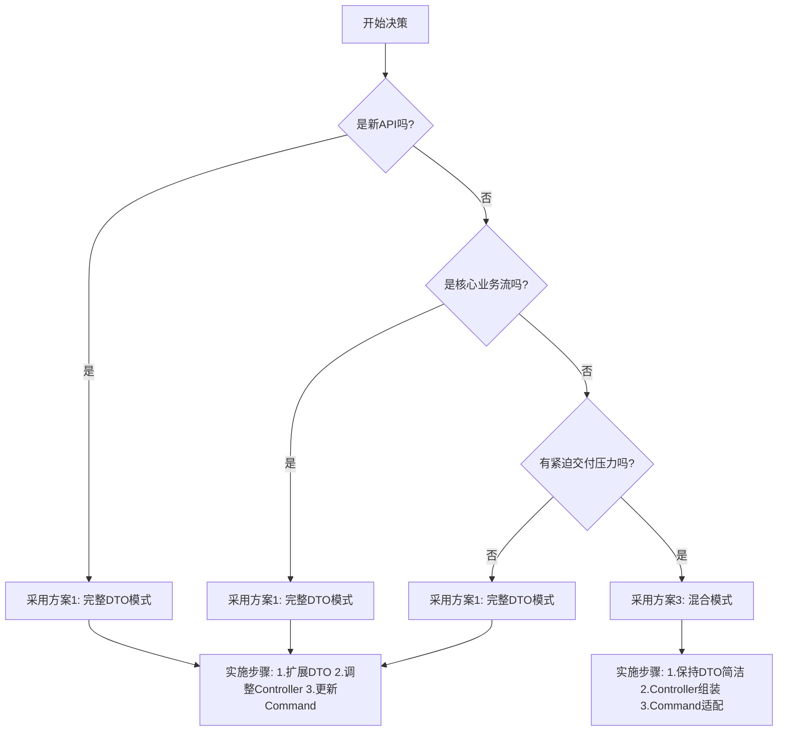

# Placement Domain - DTO Design Decisions & Solutions
# Placement领域 - DTO设计决策及解决方案

**Document Version**: 1.0
**Date**: 2025-12-21
**Status**: Final Design (待讨论)
**Context**: 重构DDD架构中，解决Placement领域API层DTO与Controller/Command类型不匹配问题

---

## 🎯 问题概述 (Problem Statement)

在DDD架构重构过程中，发现**API层DTO与Controller/Command层存在严重类型不匹配问题**。这些问题源于：

1. **DTO定义不完整**：Controller期望的字段与API DTO实际定义的字段不一致
2. **参数传递方式不一致**：部分字段在Controller层从URL参数获取，但DTO期望内联
3. **历史代码碎片化**：未遵循一致的DTO设计模式

---

## 📊 问题分类 (Issue Classification)

### 类别1: DTO属性缺失 (Missing DTO Properties)

| # | 错误位置 | 错误描述 | 严重程度 | 影响功能 |
|---|---------|---------|---------|---------|
| 1-1 | `placement-referral.controller.ts:100` | `PlacementJobApplicationUpdateStatusRequestDto` 缺少 `applicationId` 字段 | 🔴 高 | 内推导师分配失败 |
| 1-2 | `placement-referral.controller.ts:100` | `PlacementJobApplicationUpdateStatusRequestDto` 缺少 `newStatus` 字段 | 🔴 高 | 状态更新失败 |
| 1-3 | `placement-referral.controller.ts:100` | `PlacementJobApplicationUpdateStatusRequestDto` 缺少 `mentorId` 字段 | 🔴 高 | 导师分配失败 |
| 1-4 | `placement-referral.controller.ts:100` | `PlacementJobApplicationUpdateStatusRequestDto` 缺少 `changedBy` 字段 | 🟡 中 | 审计日志缺失 |
| 1-5 | `placement-referral.controller.ts:100` | `PlacementJobApplicationUpdateStatusRequestDto` 缺少 `changeReason` 字段 | 🟡 中 | 变更原因缺失 |
| 1-6 | `placement.controller.ts:195` | `PlacementJobApplicationUpdateStatusRequestDto` 缺少 `applicationId` 字段 | 🔴 高 | 申请状态更新失败 |
| 1-7 | `placement.controller.ts:240` | `RollbackJobApplicationStatusRequestDto` 缺少 `applicationId` 字段 | 🔴 高 | 状态回滚失败 |

**根本原因**：DTO定义过于简单，仅包含基础字段，未考虑实际业务场景需要的完整上下文。

### 类别2: 数据类型不匹配 (Data Type Mismatch)

| # | 错误位置 | 期望类型 | 实际类型 | 解决方案方向 |
|---|---|---|---|---|
| 2-1 | `placement-referral.controller.ts:136` | `jobType: string[]` | `string` | 统一为数组 |
| 2-2 | `placement-referral.controller.ts:144` | `normalJobTitle: string[]` | `string` | 统一为数组 |
| 2-3 | `placement-referral-manual-create.request.dto.ts` | `jobType` 字段类型不明确 | - | 需验证实际用法 |

**根本原因**：接口设计时未统一字段类型约定。

### 类别3: 跨层调用不一致 (Cross-Layer Inconsistency)

| # | 错误位置 | 问题描述 | 解决方案 |
|---|---------|---------|---------|
| 3-1 | `placement.controller.ts:84` | Controller添加`createdBy`字段，但DTO无此字段 | 拆分为URL参数 + DTO |
| 3-2 | `financial.controller.ts:539` | 传入`ledgerId`不在DTO定义中 | 从URL参数获取 |

**根本原因**：字段应在URL参数还是请求体中传递未明确约定。

---

## 🔍 根本原因分析 (Root Cause Analysis)

### 🌳 技术债务

1. **DTO设计碎片化**
   ```typescript
   // ❌ 旧模式：DTO仅包含部分字段
   class PlacementJobApplicationUpdateStatusRequestDto {
     status!: ApplicationStatus; // 仅一个字段
   }
   ```

   **问题**:
   - 字段在Controller层硬编码，未类型化
   - 审计字段（changedBy, changeReason）未显式定义
   - 业务标识符（applicationId）未包含

2. **参数传递方式混乱**
   ```typescript
   // ❌ 当前错误用法
   @Patch("referrals/:applicationId/mentor")
   assignReferralMentor(
     @Param("applicationId") applicationId: string,  // URL参数
     @Body() body: PlacementReferralAssignMentorRequestDto
   ) {
     return {
       applicationId,  // 硬编码传递
       newStatus: "mentor_assigned",  // 魔数字符串
       mentorId: body.mentorId,
       changedBy: counselorId,
     };
   }
   ```

3. **缺少统一的DTO设计规范**
   - 哪些字段放URL参数？
   - 哪些字段放请求体？
   - 哪些字段由客户端传？哪些由服务端生成？

---

## 💡 解决方案设计 (Solution Design)

### 方案1: 完整DTO模式 (推荐 ⭐⭐⭐⭐⭐)

#### 核心思想
**每个DTO包含该操作所需的所有字段**，无论这些字段从URL参数还是请求体获取。

#### 实施步骤

**步骤1: 扩展DTO定义**
```typescript
// placement-job-application-update-status.request.dto.ts

export class PlacementJobApplicationUpdateStatusRequestDto {
  @ApiProperty({
    description: "Application ID (UUID) [投递ID(UUID)]",
    type: String,
    format: "uuid"
  })
  @IsUUID()
  @IsNotEmpty()
  applicationId!: string;

  @ApiProperty({
    description: "Target status of the application [目标投递状态]",
    enum: APPLICATION_STATUSES,
    example: "interested",
  })
  @IsEnum(APPLICATION_STATUSES)
  status!: ApplicationStatus;

  @ApiPropertyOptional({
    description: "Assigned mentor ID (UUID) [分配的导师ID(UUID)]",
    type: String,
    format: "uuid",
  })
  @IsUUID()
  @IsOptional()
  mentorId?: string;

  @ApiPropertyOptional({
    description: "Change reason [变更原因]",
    type: String,
    example: "Assign referral mentor",
  })
  @IsString()
  @IsOptional()
  changeReason?: string;

  // 服务端自动填充，不由客户端传
  // changedBy: string - 从JWT token获取
  // changedAt: Date - 服务端生成
}
```

**步骤2: Controller层适配**
```typescript
// placement-referral.controller.ts

@Patch("referrals/:applicationId/mentor")
async assignReferralMentor(
  @Param("applicationId") applicationId: string,  // 保持URL参数
  @Body() body: PlacementReferralAssignMentorRequestDto,
  @CurrentUser() user: IJwtUser
) {
  const counselorId = String((user as unknown as { id: string }).id);

  // Controller负责组装完整DTO
  const updateStatusDto: PlacementJobApplicationUpdateStatusRequestDto = {
    applicationId,  // 从URL参数
    status: "mentor_assigned",  // Controller层决策
    mentorId: body.mentorId,  // 从请求体
    changeReason: "Assign referral mentor",  // 默认值
    // changedBy 不由客户端传，服务端从JWT获取
  };

  const result = await this.assignReferralMentorCommand.execute({
    updateStatusDto,
    changedBy: counselorId,  // 显式传递审计信息
  });

  return result.data;
}
```

**步骤3: Command层接口调整**
```typescript
// assign-referral-mentor.command.ts

interface ExecuteInput {
  updateStatusDto: PlacementJobApplicationUpdateStatusRequestDto;
  changedBy: string;  // 审计字段单独传递
}

async execute(input: ExecuteInput) {
  const { updateStatusDto, changedBy } = input;

  // 直接使用DTO字段
  const { applicationId, status, mentorId } = updateStatusDto;

  // 执行业务逻辑...
  await this.db.insert(applicationHistory).values({
    applicationId,  // ✅ 类型安全
    status,  // ✅ 类型安全
    changedBy,  // ✅ 明确传递
    changedAt: new Date(),  // ✅ 服务端生成
  });
}
```

#### ✅ 优势

| 维度 | 评估 |
|------|------|
| **类型安全** | ⭐⭐⭐⭐⭐ 完全类型化，编译时检查 |
| **API文档完整性** | ⭐⭐⭐⭐⭐ Swagger自动生成完整文档 |
| **可维护性** | ⭐⭐⭐⭐⭐ DTO定义清晰，易于维护 |
| **向后兼容** | ⭐⭐⭐⭐ 支持渐进式迁移 |
| **开发效率** | ⭐⭐⭐⭐ 类型提示减少错误 |
| **测试便利性** | ⭐⭐⭐⭐ DTO可独立测试验证 |

#### ❌ 劣势

- 需要重构现有的DTO和Controller
- 需要编写数据验证装饰器（约5分钟/字段）

#### 📈 适用场景

- **所有新API开发**（必须采用）
- **核心业务流DTO**（强烈推荐）
- **多团队协作API**（强烈推荐）
- **面向外部客户的API**（强制采用）

---

### 方案2: 参数分离模式 (保守方案 ⭐⭐⭐)

#### 核心思想
**URL参数放标识符，请求体放业务数据**，模块层接口明确分离这两类参数。

#### 实施步骤

**步骤1: 保持DTO精简**
```typescript
// DTO仅包含业务数据字段
export class PlacementJobApplicationUpdateStatusRequestDto {
  status!: ApplicationStatus;
  mentorId?: string;
  changeReason?: string;
}
```

**步骤2: Controller明确参数来源**
```typescript
@Patch("referrals/:applicationId/mentor")
async assignReferralMentor(
  @Param("applicationId") applicationId: string,  // URL参数单独声明
  @Body() body: PlacementJobApplicationUpdateStatusRequestDto,
  @CurrentUser() user: IJwtUser
) {
  // Controller负责组装和验证
  const fullCommand = {
    applicationId,  // 来自URL
    status: "mentor_assigned",  // Controller决策
    ...body,  // 来自请求体
    changedBy: user.id,  // 审计字段
  };

  return await this.service.execute(fullCommand);
}
```

**步骤3: Command层使用Partial类型**
```typescript
// 使用Partial类型支持部分字段
interface FullCommand extends PlacementJobApplicationUpdateStatusRequestDto {
  applicationId: string;
  changedBy: string;
}

async execute(command: FullCommand) {
  const { applicationId, status, mentorId, changedBy } = command;
  // 业务逻辑...
}
```

#### ✅ 优势

| 维度 | 评估 |
|------|------|
| **类型安全** | ⭐⭐⭐ 部分类型化 |
| **API简洁性** | ⭐⭐⭐⭐ DTO保持精简 |
| **迁移成本** | ⭐⭐⭐⭐⭐ 改动最小 |
| **向后兼容** | ⭐⭐⭐⭐⭐ 完全兼容 |

#### ❌ 劣势

- API文档不完整（缺少URL参数文档）
- Controller层需要重复字段声明
- 类型推导不直接
- 难以生成客户端SDK

#### 📈 适用场景

- **简单的CRUD接口**（单一资源操作）
- **内部不暴露的API**
- **迁移过渡期**（暂时方案）

---

### 方案3: 混合模式 (平衡方案 ⭐⭐⭐⭐)

#### 核心思想
**DTO包含所有字段，但通过`@ApiHideProperty`等装饰器控制文档展示**，同时支持多种调用方式。

#### 实施步骤

**步骤1: DTO包含完整字段**
```typescript
export class PlacementJobApplicationUpdateStatusRequestDto {
  // 必选字段
  @ApiProperty()
  applicationId!: string;

  @ApiProperty()
  status!: ApplicationStatus;

  // 可选字段
  @ApiPropertyOptional()
  mentorId?: string;

  // 服务端字段（文档中隐藏）
  @ApiHideProperty()  // 不在Swagger中显示
  @IsOptional()
  changedBy?: string;
}
```

**步骤2: Controller灵活组装**
```typescript
@Patch("referrals/:applicationId/mentor")
async assignReferralMentor(
  @Param("applicationId") applicationId: string,
  @Body() body: PlacementJobApplicationUpdateStatusRequestDto,
  @CurrentUser() user: IJwtUser
) {
  // 支持多种组装方式
  const fullDto = {
    ...body,
    applicationId,
    changedBy: user.id,
  };

  return await this.service.execute(fullDto);
}
```

#### ✅ 优势

| 维度 | 评估 |
|------|------|
| **灵活性** | ⭐⭐⭐⭐⭐ 支持多种调用方式 |
| **API文档完整性** | ⭐⭐⭐⭐ 主要字段有文档 |
| **向后兼容** | ⭐⭐⭐⭐⭐ 最大兼容性 |

#### ❌ 劣势

- DTO定义较复杂
- 某些字段可能为空（需要额外验证）
- 不够纯粹（混合了多种职责）

---

## 🎯 推荐方案对比 (Recommendation Comparison)

### 决策矩阵

| 评估维度 | 方案1: 完整DTO | 方案2: 参数分离 | 方案3: 混合模式 | 旧模式 |
|---------|------------|------------|------------|------|
| **类型安全** | ⭐⭐⭐⭐⭐ | ⭐⭐⭐ | ⭐⭐⭐⭐ | ⭐ |
| **API文档完整性** | ⭐⭐⭐⭐⭐ | ⭐⭐ | ⭐⭐⭐⭐ | ⭐ |
| **可维护性** | ⭐⭐⭐⭐⭐ | ⭐⭐⭐ | ⭐⭐⭐ | ⭐⭐ |
| **开发效率** | ⭐⭐⭐⭐ | ⭐⭐⭐ | ⭐⭐⭐⭐ | ⭐⭐ |
| **向后兼容** | ⭐⭐⭐⭐ | ⭐⭐⭐⭐⭐ | ⭐⭐⭐⭐⭐ | - |
| **测试便利性** | ⭐⭐⭐⭐⭐ | ⭐⭐⭐ | ⭐⭐⭐⭐ | ⭐ |
| **最佳实践符合度** | ⭐⭐⭐⭐⭐ | ⭐⭐⭐ | ⭐⭐⭐ | ⭐ |

### 推荐决策



---

## 📋 实施计划 (Implementation Plan)

### Phase 1: 核心DTO重构 (优先级: 🔴 高, 预计: 4-6小时)

#### 目标DTO（按优先级排序）

1. **PlacementJobApplicationUpdateStatusRequestDto**
   - ~~`applicationId`~~（URL参数）
   - [x] `status`（已存在）
   - [ ] `mentorId`（新增）
   - [ ] `changeReason`（新增）
   - [ ] `changeMetadata`（新增）

2. **RollbackJobApplicationStatusRequestDto**
   - ~~`applicationId`~~（URL参数）
   - [ ] `reason`（新增）
   - [ ] `rollbackDate`（新增）

3. **CreateJobPositionRequestDto**
   - ~~`createdBy`~~（服务端从JWT获取，不暴露给客户端）
   - [x] `jobType: string[]`（已存在，检查类型）
   - [x] `normalJobTitle: string[]`（已存在，检查类型）

#### 实施清单

- [ ] 创建DTO扩展设计文档
- [ ] 更新DTO类定义（添加字段和验证装饰器）
- [ ] 调整Controller层参数组装逻辑
- [ ] 更新Command层接口定义
- [ ] 更新单元测试
- [ ] 更新Swagger文档示例

### Phase 2: Controller层适配 (优先级: 🔴 高, 预计: 3-4小时)

#### 需要调整的Controller

```typescript
// 1. placement-referral.controller.ts
- assignReferralMentor(): 重构为使用完整DTO
- createManualJobApplication(): 验证jobType/normalJobTitle类型

// 2. placement.controller.ts
- updateJobApplicationStatus(): 重构applicationId处理
- rollbackApplicationStatus(): 重构applicationId处理
- createJobPosition(): 移除createdBy字段（服务端生成）

// 3. financial.controller.ts
- adjustPayableLedger(): 重构ledgerId处理（URL参数）
```

### Phase 3: 类型别名标准化 (优先级: 🟡 中, 预计: 2小时)

#### 标准化所有API DTO的类型别名

```typescript
// 统一格式：以'I'开头的接口名映射到RequestDto

// ✅ 标准格式示例
export type IUpdateApplicationStatusDto = PlacementJobApplicationUpdateStatusRequestDto;
export type IRollbackApplicationStatusDto = RollbackJobApplicationStatusRequestDto;
export type ICreateJobPositionDto = CreateJobPositionRequestDto;

// ❌ 待清理的旧格式
export type ICreateOrUpdateMentorPaymentInfoRequest = CreateOrUpdateMentorPaymentInfoRequestDto; // TODO: 标准化命名
```

### Phase 4: 验证与文档 (优先级: 🟢 低, 预计: 2小时)

- [ ] 运行构建验证：确保零TypeScript错误
- [ ] 生成Swagger文档：验证API文档完整性
- [ ] 更新API调用示例：Postman/Insomnia Collection
- [ ] 编写迁移指南：供前端团队参考

---

## 🎓 最佳实践规范 (Best Practices)

### 规则1: DTO设计原则

**✅ 应该做**
- [x] DTO包含操作所需的所有字段（包括URL参数对应的字段）
- [x] 使用`@ApiProperty`或`@ApiPropertyOptional`装饰所有字段
- [x] 使用class-validator进行输入验证
- [x] 为可选字段添加`@IsOptional()`装饰器
- [x] 保持DTO与业务操作1:1映射

**❌ 不应该做**
- [ ] Controller硬编码字段名（无类型化）
- [ ] 字段含义模糊不清（如`data`, `info`等）
- [ ] 混合多个业务操作的字段到一个DTO
- [ ] 省略审计字段（changedBy, createdAt等）

### 规则2: Controller层规范

**✅ 应该做**
- [x] 从JWT token提取用户信息（userId, roles等）
- [x] Controller负责组装完整DTO（包括URL参数）
- [x] 使用`@ApiOperation`详细描述API用途
- [x] 为每个字段提供清晰的描述（中英文）

**❌ 不应该做**
- [ ] 在Controller层写业务逻辑
- [ ] 假设请求数据总是有效的
- [ ] 忽略错误处理和边界条件

### 规则3: Command层规范

**✅ 应该做**
- [x] Command接收完整的DTO + 审计信息
- [x] 在Command层进行业务规则验证
- [x] 使用事务确保数据一致性
- [x] 记录详细的日志（开始、结束、关键决策点）

**❌ 不应该做**
- [ ] 直接从Controller传递零散参数
- [ ] 在Command层解析JWT token
- [ ] 忽略领域事件发布

---

## 🚨 风险与缓解措施 (Risks & Mitigation)

### 风险1: 迁移期间API不兼容

**风险描述**：重构DTO可能导致前端调用失败。

**缓解措施**：
1. 采用**增量迁移**策略：逐个API重构并验证
2. 提供**API版本兼容**（v1/v2）或使用feature flag
3. 提前通知前端团队，协调发布窗口
4. 准备**快速回滚**方案（保留旧DTO 1-2个迭代）

### 风险2: 遗漏字段导致业务逻辑错误

**风险描述**：重构过程中可能遗漏关键字段。

**缓解措施**：
1. **代码审查清单**（详见下表）
2. **全面测试覆盖**：单元测试 + 集成测试 + e2e测试
3. **生产灰度发布**：先5%流量，逐步扩大
4. **监控关键指标**：API错误率、业务成功率

### 风险3: Swagger文档前后不一致

**风险描述**：DTO字段变化但文档未更新。

**缓解措施**：
1. 使用**自动化工具**验证Swagger文档（swagger-diff）
2. **API契约测试**：使用Pact或Spring Cloud Contract
3. 文档与代码**同源管理**（代码即文档）
4. 生成**客户端SDK**并验证编译通过

---

## ✅ 代码审查清单 (Code Review Checklist)

### DTO定义审查

- [ ] DTO名称是否清晰描述其用途？
- [ ] 是否所有字段都有`@ApiProperty`/`@ApiPropertyOptional`装饰？
- [ ] 是否所有字段都有适当的验证装饰器？
- [ ] 枚举字段是否使用`@IsEnum()`验证？
- [ ] UUID字段是否使用`@IsUUID()`验证？
- [ ] 数组字段是否使用`@IsArray()`和`@ValidateNested()`？
- [ ] 日期字段是否有格式验证？
- [ ] 数字字段是否有范围限制（`@Min()`, `@Max()`）？
- [ ] 字段描述是否包含中英文？
- [ ] 是否区分客户端传值和服务端生成字段？

### Controller层审查

- [ ] URL参数是否通过`@Param()`正确声明类型？
- [ ] 请求体是否通过`@Body()`正确声明DTO类型？
- [ ] 是否从JWT提取用户信息（而非请求体）？
- [ ] Controller是否仅负责组装数据，不包含业务逻辑？
- [ ] 是否处理DTO组装的所有边界情况？
- [ ] API文档描述是否清晰完整？

### Command层审查

- [ ] 输入参数是否类型化（使用DTO + 审计信息）？
- [ ] 是否验证所有输入字段的完整性？
- [ ] 是否使用事务保证数据一致性？
- [ ] 是否发布必要的领域事件？
- [ ] 是否有充分的日志记录？
- [ ] 是否处理了所有边界条件和错误场景？

---

## 📚 参考文献 (References)

1. **NestJS文档**
   - [Validation Pipe](https://docs.nestjs.com/techniques/validation)
   - [OpenAPI (Swagger)](https://docs.nestjs.com/openapi/introduction)
   - [Exception Filters](https://docs.nestjs.com/exception-filters)

2. **设计模式**
   - [DTO vs Entity](https://martinfowler.com/eaaCatalog/dataTransferObject.html)
   - [Anti-Corruption Layer](https://learn.microsoft.com/en-us/azure/architecture/patterns/anti-corruption-layer)
   - [CQRS Pattern](https://docs.microsoft.com/en-us/azure/architecture/patterns/cqrs)

3. **最佳实践**
   - [REST API Design Guide](https://restfulapi.net/)
   - [API Versioning Strategies](https://semver.org/)
   - [Type-Driven Development](https://www.typescriptlang.org/docs/handbook/typescript-in-5-minutes.html)

---

## 🤝 相关方与职责 (Stakeholders & Responsibilities)

| 角色 | 职责 | 参与度 |
|------|------|--------|
| **后端架构师** | 设计DTO规范，审查架构决策 | 🎯 主导 |
| **后端开发** | 实施DTO重构，更新Controller/Command | 💻 执行 |
| **前端开发** | 验证API兼容性，调整调用方式 | 🔍 验证 |
| **QA测试** | 编写/执行测试用例，验证功能完整性 | ✅ 测试 |
| **技术写作** | 更新API文档，编写迁移指南 | 📖 文档 |
| **产品经理** | 协调资源，评估业务影响 | 🤝 协调 |

---

## 🔄 版本历史 (Version History)

| 版本 | 日期 | 作者 | 变更说明 |
|------|------|------|---------|
| 1.0 | 2025-12-21 | Claude | 初版完成，定义问题和解决方案 |

---

## 📞 联系方式 (Contact)

- **技术讨论**: 请创建GitHub Issue或发起技术评审会议
- **紧急问题**: 直接联系后端架构师或技术负责人

---

**声明**: 本文档为技术设计决策文档，所有重大变更需经过技术评审委员会审批。
**Last Updated**: 2025-12-21 18:30:00
**Next Review Date**: 2025-12-28 18:30:00
