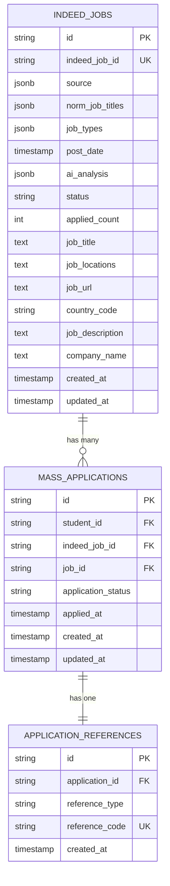

# 海投模块 (Mass Application Module) 设计文档 v2.0

> **版本：** v2.0  
> **创建日期：** 2025-01-09  
> **状态：** 极简设计  
> **负责域：** Placement Domain - 海投模块  
> **核心理念：** 简洁直接调用，无事件无通知

## 1. 核心定义

**海投**：学生在第三方平台自主筛选岗位并批量投递的免费服务

**边界**：
- ✓ 学生自主投递操作
- ✓ 批量投递能力  
- ✓ 状态跟踪记录
- ✗ 无领域事件
- ✗ 无通知机制
- ✗ 无配额限制

## 2. 数据模型

### 2.1 核心实体

```typescript
// MassApplication - 海投申请
{
  id: string;                    // 申请ID
  studentId: string;            // 学生ID
  indeedJobId: string;          // 清洗后Indeed岗位ID
  jobId?: string;               // 招聘平台原始岗位编号（如Indeed返回的job id）
  status: ApplicationStatus;    // 申请状态
  appliedAt: Date;              // 投递时间
  createdAt: Date;              // 创建时间
  updatedAt: Date;              // 更新时间
}
```

### 2.2 状态枚举

```typescript
enum ApplicationStatus {
  SUBMITTED = "submitted",     // 已投递（初始状态）
  INTERVIEWED = "interviewed", // 已面试
  OFFERED = "offered",         // 已发offer
  REJECTED = "rejected",       // 已拒绝
  EXPIRED = "expired"          // 已过期
}
```

### 2.3 约束规则

- 同一学生对同一岗位只能申请一次
- 状态必须按预定义规则流转
- 所有操作记录时间戳

### 2.4 数据表关系图



### 2.5 数据表详细设计

#### 2.5.1 主表：mass_applications

| 字段名 | 数据类型 | 约束 | 描述 |
|--------|----------|------|------|
| id | UUID | PRIMARY KEY | 申请记录唯一标识 |
| student_id | UUID | NOT NULL, FK | 学生ID，外键关联students表 |
| indeed_job_id | VARCHAR(255) | NOT NULL | 清洗后Indeed岗位ID |
| job_id | VARCHAR(100) | NULL | 招聘平台原始岗位编号（如Indeed返回的job id） |
| application_status | VARCHAR(50) | NOT NULL, DEFAULT 'submitted' | 申请状态 |
| applied_at | TIMESTAMP | NOT NULL, DEFAULT NOW() | 投递时间 |
| created_at | TIMESTAMP | NOT NULL, DEFAULT NOW() | 创建时间 |
| updated_at | TIMESTAMP | NOT NULL, DEFAULT NOW() | 更新时间 |

**索引设计**：
```sql
-- 主键索引
ALTER TABLE mass_applications ADD PRIMARY KEY (id);

-- 业务唯一索引
CREATE UNIQUE INDEX uk_student_job
ON mass_applications(student_id, indeed_job_id);

-- 查询优化索引
CREATE INDEX idx_student_status
ON mass_applications(student_id, application_status);

CREATE INDEX idx_job_status
ON mass_applications(indeed_job_id, application_status);

CREATE INDEX idx_applied_at
ON mass_applications(applied_at DESC);

CREATE INDEX idx_status_applied 
ON mass_applications(application_status, applied_at DESC);
```

#### 2.5.2 Indeed岗位表：indeed_jobs

| 字段名 | 数据类型 | 约束 | 描述 |
|--------|----------|------|------|
| id | UUID | PRIMARY KEY | 岗位记录唯一标识 |
| indeed_job_id | VARCHAR(255) | NOT NULL, UNIQUE | Indeed平台岗位ID |
| source | JSONB | NOT NULL | 数据源信息（包含type和id） |
| norm_job_titles | JSONB | NOT NULL | 标准化职位标题数组 |
| job_types | JSONB | NOT NULL | 工作类型数组（如：Full-time） |
| post_date | TIMESTAMP | NOT NULL | 发布日期 |
| ai_analysis | JSONB | NULL | AI分析结果（技能、H1B、教育要求等） |
| status | VARCHAR(50) | NOT NULL, DEFAULT 'active' | 岗位状态 |
| job_title | TEXT | NOT NULL | 职位标题 |
| job_locations | TEXT | NOT NULL | 工作地点 |
| job_url | TEXT | NOT NULL | 岗位链接 |
| country_code | VARCHAR(10) | NOT NULL | 国家代码 |
| job_description | TEXT | NOT NULL | 职位描述 |
| company_name | TEXT | NOT NULL | 公司名称 |
| created_at | TIMESTAMP | NOT NULL, DEFAULT NOW() | 创建时间 |
| updated_at | TIMESTAMP | NOT NULL, DEFAULT NOW() | 更新时间 |

**JSON字段结构示例**：
```json
{
  "source": {
    "type": "indeed",
    "id": "e1f4b5f77600ec07"
  },
  "norm_job_titles": ["Sales"],
  "job_types": ["Full-time"],
  "ai_analysis": {
    "required_skills": [
      {"skill": "Outside sales / Sales", "YOP": 1},
      {"skill": "Negotiation / Contract negotiation", "YOP": 1},
      {"skill": "Prospecting / Lead generation", "YOP": 1}
    ],
    "h1b": "NA",
    "h1b_evidence": "",
    "us_citizenship": "NA",
    "minimum_educational_requirement": "NA",
    "job_responsibilities": [
      "Diligently pursue leads and close sales",
      "Conduct professional product demonstrations"
    ],
    "industry": "Automotive Retail",
    "domain": "Sales / Retail Sales",
    "field": "Automotive Sales",
    "experience_level": "entry_level",
    "matched_job_titles": [{"job_title": "Sales", "score": 100}],
    "location": ["NA"]
  }
}
```

**索引设计**：
```sql
-- 主键索引
ALTER TABLE indeed_jobs ADD PRIMARY KEY (id);

-- Indeed ID唯一索引
CREATE UNIQUE INDEX uk_indeed_job_id 
ON indeed_jobs(indeed_job_id);

-- 状态查询索引
CREATE INDEX idx_job_status 
ON indeed_jobs(status);

-- 国家代码索引
CREATE INDEX idx_country_code 
ON indeed_jobs(country_code);

-- 发布日期索引
CREATE INDEX idx_post_date 
ON indeed_jobs(post_date DESC);

-- JSON字段GIN索引（用于JSONB字段查询）
CREATE INDEX idx_source_gin 
ON indeed_jobs USING gin(source);

CREATE INDEX idx_job_types_gin 
ON indeed_jobs USING gin(job_types);

CREATE INDEX idx_ai_analysis_gin 
ON indeed_jobs USING gin(ai_analysis);

-- 复合查询索引
CREATE INDEX idx_status_country 
ON indeed_jobs(status, country_code);

CREATE INDEX idx_created_updated 
ON indeed_jobs(created_at DESC, updated_at DESC);
```

**查询示例**：
```sql
-- 查询特定类型的岗位
SELECT * FROM indeed_jobs 
WHERE job_types @> '["Full-time"]';

-- 查询包含特定技能的岗位
SELECT * FROM indeed_jobs 
WHERE ai_analysis->'required_skills' @> '[{"skill": "Sales"}]';

-- 查询特定行业的岗位
SELECT * FROM indeed_jobs 
WHERE ai_analysis->>'industry' = 'Automotive Retail';

-- 查询特定经验级别的岗位
SELECT * FROM indeed_jobs 
WHERE ai_analysis->>'experience_level' = 'entry_level';
```

#### 2.5.3 关联表：application_references

| 字段名 | 数据类型 | 约束 | 描述 |
|--------|----------|------|------|
| id | UUID | PRIMARY KEY | 引用记录唯一标识 |
| application_id | UUID | NOT NULL, FK | 申请ID，外键关联mass_applications表 |
| reference_type | VARCHAR(50) | NOT NULL | 引用类型（如：application_reference） |
| reference_code | VARCHAR(100) | NOT NULL, UNIQUE | 统一引用编码 |
| created_at | TIMESTAMP | NOT NULL, DEFAULT NOW() | 创建时间 |

**索引设计**：
```sql
-- 主键索引
ALTER TABLE application_references ADD PRIMARY KEY (id);

-- 外键索引
CREATE INDEX idx_application_id 
ON application_references(application_id);

-- 引用编码唯一索引
CREATE UNIQUE INDEX uk_reference_code 
ON application_references(reference_code);
```

## 3. 服务接口

```typescript
interface IMassApplicationService {
  // 核心操作
  createApplication(cmd: CreateCommand): Promise<Result>;
  createBatchApplications(cmd: BatchCommand): Promise<BatchResult>;
  
  // 状态变更（服务接口）
  processApplicationRejection(cmd: RejectionCommand): Promise<Result>;
  processInterviewInvitation(cmd: InterviewCommand): Promise<Result>;
  processOfferReceived(cmd: OfferCommand): Promise<Result>;
  expireApplication(cmd: ExpireCommand): Promise<Result>;
  
  // 查询
  getApplication(id: string): Promise<Details>;
  queryStudentApplications(query: Query): Promise<PaginatedResult>;
  getApplicationStats(studentId: string): Promise<Stats>;
}
```

## 4. 领域服务设计

### 4.2 核心服务接口

#### 4.2.1 MassApplicationService

**服务职责**：处理海投申请的核心业务逻辑，遵循项目领域服务设计规范

**接口定义**（参考项目现有接口模式）：

```typescript
// interfaces/mass-application-service.interface.ts
export interface IMassApplicationService {
  /**
   * 创建海投申请
   * Create mass application (创建海投申请)
   */
  createApplication(
    command: CreateMassApplicationCommand,
  ): Promise<MassApplicationResult>;

  /**
   * 批量创建海投申请
   * Create batch mass applications (批量创建海投申请)
   */
  createBatchApplications(
    command: CreateBatchMassApplicationCommand,
  ): Promise<BatchMassApplicationResult>;

  /**
   * 更新申请状态
   * Update application status (更新申请状态)
   */
  updateApplicationStatus(
    command: UpdateMassApplicationStatusCommand,
  ): Promise<MassApplicationResult>;

  /**
   * 获取申请详情
   * Get application details (获取申请详情)
   */
  getApplication(
    query: GetMassApplicationQuery,
  ): Promise<MassApplicationDetails>;

  /**
   * 查询学生申请列表
   * Query student applications (查询学生申请列表)
   */
  queryStudentApplications(
    query: QueryStudentMassApplicationsQuery,
  ): Promise<PaginatedMassApplications>;

  /**
   * 获取申请统计
   * Get application statistics (获取申请统计)
   */
  getApplicationStats(
    query: GetMassApplicationStatsQuery,
  ): Promise<MassApplicationStats>;

  /**
   * 撤回申请
   * Withdraw application (撤回申请)
   */
  withdrawApplication(
    command: WithdrawMassApplicationCommand,
  ): Promise<MassApplicationResult>;

  /**
   * 处理申请拒绝
   * Process application rejection (处理申请拒绝)
   */
  processApplicationRejection(
    command: ProcessApplicationRejectionCommand,
  ): Promise<MassApplicationResult>;

  /**
   * 处理面试邀请
   * Process interview invitation (处理面试邀请)
   */
  processInterviewInvitation(
    command: ProcessInterviewInvitationCommand,
  ): Promise<MassApplicationResult>;

  /**
   * 处理面试结果
   * Process interview result (处理面试结果)
   */
  processInterviewResult(
    command: ProcessInterviewResultCommand,
  ): Promise<MassApplicationResult>;

  /**
   * 处理offer接收
   * Process offer received (处理offer接收)
   */
  processOfferReceived(
    command: ProcessOfferReceivedCommand,
  ): Promise<MassApplicationResult>;

  /**
   * 申请过期处理
   * Expire application (申请过期处理)
   */
  expireApplication(
    command: ExpireApplicationCommand,
  ): Promise<MassApplicationResult>;

  /**
   * Offer过期处理
   * Expire offer (Offer过期处理)
   */
  expireOffer(
    command: ExpireOfferCommand,
  ): Promise<MassApplicationResult>;
}
```
```

````

#### 4.2.2 命令对象定义

**CreateMassApplicationCommand**：
```typescript
interface CreateMassApplicationCommand {
    studentId: string;          // 学生ID
    indeedJobId: string;        // 清洗后Indeed岗位ID
    jobId?: string;            // 招聘平台原始岗位编号（可选）
    appliedAt?: Date;          // 投递时间（可选，默认当前时间）
    metadata?: Record<string, any>; // 附加元数据
}
```

**CreateBatchMassApplicationCommand**：

```typescript
interface CreateBatchMassApplicationCommand {
  studentId: string; // 学生ID
  applications: Array<{
    indeedJobId: string; // 清洗后Indeed岗位ID
    jobId?: string; // 招聘平台原始岗位编号
    appliedAt?: Date; // 投递时间
  }>; // 申请列表
  batchMetadata?: Record<string, any>; // 批量操作元数据
}
```

**UpdateMassApplicationStatusCommand** ：

```typescript
interface UpdateMassApplicationStatusCommand {
  applicationId: string; // 申请ID
  newStatus: ApplicationStatus; // 新状态
  updatedBy: string; // 更新人
  metadata?: Record<string, any>;
}
```

**ProcessApplicationRejectionCommand** ：

```typescript
interface ProcessApplicationRejectionCommand {
  applicationId: string; // 申请ID
  rejectionReason?: string; // 拒绝原因
  rejectedBy: string; // 拒绝操作人
  metadata?: Record<string, any>;
}
```

**ProcessInterviewInvitationCommand** ：

```typescript
interface ProcessInterviewInvitationCommand {
  applicationId: string; // 申请ID
  interviewDate: Date; // 面试日期
  interviewLocation?: string; // 面试地点
  interviewNotes?: string; // 面试备注
  invitedBy: string; // 邀请操作人
  metadata?: Record<string, any>;
}
```

**ProcessInterviewResultCommand** ：

```typescript
interface ProcessInterviewResultCommand {
  applicationId: string; // 申请ID
  result: 'PASSED' | 'FAILED'; // 面试结果
  resultNotes?: string; // 结果备注
  processedBy: string; // 处理操作人
  metadata?: Record<string, any>;
}
```

**ProcessOfferReceivedCommand** ：

```typescript
interface ProcessOfferReceivedCommand {
  applicationId: string; // 申请ID
  offerDetails: {
    salary?: string; // 薪资信息
    startDate?: Date; // 入职日期
    offerExpiryDate?: Date; // offer过期日期
  }; // offer详情
  offeredBy: string; // 发放操作人
  metadata?: Record<string, any>;
}
```

**ExpireApplicationCommand** ：

```typescript
interface ExpireApplicationCommand {
  applicationId: string; // 申请ID
  expiryReason: string; // 过期原因
  expiredBy: string; // 过期操作人
  metadata?: Record<string, any>;
}
```

**ExpireOfferCommand** ：

```typescript
interface ExpireOfferCommand {
  applicationId: string; // 申请ID
  expiryReason: string; // 过期原因
  expiredBy: string; // 过期操作人
  metadata?: Record<string, any>;
}
```

## 6. 业务流程设计

### 6.1 核心业务流程

#### 6.1.1 单岗位投递流程（优化版）


#### 6.1.2 批量投递流程（优化版）


### 6.2 状态流转流程（学生视角优化版）

#### 6.2.1 申请状态生命周期（增强版）


#### 6.2.2 业务规则验证

**海投服务特点**：海投是免费服务，无投递配额限制，学生可以无限次投递

**业务规则验证**：

1. **投递前验证**：
   - 检查岗位是否有效且未过期
   - 验证是否已投递过该岗位（避免重复）

2. **投递中验证**：
   - 验证岗位信息完整性
   - 实时更新投递状态

3. **投递后处理**：
   - 记录投递历史
   - 更新学生投递统计

#### 6.2.4 状态变更业务流程

**服务接口状态变更流程**：


**服务接口状态变更实现**：

所有状态变更均通过服务接口实现，主要包含以下接口方法：

- `updateApplicationStatus()` - 更新申请状态
- `processInterviewResult()` - 处理面试结果
- `processOfferReceived()` - 处理收到offer
- `processApplicationRejection()` - 处理申请被拒
- `expireApplication()` - 申请过期处理

## 7. 状态流转设计

### 7.1 状态流转规则

#### 7.1.1 状态变更业务规则（学生操作权限）

**学生可操作状态变更**：

由于海投服务为免费服务，学生无法进行主动状态变更操作，所有状态变更均通过服务接口实现。

**服务接口状态变更**：

| 当前状态    | 目标状态    | 服务接口方法                   |
| ----------- | ----------- | ------------------------------ |
| SUBMITTED   | REJECTED    | `processApplicationRejection()` |
| SUBMITTED   | INTERVIEWED | `processInterviewInvitation()`  |
| INTERVIEWED | OFFERED     | `processOfferReceived()`        |
| INTERVIEWED | REJECTED    | `processInterviewRejection()`   |
| SUBMITTED   | EXPIRED     | `expireApplication()`           |
| OFFERED     | EXPIRED     | `expireOffer()`                 |

**状态变更约束（增强版）** ：

1. **状态可见性** ：
   - 所有状态变更都有时间戳记录
   - 学生可实时查看申请进度

2. **状态变更记录** ：
   - 所有状态变更都有时间戳记录
   - 状态变更有操作人信息记录

3. **操作权限控制** ：
   - 学生只能查看自己的申请
   - 服务接口状态变更需要权限验证

4. **业务规则约束** ：
   - 申请进入面试阶段后保持当前状态
   - 重复投递同一岗位会被阻止

5. **并发处理** ：
   - 同一时间只能有一个状态变更操作
   - 服务接口状态变更保证一致性
   - 乐观锁机制防止并发冲突


## 8. 业务规则

### 8.1 核心业务规则

#### 8.1.1 唯一性约束规则

**规则定义**：同一学生对同一Indeed岗位只能有一条有效的申请记录

**实现方式**：

```typescript
// 在创建申请时进行唯一性检查
private async validateUniqueApplication(
    studentId: string,
    indeedJobId: string
): Promise<void> {
    const existingApplication = await this.database
        .select()
        .from(massApplications)
        .where(
            and(
                eq(massApplications.studentId, studentId),
                eq(massApplications.indeedJobId, indeedJobId),
                notIn(massApplications.applicationStatus, [ApplicationStatus.EXPIRED])
            )
        )
        .limit(1);

    if (existingApplication.length > 0) {
        throw new DuplicateApplicationException(
            `Student ${studentId} has already applied for job ${indeedJobId}`
        );
    }
}

private isExpired(application: MassApplication): boolean {
    return application.applicationStatus === ApplicationStatus.EXPIRED;
}
```

#### 8.1.2 状态流转规则

**规则定义**：申请状态必须按照预定义的状态机进行流转，不允许非法状态变更

**实现方式**：

```typescript
// 状态流转验证（简化版）
private readonly allowedTransitions: Map<ApplicationStatus, ApplicationStatus[]> = new Map([
    // 初始状态直接为已投递
    [ApplicationStatus.SUBMITTED, [ApplicationStatus.INTERVIEWED, ApplicationStatus.REJECTED, ApplicationStatus.EXPIRED]],
    
    // 处理阶段流转
    [ApplicationStatus.INTERVIEWED, [ApplicationStatus.OFFERED, ApplicationStatus.REJECTED]],
    
    // 结果阶段流转
    [ApplicationStatus.OFFERED, []], // 终止状态
    
    // 终止状态
    [ApplicationStatus.REJECTED, []], // 终止状态
    [ApplicationStatus.EXPIRED, []] // 终止状态
]);

private validateStatusTransition(
    oldStatus: ApplicationStatus,
    newStatus: ApplicationStatus
): void {
    const allowedTargets = this.allowedTransitions.get(oldStatus);

    if (!allowedTargets || !allowedTargets.includes(newStatus)) {
        throw new InvalidStatusTransitionException(
            `Invalid status transition from ${oldStatus} to ${newStatus}`
        );
    }
}
```

#### 8.1.3 批量操作规则

**规则定义**：批量投递操作时，逐条处理申请记录。单条记录失败不影响其他记录的投递，最终返回成功和失败的列表

**实现方式**：

```typescript
async createBatchApplications(
    command: CreateBatchMassApplicationCommand
): Promise<BatchMassApplicationResult> {
    const result: BatchMassApplicationResult = {
        batchId: this.generateBatchId(),
        totalCount: command.applications.length,
        successCount: 0,
        failedCount: 0,
        applications: [],
        failures: []
    };

    // 使用事务保证每条记录的数据一致性，但失败不整体回滚
    for (const appData of command.applications) {
        try {
            // 验证单个申请
            await this.validateSingleApplication(appData, command.studentId);

            // 创建申请（每个申请独立事务）
            const application = await this.createSingleApplicationInTransaction(
                appData,
                command.studentId
            );
            result.applications.push(application);
            result.successCount++;

        } catch (error) {
            result.failures.push({
                indeedJobId: appData.indeedJobId,
                reason: error.message
            });
            result.failedCount++;

            // 记录失败但不中断批处理
            this.logger.warn(
                `Batch application failed for job ${appData.indeedJobId}: ${error.message}`
            );
        }
    }

    return result;
}
```

**设计说明**：批量投递采用"部分成功"模式，即每个岗位投递相互独立。某个岗位投递失败（如已投递过）不影响其他岗位的投递，符合海投业务场景：学生通常批量投递多个感兴趣岗位，希望尽可能多的投递成功。

### 8.2 数据一致性规则

#### 8.2.1 事务一致性

**规则定义**：所有涉及多个数据变更的操作必须使用事务保证一致性

**应用场景**：

- 创建申请记录时必须同时创建application_references记录
- 批量操作中单条记录的创建使用独立事务

#### 8.2.2 单条申请创建的原子性

**规则定义**：单个申请的创建操作必须在同一事务中完成，确保数据一致性

**实现方式**：

```typescript
// 使用事务保证单个申请的数据一致性
async createApplicationWithTransaction(
    command: CreateMassApplicationCommand
): Promise<MassApplication> {
    return await this.transactionManager.runInTransaction(async () => {
        // 1. 创建申请记录
        const application = await this.createApplicationRecord(command);

        // 2. 创建统一引用
        const reference = await this.createApplicationReference(application);

        // 3. 验证数据完整性
        await this.validateDataIntegrity(application, reference);

        return application;
    });
}
```

### 8.3 性能优化规则

#### 8.3.1 查询优化规则

**规则定义**：高频查询必须使用索引优化，避免全表扫描

**索引策略**：

```sql
-- 核心查询索引
CREATE INDEX idx_mass_applications_student ON mass_applications(student_id);
CREATE INDEX idx_mass_applications_job ON mass_applications(indeed_job_id);
CREATE INDEX idx_mass_applications_status ON mass_applications(application_status);
CREATE INDEX idx_mass_applications_created ON mass_applications(created_at);

-- 复合查询索引
CREATE INDEX idx_mass_applications_student_status ON mass_applications(student_id, application_status);
CREATE INDEX idx_mass_applications_student_created ON mass_applications(student_id, created_at DESC);
```

#### 8.3.2 批量操作优化

**规则定义**：批量操作必须使用批处理机制，减少数据库交互次数

**实现方式**：

```typescript
// 使用批量插入优化（无事件发布）
async createBatchApplicationsOptimized(
    applications: MassApplication[]
): Promise<MassApplication[]> {
    // 1. 数据预处理
    const processedApplications = applications.map(app => ({
        ...app,
        id: this.generateId(),
        createdAt: new Date(),
        updatedAt: new Date()
    }));

    // 2. 批量验证
    await this.validateBatchApplications(processedApplications);

    // 3. 批量插入
    const createdApplications = await this.database
        .insert(massApplications)
        .values(processedApplications)
        .returning();

    return createdApplications;
}
```

## 6. 数据库设计

### 6.1 核心索引

```sql
-- 学生查询索引
CREATE INDEX idx_mass_applications_student_created_desc 
ON mass_applications(student_id, created_at DESC);

-- 状态查询索引
CREATE INDEX idx_mass_applications_student_status
ON mass_applications(student_id, application_status);

-- 岗位查询索引
CREATE INDEX idx_mass_applications_job_status
ON mass_applications(indeed_job_id, application_status);
```

### 6.2 分页优化

```typescript
// 游标分页实现
async getApplicationsWithCursor(
    studentId: string,
    cursor?: string,
    limit: number = 20
): Promise<CursorPaginatedResult> {
    let query = this.database
        .select()
        .from(massApplications)
        .where(eq(massApplications.studentId, studentId))
        .orderBy(desc(massApplications.createdAt))
        .limit(limit + 1);

    if (cursor) {
        const cursorData = this.decodeCursor(cursor);
        query = query.where(lt(massApplications.createdAt, cursorData.time));
    }

    const results = await query;
    const hasNextPage = results.length > limit;
    const items = hasNextPage ? results.slice(0, -1) : results;

    return {
        items,
        nextCursor: hasNextPage ? this.encodeCursor(items[items.length - 1]) : null,
        hasNextPage
    };
}
```


```

## 7. 实施清单

### 7.1 开发前
- [ ] 数据库表结构创建
- [ ] 核心索引添加
- [ ] 枚举类型定义

### 7.2 功能开发
- [ ] 服务接口实现
- [ ] 状态流转逻辑
- [ ] 业务规则验证
- [ ] 异常处理机制

### 7.3 测试
- [ ] 单元测试覆盖
- [ ] 集成测试通过
- [ ] 性能测试达标

### 7.4 部署
- [ ] 环境配置正确
- [ ] 监控告警配置
- [ ] 日志配置优化

## 10. 架构决策清单 (2025-01-09)

### 已决策项
- ✅ **数据模型方案**: 采用共享主键设计，application_references作为中心表
- ✅ **ID类型**: 使用UUID，利用PostgreSQL原生性能优势
- ✅ **字段命名**: 全面对齐Placement域详细设计规范
  - description → job_description
  - 添加 department 字段
  - 添加 created_by / updated_by 字段
- ✅ **防腐层实现**: 遵循DDD防腐层原则，使用字符串引用
  - student_id: string (非外键)
  - indeed_job_id: string (非外键)
- ✅ **领域事件机制**: 保持无事件设计（海投为免费服务，无需与Contract域集成）
- ✅ **海投模块采用极简设计理念**: 直接调用模式，无事件无通知
- ✅ **业务流程**: 学生自主投递，无需顾问介入
- ✅ **业务规则**: 同一学生同一岗位只能申请一次
- ✅ **批量操作**: 事务内逐条处理，失败不影响其他记录

---

**版本记录**：
- v2.0 (2025-01-09): 极简设计，无事件无通知，直接调用模式
