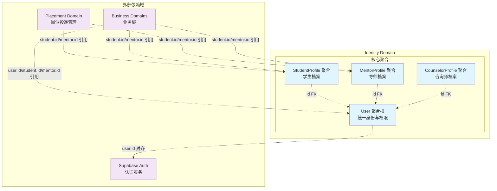

# Identity Domain 详细设计文档

> **版本：** v1.0.0  
> **创建日期：** 2025-01-09  
> **状态：** 架构设计完成  
> **负责域：** Identity Domain（身份域）  
> **文档编号：** IDENTITY-DOMAIN-2025-01-09

## 📋 目录

- [1. 领域概述](#1-领域概述)
  - [1.1 核心聚合](#11-核心聚合)
  - [1.2 领域边界定义](#12-领域边界定义)
- [2. 核心业务模块](#2-核心业务模块)
  - [2.1 User 聚合根](#21-user-聚合根)
  - [2.2 StudentProfile 聚合](#22-studentprofile-聚合)
  - [2.3 MentorProfile 聚合](#23-mentorprofile-聚合)
  - [2.4 CounselorProfile 聚合](#24-counselorprofile-聚合)
- [3. 数据模型设计](#3-数据模型设计)
  - [3.1 表关系图](#31-表关系图)
  - [3.2 用户与角色表](#32-用户与角色表)
  - [3.3 Profile 档案表](#33-profile-档案表)
  - [3.4 主数据表](#34-主数据表)
  - [3.5 状态枚举定义](#35-状态枚举定义)
- [4. 领域服务设计](#4-领域服务设计)
  - [4.1 UserService 接口](#41-userservice-接口)
  - [4.2 Profile 服务接口](#42-profile-服务接口)
- [5. 目录结构设计](#5-目录结构设计)
  - [5.1 领域层（Domain Layer）](#51-领域层domain-layer)
  - [5.2 应用层（Application Layer）](#52-应用层application-layer)
- [6. 业务规则](#6-业务规则)
  - [6.1 User 聚合规则](#61-user-聚合规则)
  - [6.2 Profile 聚合规则](#62-profile-聚合规则)
  - [6.3 角色管理规则](#63-角色管理规则)
  - [6.4 通用规则](#64-通用规则)
- [7. 待确认点](#7-待确认点)
  - [7.1 Student 和 Mentor 教育背景字段设计](#71-student-和-mentor-教育背景字段设计)
  - [7.2 School 和 Major 多语言实现方式](#72-school-和-major-多语言实现方式)
  - [7.3 Supabase 在中国大陆访问稳定性问题](#73-supabase-在中国大陆访问稳定性问题)

---

## 1. 领域概述

Identity Domain 负责管理用户身份与权限，采用"统一身份 + 角色档案"的建模方式。作为独立的限界上下文，Identity Domain 与 Supabase Auth 以及 Profile/其他业务域之间保持清晰的边界。

### 1.1 核心聚合

Identity 域内部包含以下几个聚合：

- **User 聚合根**：统一身份标识、邮箱、状态、基础属性，维护角色关系
- **StudentProfile 聚合**：学生专有档案（学校、专业、预计毕业时间、时区等）
- **MentorProfile 聚合**：导师档案（公司、职位、个人简介、好评标签等）
- **CounselorProfile 聚合**：咨询师档案（专长方向、执照编号、从业年限、时区等）

所有 Profile 聚合通过主键 `id` 直接外键关联 `User.id`：`User` 聚合负责统一身份与权限，不同 Profile 聚合则专注在各自角色视角下的档案与行为。

### 1.2 领域边界定义



**架构要点：**

- **Supabase Auth**：负责认证（密码、Token），属于独立的认证 BC
- **Identity Domain**：以 `User` 为聚合根，负责用户业务身份与授权（角色）
- **Profile Domain**：管理学生/导师/咨询师的详细档案
  - `student`、`mentor` 和 `counselor` 表都通过主键 `id` 直接外键关联 `user.id`
- **其他业务域依赖关系**：
  - 可以依赖 `user.id`（通用身份标识）
  - 也可以直接依赖 `student.id`、`mentor.id`、`counselor.id`（角色专有标识）
  - 例如：投递岗位表可以引用 `student.id`，上课记录可以引用 `mentor.id`
  - 不直接接触 Supabase Auth

**设计原则：**
- 统一身份标识：`public.user.id` 与 `auth.users.id` 严格一致
- 角色权限管理：通过 `roles` / `user_roles` 表管理用户角色关系
- 聚合职责分离：User 聚合负责身份与权限，Profile 聚合负责角色专有档案
- **跨域引用灵活性**：其他业务域可以根据业务场景选择引用 `user.id` 或直接引用 `student.id`/`mentor.id`/`counselor.id`
  - 通用业务场景（如订单、支付）引用 `user.id`
  - 角色特定业务场景（如投递岗位、上课记录）直接引用对应的 Profile `id`

---

## 2. 核心业务模块

### 2.1 User 聚合根

**业务描述**：统一身份标识（`id = auth.users.id`）、邮箱、状态、基础属性

**核心职责**：
- 维护角色关系：通过 `roles` / `user_roles` 表管理用户拥有哪些角色
- 对外暴露按 id/email 查询用户、创建用户、更新基础资料、查询/授权角色等能力

**关键能力**：
- 用户身份查询（按 ID、邮箱）
- 用户创建与更新
- 角色授权与管理
- 用户状态管理

### 2.2 StudentProfile 聚合

**业务描述**：学生专有档案：学校、专业、预计毕业时间、时区等

**核心职责**：提供例如 `updateGraduateTime`、`updateSchoolAndMajor` 等档案维护行为

**关键能力**：
- 学生档案创建与更新
- 学校与专业信息管理
- 毕业时间跟踪

### 2.3 MentorProfile 聚合

**业务描述**：导师档案：公司、职位、个人简介、好评标签等（如 `addGoodTag`）

**核心职责**：支撑导师画像、匹配与质量评估等业务

**关键能力**：
- 导师档案创建与更新
- 专业标签管理
- 导师画像构建

### 2.4 CounselorProfile 聚合

**业务描述**：咨询师档案：专长方向、执照编号、从业年限、时区等

**核心职责**：服务于咨询服务质量、合规审核等场景

**关键能力**：
- 咨询师档案创建与更新
- 专业资质管理
- 合规信息维护

---

## 3. 数据模型设计

### 3.1 表关系图

```mermaid
erDiagram
    %% 认证与身份关系
    auth_users ||--|| public_users : "id 对齐"
    
    %% 用户与角色关系
    public_user ||--o{ user_roles : "拥有"
    role ||--o{ user_roles : "被分配"
    
    %% 用户与档案关系（通过主键 id 外键关联）
    public_user ||--o| student : "id FK"
    public_user ||--o| mentor : "id FK"
    public_user ||--o| counselor : "id FK"
    
    %% 档案与主数据关系
    schools ||--o{ student : "high_school/under_college/graduate_college FK"
    schools ||--o{ mentor : "high_school/under_college/graduate_college FK"
    majors ||--o{ student : "under_major/graduate_major FK"
    majors ||--o{ mentor : "under_major/graduate_major FK"
    
    %% 用户与社交账号关系
    public_user ||--o{ social_networks : "拥有"
    
    %% 其他业务域对 Profile 的引用（示例）
    student ||--o{ placement_applications : "student.id 引用"
    mentor ||--o{ placement_applications : "mentor.id 引用"
    student ||--o{ session_records : "student.id 引用"
    mentor ||--o{ session_records : "mentor.id 引用"
    
    %% 认证用户表 - Supabase 管理
    auth_users {
        uuid id PK
        text email UK
        text encrypted_password
        timestamptz email_confirmed_at
        timestamptz created_at
        timestamptz updated_at
        jsonb user_metadata
    }
    
    %% 业务用户主表
    public_user {
        uuid id PK
        varchar email "NOT NULL"
        varchar name_en
        varchar name_zh
        varchar gender
        varchar status
        varchar password
        varchar country
        timestamptz created_time "NOT NULL, DEFAULT NOW()"
        timestamptz modified_time "NOT NULL, DEFAULT NOW()"
        uuid created_by
        uuid updated_by
    }
    
    %% 角色表
    role {
        varchar id PK "VARCHAR(32)"
        varchar cn_name "NOT NULL"
        varchar desc
        varchar status "NOT NULL"
        timestamptz created_at "NOT NULL, DEFAULT NOW()"
        timestamptz updated_at "NOT NULL, DEFAULT NOW()"
    }
    
    %% 用户角色关联表
    user_roles {
        uuid id PK
        uuid user_id FK "NOT NULL"
        varchar role_id FK "NOT NULL, VARCHAR(32)"
        varchar status "NOT NULL"
        timestamptz created_at "NOT NULL, DEFAULT NOW()"
        timestamptz updated_at "NOT NULL, DEFAULT NOW()"
    }
    
    %% 学生档案表
    student {
        uuid id PK "FK -> public_user.id"
        varchar status
        uuid high_school FK "FK -> schools.id"
        uuid under_college FK "FK -> schools.id"
        uuid under_major FK "FK -> majors.id"
        uuid graduate_college FK "FK -> schools.id"
        uuid graduate_major FK "FK -> majors.id"
        text ai_resume_summary
        varchar customer_importance
        date graduation_date
        text grades
        timestamptz created_time "NOT NULL, DEFAULT NOW()"
        timestamptz modified_time "NOT NULL, DEFAULT NOW()"
        uuid created_by FK
        uuid updated_by FK
    }
    
    %% 导师档案表
    mentor {
        uuid id PK "FK -> public_user.id"
        varchar status
        varchar type
        varchar company
        varchar company_title
        text brief_intro
        uuid high_school FK "FK -> schools.id"
        varchar location
        varchar level
        double_precision rating
        uuid under_college FK "FK -> schools.id"
        uuid under_major FK "FK -> majors.id"
        uuid graduate_college FK "FK -> schools.id"
        uuid graduate_major FK "FK -> majors.id"
        timestamptz created_time "NOT NULL, DEFAULT NOW()"
        timestamptz modified_time "NOT NULL, DEFAULT NOW()"
        uuid created_by FK
        uuid updated_by FK
    }
    
    %% 咨询师档案表
    counselor {
        uuid id PK "FK -> public_user.id"
        varchar status
        timestamptz created_time "NOT NULL, DEFAULT NOW()"
        timestamptz modified_time "NOT NULL, DEFAULT NOW()"
        uuid created_by FK
        uuid updated_by FK
    }
    
    %% 学校主数据表
    schools {
        uuid id PK
        varchar name_zh "NOT NULL"
        varchar name_en "NOT NULL"
        varchar country_code
        timestamptz created_time "NOT NULL, DEFAULT NOW()"
        timestamptz modified_time
    }
    
    %% 专业主数据表
    majors {
        uuid id PK
        varchar name_zh "NOT NULL"
        varchar name_en "NOT NULL"
        varchar degree_level
        timestamptz created_time "NOT NULL, DEFAULT NOW()"
        timestamptz modified_time
    }
    
    %% 社交账号表
    social_networks {
        uuid id PK
        uuid user_id FK "NOT NULL"
        varchar platform "NOT NULL"
        varchar account_id
        boolean is_primary "NOT NULL, DEFAULT false"
        timestamptz created_time "NOT NULL, DEFAULT NOW()"
        timestamptz modified_time
    }
```



### 3.2 用户与角色表

#### 3.2.0 字段命名规范对齐说明

为保持各表字段命名的一致性，采用以下统一规范：

**基础字段规范：**
- `id`: 主键，所有表统一使用 UUID 类型
- `created_time`: 创建时间，所有表统一使用 TIMESTAMP WITH TIME ZONE DEFAULT NOW()
- `modified_time`: 更新时间，所有表统一使用 TIMESTAMP WITH TIME ZONE
- `status`: 状态字段，统一使用 VARCHAR(50) 类型

**Profile 表外键设计：**
- `student` / `mentor` / `counselor` 表的主键 `id` 直接作为外键关联 `public.user.id`
- 不设置单独的 `user_id` 字段，简化表结构
- 实现 1:1 关系

**特殊字段规范：**
- `name_en` / `name_zh`: 中英文名称字段，统一使用 VARCHAR 类型
- `email`: 邮箱字段，统一使用 VARCHAR 类型并设置唯一约束
- `timezone`: 时区字段，统一使用 VARCHAR 类型

#### 3.2.1 auth.users 表（Supabase 管理）

| 字段名 | 类型 | 约束 | 业务含义 |
|-------|------|------|----------|
| id | UUID | PK, NOT NULL | 用户唯一标识（与 public.user.id 对齐） |
| email | TEXT | UNIQUE, NOT NULL | 邮箱地址 |
| encrypted_password | TEXT | | 加密密码 |
| email_confirmed_at | TIMESTAMP WITH TIME ZONE | | 邮箱确认时间 |
| created_at | TIMESTAMP WITH TIME ZONE | | 创建时间 |
| updated_at | TIMESTAMP WITH TIME ZONE | | 更新时间 |
| user_metadata | JSONB | | 用户元数据 |

**说明：**
- 由 Supabase 全权管理；本项目**不在业务库中直接写入/更新此表**
- `id` 与 `public.user.id` 严格一致，是两边的统一用户主键

#### 3.2.2 public.user 表（业务用户主表）

| 字段名 | 类型 | 约束 | 业务含义 |
|-------|------|------|----------|
| id | UUID | PK, NOT NULL | 用户唯一标识（等同于 auth.users.id） |
| email | VARCHAR(255) | | 邮箱地址 |
| name_en | VARCHAR(100) | | 英文姓名 |
| name_zh | VARCHAR(100) | | 中文姓名 |
| gender | VARCHAR(10) | | 性别（'male' \| 'female' \| 'other' ...） |
| status | VARCHAR(50) | | 用户状态（'active' \| 'inactive' \| 'pending_verification' ...） |
| password | VARCHAR(255) | | 密码（加密存储） |
| country | VARCHAR(100) | | 国家/地区 |
| created_time | TIMESTAMP WITH TIME ZONE | NOT NULL, DEFAULT NOW() | 创建时间 |
| modified_time | TIMESTAMP WITH TIME ZONE | NOT NULL, DEFAULT NOW() | 更新时间 |
| created_by | UUID | | 创建人 |
| updated_by | UUID | | 更新人 |

**说明：**
- 与 `User` 实体一一对应，是 Identity 聚合根在数据库中的持久化
- 只存放**与身份密切相关的基础信息**，不放业务域特有字段（那是 Profile 的职责）

**索引设计：**
```sql
-- 按邮箱查询（建议添加唯一索引）
CREATE UNIQUE INDEX idx_user_email ON public.user(email);

-- 按状态查询
CREATE INDEX idx_user_status ON public.user(status);

-- 按创建时间查询
CREATE INDEX idx_user_created_time ON public.user(created_time);
```

#### 3.2.3 public.role 表（角色表）

| 字段名 | 类型 | 约束 | 业务含义 |
|-------|------|------|----------|
| id | VARCHAR(32) | PK, NOT NULL | 角色唯一标识 |
| cn_name | VARCHAR(64) | NOT NULL | 角色中文名称 |
| desc | VARCHAR(128) | | 角色描述 |
| status | VARCHAR(32) | NOT NULL | 角色状态 |
| created_at | TIMESTAMP WITH TIME ZONE | NOT NULL, DEFAULT NOW() | 创建时间 |
| updated_at | TIMESTAMP WITH TIME ZONE | NOT NULL, DEFAULT NOW() | 更新时间 |

**说明：**
- 仅存 **角色定义**，不直接与业务含义强耦合，便于未来扩展更多系统级角色
- 典型内置角色：`student` / `mentor` / `counselor`
- 表名使用单数形式 `role`

#### 3.2.4 public.user_roles 表（用户角色关联表）

| 字段名 | 类型 | 约束 | 业务含义 |
|-------|------|------|----------|
| id | UUID | PK, NOT NULL | 关联记录唯一标识 |
| user_id | UUID | FK → public.user.id, NOT NULL | 用户ID |
| role_id | VARCHAR(32) | FK → public.role.id, NOT NULL | 角色ID |
| status | VARCHAR(32) | NOT NULL | 关联状态 |
| created_at | TIMESTAMP WITH TIME ZONE | NOT NULL, DEFAULT NOW() | 创建时间 |
| updated_at | TIMESTAMP WITH TIME ZONE | NOT NULL, DEFAULT NOW() | 更新时间 |

**约束建议：**
```sql
-- 防止重复角色
ALTER TABLE public.user_roles 
ADD CONSTRAINT uk_user_roles_user_role UNIQUE (user_id, role_id);
```

**说明：**
- 实现用户与角色的**多对多**关系
- Identity 领域的 `User.roles`（字符串数组）就是从 `user_roles` + `role` 聚合查询得到
- `role_id` 使用 VARCHAR(32) 类型，与 `role` 表的 `id` 类型一致

**索引设计：**
```sql
-- 按用户查询角色
CREATE INDEX idx_user_roles_user_id ON public.user_roles(user_id);

-- 按角色查询用户
CREATE INDEX idx_user_roles_role_id ON public.user_roles(role_id);

-- 复合查询优化
CREATE INDEX idx_user_roles_user_status ON public.user_roles(user_id, status);
```

**查询优化示例：**
```sql
-- 查询用户的所有角色
SELECT r.cn_name, r.desc, ur.status, ur.created_at
FROM public.user_roles ur
JOIN public.role r ON ur.role_id = r.id
WHERE ur.user_id = 'user_id_123' AND ur.status = 'active';

-- 查询拥有特定角色的所有用户
SELECT u.id, u.email, u.name_en, u.name_zh
FROM public.user_roles ur
JOIN public.user u ON ur.user_id = u.id
WHERE ur.role_id = 'student'
  AND ur.status = 'active';
```

### 3.3 Profile 档案表

#### 3.3.1 public.student 表（学生档案表）

| 字段名 | 类型 | 约束 | 业务含义 |
|-------|------|------|----------|
| id | UUID | PK, FK → public.user.id, NOT NULL | 学生档案唯一标识（直接关联 user.id） |
| status | VARCHAR(50) | | 学生状态 |
| high_school | UUID | FK → public.schools.id | 高中学校（外键关联 schools.id） |
| under_college | UUID | FK → public.schools.id | 本科院校（外键关联 schools.id） |
| under_major | UUID | FK → public.majors.id | 本科专业（外键关联 majors.id） |
| graduate_college | UUID | FK → public.schools.id | 研究生院校（外键关联 schools.id） |
| graduate_major | UUID | FK → public.majors.id | 研究生专业（外键关联 majors.id） |
| ai_resume_summary | TEXT | | AI简历摘要 |
| customer_importance | VARCHAR(50) | | 客户重要性 |
| graduation_date | DATE | | 毕业时间 |
| grades | TEXT | | 成绩信息 |
| created_time | TIMESTAMP WITH TIME ZONE | NOT NULL, DEFAULT NOW() | 创建时间 |
| modified_time | TIMESTAMP WITH TIME ZONE | NOT NULL, DEFAULT NOW() | 更新时间 |
| created_by | UUID | FK → public.user.id | 创建人 |
| updated_by | UUID | FK → public.user.id | 更新人 |

**说明：**
- 与 `User` 是 1:1 关系，主键 `id` 直接作为外键关联 `public.user.id`
- 不设置单独的 `user_id` 字段，简化表结构
- 只存学生特有信息，不重复用户基础信息
- 所有学校字段（`high_school`, `under_college`, `graduate_college`）作为外键关联 `schools.id`
- 所有专业字段（`under_major`, `graduate_major`）作为外键关联 `majors.id`
- 表名使用单数形式 `student`

**索引设计：**
```sql
-- 按高中学校查询
CREATE INDEX idx_student_high_school ON public.student(high_school);

-- 按本科院校查询
CREATE INDEX idx_student_under_college ON public.student(under_college);

-- 按本科专业查询
CREATE INDEX idx_student_under_major ON public.student(under_major);

-- 按研究生院校查询
CREATE INDEX idx_student_graduate_college ON public.student(graduate_college);

-- 按研究生专业查询
CREATE INDEX idx_student_graduate_major ON public.student(graduate_major);

-- 按状态查询
CREATE INDEX idx_student_status ON public.student(status);
```

#### 3.3.2 public.mentor 表（导师档案表）

| 字段名 | 类型 | 约束 | 业务含义 |
|-------|------|------|----------|
| id | UUID | PK, FK → public.user.id, NOT NULL | 导师档案唯一标识（直接关联 user.id） |
| status | VARCHAR(50) | | 导师状态 |
| type | VARCHAR(20) | | 导师类型 |
| company | VARCHAR(100) | | 公司名称 |
| company_title | VARCHAR(100) | | 公司职位 |
| brief_intro | TEXT | | 个人简介 |
| high_school | UUID | FK → public.schools.id | 高中学校（外键关联 schools.id） |
| location | VARCHAR(100) | | 位置 |
| level | VARCHAR(50) | | 级别 |
| rating | DOUBLE PRECISION | | 评分 |
| under_college | UUID | FK → public.schools.id | 本科院校（外键关联 schools.id） |
| under_major | UUID | FK → public.majors.id | 本科专业（外键关联 majors.id） |
| graduate_college | UUID | FK → public.schools.id | 研究生院校（外键关联 schools.id） |
| graduate_major | UUID | FK → public.majors.id | 研究生专业（外键关联 majors.id） |
| created_time | TIMESTAMP WITH TIME ZONE | NOT NULL, DEFAULT NOW() | 创建时间 |
| modified_time | TIMESTAMP WITH TIME ZONE | NOT NULL, DEFAULT NOW() | 更新时间 |
| created_by | UUID | FK → public.user.id | 创建人 |
| updated_by | UUID | FK → public.user.id | 更新人 |

**说明：**
- 与 `User` 是 1:1 关系，主键 `id` 直接作为外键关联 `public.user.id`
- 不设置单独的 `user_id` 字段，简化表结构
- 只存导师特有信息，不重复用户基础信息
- 所有学校字段（`high_school`, `under_college`, `graduate_college`）作为外键关联 `schools.id`
- 所有专业字段（`under_major`, `graduate_major`）作为外键关联 `majors.id`
- 表名使用单数形式 `mentor`

**索引设计：**
```sql
-- 按公司查询
CREATE INDEX idx_mentor_company ON public.mentor(company);

-- 按状态查询
CREATE INDEX idx_mentor_status ON public.mentor(status);

-- 按评分查询
CREATE INDEX idx_mentor_rating ON public.mentor(rating);

-- 按本科院校查询
CREATE INDEX idx_mentor_under_college ON public.mentor(under_college);

-- 按本科专业查询
CREATE INDEX idx_mentor_under_major ON public.mentor(under_major);

-- 按研究生院校查询
CREATE INDEX idx_mentor_graduate_college ON public.mentor(graduate_college);

-- 按研究生专业查询
CREATE INDEX idx_mentor_graduate_major ON public.mentor(graduate_major);

-- 按高中学校查询
CREATE INDEX idx_mentor_high_school ON public.mentor(high_school);
```

#### 3.3.3 public.counselor 表（咨询师档案表）

| 字段名 | 类型 | 约束 | 业务含义 |
|-------|------|------|----------|
| id | UUID | PK, FK → public.user.id, NOT NULL | 咨询师档案唯一标识（直接关联 user.id） |
| status | VARCHAR(50) | | 咨询师状态 |
| created_time | TIMESTAMP WITH TIME ZONE | NOT NULL, DEFAULT NOW() | 创建时间 |
| modified_time | TIMESTAMP WITH TIME ZONE | NOT NULL, DEFAULT NOW() | 更新时间 |
| created_by | UUID | FK → public.user.id | 创建人 |
| updated_by | UUID | FK → public.user.id | 更新人 |

**说明：**
- 与 `User` 是 1:1 关系，主键 `id` 直接作为外键关联 `public.user.id`
- 不设置单独的 `user_id` 字段，简化表结构
- 只存咨询师特有信息，不重复用户基础信息
- 表名使用单数形式 `counselor`

**索引设计：**
```sql
-- 按状态查询
CREATE INDEX idx_counselor_status ON public.counselor(status);
```

### 3.4 主数据表

#### 3.4.1 public.schools 表（学校主数据表）

| 字段名 | 类型 | 约束 | 业务含义 |
|-------|------|------|----------|
| id | UUID | PK, NOT NULL | 学校唯一标识 |
| name_zh | VARCHAR | NOT NULL | 学校中文名 |
| name_en | VARCHAR | NOT NULL | 学校英文名 |
| country_code | VARCHAR | | ISO 国家/地区代码（如 CN / US） |
| created_time | TIMESTAMP WITH TIME ZONE | NOT NULL, DEFAULT NOW() | 创建时间 |
| modified_time | TIMESTAMP WITH TIME ZONE | | 更新时间 |

**说明：**
- 作为学校的主数据字典表，用于支持中英文多语言显示
- `student` 表中的学校字段（`high_school`, `under_college`, `graduate_college`）作为外键关联 `schools.id`
- `mentor` 表中的学校字段（`high_school`, `under_college`, `graduate_college`）作为外键关联 `schools.id`

**索引设计：**
```sql
-- 按中文名查询
CREATE INDEX idx_schools_name_zh ON public.schools(name_zh);

-- 按英文名查询
CREATE INDEX idx_schools_name_en ON public.schools(name_en);

-- 按国家代码查询
CREATE INDEX idx_schools_country_code ON public.schools(country_code);
```

#### 3.4.2 public.majors 表（专业主数据表）

| 字段名 | 类型 | 约束 | 业务含义 |
|-------|------|------|----------|
| id | UUID | PK, NOT NULL | 专业唯一标识 |
| name_zh | VARCHAR | NOT NULL | 专业中文名 |
| name_en | VARCHAR | NOT NULL | 专业英文名 |
| degree_level | VARCHAR | | 学历层级（如 bachelor / master / phd） |
| created_time | TIMESTAMP WITH TIME ZONE | NOT NULL, DEFAULT NOW() | 创建时间 |
| modified_time | TIMESTAMP WITH TIME ZONE | | 更新时间 |

**说明：**
- 作为专业的主数据字典表，同样支持中英文多语言展示
- `student` 和 `mentor` 表中的专业字段（`under_major`, `graduate_major`）作为外键关联 `majors.id`

**索引设计：**
```sql
-- 按中文名查询
CREATE INDEX idx_majors_name_zh ON public.majors(name_zh);

-- 按英文名查询
CREATE INDEX idx_majors_name_en ON public.majors(name_en);

-- 按学历层级查询
CREATE INDEX idx_majors_degree_level ON public.majors(degree_level);
```

#### 3.4.3 public.social_networks 表（用户社交账号表）

| 字段名 | 类型 | 约束 | 业务含义 |
|-------|------|------|----------|
| id | UUID | PK, NOT NULL | 社交账号记录唯一标识 |
| user_id | UUID | FK → public.user.id, NOT NULL | 用户ID |
| platform | VARCHAR | NOT NULL | 平台标识（如 linkedin / wechat / github 等） |
| account_id | VARCHAR | | 账号id（如用户名、微信号等） |
| is_primary | BOOLEAN | NOT NULL, DEFAULT false | 是否为主展示账号 |
| created_time | TIMESTAMP WITH TIME ZONE | NOT NULL, DEFAULT NOW() | 创建时间 |
| modified_time | TIMESTAMP WITH TIME ZONE | | 更新时间 |

**说明：**
- 统一管理用户在不同平台的社交账号信息，供简历、导师展示页、推荐系统等使用
- 一个 `user_id` 可以关联多个社交账号记录；`is_primary` 可用来标记主展示账号

**索引设计：**
```sql
-- 按用户查询
CREATE INDEX idx_social_networks_user_id ON public.social_networks(user_id);

-- 按平台查询
CREATE INDEX idx_social_networks_platform ON public.social_networks(platform);

-- 查询用户的主账号
CREATE INDEX idx_social_networks_user_primary ON public.social_networks(user_id, is_primary) WHERE is_primary = true;
```

### 3.5 状态枚举定义

#### 3.5.1 用户状态枚举

```typescript
export enum UserStatus {
  ACTIVE = 'active',                    // 活跃
  INACTIVE = 'inactive',                // 非活跃
  PENDING_VERIFICATION = 'pending_verification'  // 待验证
}
```

#### 3.5.2 角色状态枚举

```typescript
export enum RoleStatus {
  ACTIVE = 'active',                    // 活跃
  INACTIVE = 'inactive'                 // 非活跃
}
```

#### 3.5.3 角色名称枚举

```typescript
export enum RoleName {
  STUDENT = 'student',                  // 学生
  MENTOR = 'mentor',                    // 导师
  COUNSELOR = 'counselor'               // 咨询师
}
```

---

## 4. 领域服务设计

### 4.1 UserService 接口

```typescript
// src/domains/identity/user/user-interface.ts

import type { DrizzleTransaction } from "@shared/types/database.types";

export interface User {
  id: string;                              // = auth.users.id
  email: string;
  gender?: string;
  nameEn?: string;
  nameZh?: string;
  status?: 'active' | 'inactive' | 'pending_verification';
  country?: string;
  createdTime?: Date;
  modifiedTime?: Date;
  roles?: string[];                        // Role name 或角色 ID（依实现而定）
}

export interface CreateUserInput {
  id: string;                              // 从 Supabase 返回的 auth_user_id
  email: string;
  nameEn?: string;
  nameZh?: string;
  gender?: string;
  status?: string;
  country?: string;
}

// src/domains/identity/user/user-service.ts (接口层面)

export interface IUserService {
  /**
   * Find user by ID
   */
  findById(id: string): Promise<User | null>;

  /**
   * Find user by ID with roles
   */
  findByIdWithRoles(id: string): Promise<User | null>;

  /**
   * Find user by email
   */
  findByEmail(email: string): Promise<User | null>;

  /**
   * Create a new user
   */
  create(user: CreateUserInput, tx?: DrizzleTransaction): Promise<User>;

  /**
   * Create a new user with roles in a transactional way
   */
  createWithRoles(
    user: CreateUserInput,
    roles: string[],
    tx?: DrizzleTransaction,
  ): Promise<User>;

  /**
   * Assign roles to user
   */
  authorizeRoles(
    userId: string,
    roles: string[],
    tx?: DrizzleTransaction,
  ): Promise<string[]>;

  /**
   * Get user roles by user ID
   */
  getRolesByUserId(
    userId: string,
    tx?: DrizzleTransaction,
  ): Promise<string[]>;

  /**
   * Update user
   */
  update(
    id: string,
    user: Partial<CreateUserInput>,
    tx?: DrizzleTransaction,
  ): Promise<User>;
}
```

**说明：**
- `UserService` 实现 `IUserService` 接口，封装对 `users` / `user_roles` / `roles` 的读写与领域规则
- 所有涉及角色操作的方法都支持事务参数，确保数据一致性
- `User.roles` 返回角色名称数组，便于业务层使用

### 4.2 Profile 服务接口

#### 4.2.1 StudentProfileService 接口

```typescript
// src/domains/identity/student/student-profile.service.ts

export interface IStudentProfileService {
  /**
   * Find student profile by user ID
   */
  findByUserId(userId: string): Promise<StudentProfile | null>;

  /**
   * Create student profile
   */
  create(profile: CreateStudentProfileInput, tx?: DrizzleTransaction): Promise<StudentProfile>;

  /**
   * Update student profile
   */
  update(userId: string, profile: Partial<CreateStudentProfileInput>, tx?: DrizzleTransaction): Promise<StudentProfile>;

  /**
   * Update graduation time
   */
  updateGraduateTime(userId: string, graduationYear: number, tx?: DrizzleTransaction): Promise<StudentProfile>;

  /**
   * Update school and major
   */
  updateSchoolAndMajor(userId: string, school: string, major: string, tx?: DrizzleTransaction): Promise<StudentProfile>;
}
```

#### 4.2.2 MentorProfileService 接口

```typescript
// src/domains/identity/mentor/mentor-profile.service.ts

export interface IMentorProfileService {
  /**
   * Find mentor profile by user ID
   */
  findByUserId(userId: string): Promise<MentorProfile | null>;

  /**
   * Create mentor profile
   */
  create(profile: CreateMentorProfileInput, tx?: DrizzleTransaction): Promise<MentorProfile>;

  /**
   * Update mentor profile
   */
  update(userId: string, profile: Partial<CreateMentorProfileInput>, tx?: DrizzleTransaction): Promise<MentorProfile>;

  /**
   * Add good tag
   */
  addGoodTag(userId: string, tag: string, tx?: DrizzleTransaction): Promise<MentorProfile>;
}
```

#### 4.2.3 CounselorProfileService 接口

```typescript
// src/domains/identity/counselor/counselor-profile.service.ts

export interface ICounselorProfileService {
  /**
   * Find counselor profile by user ID
   */
  findByUserId(userId: string): Promise<CounselorProfile | null>;

  /**
   * Create counselor profile
   */
  create(profile: CreateCounselorProfileInput, tx?: DrizzleTransaction): Promise<CounselorProfile>;

  /**
   * Update counselor profile
   */
  update(userId: string, profile: Partial<CreateCounselorProfileInput>, tx?: DrizzleTransaction): Promise<CounselorProfile>;
}
```

---

## 5. 目录结构设计

### 5.1 领域层（Domain Layer）

```text
src/domains/identity/
  ├── user/
  │   ├── user-interface.ts      -- User 聚合根接口 + CreateUserInput
  │   ├── user-service.ts        -- User 领域服务（实现 IUserService）
  │   ├── user.constants.ts      -- 与用户/角色相关的常量（默认角色等）
  │   ├── user.module.ts         -- Nest 模块（供应用层/控制器注入）
  │   └── index.ts               -- Barrel 导出
  │
  ├── student/
  │   ├── student-profile.service.ts    -- 学生 Profile 领域服务
  │   ├── student-profile.interface.ts  -- 学生 Profile 接口定义
  │   └── index.ts                     -- Barrel 导出
  │
  ├── mentor/
  │   ├── mentor-profile.service.ts     -- 导师 Profile 领域服务
  │   ├── mentor-profile.interface.ts   -- 导师 Profile 接口定义
  │   └── index.ts                     -- Barrel 导出
  │
  └── counselor/
      ├── counselor-profile.service.ts  -- 咨询师 Profile 领域服务
      ├── counselor-profile.interface.ts -- 咨询师 Profile 接口定义
      └── index.ts                     -- Barrel 导出
```

**职责对齐（聚合 → 目录/文件）：**

- **User 聚合根**：
  - `user-interface.ts`：User 实体/输入 DTO 接口定义
  - `user-service.ts`：实现 `IUserService`，封装对 `users` / `user_roles` / `roles` 的读写与领域规则
  - `user.module.ts`：Nest 模块，提供 `UserService` 注入
- **StudentProfile 聚合**：
  - 目录：`student/`
  - `student-profile.service.ts`：学生档案聚合的领域服务（如更新学校/专业、`updateGraduateTime` 等）
- **MentorProfile 聚合**：
  - 目录：`mentor/`
  - `mentor-profile.service.ts`：导师档案聚合的领域服务（如 `addGoodTag`、更新导师简介等）
- **CounselorProfile 聚合**：
  - 目录：`counselor/`
  - `counselor-profile.service.ts`：咨询师档案聚合的领域服务（如更新专长方向、执业信息等）

### 5.2 应用层（Application Layer）

```text
src/application/commands/
  ├── auth/
  │   ├── dto/
  │   │   └── auth-result.dto.ts         -- 登录/注册结果 DTO
  │   ├── login.command.ts               -- 登录用例
  │   └── register.command.ts            -- 注册用例
  │
  └── auth-command/
      ├── auth-command.module.ts         -- Auth Command 模块（组合适配器与领域服务）
      └── auth-command.service.ts        -- AuthCommandService（注册/角色分配/更新用户资料）

src/application/queries/
  ├── user-query.service.ts              -- UserQueryService（按 ID/邮箱/角色查询）
  ├── student/
  │   └── student-list.query.ts          -- 学生列表/查询
  ├── mentor/
  │   └── mentor-list.query.ts           -- 导师列表/查询
  └── contract/
      └── service-balance.query.ts       -- 示例：其他 BC 通过 userId 查询相关信息
```

---

## 6. 业务规则

### 6.1 User 聚合规则
- **身份唯一性**：`public.user.id` 必须与 `auth.users.id` 严格一致
- **邮箱唯一性**：每个邮箱只能对应一个用户账户
- **状态流转**：用户状态按 "pending_verification" → "active" → "inactive" 顺序流转
- **角色管理**：用户可以有多个角色，但同一角色不能重复分配

### 6.2 Profile 聚合规则
- **一对一关系**：每个用户在每个角色下只能有一个 Profile 记录
- **共享主键**：`student`、`mentor` 和 `counselor` 表的主键 `id` 直接作为外键关联 `public.user.id`，不设置单独的 `user_id` 字段
- **数据分离**：Profile 表只存储角色专有信息，不重复用户基础信息
- **跨域引用**：其他业务域可以直接引用 `student.id`、`mentor.id`、`counselor.id` 作为外键
  - 例如：投递岗位表可以引用 `student.id`，上课记录可以引用 `mentor.id`
  - 这样设计的好处是：业务域可以直接通过角色 ID 关联，无需先查询 `user.id` 再关联

### 6.3 角色管理规则
- **角色定义**：角色定义存储在 `roles` 表中，不直接与业务含义强耦合
- **角色分配**：通过 `user_roles` 表实现用户与角色的多对多关系
- **角色状态**：角色关联可以设置为 active/inactive，支持软删除

### 6.4 通用规则
- **数据一致性**：所有涉及多表操作的方法都支持事务参数，确保数据一致性
- **权限控制**：严格按照角色分配权限，用户只能查看和操作自己的数据
- **性能优化**：列表查询必须使用分页，耗时操作必须异步处理
- **审计跟踪**：所有表都包含 `created_time` 和 `modified_time` 字段，支持审计跟踪

---

## 7. 待确认点

### 7.1 Student 和 Mentor 教育背景字段设计

**设计决策**：`student` 和 `mentor` 表中的高中、本科、研究生学校都作为独立字段放到表中（`high_school`、`under_college`、`graduate_college`），而不是采用其他方式（如 JSONB 字段、关联表等）。

**优势说明**：
- **查询性能优化**：每个教育阶段作为独立字段，可以建立专门的索引，查询特定教育背景的用户时性能更好
- **数据完整性保障**：通过外键约束直接关联 `schools` 表，数据库层面保证数据一致性
- **业务语义清晰**：字段命名直观，业务代码可读性强，便于理解和维护
- **统计查询便利**：可以方便地进行按教育阶段分组统计（如统计本科院校分布、研究生院校分布等）
- **类型安全**：在 TypeScript 中可以直接定义明确的字段类型，避免 JSONB 带来的类型不确定性

**对比其他方案**：
- **JSONB 字段**：虽然灵活，但无法建立外键约束，查询性能较差，且类型安全性不足
- **关联表（多对多）**：虽然可以支持多个教育阶段，但增加了查询复杂度，且对于固定三个阶段的场景来说过度设计

### 7.2 School 和 Major 多语言实现方式

**设计决策**：`schools` 和 `majors` 表采用 `name_zh` 和 `name_en` 多个字段的方式实现多语言，而不是使用前端多语言包或翻译表。

**原因说明**：
- **数据量规模**：学校（schools）和专业（majors）的数量庞大，统一在数据库表中维护可以保证数据的一致性和完整性
- **语言需求有限**：主要面向中英文用户，基本上不需要考虑将来可能会有其他很多语言而导致字段膨胀的问题
- **查询性能**：直接在表中存储多语言字段，查询时无需关联翻译表，性能更好
- **数据管理便利**：管理员可以直接在数据库中维护和更新多语言数据，无需修改代码或配置文件
- **避免翻译表复杂度**：如果使用翻译表，需要维护 `school_translations` 或 `major_translations` 表，增加系统复杂度

**对比其他方案**：
- **前端多语言包**：适合 UI 文本，但不适合动态数据（学校、专业），且无法支持按语言筛选查询
- **翻译表**：虽然灵活，但对于只有中英文两种语言的场景来说，增加了不必要的表关联和查询复杂度

### 7.3 Supabase 在中国大陆访问稳定性问题

**问题描述**：Supabase 在中国大陆访问很不稳定，会非常影响用户体验，特别是在用户注册、登录等关键流程中。

**可能的备选方案**：

#### 方案一：网络代理/加速方案（保持使用 Supabase）
- **CDN 加速**：通过国内 CDN 节点加速 Supabase API 请求
- **反向代理**：在国内部署反向代理服务器，代理 Supabase 请求
- **VPN/专线**：使用 VPN 或专线连接，提升访问稳定性
- **优势**：无需替换现有架构，改动较小
- **劣势**：仍依赖 Supabase 服务，可能存在延迟和稳定性问题

#### 方案二：替换 Supabase Auth（保留数据库）
- **自建认证服务**：
  - 使用 JWT + bcrypt 实现密码认证
  - 使用 Passport.js 等框架支持 OAuth 登录（微信、GitHub 等）
  - 实现邮箱验证、密码重置等功能
- **使用国内认证服务**：
  - 阿里云身份认证服务（IDaaS）
  - 腾讯云身份认证服务
  - Authing、Clerk 等国内认证服务商
- **优势**：完全控制认证流程，可以针对国内用户优化体验
- **劣势**：需要自行实现或集成认证功能，开发成本较高

#### 方案三：完全替换 Supabase（数据库 + Auth）
- **数据库替换**：
  - PostgreSQL（自建或使用阿里云 RDS、腾讯云 PostgreSQL）
  - 使用 Drizzle ORM 保持代码层面的兼容性
- **认证服务替换**：
  - 自建认证服务（如方案二）
  - 使用国内认证服务商
- **实时功能替换**：
  - 使用 WebSocket（Socket.io）实现实时功能
  - 使用 Redis Pub/Sub 实现消息推送
- **存储替换**：
  - 使用阿里云 OSS、腾讯云 COS 等对象存储服务
- **优势**：完全脱离 Supabase，可以针对国内环境优化
- **劣势**：需要重构现有架构，开发成本最高

**建议**：
- **短期方案**：采用方案一，通过 CDN 或反向代理缓解访问问题
- **长期方案**：评估方案二或方案三，根据业务发展需要逐步迁移，优先考虑替换认证服务（方案二），保留数据库架构不变
