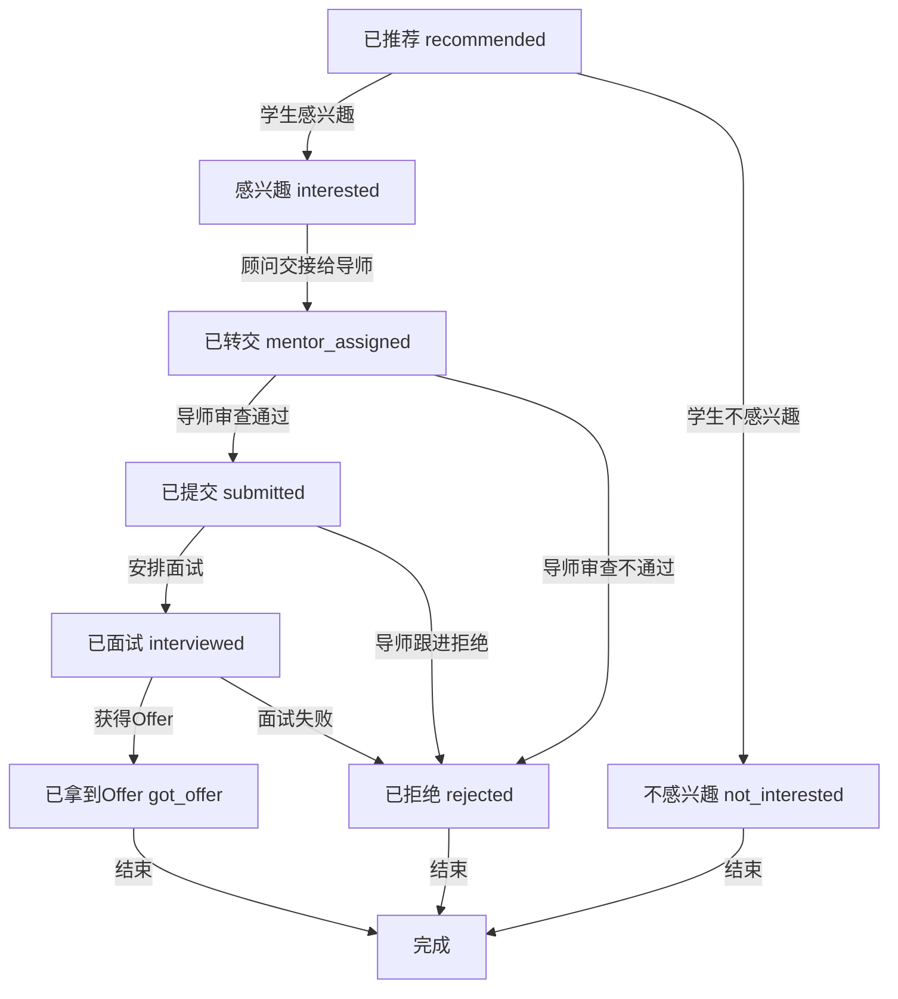

# 内推功能详细设计文档

## 1. 业务概述

### 1.1 功能定义
内推功能（Mentor Referral）是指由导师（Mentor）推荐学生向企业岗位提交求职申请的业务流程。该功能旨在利用导师的专业评估和内部关系，提高学生的求职成功率。

### 1.2 业务目标
- 提供导师推荐学生的能力
- 实现完整的内推申请生命周期管理
- 支持导师对学生的评估流程
- 确保数据一致性和业务规则遵循
- 提供高效的查询和搜索功能

### 1.3 核心概念
- **导师（Mentor）**：推荐学生并进行评估的角色
- **学生（Student）**：求职申请的主体
- **岗位（Job Position）**：企业发布的招聘职位
- **内推申请（Mentor Referral Application）**：由导师推荐的学生求职申请
- **导师评估（Mentor Screening）**：导师对学生的评估结果
- **申请状态（Application Status）**：内推申请的生命周期状态

## 2. 系统架构

### 2.1 架构概述
内推功能基于领域驱动设计（DDD）实现，位于Placement Domain（投递领域）中。采用分层架构，包括：

- **应用层**：处理请求和响应
- **领域服务层**：实现核心业务逻辑
- **基础设施层**：处理数据库访问和外部服务调用

### 2.2 核心组件

| 组件 | 职责 | 文件位置 |
|------|------|----------|
| JobApplicationService | 处理投递申请的核心业务逻辑，包括内推申请 | src/domains/placement/services/job-application.service.ts |
| JobPositionService | 处理岗位管理逻辑 | src/domains/placement/services/job-position.service.ts |
| 投递DTO | 定义数据传输对象，包括内推相关的DTO | src/domains/placement/dto/job-application.dto.ts |
| 投递类型 | 定义类型和常量，包括内推类型 | src/domains/placement/types/application-type.types.ts |
| 数据库Schema | 定义数据库结构，包括内推相关的表 | src/infrastructure/database/schema/placement.schema.ts |

## 3. 业务流程

### 3.1 内推申请生命周期



### 3.2 关键业务流程说明

#### 3.2.1 内推申请推荐流程
1. 顾问向学生推荐岗位
2. 申请状态初始化为 `recommended`
3. 系统通知学生查看推荐岗位

#### 3.2.2 学生决策流程
1. 学生收到推荐岗位通知
2. 学生决策是否对此岗位感兴趣
3. 学生可以选择：
   - 感兴趣（状态变为 `interested`）
   - 不感兴趣（状态变为 `not_interested`）

#### 3.2.3 顾问处理流程
1. 顾问处理学生感兴趣的岗位
2. 顾问将申请交接给导师
3. 申请状态变为 `mentor_assigned`
4. 系统通知导师进行审查

#### 3.2.4 导师审查流程
1. 导师收到审查请求
2. 导师对学生进行审查
3. 导师提交审查结果：
   - 审查通过（状态变为 `submitted`）
   - 审查不通过（状态变为 `rejected`）

#### 3.2.5 后续状态跟进流程
1. 导师跟进已提交的申请
2. 根据企业反馈更新状态：
   - 安排面试（状态变为 `interviewed`）
   - 直接拒绝（状态变为 `rejected`）
3. 面试后根据结果更新状态：
   - 获得Offer（状态变为 `got_offer`）
   - 面试失败（状态变为 `rejected`）

#### 3.2.6 状态变更流程
1. 状态变更需要通过 `updateApplicationStatus` 方法
2. 系统验证状态转换是否符合规则
3. 记录状态变更历史，包括变更人、原因和元数据
4. 更新申请的当前状态
5. 发布状态变更事件

## 4. 状态管理

### 4.1 状态定义

| 状态值 | 中文标签 | 描述 |
|--------|----------|------|
| recommended | 已推荐 | 岗位已推荐给学生 |
| interested | 感兴趣 | 学生对推荐岗位感兴趣 |
| not_interested | 不感兴趣 | 学生对推荐岗位不感兴趣 |
| mentor_assigned | 已转交 | 已分配导师处理申请 |
| submitted | 已提交 | 申请已提交给企业 |
| interviewed | 已面试 | 学生已参加面试 |
| got_offer | 已拿到Offer | 学生已获得Offer |
| rejected | 已拒绝 | 申请被拒绝 |

### 4.2 状态转换规则

| 当前状态 | 允许转换到的状态 | 转换条件 |
|----------|------------------|----------|
| recommended | interested | 学生对岗位感兴趣 |
| recommended | not_interested | 学生对岗位不感兴趣 |
| interested | mentor_assigned | 顾问将申请交接给导师 |
| mentor_assigned | submitted | 导师审查通过 |
| mentor_assigned | rejected | 导师审查不通过 |
| submitted | interviewed | 安排面试 |
| submitted | rejected | 导师跟进拒绝 |
| interviewed | got_offer | 获得Offer |
| interviewed | rejected | 面试失败 |
| not_interested | 无（终态） | 学生已明确表示不感兴趣 |
| rejected | 无（终态） | 申请已被拒绝 |
| got_offer | 无（终态） | 学生已获得Offer |

### 4.3 状态转换验证

状态转换通过 `ALLOWED_APPLICATION_STATUS_TRANSITIONS` 常量定义，在 `updateApplicationStatus` 方法中进行验证：

```typescript
export const ALLOWED_APPLICATION_STATUS_TRANSITIONS: Partial<
  Record<ApplicationStatus, ApplicationStatus[]>
> = {
  recommended: ["interested", "not_interested"],
  interested: ["mentor_assigned"],
  mentor_assigned: ["submitted", "rejected"],
  submitted: ["interviewed", "rejected"],
  interviewed: ["got_offer", "rejected"],
};
```

## 5. 核心服务接口

### 5.1 JobApplicationService

#### 5.1.1 submitApplication

**功能**：提交投递申请（包括内推申请）

**参数**：
- `dto: ISubmitApplicationDto`：提交申请的数据传输对象
  - `studentId: string`：学生ID
  - `jobId: string`：岗位ID
  - `applicationType: ApplicationType`：申请类型（包括内推）
  - `coverLetter?: string`：求职信
  - `customAnswers?: Record<string, any>`：自定义问题回答，包括推荐导师信息
  - `isUrgent?: boolean`：加急申请标记

**返回值**：
- `Promise<IServiceResult<Record<string, any>, Record<string, any>>>`：服务结果，包含创建的申请数据

**业务逻辑**：
1. 检查是否存在重复申请
2. 验证岗位是否存在
3. 创建投递申请记录，根据申请类型设置初始状态：
   - 内推申请：初始状态为 `recommended`
   - 其他申请：初始状态为 `submitted`
4. 记录状态变更历史
5. 发布申请提交事件
6. 返回创建结果

#### 5.1.2 submitMentorScreening

**功能**：提交导师评估结果

**参数**：
- `dto: ISubmitMentorScreeningDto`：导师评估的数据传输对象
  - `applicationId: string`：申请ID
  - `mentorId: string`：导师ID
  - `technicalSkills: number`：技术技能评分（1-5）
  - `experienceMatch: number`：经验匹配度评分（1-5）
  - `culturalFit: number`：文化适应度评分（1-5）
  - `overallRecommendation: "strongly_recommend" | "recommend" | "neutral" | "not_recommend"`：整体推荐度
  - `screeningNotes?: string`：评估备注

**返回值**：
- `Promise<IServiceResult<Record<string, any>, Record<string, any>>>`：服务结果，包含更新后的申请数据

**业务逻辑**：
1. 验证申请存在且为内推类型
2. 验证申请状态为 `mentor_assigned`
3. 保存导师评估结果
4. 根据评估结果更新申请状态：
   - 推荐度为 "strongly_recommend" 或 "recommend"：状态变为 `submitted`
   - 推荐度为 "neutral" 或 "not_recommend"：状态变为 `rejected`
5. 记录状态变更历史
6. 发布导师评估完成事件
7. 返回更新结果

#### 5.1.3 updateApplicationStatus

**功能**：更新投递申请状态

**参数**：
- `dto: IUpdateApplicationStatusDto`：更新状态的数据传输对象
  - `applicationId: string`：申请ID
  - `newStatus: ApplicationStatus`：新状态
  - `changedBy?: string`：变更人ID
  - `changeReason?: string`：变更原因
  - `changeMetadata?: Record<string, any>`：变更元数据

**返回值**：
- `Promise<IServiceResult<Record<string, any>, Record<string, any>>>`：服务结果，包含更新后的申请数据

**业务逻辑**：
1. 验证申请是否存在
2. 验证状态转换是否合法
3. 更新申请状态和结果信息
4. 记录状态变更历史
5. 发布状态变更事件
6. 返回更新结果

## 6. 数据模型

### 6.1 核心数据结构

#### 6.1.1 内推申请

| 字段名 | 类型 | 描述 |
|--------|------|------|
| id | string | 申请ID |
| studentId | string | 学生ID |
| jobId | string | 岗位ID |
| applicationType | string | 申请类型（mentor_referral） |
| coverLetter | string | 求职信 |
| customAnswers | jsonb | 自定义问题回答，包括推荐导师信息 |
| mentorScreening | jsonb | 导师评估结果 |
| status | string | 申请状态 |
| isUrgent | boolean | 加急申请标记 |
| submittedAt | timestamp | 提交时间 |
| createdAt | timestamp | 创建时间 |
| updatedAt | timestamp | 更新时间 |

#### 6.1.2 导师评估

| 字段名 | 类型 | 描述 |
|--------|------|------|
| technicalSkills | number | 技术技能评分（1-5） |
| experienceMatch | number | 经验匹配度评分（1-5） |
| culturalFit | number | 文化适应度评分（1-5） |
| overallRecommendation | string | 整体推荐度 |
| screeningNotes | string | 评估备注 |
| evaluatedBy | string | 评估人ID |
| evaluatedAt | timestamp | 评估时间 |

#### 6.1.3 状态变更历史

| 字段名 | 类型 | 描述 |
|--------|------|------|
| id | string | 历史记录ID |
| applicationId | string | 申请ID |
| previousStatus | string | 变更前状态 |
| newStatus | string | 变更后状态 |
| changedBy | string | 变更人ID |
| changedByType | string | 变更人类型 |
| changeReason | string | 变更原因 |
| changeMetadata | jsonb | 变更元数据 |
| createdAt | timestamp | 创建时间 |

### 6.2 数据库Schema

主要数据库表包括：
- `job_applications`：存储投递申请信息，包括内推申请
- `recommended_jobs`：存储推荐岗位信息
- `application_history`：存储状态变更历史

## 7. 接口设计

### 7.1 外部接口

#### 7.1.1 提交内推申请

**请求**：
```http
POST /api/placement/applications
Content-Type: application/json

{
  "studentId": "student-123",
  "jobId": "job-456",
  "applicationType": "mentor_referral",
  "coverLetter": "Dear Hiring Manager...",
  "customAnswers": { 
    "referralMentor": "mentor-789",
    "referralReason": "Strong technical background",
    "previousExperience": "5+ years in software development"
  },
  "isUrgent": false
}
```

**响应**：
```http
201 Created
Content-Type: application/json

{
  "data": {
    "id": "application-789",
    "studentId": "student-123",
    "jobId": "job-456",
    "applicationType": "mentor_referral",
    "status": "submitted",
    "createdAt": "2023-01-01T00:00:00Z"
  }
}
```

#### 7.1.2 提交导师评估

**请求**：
```http
POST /api/placement/applications/{applicationId}/mentor-screening
Content-Type: application/json

{
  "mentorId": "mentor-789",
  "technicalSkills": 5,
  "experienceMatch": 4,
  "culturalFit": 5,
  "overallRecommendation": "strongly_recommend",
  "screeningNotes": "Excellent candidate with strong technical skills"
}
```

**响应**：
```http
200 OK
Content-Type: application/json

{
  "data": {
    "id": "application-789",
    "studentId": "student-123",
    "jobId": "job-456",
    "applicationType": "mentor_referral",
    "mentorScreening": {
      "technicalSkills": 5,
      "experienceMatch": 4,
      "culturalFit": 5,
      "overallRecommendation": "strongly_recommend",
      "screeningNotes": "Excellent candidate with strong technical skills",
      "evaluatedBy": "mentor-789",
      "evaluatedAt": "2023-01-02T00:00:00Z"
    },
    "status": "submitted",
    "updatedAt": "2023-01-02T00:00:00Z"
  }
}
```

#### 7.1.3 更新申请状态

**请求**：
```http
PATCH /api/placement/applications/{applicationId}/status
Content-Type: application/json

{
  "newStatus": "interviewed",
  "changedBy": "mentor-789",
  "changeReason": "Positive mentor screening",
  "changeMetadata": { "interviewDate": "2023-01-10T10:00:00Z" }
}
```

**响应**：
```http
200 OK
Content-Type: application/json

{
  "data": {
    "id": "application-789",
    "studentId": "student-123",
    "jobId": "job-456",
    "status": "interviewed",
    "updatedAt": "2023-01-03T00:00:00Z"
  }
}
```

## 7. 业务规则与约束

### 7.1 申请提交规则
1. 同一学生同一岗位只能提交一次申请
2. 岗位必须处于活跃状态才能提交申请
3. 内推申请必须指定推荐导师

### 7.2 导师评估规则
1. 只有内推类型的申请才能进行导师评估
2. 导师评估只能在申请状态为 `submitted` 时进行
3. 导师评估必须包含完整的评分和推荐意见

### 7.3 状态转换规则
1. 状态转换必须符合预定义的转换规则
2. 状态变更必须记录变更人、原因和元数据
3. 某些状态是终态，不能再转换（如：已拿到Offer、已拒绝、已撤回）

### 7.4 数据完整性规则
1. 学生ID、岗位ID和导师ID必须存在且有效
2. 状态值和推荐类型必须是预定义的有效值之一
3. 时间字段必须符合ISO 8601格式

## 8. 测试策略

### 8.1 单元测试
- 测试服务层的核心业务逻辑
- 测试内推申请推荐流程
- 测试学生决策流程
- 测试顾问交接流程
- 测试导师审查流程
- 测试状态转换验证
- 测试搜索和筛选功能
- 测试错误处理机制

### 8.2 集成测试
- 测试完整的内推业务流程：推荐 → 学生决策 → 顾问交接 → 导师审查 → 后续跟进
- 测试数据库交互
- 测试跨服务调用
- 测试事件发布和订阅
- 测试状态转换的完整性

### 8.3 测试场景
- 测试顾问向学生推荐岗位
- 测试学生选择感兴趣
- 测试学生选择不感兴趣
- 测试顾问交接给导师
- 测试导师审查通过
- 测试导师审查不通过
- 测试后续状态跟进

### 8.4 测试覆盖率
- 目标覆盖率：≥80%
- 使用Jest进行测试
- 生成详细的覆盖率报告

## 9. 监控与日志

### 9.1 日志记录
- 使用NestJS内置的Logger进行日志记录
- 记录关键业务操作和错误信息
- 日志级别：debug、log、warn、error

### 9.2 监控指标
- 内推申请提交成功率
- 导师评估完成率
- 状态转换频率
- 平均处理时间
- 错误率

## 10. 性能优化

### 10.1 查询优化
- 为频繁查询的字段添加索引
- 使用分页查询避免大数据量返回
- 优化查询条件，减少全表扫描

### 10.2 数据库优化
- 使用连接池管理数据库连接
- 合理设计表结构，避免冗余字段
- 定期清理过期数据

## 11. 扩展考虑

### 11.1 功能扩展
- 支持批量内推
- 支持导师推荐模板
- 支持自动状态同步
- 支持申请进度提醒

### 11.2 技术扩展
- 支持分布式部署
- 支持水平扩展
- 支持缓存机制

## 12. 风险评估

| 风险 | 影响 | 缓解措施 |
|------|------|----------|
| 导师评估不及时 | 影响申请进度 | 设置评估时限提醒 |
| 状态转换错误 | 数据不一致 | 严格的状态转换验证 |
| 重复申请 | 数据冗余 | 唯一约束和重复检查 |
| 性能问题 | 响应缓慢 | 查询优化和数据库索引 |
| 数据丢失 | 业务中断 | 定期备份和恢复机制 |

## 13. 结论

内推功能是Placement Domain的重要组成部分，为学生和导师提供了高效的求职推荐和评估能力。通过严格的业务规则和状态管理，确保了数据的一致性和业务流程的正确性。该设计文档详细描述了内推功能的业务流程、系统架构、核心服务接口和数据模型，为开发和维护提供了清晰的指导。