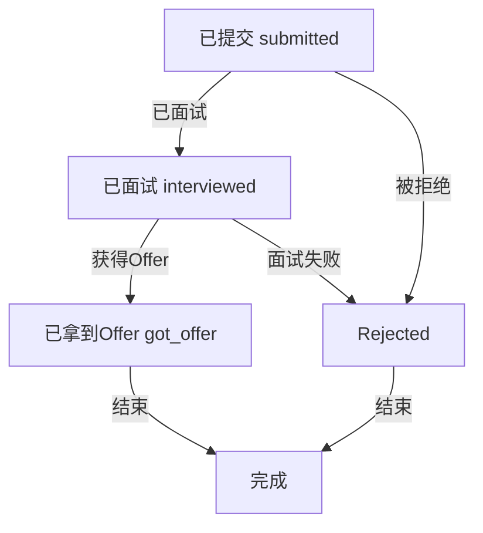

# 代投功能详细设计文档

## 1. 业务概述

### 1.1 功能定义
代投功能（Counselor-Assisted Application）是指由顾问（Counselor）代表学生向企业岗位提交求职申请的业务流程。该功能旨在帮助学生更高效地管理求职过程，尤其是对于缺乏求职经验或时间有限的学生。

### 1.2 业务目标
- 提供顾问代表学生提交申请的能力
- 实现完整的代投申请生命周期管理
- 支持灵活的状态转换和跟踪
- 确保数据一致性和业务规则遵循
- 提供高效的查询和搜索功能

### 1.3 核心概念
- **顾问（Counselor）**：代表学生提交申请的角色
- **学生（Student）**：求职申请的主体
- **岗位（Job Position）**：企业发布的招聘职位
- **代投申请（Counselor Application）**：由顾问代表学生提交的求职申请
- **申请状态（Application Status）**：代投申请的生命周期状态

## 2. 系统架构

### 2.1 架构概述
代投功能基于领域驱动设计（DDD）实现，位于Placement Domain（投递领域）中。采用分层架构，包括：

- **应用层**：处理请求和响应
- **领域服务层**：实现核心业务逻辑
- **基础设施层**：处理数据库访问和外部服务调用

### 2.2 核心组件

| 组件 | 职责 | 文件位置 |
|------|------|----------|
| JobApplicationService | 处理投递申请的核心业务逻辑 | src/domains/placement/services/job-application.service.ts |
| JobPositionService | 处理岗位管理逻辑 | src/domains/placement/services/job-position.service.ts |
| 投递DTO | 定义数据传输对象 | src/domains/placement/dto/job-application.dto.ts |
| 投递类型 | 定义类型和常量 | src/domains/placement/types/application-status.types.ts |
| 数据库Schema | 定义数据库结构 | src/infrastructure/database/schema/placement.schema.ts |

## 3. 业务流程

### 3.1 代投申请生命周期



### 3.2 关键业务流程说明

#### 3.2.1 岗位推荐流程
1. 系统或顾问向学生推荐岗位
2. 岗位状态为 `recommended`
3. 学生可以选择 `interested` 或 `not_interested`

#### 3.2.2 代投申请提交流程
1. 顾问代表学生直接提交申请，状态初始为 `submitted`
2. 企业处理申请，状态可能变为 `interviewed` 或 `rejected`
3. 若申请进入面试阶段，状态变为 `interviewed`
4. 面试后，状态可能变为 `got_offer` 或 `rejected`
5. 最终状态 `got_offer` 或 `rejected` 表示申请流程结束

**注意**：从 v2.0 开始，代投申请的初始状态为 `submitted`，与内推申请（`recommended`）区分开来，更符合业务语义（代投是已提交状态，内推是已推荐状态）。

#### 3.2.3 状态变更流程
1. 状态变更需要通过 `updateApplicationStatus` 方法
2. 系统验证状态转换是否符合规则
3. 记录状态变更历史，包括变更人、原因和元数据
4. 更新申请的当前状态

## 4. 状态管理

### 4.1 状态定义

| 状态值 | 中文标签 | 描述 |
|--------|----------|------|
| recommended | 已推荐 | 岗位已推荐给学生 |
| interested | 感兴趣 | 学生对推荐岗位感兴趣 |
| not_interested | 不感兴趣 | 学生对推荐岗位不感兴趣 |
| mentor_assigned | 已转交 | 已分配导师处理申请 |
| submitted | 已提交 | 申请已提交给企业 |
| interviewed | 已面试 | 学生已参加面试 |
| got_offer | 已拿到Offer | 学生已获得Offer |
| rejected | 已拒绝 | 申请被拒绝 |


### 4.2 状态转换规则

| 当前状态 | 允许转换到的状态 |
|----------|------------------|
| recommended | interested, not_interested |
| interested | mentor_assigned |
| not_interested | interested |
| mentor_assigned | submitted, rejected |
| submitted | interviewed, rejected |
| interviewed | got_offer, rejected |
| got_offer | 无（终态） |
| rejected | 无（终态） |

### 4.3 状态转换验证

状态转换通过 `ALLOWED_APPLICATION_STATUS_TRANSITIONS` 常量定义，在 `updateApplicationStatus` 方法中进行验证：

```typescript
export const ALLOWED_APPLICATION_STATUS_TRANSITIONS: Partial<
  Record<ApplicationStatus, ApplicationStatus[]>
> = {
  submitted: [ "interviewed", "rejected"],
  mentor_assigned: ["submitted", "rejected"],
  interviewed: ["got_offer", "rejected"],
  recommended: ["interested", "not_interested"],
  interested: ["mentor_assigned"],
  not_interested: ["interested"],
};
```

## 5. 核心服务接口

### 5.1 JobApplicationService

#### 5.1.1 submitApplication

**功能**：提交投递申请

**参数**：
- `dto: ISubmitApplicationDto`：提交申请的数据传输对象
  - `studentId: string`：学生ID
  - `jobId: string`：岗位ID
  - `applicationType: ApplicationType`：申请类型（包括代投）
  - `coverLetter?: string`：求职信
  - `customAnswers?: Record<string, any>`：自定义问题回答

**返回值**：
- `Promise<IServiceResult<Record<string, any>, Record<string, any>>>`：服务结果，包含创建的申请数据

**业务逻辑**：
1. 检查是否存在重复申请
2. 验证岗位是否存在
3. 创建投递申请记录
4. 返回创建结果

#### 5.1.2 updateApplicationStatus

**功能**：更新投递申请状态

**参数**：
- `dto: IUpdateApplicationStatusDto`：更新状态的数据传输对象
  - `applicationId: string`：申请ID
  - `newStatus: ApplicationStatus`：新状态
  - `changedBy?: string`：变更人ID
  - `changeReason?: string`：变更原因
  - `changeMetadata?: Record<string, any>`：变更元数据

**返回值**：
- `Promise<IServiceResult<Record<string, any>, Record<string, any>>>`：服务结果，包含更新后的申请数据

**业务逻辑**：
1. 验证申请是否存在
2. 验证状态转换是否合法
3. 更新申请状态
4. 记录状态变更历史
5. 返回更新结果

#### 5.1.3 search

**功能**：搜索投递申请

**参数**：
- `filter?: IJobApplicationSearchFilter`：搜索筛选条件
  - `studentId?: string`：按学生筛选
  - `jobId?: string`：按岗位筛选
  - `status?: ApplicationStatus`：按状态筛选
  - `applicationType?: ApplicationType`：按申请类型筛选
- `pagination?: IOffsetPagination`：分页参数
- `sort?: ISortQuery`：排序参数

**返回值**：
- `Promise<IPaginatedResult<Record<string, any>>>`：分页查询结果

**业务逻辑**：
1. 构建查询条件
2. 执行分页查询
3. 返回查询结果

### 5.2 JobPositionService

#### 5.2.1 createJobPosition

**功能**：创建新岗位

**参数**：
- `dto: ICreateJobPositionDto`：创建岗位的数据传输对象

**返回值**：
- `Promise<IServiceResult<Record<string, any>, Record<string, any>>>`：服务结果，包含创建的岗位数据

#### 5.2.2 search

**功能**：搜索岗位

**参数**：
- `filter?: IJobPositionSearchFilter`：搜索筛选条件
- `pagination?: IOffsetPagination`：分页参数
- `sort?: ISortQuery`：排序参数

**返回值**：
- `Promise<IPaginatedResult<Record<string, any>>>`：分页查询结果

## 6. 数据模型

### 6.1 核心数据结构

#### 6.1.1 投递申请

| 字段名 | 类型 | 描述 |
|--------|------|------|
| id | string | 申请ID |
| studentId | string | 学生ID |
| jobId | string | 岗位ID |
| applicationType | string | 申请类型 |
| coverLetter | string | 求职信 |
| customAnswers | jsonb | 自定义问题回答 |
| status | string | 申请状态 |
| submittedAt | timestamp | 提交时间 |
| createdAt | timestamp | 创建时间 |
| updatedAt | timestamp | 更新时间 |

#### 6.1.2 岗位信息

| 字段名 | 类型 | 描述 |
|--------|------|------|
| id | string | 岗位ID |
| title | string | 岗位标题 |
| companyName | string | 公司名称 |
| companyNameNormalized | string | 标准化公司名称 |
| source | string | 岗位来源 |
| status | string | 岗位状态 |
| createdBy | string | 创建人ID |
| createdAt | timestamp | 创建时间 |
| updatedAt | timestamp | 更新时间 |

#### 6.1.3 状态变更历史

| 字段名 | 类型 | 描述 |
|--------|------|------|
| id | string | 历史记录ID |
| applicationId | string | 申请ID |
| previousStatus | string | 变更前状态 |
| newStatus | string | 变更后状态 |
| changedBy | string | 变更人ID |
| changedByType | string | 变更人类型 |
| changeReason | string | 变更原因 |
| changeMetadata | jsonb | 变更元数据 |
| createdAt | timestamp | 创建时间 |

### 6.2 数据库Schema

主要数据库表包括：
- `job_applications`：存储投递申请信息
- `recommended_jobs`：存储推荐岗位信息
- `application_history`：存储状态变更历史

## 7. 接口设计

### 7.1 外部接口

#### 7.1.1 提交代投申请

**请求**：
```http
POST /api/placement/applications
Content-Type: application/json

{
  "studentId": "student-123",
  "jobId": "job-456",
  "applicationType": "counselor",
  "coverLetter": "Dear Hiring Manager...",
  "customAnswers": { "question1": "answer1" }
}
```

**响应**：
```http
201 Created
Content-Type: application/json

{
  "data": {
    "id": "application-789",
    "studentId": "student-123",
    "jobId": "job-456",
    "applicationType": "counselor",
    "status": "submitted",
    "createdAt": "2023-01-01T00:00:00Z"
  }
}
```

#### 7.1.2 更新申请状态

**请求**：
```http
PATCH /api/placement/applications/{applicationId}/status
Content-Type: application/json

{
  "newStatus": "submitted",
  "changedBy": "counselor-789",
  "changeReason": "提交申请",
  "changeMetadata": { "note": "已提交到企业系统" }
}
```

**响应**：
```http
200 OK
Content-Type: application/json

{
  "data": {
    "id": "application-789",
    "studentId": "student-123",
    "jobId": "job-456",
    "status": "submitted",
    "updatedAt": "2023-01-02T00:00:00Z"
  }
}
```

#### 7.1.3 搜索代投申请

**请求**：
```http
GET /api/placement/applications?studentId=student-123&applicationType=counselor&status=submitted&offset=0&limit=10
```

**响应**：
```http
200 OK
Content-Type: application/json

{
  "items": [
    {
      "id": "application-789",
      "studentId": "student-123",
      "jobId": "job-456",
      "applicationType": "counselor",
      "status": "submitted",
      "createdAt": "2023-01-01T00:00:00Z"
    }
  ],
  "total": 1,
  "offset": 0,
  "limit": 10
}
```

## 8. 业务规则与约束

### 8.1 申请提交规则
1. 同一学生同一岗位只能提交一次申请
2. 岗位必须处于活跃状态才能提交申请
3. 申请类型必须是有效的类型之一

### 8.2 状态转换规则
1. 状态转换必须符合预定义的转换规则
2. 状态变更必须记录变更人、原因和元数据
3. 某些状态是终态，不能再转换（如：已拿到Offer、已拒绝、已撤回）

### 8.3 数据完整性规则
1. 学生ID和岗位ID必须存在且有效
2. 状态值必须是预定义的有效值之一
3. 时间字段必须符合ISO 8601格式

## 9. 测试策略

### 9.1 单元测试
- 测试服务层的核心业务逻辑
- 测试状态转换验证
- 测试搜索和筛选功能
- 测试错误处理机制

### 9.2 集成测试
- 测试完整的业务流程
- 测试数据库交互
- 测试跨服务调用

### 9.3 测试覆盖率
- 目标覆盖率：≥80%
- 使用Jest进行测试
- 生成详细的覆盖率报告

## 10. 监控与日志

### 10.1 日志记录
- 使用NestJS内置的Logger进行日志记录
- 记录关键业务操作和错误信息
- 日志级别：debug、log、warn、error

### 10.2 监控指标
- 申请提交成功率
- 状态转换频率
- 平均处理时间
- 错误率

## 11. 性能优化

### 11.1 查询优化
- 为频繁查询的字段添加索引
- 使用分页查询避免大数据量返回
- 优化查询条件，减少全表扫描

### 11.2 数据库优化
- 使用连接池管理数据库连接
- 合理设计表结构，避免冗余字段
- 定期清理过期数据

## 12. 扩展考虑

### 12.1 功能扩展
- 支持批量代投
- 支持申请模板
- 支持自动状态同步
- 支持申请进度提醒

### 12.2 技术扩展
- 支持分布式部署
- 支持水平扩展
- 支持缓存机制

## 13. 风险评估

| 风险 | 影响 | 缓解措施 |
|------|------|----------|
| 状态转换错误 | 数据不一致 | 严格的状态转换验证 |
| 重复申请 | 数据冗余 | 唯一约束和重复检查 |
| 性能问题 | 响应缓慢 | 查询优化和数据库索引 |
| 数据丢失 | 业务中断 | 定期备份和恢复机制 |

## 14. 结论

代投功能是Placement Domain的重要组成部分，为学生和顾问提供了高效的求职申请管理能力。通过严格的业务规则和状态管理，确保了数据的一致性和业务流程的正确性。该设计文档详细描述了代投功能的业务流程、系统架构、核心服务接口和数据模型，为开发和维护提供了清晰的指导。

---

## 附录：版本历史

### v2.0 (2025-12-02)
**主要变更：**
- ✅ **修正初始状态**：代投申请的初始状态从 `recommended` 修正为 `submitted`
  - 更符合业务语义：代投是直接提交，内推是推荐
  - 与代码实现保持一致（`ApplicationType.PROXY` 初始状态为 `submitted`）
- ✅ **文档同步**：更新设计文档以反映实际代码实现

**影响范围：**
- 代投申请提交后的初始状态
- API 响应中的 `status` 字段值

**验证：**
- 代码实现：`submitApplication` 方法中，非 `REFERRAL` 类型初始状态为 `submitted`
- 测试验证：代投申请创建后状态为 `submitted`，而非 `recommended`

---