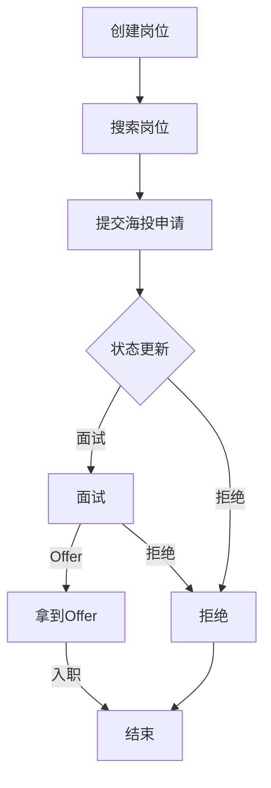

# Placement Domain 海投设计文档

## 1. 文档概述

### 1.1 目的
本文档详细描述了 Placement Domain 中**海投**（Direct Application）功能的设计与实现，包括服务接口、业务流程、数据模型和状态管理。通过本文档可以评估当前代码的业务逻辑是否完整、合理和高效。

### 1.2 术语定义
| 术语 | 解释 |
|------|------|
| 海投 | 学生直接向公司提交的职位申请，对应 `ApplicationType.direct` |
| 投递状态 | 申请的生命周期状态，如 `submitted`、`interviewed`、`got_offer` 等 |

## 2. 架构设计

### 2.1 分层架构
```
┌───────────────────────────────────────────────────────────────────┐
│                          API Layer                               │
└───────────────────────────────────────────────────────────────────┘
                                  │
┌───────────────────────────────────────────────────────────────────┐
│                       Application Layer                          │
└───────────────────────────────────────────────────────────────────┘
                                  │
┌───────────────────────────────────────────────────────────────────┐
│                       Domain Layer                               │
│  ┌─────────────────┐  ┌─────────────────┐                        │
│  │ JobApplication  │  │ JobPosition     │                        │
│  │ Service         │  │ Service         │                        │
│  └─────────────────┘  └─────────────────┘                        │
└───────────────────────────────────────────────────────────────────┘
                                  │
┌───────────────────────────────────────────────────────────────────┐
│                       Infrastructure Layer                      │
│  ┌─────────────────┐  ┌─────────────────┐                        │
│  │ Database        │  │ Other Services  │                        │
│  └─────────────────┘  └─────────────────┘                        │
└───────────────────────────────────────────────────────────────────┘
```

### 2.2 核心组件

| 组件 | 职责 | 位置 |
|------|------|------|
| JobApplicationService | 处理海投申请生命周期管理 | `src/domains/placement/services/job-application.service.ts` |
| JobPositionService | 处理岗位生命周期管理 | `src/domains/placement/services/job-position.service.ts` |
| ApplicationStatus | 定义海投状态枚举 | `src/domains/placement/types/application-status.types.ts` |
| 数据模型 | 定义海投相关数据库表结构 | `src/infrastructure/database/schema/placement.schema.ts` |

## 3. 核心服务接口

### 3.1 JobPositionService

#### 3.1.1 createJobPosition
**功能**：创建新岗位

**接口定义**：
```typescript
async createJobPosition(
  dto: ICreateJobPositionDto
): Promise<IServiceResult<Record<string, any>, Record<string, any>>>;
```

**参数**：
```typescript
interface ICreateJobPositionDto {
  title: string; // 岗位标题
  companyName: string; // 公司名称
  description?: string; // 岗位描述
  requirements?: Record<string, any>; // 岗位要求
  responsibilities?: string; // 岗位职责
  jobType?: string; // 岗位类型
  experienceLevel?: string; // 经验等级
  industry?: string; // 行业
  locations?: Array<Record<string, any>>; // 地点列表
  remoteType?: string; // 远程类型
  salaryMin?: number; // 最低薪资
  salaryMax?: number; // 最高薪资
  salaryCurrency?: string; // 薪资货币
  postedDate?: Date; // 发布日期
  expiryDate?: Date; // 过期日期
  source: string; // 数据来源
  jobSource: "web" | "bd"; // 岗位来源
  sourceUrl?: string; // 原始链接
  sourceJobId?: string; // 原始平台岗位ID
  aiAnalysis?: Record<string, any>; // AI分析结果
  qualityScore?: number; // 岗位质量评分
  createdBy: string; // 创建人ID
}
```

**返回值**：创建的岗位信息

#### 3.1.2 search
**功能**：搜索岗位

**接口定义**：
```typescript
async search(
  filter?: IJobPositionSearchFilter,
  pagination?: IOffsetPagination,
  sort?: ISortQuery
): Promise<{ items: Record<string, any>[]; total: number; offset: number; limit: number }>;
```

**参数**：
```typescript
interface IJobPositionSearchFilter {
  status?: "active" | "inactive" | "expired"; // 按状态筛选
  companyName?: string; // 按公司筛选
  locations?: string[]; // 按地点筛选
  jobType?: string; // 按岗位类型筛选
  experienceLevel?: string; // 按经验等级筛选
  industry?: string; // 按行业筛选
}
```

**返回值**：分页的岗位列表

### 3.2 JobApplicationService

#### 3.2.1 submitApplication
**功能**：提交海投申请

**接口定义**：
```typescript
async submitApplication(
  dto: ISubmitApplicationDto
): Promise<IServiceResult<Record<string, any>, Record<string, any>>>;
```

**参数**：
```typescript
interface ISubmitApplicationDto {
  studentId: string; // 学生ID
  jobId: string; // 岗位ID
  applicationType: "direct"; // 申请类型，海投固定为 direct
  coverLetter?: string; // 求职信
  customAnswers?: Record<string, any>; // 自定义问题回答
  isUrgent?: boolean; // 是否加急
}
```

**返回值**：创建的申请信息

#### 3.2.2 updateApplicationStatus
**功能**：更新海投申请状态

**接口定义**：
```typescript
async updateApplicationStatus(
  dto: IUpdateApplicationStatusDto
): Promise<IServiceResult<Record<string, any>, Record<string, any>>>;
```

**参数**：
```typescript
interface IUpdateApplicationStatusDto {
  applicationId: string; // 申请ID
  newStatus: ApplicationStatus; // 新状态
  changedBy: string; // 变更人ID
  changedByType?: ChangedByType; // 变更人类型
  changeReason?: string; // 变更原因
}
```

**返回值**：更新后的申请信息

#### 3.2.3 getStatusHistory
**功能**：获取海投申请状态历史

**接口定义**：
```typescript
async getStatusHistory(applicationId: string): Promise<Array<Record<string, any>>>;
```

**参数**：
- applicationId: 申请ID

**返回值**：申请状态历史列表

## 4. 业务流程

### 4.1 海投完整流程



### 4.2 状态流转规则

**海投允许的状态转换**：
| 当前状态 | 允许转换的状态 |
|----------|----------------|
| submitted | interviewed, rejected |
| interviewed | got_offer, rejected |
| got_offer | - |
| rejected | - |

### 4.3 核心业务逻辑

#### 4.3.1 岗位创建流程
1. 接收岗位创建请求
2. 验证必填字段
3. 初始化岗位状态为 `active`
4. 插入数据库
5. 返回创建结果

#### 4.3.2 海投申请提交流程
1. 接收海投申请请求
2. 验证岗位存在
3. 检查是否重复申请（同一学生不能重复申请同一岗位）
4. 创建申请记录，初始状态为 `submitted`
5. 记录初始状态到申请历史
6. 更新岗位的 `directApplicationCount`
7. 返回创建结果

#### 4.3.3 状态更新流程
1. 接收状态更新请求
2. 验证申请存在
3. 验证状态转换合法性（基于海投允许的状态转换规则）
4. 更新申请状态
5. 记录状态变更到申请历史
6. 返回更新结果

## 5. 数据模型

### 5.1 核心表结构

#### 5.1.1 recommendedJobs（推荐岗位表）
| 字段 | 类型 | 描述 |
|------|------|------|
| id | UUID | 主键 |
| title | VARCHAR | 岗位标题 |
| companyName | VARCHAR | 公司名称 |
| description | TEXT | 岗位描述 |
| requirements | JSONB | 岗位要求 |
| responsibilities | TEXT | 岗位职责 |
| jobType | VARCHAR | 岗位类型 |
| experienceLevel | VARCHAR | 经验等级 |
| industry | VARCHAR | 行业 |
| remoteType | VARCHAR | 远程类型 |
| salaryMin | DECIMAL | 最低薪资 |
| salaryMax | DECIMAL | 最高薪资 |
| salaryCurrency | VARCHAR | 薪资货币 |
| status | job_status | 岗位状态（active/inactive/expired） |
| postedDate | DATE | 发布日期 |
| expiryDate | DATE | 过期日期 |
| source | VARCHAR | 数据来源 |
| jobSource | VARCHAR | 岗位来源（web/bd） |
| directApplicationCount | INTEGER | 海投次数 |

#### 5.1.2 jobApplications（海投申请表）
| 字段 | 类型 | 描述 |
|------|------|------|
| id | UUID | 主键 |
| studentId | VARCHAR | 学生ID |
| jobId | UUID | 岗位ID（外键） |
| applicationType | application_type | 申请类型，海投固定为 direct |
| status | application_status | 申请状态 |
| result | result_enum | 申请结果 |
| resultReason | TEXT | 结果原因 |
| resultDate | DATE | 结果日期 |
| isUrgent | BOOLEAN | 是否加急 |
| notes | TEXT | 内部备注 |

#### 5.1.3 applicationHistory（申请历史表）
| 字段 | 类型 | 描述 |
|------|------|------|
| id | UUID | 主键 |
| applicationId | UUID | 申请ID（外键） |
| previousStatus | application_status | 之前状态 |
| newStatus | application_status | 新状态 |
| changedBy | VARCHAR | 变更人ID |
| changedByType | changed_by_type | 变更人类型 |
| changeReason | TEXT | 变更原因 |
| changeMetadata | JSONB | 变更元数据 |
| changedAt | TIMESTAMP | 变更时间 |


## 7. 状态管理

### 7.1 状态定义

**海投相关状态**：
```typescript
export const SEA_APPLICATION_STATUSES = [
  "submitted",
  "interviewed",
  "got_offer",
  "rejected"
] as const;

export type SeaApplicationStatus = typeof SEA_APPLICATION_STATUSES[number];
```

### 7.2 状态标签

**海投相关状态标签**：
```typescript
export const SEA_APPLICATION_STATUS_LABELS: Record<SeaApplicationStatus, string> = {
  submitted: "已提交",
  interviewed: "已面试",
  got_offer: "已拿到Offer",
  rejected: "已拒绝"
};
```

### 7.3 状态转换规则

**海投允许的状态转换**：
```typescript
export const ALLOWED_SEA_APPLICATION_STATUS_TRANSITIONS: Partial<
  Record<SeaApplicationStatus, SeaApplicationStatus[]>
> = {
  submitted: ["interviewed", "rejected"],
  interviewed: ["got_offer", "rejected"]
};
```

## 8. 业务规则

### 8.1 核心业务规则

1. **重复申请检查**：同一学生不能重复申请同一岗位
2. **状态转换限制**：严格的海投状态转换规则，确保业务流程的正确性
3. **岗位状态管理**：岗位可以是 `active`、`inactive` 或 `expired` 状态
4. **加急申请处理**：支持标记加急海投申请，便于优先处理

### 8.2 数据完整性规则

1. **唯一约束**：
   - 岗位表：`companyName` + `title` 唯一
   - 海投申请表：`studentId` + `jobId` 唯一
2. **外键约束**：
   - `jobApplications.jobId` 引用 `recommendedJobs.id`
   - `applicationHistory.applicationId` 引用 `jobApplications.id`
3. **非空约束**：
   - 岗位表：`title`、`companyName`、`source`、`jobSource` 等字段非空
   - 海投申请表：`applicationId`、`studentId`、`jobId`、`applicationType`、`status` 等字段非空

## 9. 测试策略

### 9.1 单元测试

**测试文件**：
- `src/domains/placement/services/job-application.service.spec.ts`
- `src/domains/placement/services/job-position.service.spec.ts`

**测试重点**：
- 海投服务层核心逻辑
- 海投状态转换验证
- 海投边界情况处理

### 9.2 集成测试

**测试文件**：
- `test/domains/placement/direct-application-flow.e2e-spec.ts`

**测试重点**：
- 海投完整业务流程
- 海投数据库交互
- 海投多服务协同

## 10. 代码评估

### 10.1 优点

1. **清晰的分层架构**：采用 DDD 架构，职责分离清晰
2. **严格的状态管理**：明确的海投状态定义和转换规则，确保业务流程的正确性
3. **完整的测试覆盖**：包含海投相关的单元测试和集成测试
4. **类型安全**：使用 TypeScript 严格类型，减少运行时错误
5. **单一数据源**：海投状态值从统一数组派生，确保一致性
6. **丰富的索引设计**：优化海投相关查询性能

### 10.2 改进建议

1. **海投状态转换逻辑优化**：
   - 当前海投状态转换逻辑使用简单的数组匹配，可考虑使用更灵活的状态机实现
   - 建议添加海投状态转换的业务规则验证

2. **海投错误处理增强**：
   - 部分海投错误信息不够详细，建议添加更具体的错误码和错误信息
   - 建议统一海投错误处理机制

3. **海投性能优化**：
   - 对于频繁查询的海投场景，建议添加更多缓存机制
   - 对于海投批量操作，建议优化数据库查询

4. **海投文档完善**：
   - 建议添加更详细的海投 API 文档
   - 建议添加海投业务规则文档

5. **海投测试改进**：
   - 建议增加更多海投边界情况测试
   - 建议增加海投性能测试

### 10.3 代码质量评估

| 评估维度 | 评分 | 说明 |
|----------|------|------|
| 架构设计 | 9/10 | 清晰的 DDD 架构，海投职责分离合理 |
| 代码可读性 | 8/10 | 海投代码结构清晰，注释完整 |
| 类型安全 | 9/10 | 严格的 TypeScript 类型定义，海投类型安全 |
| 测试覆盖 | 8/10 | 包含海投相关的单元测试和集成测试 |
| 性能优化 | 7/10 | 基本优化，海投查询性能可进一步提升 |
| 可维护性 | 8/10 | 模块化设计，海投功能便于维护 |
| 扩展性 | 8/10 | 模块化设计，海投功能便于扩展 |

## 11. 总结

Placement Domain 的海投功能设计完整，实现了岗位管理、海投申请、状态管理等核心功能。采用了清晰的分层架构和严格的状态管理，确保了海投业务流程的正确性和系统的可扩展性。

代码质量整体良好，但仍有改进空间，特别是在海投状态转换逻辑、错误处理和性能优化方面。建议进一步完善海投相关文档和测试，以提高系统的可维护性和可靠性。

该设计能够满足当前的海投业务需求，并为未来的海投功能扩展提供了良好的基础。