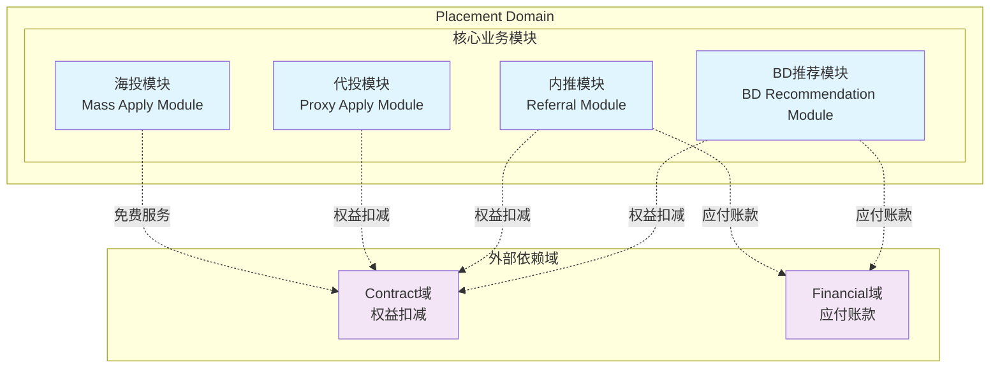
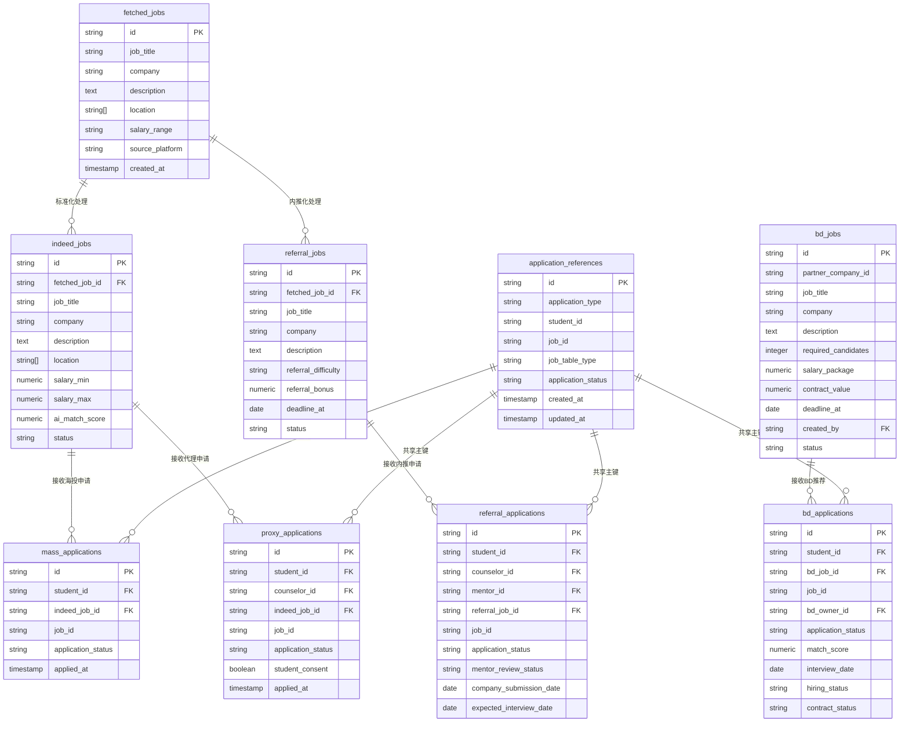
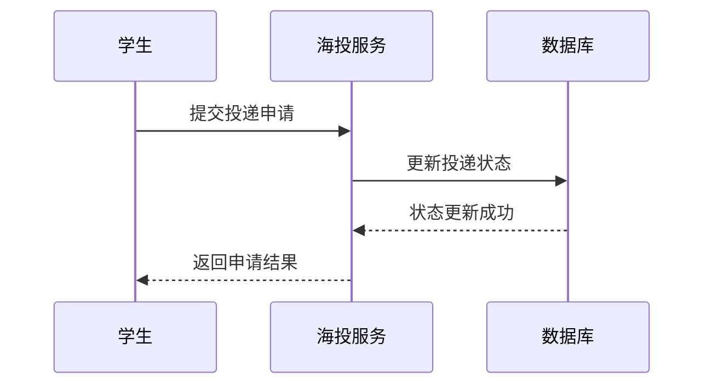
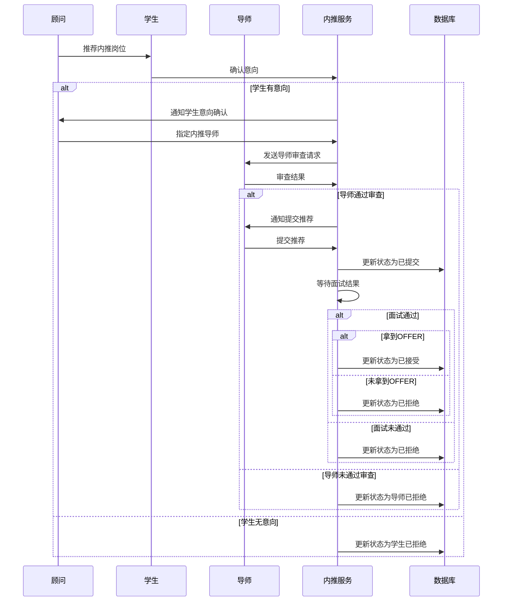
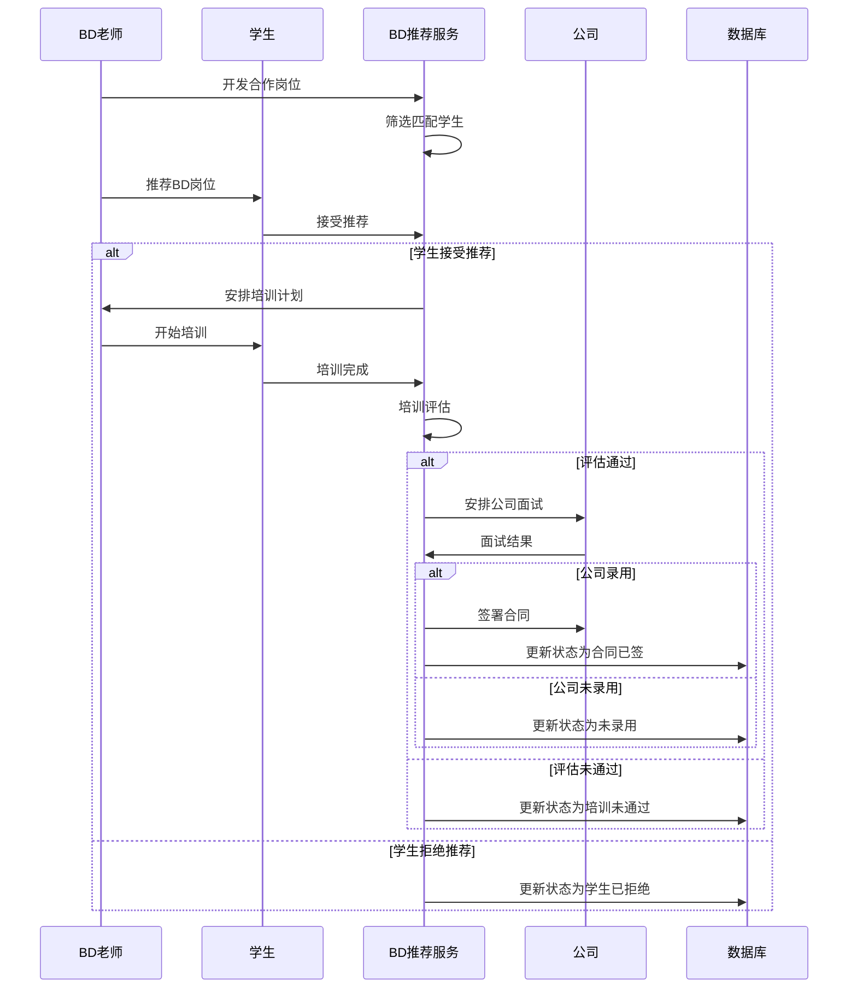

# Placement Domain 详细设计文档

> **版本：** v1.0.0  
> **创建日期：** 2025-01-09  
> **状态：** 架构设计完成  
> **负责域：** Placement Domain（投岗域）  
> **文档编号：** PLACEMENT-DOMAIN-2025-01-09

## 📋 目录

- [1. 领域概述](#1-领域概述)
- [2. 核心业务模块](#2-核心业务模块)
  - [2.1 海投模块 (Mass Apply Module)](#21-海投模块-mass-apply-module)
  - [2.2 代投模块 (Proxy Apply Module)](#22-代投模块-proxy-apply-module)
  - [2.3 内推模块 (Referral Module)](#23-内推模块-referral-module)
  - [2.4 BD推荐模块 (BD Recommendation Module)](#24-bd推荐模块-bd-recommendation-module)
- [3. 数据模型设计](#3-数据模型设计)
- [4. 业务流程设计](#4-业务流程设计)
- [5. 模块服务设计](#5-模块服务设计)
- [6. 领域事件设计](#6-领域事件设计)
- [7. 业务规则](#7-业务规则)
- [8. 实施检查清单](#8-实施检查清单)

---

## 1. 领域概述

Placement Domain 负责管理学生求职过程中的岗位投递业务，涵盖四种投岗模式：海投、代投、内推和BD推荐。每种模式都有特定的业务流程和参与角色。

### 1.1 核心模块

按业务能力划分为四个独立模块，各自管理业务逻辑和数据模型：

- **海投模块**：学生自主投递管理
- **代投模块**：顾问代学生投递管理  
- **内推模块**：导师内推流程管理
- **BD推荐模块**：BD老师推荐管理

### 1.2 领域边界定义



**模块划分原则：**
- 按业务能力划分模块，确保高内聚、低耦合
- 每个模块独立管理其数据模型和业务逻辑
- 模块间通过领域事件进行松耦合通信
- 各核心业务模块独立负责自身的投递状态跟踪与变更

**通信机制**：统一事件模型（APPLICATION_CREATED、APPLICATION_STATUS_CHANGED）+ 业务特定事件
**管理原则**：各模块独立负责投递记录的创建、状态更新和查询


---

## 2. 核心业务模块

### 2.1 海投模块 (Mass Apply Module)

**业务描述**：学生在Indeed等平台自主筛选岗位并投递

**参与角色**：学生

**核心职责**：管理海投投递记录的创建、状态更新和历史查询

### 2.2 代投模块 (Proxy Apply Module)

**业务描述**：顾问代替学生在Indeed等平台筛选岗位并投递

**参与角色**：顾问、学生

**核心职责**：管理代投投递记录、学生确认流程和状态跟踪

### 2.3 内推模块 (Referral Module)

**业务描述**：通过导师内推网络向目标公司推荐学生

**参与角色**：顾问、学生、导师

**核心职责**：管理内推申请的全生命周期和导师审查流程跟踪

### 2.4 BD推荐模块 (BD Recommendation Module)

**业务描述**：BD老师开发的合作岗位，提供订单式培养和推荐

**参与角色**：BD老师、学生

**核心职责**：管理BD推荐记录、培训流程跟踪和合同状态维护


---

## 3. 数据模型设计

### 3.1 表关系图



### 3.2 岗位数据表 (Job Postings)

#### 3.2.0 字段命名规范对齐说明
为保持各jobs表字段命名的一致性，采用以下统一规范：

**基础字段规范：**
- `id`: 主键，所有表统一使用VARCHAR(32)
- `job_title`: 岗位标题，所有表统一使用VARCHAR(500) NOT NULL
- `company`: 公司名称，所有表统一使用VARCHAR(500) NOT NULL  
- `job_description`: 岗位描述，所有表统一使用TEXT类型
- `department`: 目标部门，所有表统一添加此字段，VARCHAR(500)
- `location`: 工作地点，仅fetched_jobs和indeed_jobs使用，类型为VARCHAR(500)[]
- `status`: 岗位状态，所有表统一使用VARCHAR(50) DEFAULT 'active'
- `created_at`: 创建时间，所有表统一使用TIMESTAMP WITH TIME ZONE DEFAULT NOW()
- `updated_at`: 更新时间，所有表统一使用TIMESTAMP WITH TIME ZONE DEFAULT NOW()

**特殊字段规范：**
- `deadline_at`: 申请截止日期，referral_jobs和bd_jobs统一使用
- `created_by`: 创建人ID，referral_jobs和bd_jobs统一使用
- `fetched_job_id`: 原始数据关联，indeed_jobs、referral_jobs统一使用
- `fetched_at`: 抓取时间，仅fetched_jobs使用

#### 3.2.1 fetched_jobs 表 (原始抓取数据)
| 字段名 | 类型 | 约束 | 业务含义 |
|-------|------|------|----------|
| id | VARCHAR(32) | PK, NOT NULL | 原始岗位唯一标识 |
| job_title | VARCHAR(500) | NOT NULL | 岗位标题 |
| company | VARCHAR(500) | NOT NULL | 公司名称 |
| description | TEXT | | 岗位描述 |
| location | VARCHAR(500)[] | | 工作地点 |
| salary_range | VARCHAR(200) | | 薪资范围 |
| job_type | VARCHAR(100) | | 工作类型 |
| experience_level | VARCHAR(100) | | 经验要求 |
| source_url | VARCHAR(1000) | NOT NULL | 原始URL |
| source_platform | VARCHAR(100) | NOT NULL | 来源平台 |
| created_at | TIMESTAMP WITH TIME ZONE | DEFAULT NOW() | 创建时间 (原fetch_timestamp) |
| raw_data | JSONB | | 原始数据 |
| fetched_at | TIMESTAMP WITH TIME ZONE | NOT NULL | 抓取时间 |
| updated_at | TIMESTAMP WITH TIME ZONE | DEFAULT NOW() | 更新时间 |

#### 3.1.2 indeed_jobs 表 (标准化海投岗位)
| 字段名 | 类型 | 约束 | 业务含义 |
|-------|------|------|----------|
| id | VARCHAR(32) | PK, NOT NULL | Indeed岗位唯一标识 |
| fetched_job_id | VARCHAR(32) | FK → fetched_jobs.id | 原始数据关联 |
| job_title | VARCHAR(500) | NOT NULL | 标准化岗位标题 |
| company | VARCHAR(500) | NOT NULL | 标准化公司名称 |
| description | TEXT | NOT NULL | 标准化岗位描述 |
| location | VARCHAR(500)[] | | 工作地点 |
| department | VARCHAR(500) | | 目标部门 |
| salary_min | NUMERIC(12,2) | | 最低薪资 |
| salary_max | NUMERIC(12,2) | | 最高薪资 |
| job_type | VARCHAR(100) | | 工作类型 |
| experience_level | VARCHAR(100) | | 经验要求 |
| required_skills | TEXT[] | | 技能要求 |
| industry | VARCHAR(200) | | 行业分类 |
| job_category | VARCHAR(200) | | 岗位分类 |
| ai_match_score | NUMERIC(3,2) | | AI匹配评分 |
| status | VARCHAR(50) | DEFAULT 'active' | 岗位状态 |
| created_at | TIMESTAMP WITH TIME ZONE | DEFAULT NOW() | 创建时间 |
| updated_at | TIMESTAMP WITH TIME ZONE | DEFAULT NOW() | 更新时间 |

#### 3.2.3 referral_jobs 表 (内推岗位)
| 字段名 | 类型 | 约束 | 业务含义 |
|-------|------|------|----------|
| id | VARCHAR(32) | PK, NOT NULL | 内推岗位唯一标识 |
| fetched_job_id | VARCHAR(32) | FK → fetched_jobs.id | 原始数据关联 |
| job_id | VARCHAR(100) | | 招聘岗位的原始jobId |
| job_title | VARCHAR(500) | NOT NULL | 内推岗位标题 |
| company | VARCHAR(500) | NOT NULL | 目标公司 |
| department | VARCHAR(500) | | 目标部门 |
| description | TEXT | NOT NULL | 岗位描述 |
| referral_difficulty | VARCHAR(50) | | 内推难度 |
| referral_bonus | NUMERIC(12,2) | | 内推奖金 |
| deadline_at | DATE | | 申请截止日期 (原deadline) |
| status | VARCHAR(50) | DEFAULT 'active' | 岗位状态 |
| created_by | VARCHAR(32) | NOT NULL | 创建人 |
| created_at | TIMESTAMP WITH TIME ZONE | DEFAULT NOW() | 创建时间 |
| updated_at | TIMESTAMP WITH TIME ZONE | DEFAULT NOW() | 更新时间 |

#### 3.2.4 bd_jobs 表 (BD合作岗位)
| 字段名 | 类型 | 约束 | 业务含义 |
|-------|------|------|----------|
| id | VARCHAR(32) | PK, NOT NULL | BD岗位唯一标识 |
| partner_company_id | VARCHAR(32) | NOT NULL | 合作单位ID |
| job_id | VARCHAR(100) | | 招聘岗位的原始jobId |
| job_title | VARCHAR(500) | NOT NULL | 岗位标题 |
| company | VARCHAR(500) | NOT NULL | 合作公司名称 |
| department | VARCHAR(500) | | 目标部门 |
| description | TEXT | NOT NULL | 岗位描述 |
| required_candidates | INTEGER | NOT NULL | 需求人数 |
| salary_package | NUMERIC(12,2) | | 薪资包 |
| contract_value | NUMERIC(12,2) | | 合同价值 |
| deadline_at | DATE | | 申请截止日期 (原recruitment_deadline) |
| created_by | VARCHAR(32) | NOT NULL | 创建人 (原bd_owner_id) |
| status | VARCHAR(50) | DEFAULT 'active' | 岗位状态 |
| created_at | TIMESTAMP WITH TIME ZONE | DEFAULT NOW() | 创建时间 |
| updated_at | TIMESTAMP WITH TIME ZONE | DEFAULT NOW() | 更新时间 |

### 3.3 Application References表 (申请引用表)

#### 3.3.0 共享主键技术设计
为提高查询效率并统一管理不同类型的申请记录，采用共享主键技术创建application_references表作为所有申请表的统一入口。

**设计原理：**
- application_references表作为主表，存储所有申请的公共信息
- 四个具体的申请表（mass_applications、proxy_applications、referral_applications、bd_applications）作为子表，共享application_references表的主键
- 通过application_type字段区分不同类型的申请
- 查询时可以通过application_references表快速过滤和聚合数据

#### 3.3.1 application_references表结构
| 字段名 | 类型 | 约束 | 业务含义 |
|-------|------|------|----------|
| id | VARCHAR(32) | PK, NOT NULL | 申请唯一标识（共享主键） |
| application_type | VARCHAR(50) | NOT NULL, CHECK (application_type IN ('mass', 'proxy', 'referral', 'bd')) | 申请类型 |
| student_id | VARCHAR(32) | NOT NULL | 学生ID |
| job_id | VARCHAR(32) | NOT NULL | 岗位ID |
| job_table_type | VARCHAR(50) | NOT NULL, CHECK (job_table_type IN ('indeed', 'referral', 'bd')) | 岗位表类型 |
| application_status | VARCHAR(50) | NOT NULL | 申请状态 |
| created_at | TIMESTAMP WITH TIME ZONE | DEFAULT NOW() | 创建时间 |
| updated_at | TIMESTAMP WITH TIME ZONE | DEFAULT NOW() | 更新时间 |

**索引设计：**
```sql
-- 按申请类型查询
CREATE INDEX idx_application_references_type ON application_references(application_type);

-- 按学生查询所有申请
CREATE INDEX idx_application_references_student ON application_references(student_id);

-- 按岗位查询所有申请
CREATE INDEX idx_application_references_job ON application_references(job_id, job_table_type);

-- 按状态查询
CREATE INDEX idx_application_references_status ON application_references(application_status);

-- 复合查询优化
CREATE INDEX idx_application_references_student_type ON application_references(student_id, application_type);
```

#### 3.3.2 子表共享主键约束
四个具体的申请表使用application_references表的id作为外键和主键，确保数据一致性：

```sql
-- mass_applications表约束
ALTER TABLE mass_applications 
ADD CONSTRAINT fk_mass_applications_reference 
FOREIGN KEY (id) REFERENCES application_references(id) ON DELETE CASCADE;

-- proxy_applications表约束  
ALTER TABLE proxy_applications 
ADD CONSTRAINT fk_proxy_applications_reference 
FOREIGN KEY (id) REFERENCES application_references(id) ON DELETE CASCADE;

-- referral_applications表约束
ALTER TABLE referral_applications 
ADD CONSTRAINT fk_referral_applications_reference 
FOREIGN KEY (id) REFERENCES application_references(id) ON DELETE CASCADE;

-- bd_applications表约束
ALTER TABLE bd_applications 
ADD CONSTRAINT fk_bd_applications_reference 
FOREIGN KEY (id) REFERENCES application_references(id) ON DELETE CASCADE;
```

#### 3.3.3 查询优化示例

**统一申请查询：**
```sql
-- 查询学生的所有申请
SELECT ar.*, 
       CASE ar.application_type
           WHEN 'mass' THEN mj.job_title
           WHEN 'proxy' THEN ij.job_title  
           WHEN 'referral' THEN rj.job_title
           WHEN 'bd' THEN bj.job_title
       END as job_title,
       CASE ar.application_type
           WHEN 'mass' THEN mj.company
           WHEN 'proxy' THEN ij.company
           WHEN 'referral' THEN rj.company  
           WHEN 'bd' THEN bj.company
       END as company
FROM application_references ar
LEFT JOIN indeed_jobs ij ON ar.job_table_type = 'indeed' AND ar.job_id = ij.id
LEFT JOIN referral_jobs rj ON ar.job_table_type = 'referral' AND ar.job_id = rj.id  
LEFT JOIN bd_jobs bj ON ar.job_table_type = 'bd' AND ar.job_id = bj.id
WHERE ar.student_id = 'student_id_123'
ORDER BY ar.created_at DESC;
```

**聚合统计查询：**
```sql
-- 按类型统计申请数量
SELECT application_type, COUNT(*) as total_count,
       COUNT(CASE WHEN application_status = 'completed' THEN 1 END) as completed_count,
       COUNT(CASE WHEN application_status = 'pending' THEN 1 END) as pending_count
FROM application_references 
WHERE student_id = 'student_id_123'
GROUP BY application_type;

-- 按状态统计所有申请
SELECT application_status, COUNT(*) as count
FROM application_references
GROUP BY application_status;
```

### 3.4 投递记录表 (Application Records)
  
  #### 3.4.1 mass_applications 表 (海投申请)
| 字段名 | 类型 | 约束 | 业务含义 |
|-------|------|------|----------|
| id | VARCHAR(32) | PK, NOT NULL | 海投记录唯一标识 |
| student_id | VARCHAR(32) | NOT NULL FK → students.id | 学生ID |
| indeed_job_id | VARCHAR(32) | NOT NULL FK → indeed_jobs.id | Indeed岗位ID |
| job_id | VARCHAR(100) | | 招聘岗位的原始jobId |
| application_status | VARCHAR(50) | NOT NULL | 投递状态 |
| applied_at | TIMESTAMP WITH TIME ZONE | | 投递时间 |
| created_at | TIMESTAMP WITH TIME ZONE | DEFAULT NOW() | 创建时间 |
| updated_at | TIMESTAMP WITH TIME ZONE | DEFAULT NOW() | 更新时间 |
| updated_by | VARCHAR(32) | NOT NULL | 更新人 |

#### 3.3.2 proxy_applications 表 (代投记录)
| 字段名 | 类型 | 约束 | 业务含义 |
|-------|------|------|----------|
| id | VARCHAR(32) | PK, NOT NULL | 代投记录唯一标识 |
| student_id | VARCHAR(32) | NOT NULL FK → students.id | 学生ID |
| counselor_id | VARCHAR(32) | NOT NULL FK → counselors.id | 顾问ID |
| indeed_job_id | VARCHAR(32) | NOT NULL FK → indeed_jobs.id | Indeed岗位ID |
| job_id | VARCHAR(100) | | 招聘岗位的原始jobId |
| application_status | VARCHAR(50) | NOT NULL | 投递状态 |
| student_consent | BOOLEAN | DEFAULT false | 学生同意 |
| consent_at | TIMESTAMP WITH TIME ZONE | | 同意时间 |
| applied_at | TIMESTAMP WITH TIME ZONE | | 投递时间 |
| created_at | TIMESTAMP WITH TIME ZONE | DEFAULT NOW() | 创建时间 |
| updated_at | TIMESTAMP WITH TIME ZONE | DEFAULT NOW() | 更新时间 |
| updated_by | VARCHAR(32) | NOT NULL | 更新人 |

#### 3.4.3 referral_applications 表 (内推申请)
| 字段名 | 类型 | 约束 | 业务含义 |
|-------|------|------|----------|
| id | VARCHAR(32) | PK, NOT NULL | 内推申请唯一标识 |
| student_id | VARCHAR(32) | NOT NULL FK → students.id | 学生ID |
| counselor_id | VARCHAR(32) | NOT NULL FK → counselors.id | 顾问ID |
| mentor_id | VARCHAR(32) | FK → mentors.id | 导师ID |
| referral_job_id | VARCHAR(32) | NOT NULL FK → referral_jobs.id | 内推岗位ID |
| job_id | VARCHAR(100) | | 招聘岗位的原始jobId |
| application_status | VARCHAR(50) | NOT NULL | 申请状态 |
| mentor_review_status | VARCHAR(50) | | 导师审查状态 |
| company_submission_date | DATE | | 公司提交日期 |
| expected_interview_date | DATE | | 预期面试日期 |
| created_at | TIMESTAMP WITH TIME ZONE | DEFAULT NOW() | 创建时间 |
| updated_at | TIMESTAMP WITH TIME ZONE | DEFAULT NOW() | 更新时间 |
| updated_by | VARCHAR(32) | NOT NULL | 更新人 |

#### 3.4.4 bd_applications 表 (BD推荐记录)
| 字段名 | 类型 | 约束 | 业务含义 |
|-------|------|------|----------|
| id | VARCHAR(32) | PK, NOT NULL | BD推荐记录唯一标识 |
| student_id | VARCHAR(32) | NOT NULL FK → students.id | 学生ID |
| bd_job_id | VARCHAR(32) | NOT NULL FK → bd_jobs.id | BD岗位ID |
| job_id | VARCHAR(100) | | 招聘岗位的原始jobId |
| bd_owner_id | VARCHAR(32) | NOT NULL FK → users.id | BD负责人ID |
| application_status | VARCHAR(50) | NOT NULL | 推荐状态 |
| match_score | NUMERIC(3,2) | | 匹配评分 |
| interview_date | DATE | | 面试日期 |
| hiring_status | VARCHAR(50) | | 录用状态 |
| contract_status | VARCHAR(50) | | 合同状态 |
| created_at | TIMESTAMP WITH TIME ZONE | DEFAULT NOW() | 创建时间 |
| updated_at | TIMESTAMP WITH TIME ZONE | DEFAULT NOW() | 更新时间 |
| updated_by | VARCHAR(32) | NOT NULL | 更新人 |

### 3.4 状态枚举定义

#### 3.4.1 投递状态枚举

```typescript
export const applicationStatusEnum = pgEnum('application_status', [
  'draft',           // 草稿
  'submitted',       // 已提交
  'under_review',    // 审核中
  'interview_scheduled', // 面试已安排
  'interviewed',     // 已完成面试
  'offered',         // 已收到offer
  'rejected',        // 被拒绝
  'withdrawn',       // 已撤回
  'expired'          // 已过期
]);

export const referralApplicationStatusEnum = pgEnum('referral_application_status', [
  'student_interested',    // 学生有意向
  'student_not_interested', // 学生无意向
  'under_mentor_review', // 导师审查中
  'mentor_approved',     // 导师已通过
  'mentor_rejected',     // 导师已拒绝
  'submitted_to_company', // 已提交给公司
  'company_interviewed', // 公司面试完成
  'company_offered',     // 公司已发offer
  'company_rejected',    // 公司已拒绝
  'completed'           // 流程完成
]);

export const bdApplicationStatusEnum = pgEnum('bd_application_status', [
  'recommended',        // 已推荐
  'training_scheduled', // 培训已安排
  'in_training',       // 培训中
  'training_completed', // 培训完成
  'interview_scheduled', // 面试已安排
  'interviewed',       // 面试完成
  'hired',            // 已录用
  'not_hired',        // 未录用
  'contract_signed',  // 合同已签
  'contract_completed' // 合同完成
]);
```

---

## 4. 业务流程设计

### 4.1 海投业务流程



### 4.2 代投业务流程


### 4.3 内推业务流程



### 4.4 BD推荐业务流程



---

## 5. 模块服务设计

### 5.1 海投服务 (MassApplicationService)
```typescript
interface MassApplicationService {
  searchJobs(criteria: JobSearchCriteria): Promise<JobSearchResult>;
  applyToJob(application: MassApplicationRequest): Promise<ApplicationResult>;
  getApplicationStatus(applicationId: string): Promise<ApplicationStatus>;
  getJobRecommendations(userId: string): Promise<JobRecommendation[]>;
  getApplicationStats(userId: string): Promise<ApplicationStats>;
}
```

### 5.2 代投服务 (ProxyApplicationService)
```typescript
interface ProxyApplicationService {
  requestProxyApplication(request: ProxyApplicationRequest): Promise<ProxyApplication>;
  reviewApplication(applicationId: string, review: ApplicationReview): Promise<ProxyApplication>;
  submitApplication(applicationId: string): Promise<ProxyApplication>;
  getApplicationById(applicationId: string): Promise<ProxyApplication>;
  getApplicationsByUser(userId: string): Promise<ProxyApplication[]>;
}
```

### 5.3 内推服务 (ReferralApplicationService)
```typescript
interface ReferralApplicationService {
  requestReferralApplication(request: ReferralApplicationRequest): Promise<ReferralApplication>;
  assignMentor(applicationId: string, mentorId: string): Promise<ReferralApplication>;
  initiateReferral(applicationId: string): Promise<ReferralResult>;
  getReferralApplicationById(applicationId: string): Promise<ReferralApplication>;
  getReferralApplicationsByUser(userId: string): Promise<ReferralApplication[]>;
}
```

### 5.4 BD推荐服务 (BDApplicationService)
```typescript
interface BDApplicationService {
  createBDApplication(request: BDApplicationRequest): Promise<BDApplication>;
  addCandidate(applicationId: string, candidate: CandidateDetails): Promise<Candidate>;
  createContract(applicationId: string, contract: ContractDetails): Promise<Contract>;
  getBDApplicationById(applicationId: string): Promise<BDApplication>;
  getBDApplicationsByPartner(partnerId: string): Promise<BDApplication[]>;
}
```

---

## 6. 简化领域事件设计

### 事件设计简化原则
为降低系统复杂度并提高可维护性，Placement Domain采用简化的统一事件模型：
- **统一核心事件**：将原本分散的模块特定创建和状态更新事件合并为两个统一事件
- **最小化特定事件**：仅保留真正需要特殊处理的业务流程事件
- **标准化数据结构**：统一事件格式，提高事件处理的一致性
- **减少事件数量**：从原来的10+个事件简化为5个核心事件

### 6.1 统一核心投递事件

```typescript
// 投递申请创建事件 - 统一事件，适用于所有投递类型
export const APPLICATION_CREATED = 'placement.application.created';
export interface ApplicationCreatedEvent {
  applicationId: string;
  applicationType: 'mass' | 'proxy' | 'referral' | 'bd';
  studentId: string;
  jobId: string;
  jobTitle: string;
  companyName: string;
  createdBy: string;
  createdAt: Date;
}

// 投递状态枚举定义
export enum ApplicationStatus {
  PENDING = 'pending',           // 待处理 - 初始状态
  SUBMITTED = 'submitted',       // 已提交 - 完成投递操作
  IN_REVIEW = 'in_review',       // 审核中 - 公司正在审核
  INTERVIEWED = 'interviewed',   // 已面试 - 完成面试环节
  OFFERED = 'offered',           // 已发offer - 收到公司offer
  ACCEPTED = 'accepted',         // 已接受 - 学生接受offer
  REJECTED = 'rejected',         // 已拒绝 - 学生拒绝或公司拒绝
  CANCELLED = 'cancelled',       // 已取消 - 申请被取消
  EXPIRED = 'expired'            // 已过期 - 超过有效期
}

// 投递状态变更事件 - 统一事件，适用于所有投递类型
export const APPLICATION_STATUS_CHANGED = 'placement.application.status-changed';
export interface ApplicationStatusChangedEvent {
  applicationId: string;
  applicationType: 'mass' | 'proxy' | 'referral' | 'bd';
  oldStatus: ApplicationStatus;
  newStatus: ApplicationStatus;
  changedBy: string;
  feedback?: string;
  changedAt: Date;
}
```

### 6.2 业务特定事件

```typescript
// 代投确认事件
export const PROXY_APPLICATION_CONSENTED = 'placement.proxy-application.consented';
export interface ProxyApplicationConsentedEvent {
  applicationId: string;
  studentId: string;
  consentedAt: Date;
}

// 内推导师审查事件
export const REFERRAL_MENTOR_REVIEWED = 'placement.referral.mentor-reviewed';
export interface ReferralMentorReviewedEvent {
  applicationId: string;
  mentorId: string;
  reviewStatus: MentorReviewStatus;
  reviewNotes?: string;
  reviewedAt: Date;
}

// BD合同签署事件
export const BD_CONTRACT_SIGNED = 'placement.bd.contract-signed';
export interface BDContractSignedEvent {
  applicationId: string;
  contractValue: number;
  signedAt: Date;
}
```

---

## 7. 业务规则

### 7.1 海投模块规则
- **每日投递上限**: 每个用户每日最多投递 50 个岗位
- **重复投递检查**: 同一用户不能重复投递同一岗位
- **AI匹配阈值**: 匹配分数 ≥ 0.7 的岗位才允许自动投递
- **状态转换**: 投递状态按 "pending" → "submitted" → "in_review" → "interviewed" → "offered" → "accepted/rejected" 顺序流转

### 7.2 代投模块规则
- **学生确认时限**: 学生必须在 48 小时内确认代投申请
- **顾问权限验证**: 只有认证顾问才能执行代投操作
- **投递前确认**: 实际投递前必须获得学生最终确认
- **确认时限**: 学生有 72 小时确认投递结果

### 7.3 内推模块规则
- **导师负载限制**: 每位导师同时指导的学生不超过 5 人
- **推荐时机**: 必须在岗位截止日期前完成推荐
- **面试跟进**: 导师需要协助面试安排和提供面试指导
- **结果跟踪**: 跟踪面试结果直到最终确定

### 7.4 BD推荐模块规则
- **合作伙伴验证**: 合作公司必须经过资质验证
- **培训要求**: 候选人必须完成指定培训才能推荐
- **佣金计算**: 按成功入职后的月薪比例计算，候选人通过试用期后支付
- **培训考核**: 培训结束需要通过考核，完整记录培训过程

### 7.5 通用规则
- **数据一致性**: 所有状态更新必须在事务中执行，状态变更必须发布相应事件
- **权限控制**: 严格按照角色分配权限，用户只能查看和操作自己的数据
- **性能优化**: 列表查询必须使用分页，耗时操作必须异步处理

---

## 8. 实施检查清单

### 8.1 数据库实施
- [ ] 创建基础数据表结构 (fetched_jobs, indeed_jobs, referral_jobs, bd_jobs, applications)
- [ ] 设置表间关联关系和必要索引
- [ ] 配置数据约束和验证规则

### 8.2 模块服务实施
- [ ] 实现海投服务接口 (岗位搜索、投递执行、状态跟踪)
- [ ] 实现代投服务接口 (申请管理、审核流程、确认机制)
- [ ] 实现内推服务接口 (导师匹配、内推执行、面试安排)
- [ ] 实现BD推荐服务接口 (候选人管理、合同管理、培训管理)

### 8.3 事件系统实施
- [ ] 定义统一核心投递事件 (APPLICATION_CREATED, APPLICATION_STATUS_CHANGED)
- [ ] 定义业务特定事件 (代投确认、内推导师审查、BD合同签署)
- [ ] 实现统一事件发布机制和核心事件监听器
- [ ] 配置事件持久化、幂等性处理和测试事件流转

### 8.4 API接口实施
- [ ] 设计RESTful API端点，实现用户认证和授权
- [ ] 实现数据验证、错误处理和API文档

### 8.5 测试和部署
- [ ] 编写单元测试和集成测试
- [ ] 配置持续集成和生产环境部署

---

## 附录：相关文档引用

- [领域驱动设计基础](../docs/ddd-fundamentals.md)
- [事件驱动架构指南](../docs/event-driven-architecture.md)
- [模块间通信规范](../docs/inter-module-communication.md)
- [数据库设计规范](../docs/database-design-guidelines.md)
- [API设计规范](../docs/api-design-guidelines.md)