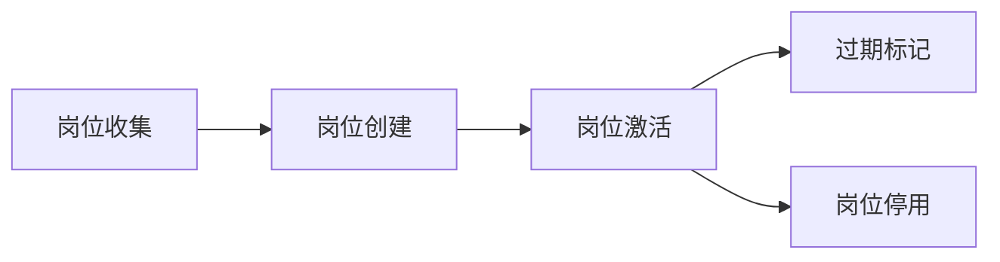
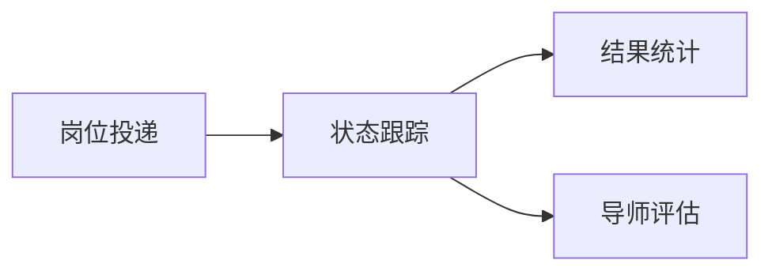
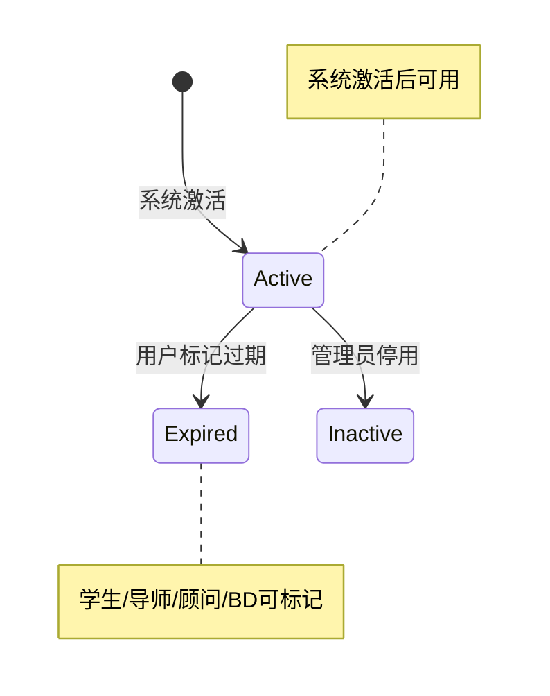
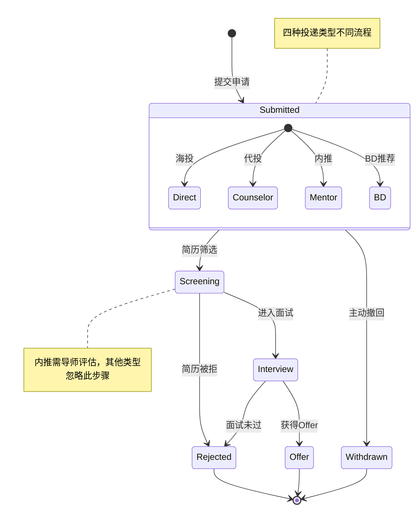
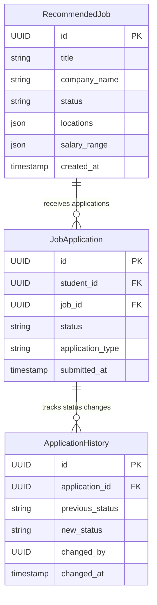

# Placement Domain Design v3.1

**版本**: v3.1 | **发布日期**: 2025-11-27 | **阅读时间**: ~10分钟
**核心变更**: 移除数据清洗功能，聚焦岗位过期标记 | **状态**: ✅ 已评审
**核心域**: 岗位生命周期 + 投递管理 | **架构**: 事件驱动 + 分层存储

## 🎯 核心速览

| 业务域 | 核心职责 | 关键指标 |
|--------|----------|----------|
| **岗位管理** | 岗位收集、清洗 | 日处理10万岗位 |
| **投递管理** | 4种投递方式、状态跟踪 | 支持千万级申请 |
| **权益验证** | 跨域调用Contract Domain | 实时权益校验 |

### 🔄 核心业务流程

#### 岗位生命周期流程（主流程）


#### 投递申请流程（子流程）


## 🏗️ 领域模型概览

### 核心聚合根
| 聚合根 | 职责 | 关键实体 | 值对象 |
|--------|------|----------|--------|
| **RecommendedJob** | 岗位生命周期管理 | JobRequirement, CompanyInfo | Location, Salary, Tags |
| **JobApplication** | 投递申请管理 | ApplicationHistory | Metadata |

### 领域服务矩阵
| 服务 | 核心功能 | 计费策略 |
|------|----------|----------|
| **RecommendedJobService** | 收集•录入•状态•去重 | 免费 |
| **ApplicationDeliveryService** | 海投•代投•内推•BD | 混合计费 |

### 投递类型与计费策略
| 类型 | 描述 | 权益验证 | 导师评估 | 计费方式 |
|------|------|----------|----------|----------|
| **Direct** | 学生海投 | ❌ 无需 | ❌ 无需 | 🆓 免费 |
| **CounselorAssisted** | 顾问代投 | ✅ 需要 | ❌ 无需 | 💰 权益扣除 |
| **MentorReferral** | 导师内推 | ✅ 需要 | ✅ 必须 | 💰 权益+计费 |
| **BDReferral** | BD推荐 | ✅ 需要 | ❌ 无需 | 💰 权益+计费 |

## 📊 状态图速览

### 岗位过期标记状态机


### 投递申请状态机


**状态说明**：
- **Submitted**: 已提交，等待处理（四种投递类型不同处理流程）
- **Screening**: 简历筛选中（内推需导师评估，其他类型系统处理）
- **Interview**: 进入面试环节（包含技术面、HR面等）
- **Offer**: 获得工作机会，等待学生确认
- **Rejected**: 申请被拒，记录拒绝原因
- **Withdrawn**: 学生主动撤回申请

**状态转换约束**：
- Submitted → Screening：
  - 海投/代投/BD推荐：系统直接转换
  - 内推：需导师评估通过后转换
- Screening → Interview：需记录面试安排信息
- Interview → Offer：需记录Offer详情（薪资、入职时间等）
- 任何状态都可转换为Withdrawn（学生主动撤回）

**关键状态转换规则**：
| 转换路径 | 触发条件 | 权限要求 | 业务规则 |
|----------|----------|----------|----------|
| **Submitted → Screening（海投）** | 忽略 | 系统 | 无特殊要求，自动处理 |
| **Submitted → Screening（代投）** | 忽略 | 系统 | 需验证Counselor权益余额 |
| **Submitted → Screening（BD推荐）** | 忽略 | 系统 | 需验证BD权益余额 |
| **Submitted → Screening（内推）** | 导师评估通过 | 内推导师 | 评估字段完整，评分≥3，整体推荐度为recommend或strongly_recommend |
| **Screening → Interview** | 面试邀请确认 | 企业HR | 需记录面试安排信息 |
| **Interview → Offer** | Offer确认 | 企业HR | 需记录Offer详情 |
| **任意 → Withdrawn** | 主动撤回 | 学生（部分状态支持） | 仅允许特定状态撤回 |
| **任意 → Rejected** | 申请被拒 | 企业HR | 需记录拒绝原因 |

**四种投递类型差异化处理**：

| 投递类型 | 提交角色 | 状态转换权限 | 特殊约束 |
|----------|----------|--------------|----------|
| **海投** | 学生 | 学生+系统 | 无特殊要求 |
| **代投** | Counselor | 学生+Counselor+系统 | 需验证Counselor权益 |
| **内推** | 顾问→学生→导师 | 导师主导 | 需导师评估，学生确认 |
| **BD推荐** | BD导师 | BD导师+系统 | 需验证BD权益 |

**业务价值**：

- 支持四种投递类型的差异化流程管理
- 为不同角色提供精准的状态跟踪和权限控制
- 内推类型支持导师评估机制，提升推荐质量
- 完整的审计追踪，支持业务流程分析
- 灵活的权限矩阵，适应复杂业务场景

## 4. Placement Domain数据表关系

### 🗄️ 数据库速查表

#### 核心表结构对比
| 表名 | 主要字段 | 数据量级 | 查询模式 |
|------|----------|----------|----------|
| `recommended_jobs` | 岗位信息+状态 | 百万级 | 状态+时间范围 |
| `job_applications` | 申请记录+状态 | 千万级 | 学生+岗位+状态 |
| `application_history` | 状态变更历史 | 亿级 | 申请ID+时间降序 |

#### 关键索引设计
| 索引名 | 字段组合 | 查询场景 | 性能目标 |
|--------|----------|----------|----------|
| `idx_jobs_status_created` | `(status, created_at)` | 活跃岗位列表 | <100ms |
| `idx_apps_student_job` | `(student_id, job_id)` | 防重复投递 | <10ms |
| `idx_apps_status_submitted` | `(status, submitted_at)` | 状态统计 | <200ms |
| `idx_history_application_changed` | `(application_id, changed_at DESC)` | 状态轨迹 | <50ms |

#### 5.1 推荐岗位表结构（recommended_jobs）

```sql
CREATE TABLE recommended_jobs (
    -- 基础信息
    id UUID PRIMARY KEY DEFAULT gen_random_uuid(),
    title VARCHAR(200) NOT NULL COMMENT '岗位标题',
    company_name VARCHAR(200) NOT NULL COMMENT '公司名称',
    
    -- 岗位详情
    description TEXT COMMENT '岗位描述',
    requirements JSONB COMMENT '岗位要求（技能、经验等）',
    responsibilities TEXT COMMENT '岗位职责',
    
    -- 分类信息
    job_type VARCHAR(50) COMMENT '岗位类型（fulltime/internship/contract）',
    experience_level VARCHAR(50) COMMENT '经验等级（entry/mid/senior/executive）',
    industry VARCHAR(100) COMMENT '行业分类',
    
    -- 地点信息
    locations JSONB COMMENT '工作地点列表（支持多个国家城市）',
    /* JSON结构示例：
    [
      {
        "city": "New York",
        "state": "NY", 
        "country": "USA",
        "address": "123 Broadway, New York, NY 10001",
        "is_primary": true
      },
      {
        "city": "London",
        "state": "England",
        "country": "UK", 
        "address": "456 Oxford Street, London W1C 1JG",
        "is_primary": false
      }
    ]
    */
    remote_type VARCHAR(50) COMMENT '远程类型（onsite/remote/hybrid）',
    
    -- 薪资信息
    salary_min DECIMAL(10,2) COMMENT '最低薪资',
    salary_max DECIMAL(10,2) COMMENT '最高薪资',
    salary_currency VARCHAR(10) COMMENT '薪资货币',
    
    -- 状态管理
    status VARCHAR(50) NOT NULL DEFAULT 'draft' COMMENT '岗位状态',
    
    -- 时间戳
    posted_date DATE COMMENT '发布日期',
    expiry_date DATE COMMENT '过期日期',
    created_at TIMESTAMP DEFAULT CURRENT_TIMESTAMP COMMENT '创建时间',
    updated_at TIMESTAMP DEFAULT CURRENT_TIMESTAMP COMMENT '更新时间',
    
    -- 业务字段
    source VARCHAR(100) NOT NULL COMMENT '数据来源',
    job_source VARCHAR(20) NOT NULL COMMENT '岗位来源（web/bd）',
    source_url TEXT COMMENT '原始链接',
    source_job_id VARCHAR(100) COMMENT '原始平台岗位ID',
    view_count INTEGER DEFAULT 0 COMMENT '查看次数',
    application_count INTEGER DEFAULT 0 COMMENT '申请次数',
    quality_score DECIMAL(3,2) COMMENT '岗位质量评分（0-1）',
    
    -- AI分析结果（新增）
    ai_analysis JSONB COMMENT 'AI分析结果',
    /* JSON结构示例：
    {
      "required_skills": [
        {
          "skill": "Outside sales / Sales",
          "YOP": 1,
          "category": "core"
        }
      ],
      "h1b": "NA",
      "h1b_evidence": "",
      "us_citizenship": "NA", 
      "us_citizenship_evidence": "",
      "minimum_educational_requirement": "NA",
      "minimum_educational_requirement_evidence": "",
      "job_responsibilities": ["职责1", "职责2"],
      "industry": "Automotive Retail / Auto Dealership",
      "domain": "Sales / Retail Sales",
      "field": "Automotive Sales",
      "experience_level": "entry_level",
      "experience_level_evidence": "相关证据文本",
      "matched_job_titles": [
        {
          "job_title": "Sales",
          "score": 100
        }
      ],
      "location": ["Hallstead, PA 18822"],
      "salary_analysis": {
        "estimated_range": "$60,000 - $100,000+",
        "type": "uncapped"
      }
    }
    */
    
    -- 约束
    CONSTRAINT idx_company_title UNIQUE(company_name, title),
    CONSTRAINT idx_source_job_unique UNIQUE(source, source_job_id),
    CONSTRAINT idx_job_source CHECK (job_source IN ('web', 'bd')),
    CONSTRAINT idx_status_active CHECK (status IN ('active', 'inactive', 'expired')),
    CONSTRAINT chk_salary_range CHECK (salary_min IS NULL OR salary_max IS NULL OR salary_min <= salary_max),
    CONSTRAINT chk_posted_expiry CHECK (posted_date IS NULL OR expiry_date IS NULL OR posted_date <= expiry_date)
);

-- 核心查询索引
CREATE INDEX idx_recommended_jobs_status ON recommended_jobs(status) WHERE status = 'active';
CREATE INDEX idx_recommended_jobs_company ON recommended_jobs(company_name);
CREATE INDEX idx_recommended_jobs_job_source ON recommended_jobs(job_source);
CREATE INDEX idx_recommended_jobs_location ON recommended_jobs USING gin((locations->>'city'), (locations->>'country'));
CREATE INDEX idx_recommended_jobs_salary ON recommended_jobs(salary_min, salary_max);
CREATE INDEX idx_recommended_jobs_type_level ON recommended_jobs(job_type, experience_level);
CREATE INDEX idx_recommended_jobs_posted_date ON recommended_jobs(posted_date DESC);
CREATE INDEX idx_recommended_jobs_quality ON recommended_jobs(quality_score DESC) WHERE status = 'active';

-- GIN索引支持全文搜索
CREATE INDEX idx_recommended_jobs_search ON recommended_jobs USING gin(to_tsvector('english', title || ' ' || description));

-- 标签索引
CREATE INDEX idx_recommended_jobs_tags ON recommended_jobs USING gin(tags);
CREATE INDEX idx_recommended_jobs_skills ON recommended_jobs USING gin(skills_required);

-- AI分析复合索引（减少冗余，提高查询效率）
CREATE INDEX idx_recommended_jobs_ai_composite ON recommended_jobs USING gin((ai_analysis->'industry'), (ai_analysis->'domain'), (ai_analysis->'experience_level'));
CREATE INDEX idx_recommended_jobs_ai_skills ON recommended_jobs USING gin((ai_analysis->'required_skills'));
CREATE INDEX idx_recommended_jobs_ai_location ON recommended_jobs USING gin((ai_analysis->'location'));
CREATE INDEX idx_recommended_jobs_source_job_id ON recommended_jobs(source_job_id);
```

#### 5.2 投递申请表结构（job_applications）

```sql
CREATE TABLE job_applications (
    -- 基础信息
    id UUID PRIMARY KEY DEFAULT gen_random_uuid(),
    student_id UUID NOT NULL COMMENT '学生ID（字符串引用，不建外键）',
    job_id UUID NOT NULL REFERENCES recommended_jobs(id) COMMENT '岗位ID（外键引用recommended_jobs）',

    -- 申请信息
    application_type VARCHAR(50) NOT NULL COMMENT '申请类型（direct/mentor_referral/bd_referral/counselor_assisted）',
    cover_letter TEXT COMMENT '求职信',
    custom_answers JSONB COMMENT '自定义问题回答',

    -- 状态管理
    status VARCHAR(50) NOT NULL DEFAULT 'submitted' COMMENT '申请状态',

    -- 内推导师评估信息（仅内推类型使用）
    mentor_screening JSONB COMMENT '导师评估信息（仅内推类型）',
    /* JSON结构示例：
    {
      "technicalSkills": 4, // 技术技能评分 (1-5)
      "experienceMatch": 3, // 经验匹配度 (1-5)
      "culturalFit": 5, // 文化适应度 (1-5)
      "overallRecommendation": "recommend", // 整体推荐度
      "screeningNotes": "学生技术能力扎实，项目经验丰富" // 评估备注
    }
    */
    
    -- 结果记录
    result VARCHAR(50) COMMENT '申请结果（hired/rejected/withdrawn/declined）',
    result_reason TEXT COMMENT '结果原因',
    result_date DATE COMMENT '结果日期',
    
    -- 时间戳
    submitted_at TIMESTAMP DEFAULT CURRENT_TIMESTAMP COMMENT '提交时间',
    updated_at TIMESTAMP DEFAULT CURRENT_TIMESTAMP COMMENT '更新时间',
    
    -- 业务字段
    is_urgent BOOLEAN DEFAULT FALSE COMMENT '是否加急申请',
    notes TEXT COMMENT '内部备注',
    
    -- 约束
    CONSTRAINT idx_student_job UNIQUE(student_id, job_id),
    CONSTRAINT idx_application_status CHECK (status IN ('submitted', 'screening', 'interview', 'offer', 'hired', 'rejected', 'withdrawn', 'declined')),
    CONSTRAINT idx_application_result CHECK (result IN ('hired', 'rejected', 'withdrawn', 'declined'))
);

-- 核心查询索引
CREATE INDEX idx_job_applications_student ON job_applications(student_id);
CREATE INDEX idx_job_applications_job ON job_applications(job_id);
CREATE INDEX idx_job_applications_status ON job_applications(status);
CREATE INDEX idx_job_applications_type ON job_applications(application_type);
CREATE INDEX idx_job_applications_submitted ON job_applications(submitted_at DESC);
```

#### 5.3 申请历史记录表结构（application_history）

```sql
CREATE TABLE application_history (
    -- 基础信息
    id UUID PRIMARY KEY DEFAULT gen_random_uuid(),
    application_id UUID NOT NULL REFERENCES job_applications(id) COMMENT '申请ID（外键引用job_applications）',
    
    -- 状态变更
    previous_status VARCHAR(50) COMMENT '之前状态',
    new_status VARCHAR(50) NOT NULL COMMENT '新状态',
    
    -- 变更信息
    changed_by UUID COMMENT '变更人ID（系统或用户）',
    changed_by_type VARCHAR(50) COMMENT '变更人类型（system/student/mentor/bd）',
    change_reason TEXT COMMENT '变更原因',
    change_metadata JSONB COMMENT '变更元数据（面试安排、Offer详情等）',
    
    -- 时间戳
    changed_at TIMESTAMP DEFAULT CURRENT_TIMESTAMP COMMENT '变更时间',
    
    -- 索引
    CONSTRAINT idx_application_history_status CHECK (new_status IN ('submitted', 'screening', 'interview', 'offer', 'hired', 'rejected', 'withdrawn', 'declined'))
);

-- 查询索引
CREATE INDEX idx_application_history_application ON application_history(application_id);
CREATE INDEX idx_application_history_changed_at ON application_history(changed_at DESC);
CREATE INDEX idx_application_history_status_change ON application_history(previous_status, new_status);
```

#### 5.5 岗位过期状态管理（已整合到recommended_jobs表）

岗位过期状态直接在`recommended_jobs`表的`status`字段中管理，状态值为`'expired'`。过期标记操作通过更新岗位状态实现，不再使用独立的过期标记表。

**状态转换逻辑：**
- `active` → `expired`：用户标记岗位过期
- `expired` → `active`：管理员审核后重新激活
- `expired` → `inactive`：系统自动清理

**操作记录：**通过`application_history`表记录状态变更历史，包含操作人、操作类型和变更原因。

#### 5.4 数据表关系图



**数据表设计原则**：
- **业务聚焦**：仅包含placement domain核心业务数据
- **性能优化**：核心查询都有对应索引支持
- **扩展性**：JSONB字段支持灵活扩展
- **数据完整性**：外键约束和状态检查约束
- **审计追踪**：完整的历史记录支持

## 5. 领域事件

### 5.1 岗位相关事件

```typescript
// 岗位创建事件
export const JOB_POSITION_CREATED_EVENT = "placement.position.created"
export interface JobPositionCreatedEvent {
  positionId: string
  title: string
  companyName: string
  jobSource: JobSource
  locations: JobLocation[]
  sourceJobId?: string
  aiAnalysis?: AIAnalysis
  createdBy: string
}

// 岗位状态变更事件
export const JOB_POSITION_STATUS_CHANGED_EVENT = "placement.position.status_changed"
export interface JobPositionStatusChangedEvent {
  positionId: string
  previousStatus: PositionStatus
  newStatus: PositionStatus
  changedBy: string
}
```

### 5.2 投递相关事件

```typescript
// 投递申请事件
export const JOB_APPLICATION_SUBMITTED_EVENT = "placement.application.submitted"
export interface JobApplicationSubmittedEvent {
  applicationId: string
  studentId: string
  positionId: string
  applicationType: ApplicationType
}

// 投递状态变更事件
export const JOB_APPLICATION_STATUS_CHANGED_EVENT = "placement.application.status_changed"
export interface JobApplicationStatusChangedEvent {
  applicationId: string
  previousStatus: ApplicationStatus
  newStatus: ApplicationStatus
  changedAt: string
}

// 内推导师评估事件
export const MENTOR_SCREENING_COMPLETED_EVENT = "placement.mentor_screening.completed"
export interface MentorScreeningCompletedEvent {
  applicationId: string
  mentorId: string
  screeningResult: {
    technicalSkills: number
    experienceMatch: number
    culturalFit: number
    overallRecommendation: 'strongly_recommend' | 'recommend' | 'neutral' | 'not_recommend'
    screeningNotes?: string
  }
  evaluatedAt: string
}

// 岗位过期标记事件
export const JOB_POSITION_EXPIRED_EVENT = "placement.position.expired"
export interface JobPositionExpiredEvent {
  positionId: string
  expiredBy: string
  expiredByType: 'student' | 'mentor' | 'counselor' | 'bd'
  expiredAt: string
}

// 核心类型定义
export type JobSource = 'web' | 'bd'

export interface JobLocation {
  city: string
  state?: string
  country: string
  is_primary: boolean
}

export interface AIAnalysis {
  required_skills: Array<{
    skill: string
    YOP: number
    category: 'core' | 'preferred' | 'optional'
  }>
  industry: string
  domain: string
  field: string
  location: string[]
}
```

**完整类型定义**: 参考 `src/domains/placement/events/`

## ⚖️ 业务规则矩阵

### 岗位业务规则（12条）
| 规则类型 | 规则内容 | 技术实现 |
|----------|----------|----------|
| **过期标记** | 多角色可标记岗位过期，状态变更为expired | 权限+状态机+历史记录 |
| **唯一性** | 公司+标题不重复，平台岗位ID唯一 | 复合唯一索引 |
| **重复检测** | 相似度>80%标记重复 | 算法检测 |
| **质量评分** | 完整度+信誉度+竞争力 | 评分算法 |
| **可见性控制** | 仅激活状态可见 | 查询过滤 |
| **数据一致性** | 薪资范围、日期范围逻辑正确 | 检查约束 |
| **来源验证** | 必填数据来源字段 | 非空约束 |
| **岗位来源** | job_source字段值必须为web或bd | 检查约束 |
| **同步冲突** | 基于更新时间戳的冲突解决 | 版本控制 |

### 投递业务规则（11条）
| 规则类型 | 规则内容 | 验证方式 |
|----------|----------|----------|
| **权益验证** | 代投/内推/BD需权益 | 跨域调用 |
| **重复投递** | 学生+岗位唯一 | 唯一索引 |
| **状态一致性** | 变更记录完整历史 | 事件溯源 |
| **申请类型** | Direct/Mentor/BD/Counselor | 类型约束 |
| **结果记录** | 时间 | 必填字段 |
| **撤回限制** | 仅初期状态可撤回 | 状态检查 |
| **通知机制** | 关键状态必通知 | 事件发布 |
  


## 7. 性能优化

### 7.1 核心索引配置

关键查询场景与索引策略：

| 查询场景 | 性能目标 | 索引配置 | 验证方法 |
|---------|---------|---------|---------|
| 活跃岗位列表 | <100ms | 部分索引（status='active'） | 10万数据测试 |
| 防重复投递检查 | <10ms | 唯一索引（student_id, job_id） | 压力测试1000 QPS |
| 学生投递历史 | <200ms | 复合索引（student_id, submitted_at DESC） | 千万级数据测试 |
| 状态轨迹查询 | <50ms | 复合索引（application_id, changed_at DESC） | 亿级数据测试 |

**索引建议**：
1. JSONB字段：使用GIN索引 + `@>` 操作符
2. 排序字段：添加ORDER BY索引
3. 大数据分页：使用游标替代OFFSET
4. 覆盖索引：减少回表查询

## 8. 实现指南

### 8.1 数据库迁移步骤

使用Supabase MCP工具应用数据库变更：

```bash
# 步骤1: 创建Drizzle ORM schema文件
# 文件位置: src/infrastructure/database/schema/placement.schema.ts

# 步骤2: 生成migration脚本
npm run db:generate

# 步骤3: 应用migration
npm run db:migrate

# 步骤4: 使用Supabase MCP直接操作（开发环境）
# 查看现有表
supabase_list_tables

# 执行SQL脚本（见本文档第5章节的SQL）
supabase_execute_sql
```

### 8.2 Drizzle ORM Schema示例

```typescript
// 核心schema定义（完整实现见 src/infrastructure/database/schema/placement.schema.ts）

import { pgTable, uuid, varchar, timestamp, jsonb, pgEnum } from "drizzle-orm/pg-core";

// 枚举定义（3个核心状态）
export const jobStatusEnum = pgEnum("job_status", ["active", "inactive", "expired"]);
export const applicationStatusEnum = pgEnum("application_status", [
  "submitted", "screening", "interview", "offer", "hired", "rejected", "withdrawn", "declined"
]);
export const applicationTypeEnum = pgEnum("application_type", [
  "direct", "counselor_assisted", "mentor_referral", "bd_referral"
]);

// 核心表结构（含索引配置）
export const recommendedJobs = pgTable("recommended_jobs", {
  id: uuid("id").defaultRandom().primaryKey(),
  title: varchar("title", { length: 200 }).notNull(),
  companyName: varchar("company_name", { length: 200 }).notNull(),
  status: jobStatusEnum("status").notNull().default("active"),
  locations: jsonb("locations"),
  aiAnalysis: jsonb("ai_analysis"),
  createdAt: timestamp("created_at", { withTimezone: true }).defaultNow().notNull(),
}, (table) => ({
  companyTitleUnique: uniqueIndex("idx_company_title").on(table.companyName, table.title),
  statusActiveIdx: index("idx_recommended_jobs_status_active").on(table.status).where(sql\`\${table.status} = 'active'\`),
}));

export const jobApplications = pgTable("job_applications", {
  id: uuid("id").defaultRandom().primaryKey(),
  studentId: varchar("student_id", { length: 36 }).notNull(), // 字符串引用（跨域）
  jobId: uuid("job_id").notNull().references(() => recommendedJobs.id), // 域内外键
  status: applicationStatusEnum("status").notNull().default("submitted"),
  submittedAt: timestamp("submitted_at", { withTimezone: true }).defaultNow().notNull(),
}, (table) => ({
  studentJobUnique: uniqueIndex("idx_student_job").on(table.studentId, table.jobId),
}));

export const applicationHistory = pgTable("application_history", {
  id: uuid("id").defaultRandom().primaryKey(),
  applicationId: uuid("application_id").notNull().references(() => jobApplications.id),
  newStatus: applicationStatusEnum("new_status").notNull(),
  changedAt: timestamp("changed_at", { withTimezone: true }).defaultNow().notNull(),
});
```

**完整实现**: 参考 `src/infrastructure/database/schema/placement.schema.ts`

### 8.3 外键引用策略（DDD防腐层）

基于项目架构规范：

| 引用类型 | 字段示例 | 实现方式 | 说明 |
|---------|---------|---------|------|
| **跨域引用** | `student_id` | UUID字符串，不建外键 | Placement → Identity Domain |
| **跨域引用** | `resume_id` | UUID字符串，不建外键 | Placement → Student Domain |
| **域内引用** | `job_id` | 创建外键约束 | 引用recommended_jobs |
| **域内引用** | `application_id` | 创建外键约束 | 引用job_applications |

**优势**：
- 降低域间耦合，支持独立演进
- 避免跨域外键导致的事务锁和性能问题
- 明确边界，符合DDD防腐层原则

## 9. 版本历史

### v3.1 (当前版本)
- **发布日期**: 2025-11-27
- **核心变更**:
  - 移除数据清洗功能，聚焦岗位过期标记
  - 简化岗位状态：从6个状态缩减为3个核心状态（active/inactive/expired）
  - 明确外键策略：跨域字符串引用，域内使用外键约束
  - 添加性能优化指南和Drizzle ORM实现示例
  - 添加数据库迁移和实现步骤
- **设计决策**:
  - 保持3个核心状态，聚焦岗位过期标记功能（避免过度设计）
  - 采用DDD防腐层原则，跨域引用使用字符串而非外键
  - 文档化实现路径，提供Drizzle ORM schema示例

### v3.0
- **发布日期**: 2025-11-20
- **核心特性**:
  - 完整的岗位生命周期管理（6个状态）
  - 四种投递类型支持（Direct/Counselor/Mentor/BD）
  - 导师评估机制
  - 权益验证跨域调用
  - 事件驱动架构设计

## 11. 核心服务接口

### 岗位服务接口（Job Service）
| 服务接口 | 参数类型 | 返回值类型 | 核心逻辑 |
|---------|---------|-----------|---------|
| `findOne(params)` | `{id?, title?, companyName?}` | `RecommendedJob` | 查询单个岗位详情 |
| `search(filter, pagination)` | `{status?, locations?, skills?}` | `Page<RecommendedJob>` | 分页搜索岗位 |
| `createJob(params)` | `{title, companyName, locations}` | `RecommendedJob` | 创建新岗位 |
| `markJobExpired(params)` | `{jobId, userId, reason?}` | `RecommendedJob` | 标记岗位过期 |
| `applyForJob(params)` | `{studentId, jobId, type}` | `JobApplication` | 投递岗位 |

### 投递服务接口（Application Service）
| 服务接口 | 参数类型 | 返回值类型 | 核心逻辑 |
|---------|---------|-----------|---------|
| `getApplications(studentId)` | `{studentId}` | `Page<JobApplication>` | 获取投递记录 |
| `updateStatus(params)` | `{applicationId, status}` | `JobApplication` | 更新投递状态 |
| `submitMentorScreening(params)` | `{applicationId, mentorId, result}` | `JobApplication` | 提交导师评估 |

**完整接口**: 参考 `src/domains/placement/services/`


---

**文档结束 | 版本 v3.1（移除数据清洗功能） | 阅读时间 ~10分钟 | 状态: ✅ 已评审 | 修改完成: 冗余字段移除、注释完善、状态机约束验证、接口示例补充、岗位过期标记表结构简化、数据表关系图修复、Mermaid语法修复、性能优化速查移除、版本控制机制移除、投递状态机简化**