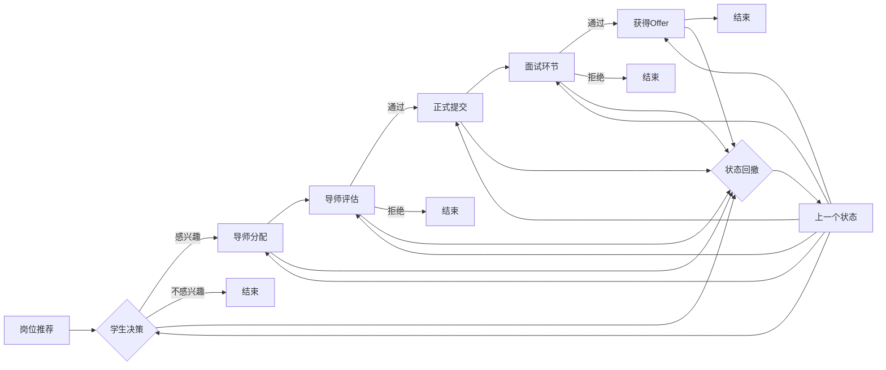
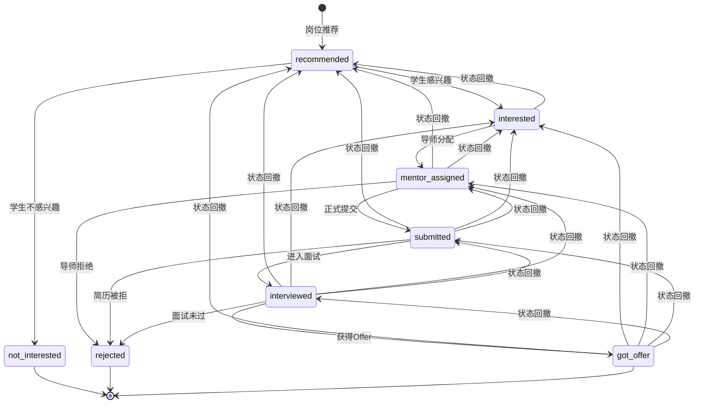

# Placement Domain Design v3.1

**版本**: v3.1 | **发布日期**: 2025-11-27 | **阅读时间**: ~10分钟
**核心变更**: 移除数据清洗功能，聚焦岗位过期标记 | **状态**: ✅ 已评审
**核心域**: 岗位生命周期 + 投递管理 | **架构**: 事件驱动 + 分层存储

## 🎯 核心速览

| 业务域 | 核心职责 | 关键指标 |
|--------|----------|----------|
| **岗位管理** | 岗位收集、清洗 | 日处理10万岗位 |
| **投递管理** | 4种投递方式、状态跟踪 | 支持千万级申请 |
| **权益验证** | 跨域调用Contract Domain | 实时权益校验 |

### 🔄 核心业务流程

#### 岗位生命周期流程（主流程）


#### 投递申请流程（子流程）


## 🏗️ 领域模型概览

### 核心聚合根
| 聚合根 | 职责 | 关键实体 | 值对象 |
|--------|------|----------|--------|
| **RecommendedJob** | 岗位生命周期管理 | JobRequirement, CompanyInfo | Location, Salary, Tags |
| **JobApplication** | 投递申请管理 | ApplicationHistory | Metadata |

### 领域服务矩阵
| 服务 | 核心功能 | 计费策略 |
|------|----------|----------|
| **RecommendedJobService** | 收集•录入•状态•去重 | 免费 |
| **ApplicationDeliveryService** | 海投•代投•内推•BD | 混合计费 |

### 投递类型与计费策略
| 类型 | 描述 | 权益验证 | 导师评估 | 计费方式 |
|------|------|----------|----------|----------|
| **Direct** | 学生海投 | ❌ 无需 | ❌ 无需 | 🆓 免费 |
| **CounselorAssisted** | 顾问代投 | ✅ 需要 | ❌ 无需 | 💰 权益扣除 |
| **MentorReferral** | 导师内推 | ✅ 需要 | ✅ 必须 | 💰 权益+计费 |
| **BDReferral** | BD推荐 | ✅ 需要 | ❌ 无需 | 💰 权益+计费 |

## 📊 状态图速览

### 岗位过期标记状态机


### 投递申请状态机


**状态说明**：
- **recommended**: 岗位已推荐给学生
- **interested**: 学生对推荐岗位感兴趣
- **not_interested**: 学生对推荐岗位不感兴趣
- **mentor_assigned**: 已分配导师进行评估
- **submitted**: 申请已正式提交给企业
- **interviewed**: 学生已参加面试
- **got_offer**: 学生获得工作Offer
- **rejected**: 申请被拒绝

**状态转换约束**：
- **recommended → interested/not_interested**: 学生决策阶段，二选一
- **interested → mentor_assigned**: 系统自动分配导师
- **mentor_assigned → submitted/rejected**: 导师评估结果
- **submitted → interviewed/rejected**: 企业简历筛选结果
- **interviewed → got_offer/rejected**: 面试结果
- 支持状态回撤功能，可安全回退到上一个有效状态，通过`rollbackApplicationStatus`方法实现

**关键状态转换规则**：
| 转换路径 | 触发条件 | 权限要求 | 业务规则 |
|----------|----------|----------|----------|
| **recommended → interested** | 学生选择感兴趣 | 学生 | 无特殊要求 |
| **recommended → not_interested** | 学生选择不感兴趣 | 学生 | 无特殊要求 |
| **interested → mentor_assigned** | 系统自动分配 | 系统 | 基于学生专业和导师领域匹配 |
| **mentor_assigned → submitted** | 导师评估通过 | 导师 | 评估结果为推荐或强烈推荐 |
| **mentor_assigned → rejected** | 导师评估不通过 | 导师 | 评估结果为不推荐 |
| **submitted → interviewed** | 企业邀请面试 | 系统 | 需记录面试安排信息 |
| **submitted → rejected** | 企业拒绝简历 | 系统 | 需记录拒绝原因 |
| **interviewed → got_offer** | 企业发放Offer | 系统 | 需记录Offer详情 |
| **interviewed → rejected** | 面试未通过 | 系统 | 需记录拒绝原因 |
| **状态回撤** | 学生/管理员发起 | 学生/管理员 | 可回退到上一个有效状态，保留完整历史记录 |


**四种投递类型差异化处理**：

| 投递类型 | 提交角色 | 状态转换权限 | 特殊约束 |
|----------|----------|--------------|----------|
| **Direct** | 学生 | 学生+系统 | 直接进入submitted状态 |
| **CounselorAssisted** | 顾问 | 顾问+系统 | 需验证顾问权益，直接进入submitted状态 |
| **MentorReferral** | 顾问→学生→导师 | 导师主导 | 需完整的推荐→感兴趣→导师分配→评估流程 |
| **BDReferral** | BD导师 | BD导师+系统 | 需验证BD权益，直接进入submitted状态 |

**业务价值**：

- 支持四种投递类型的差异化流程管理
- 为不同角色提供精准的状态跟踪和权限控制
- 内推类型支持导师评估机制，提升推荐质量
- 完整的审计追踪，支持业务流程分析
- 灵活的权限矩阵，适应复杂业务场景

## 4. Placement Domain数据表关系

### 🗄️ 数据库速查表

#### 核心表结构对比
| 表名 | 主要字段 | 数据量级 | 查询模式 |
|------|----------|----------|----------|
| `recommended_jobs` | 岗位信息+状态 | 百万级 | 状态+时间范围 |
| `job_applications` | 申请记录+状态 | 千万级 | 学生+岗位+状态 |
| `application_history` | 状态变更历史 | 亿级 | 申请ID+时间降序 |

#### 关键索引设计
| 索引名 | 字段组合 | 查询场景 | 性能目标 |
|--------|----------|----------|----------|
| `idx_jobs_status_created` | `(status, created_at)` | 活跃岗位列表 | <100ms |
| `idx_apps_student_job` | `(student_id, job_id)` | 防重复投递 | <10ms |
| `idx_apps_status_submitted` | `(status, submitted_at)` | 状态统计 | <200ms |
| `idx_history_application_changed` | `(application_id, changed_at DESC)` | 状态轨迹 | <50ms |

#### 5.1 推荐岗位表结构（recommended_jobs）

```sql
CREATE TABLE recommended_jobs (
    -- 基础信息
    id UUID PRIMARY KEY DEFAULT gen_random_uuid(),
    title VARCHAR(200) NOT NULL COMMENT '岗位标题',
    company_name VARCHAR(200) NOT NULL COMMENT '公司名称',
    company_name_normalized VARCHAR(200) COMMENT '标准化公司名称',
    location VARCHAR(200) COMMENT '地点',
    salary_range VARCHAR(100) COMMENT '薪资范围',
    
    -- 岗位详情
    description TEXT COMMENT '岗位描述',
    requirements VARCHAR[] COMMENT '岗位要求（技能、经验等）',
    benefits VARCHAR[] COMMENT '福利',
    skills_required VARCHAR[] COMMENT '所需技能',
    responsibilities TEXT COMMENT '岗位职责',
    
    -- 分类信息
    job_type VARCHAR(50) COMMENT '岗位类型（fulltime/internship/contract）',
    experience_level VARCHAR(50) COMMENT '经验等级（entry/mid/senior/executive）',
    industry VARCHAR(100) COMMENT '行业分类',
    department VARCHAR(100) COMMENT '部门',
    employment_type VARCHAR(50) COMMENT '雇佣类型',
    
    -- 远程类型
    remote_type VARCHAR(50) COMMENT '远程类型（onsite/remote/hybrid）',
    
    -- 状态管理
    status VARCHAR(50) NOT NULL DEFAULT 'active' COMMENT '岗位状态',
    duplicate_check_status VARCHAR(50) COMMENT '重复检查状态',
    duplicate_confidence_score DECIMAL(3,2) COMMENT '重复置信度分数',
    
    -- 业务字段
    source VARCHAR(100) NOT NULL COMMENT '数据来源',
    source_url TEXT COMMENT '原始链接',
    external_id VARCHAR(100) COMMENT '外部ID',
    
    -- 时间戳
    created_at TIMESTAMP WITH TIME ZONE DEFAULT CURRENT_TIMESTAMP NOT NULL COMMENT '创建时间',
    updated_at TIMESTAMP WITH TIME ZONE DEFAULT CURRENT_TIMESTAMP NOT NULL COMMENT '更新时间',
    created_by UUID COMMENT '创建人',
    updated_by UUID COMMENT '更新人',
    version INTEGER DEFAULT 1 NOT NULL COMMENT '版本',
    
    -- 约束
    CONSTRAINT idx_company_title UNIQUE(company_name, title),
    CONSTRAINT idx_status_active CHECK (status IN ('active', 'inactive', 'expired'))
);

-- 核心查询索引
CREATE INDEX idx_recommended_jobs_status ON recommended_jobs(status);
CREATE INDEX idx_recommended_jobs_company ON recommended_jobs(company_name);
CREATE INDEX idx_recommended_jobs_title ON recommended_jobs(title);
CREATE INDEX idx_recommended_jobs_created_at ON recommended_jobs(created_at);
```

#### 5.2 投递申请表结构（job_applications）

```sql
CREATE TABLE job_applications (
    -- 基础信息
    id UUID PRIMARY KEY DEFAULT gen_random_uuid(),
    student_id VARCHAR(36) NOT NULL COMMENT '学生ID（字符串引用，不建外键）',
    job_id UUID NOT NULL REFERENCES recommended_jobs(id) ON DELETE CASCADE COMMENT '岗位ID（外键引用recommended_jobs）',

    -- 申请信息
    application_type VARCHAR(50) NOT NULL COMMENT '申请类型（direct/mentor_referral/bd_referral/counselor_assisted）',
    cover_letter TEXT COMMENT '求职信',
    custom_answers JSONB COMMENT '自定义问题回答',

    -- 状态管理
    status VARCHAR(50) NOT NULL DEFAULT 'submitted' COMMENT '申请状态',

    -- 内推导师评估信息（仅内推类型使用）
    mentor_screening JSONB COMMENT '导师评估信息（仅内推类型）',
    /* JSON结构示例：
    {
      "technicalSkills": 4, // 技术技能评分 (1-5)
      "experienceMatch": 3, // 经验匹配度 (1-5)
      "culturalFit": 5, // 文化适应度 (1-5)
      "overallRecommendation": "recommend", // 整体推荐度
      "screeningNotes": "学生技术能力扎实，项目经验丰富" // 评估备注
    }
    */
    
    -- 结果记录
    result VARCHAR(50) COMMENT '申请结果（rejected）',
    result_reason TEXT COMMENT '结果原因',
    result_date DATE COMMENT '结果日期',
    
    -- 时间戳
    submitted_at TIMESTAMP WITH TIME ZONE DEFAULT CURRENT_TIMESTAMP NOT NULL COMMENT '提交时间',
    updated_at TIMESTAMP WITH TIME ZONE DEFAULT CURRENT_TIMESTAMP NOT NULL COMMENT '更新时间',
    
    -- 业务字段
    notes TEXT COMMENT '内部备注',
    
    -- 约束
    CONSTRAINT idx_student_job UNIQUE(student_id, job_id),
    CONSTRAINT idx_application_status CHECK (status IN ('recommended', 'interested', 'not_interested', 'mentor_assigned', 'submitted', 'interviewed', 'got_offer', 'rejected')),
    CONSTRAINT idx_application_result CHECK (result IN ('rejected'))
);

-- 核心查询索引
CREATE INDEX idx_job_applications_student ON job_applications(student_id);
CREATE INDEX idx_job_applications_job ON job_applications(job_id);
CREATE INDEX idx_job_applications_status ON job_applications(status);
CREATE INDEX idx_job_applications_type ON job_applications(application_type);
CREATE INDEX idx_job_applications_submitted ON job_applications(submitted_at);
```

#### 5.3 申请历史记录表结构（application_history）

```sql
CREATE TABLE application_history (
    -- 基础信息
    id UUID PRIMARY KEY DEFAULT gen_random_uuid(),
    application_id UUID NOT NULL REFERENCES job_applications(id) ON DELETE CASCADE COMMENT '申请ID（外键引用job_applications）',
    
    -- 状态变更
    previous_status VARCHAR(50) COMMENT '之前状态',
    new_status VARCHAR(50) NOT NULL COMMENT '新状态',
    
    -- 变更信息
    changed_by VARCHAR(36) COMMENT '变更人ID（系统或用户）',
    changed_by_type VARCHAR(50) COMMENT '变更人类型（system/student/mentor/bd/counselor）',
    change_reason TEXT COMMENT '变更原因',
    change_metadata JSONB COMMENT '变更元数据（面试安排、Offer详情等）',
    
    -- 时间戳
    changed_at TIMESTAMP WITH TIME ZONE DEFAULT CURRENT_TIMESTAMP NOT NULL COMMENT '变更时间',
    
    -- 约束
    CONSTRAINT idx_application_history_status CHECK (new_status IN ('recommended', 'interested', 'not_interested', 'mentor_assigned', 'submitted', 'interviewed', 'got_offer', 'rejected'))
);

-- 查询索引
CREATE INDEX idx_application_history_application ON application_history(application_id);
CREATE INDEX idx_application_history_changed_at ON application_history(changed_at);
CREATE INDEX idx_application_history_status_change ON application_history(previous_status, new_status);
```

#### 5.5 岗位过期状态管理（已整合到recommended_jobs表）

岗位过期状态直接在`recommended_jobs`表的`status`字段中管理，状态值为`'expired'`。过期标记操作通过更新岗位状态实现，不再使用独立的过期标记表。

**状态转换逻辑：**
- `active` → `expired`：用户标记岗位过期
- `expired` → `active`：管理员审核后重新激活
- `expired` → `inactive`：系统自动清理

**操作记录：**通过`application_history`表记录状态变更历史，包含操作人、操作类型和变更原因。

#### 5.4 数据表关系图


**数据表设计原则**：
- **业务聚焦**：仅包含placement domain核心业务数据
- **性能优化**：核心查询都有对应索引支持
- **扩展性**：JSONB字段支持灵活扩展
- **数据完整性**：外键约束和状态检查约束
- **审计追踪**：完整的历史记录支持

## 5. 领域事件

### 5.1 投递相关事件

```typescript
// 投递申请事件
export const JOB_APPLICATION_SUBMITTED_EVENT = "placement.application.submitted"
export interface JobApplicationSubmittedEvent {
  applicationId: string
  studentId: string
  positionId: string
  applicationType: "direct" | "counselor_assisted" | "mentor_referral" | "bd_referral"
  submittedAt: string
}

// 投递状态变更事件
export const JOB_APPLICATION_STATUS_CHANGED_EVENT = "placement.application.status_changed"
export interface JobApplicationStatusChangedEvent {
  applicationId: string
  previousStatus: "recommended" | "interested" | "not_interested" | "mentor_assigned" | "submitted" | "interviewed" | "got_offer" | "rejected"
  newStatus: "recommended" | "interested" | "not_interested" | "mentor_assigned" | "submitted" | "interviewed" | "got_offer" | "rejected"
  changedBy?: string
  changedAt: string
}

// 内推导师评估事件
export const MENTOR_SCREENING_COMPLETED_EVENT = "placement.mentor_screening.completed"
export interface MentorScreeningCompletedEvent {
  applicationId: string
  mentorId: string
  screeningResult: {
    technicalSkills: number
    experienceMatch: number
    culturalFit: number
    overallRecommendation: "strongly_recommend" | "recommend" | "neutral" | "not_recommend"
    screeningNotes?: string
  }
  evaluatedAt: string
}
```

**完整类型定义**: 参考 `src/domains/placement/events/`

## ⚖️ 业务规则矩阵

### 岗位业务规则（12条）
| 规则类型 | 规则内容 | 技术实现 |
|----------|----------|----------|
| **过期标记** | 多角色可标记岗位过期，状态变更为expired | 权限+状态机+历史记录 |
| **唯一性** | 公司+标题不重复，平台岗位ID唯一 | 复合唯一索引 |
| **重复检测** | 相似度>80%标记重复 | 算法检测 |
| **质量评分** | 完整度+信誉度+竞争力 | 评分算法 |
| **可见性控制** | 仅激活状态可见 | 查询过滤 |
| **数据一致性** | 薪资范围、日期范围逻辑正确 | 检查约束 |
| **来源验证** | 必填数据来源字段 | 非空约束 |
| **岗位来源** | job_source字段值必须为web或bd | 检查约束 |
| **同步冲突** | 基于更新时间戳的冲突解决 | 版本控制 |

### 投递业务规则（11条）
| 规则类型 | 规则内容 | 验证方式 |
|----------|----------|----------|
| **权益验证** | 代投/内推/BD需权益 | 跨域调用 |
| **重复投递** | 学生+岗位唯一 | 唯一索引 |
| **状态一致性** | 变更记录完整历史 | 事件溯源 |
| **申请类型** | Direct/Mentor/BD/Counselor | 类型约束 |
| **结果记录** | 时间 | 必填字段 |
| **撤回限制** | 仅初期状态可撤回 | 状态检查 |
| **通知机制** | 关键状态必通知 | 事件发布 |
  


## 7. 性能优化

### 7.1 核心索引配置

关键查询场景与索引策略：

| 查询场景 | 性能目标 | 索引配置 | 验证方法 |
|---------|---------|---------|---------|
| 活跃岗位列表 | <100ms | 部分索引（status='active'） | 10万数据测试 |
| 防重复投递检查 | <10ms | 唯一索引（student_id, job_id） | 压力测试1000 QPS |
| 学生投递历史 | <200ms | 复合索引（student_id, submitted_at DESC） | 千万级数据测试 |
| 状态轨迹查询 | <50ms | 复合索引（application_id, changed_at DESC） | 亿级数据测试 |

**索引建议**：
1. JSONB字段：使用GIN索引 + `@>` 操作符
2. 排序字段：添加ORDER BY索引
3. 大数据分页：使用游标替代OFFSET
4. 覆盖索引：减少回表查询

## 8. 实现指南

### 8.1 数据库迁移步骤

使用Supabase MCP工具应用数据库变更：

```bash
# 步骤1: 创建Drizzle ORM schema文件
# 文件位置: src/infrastructure/database/schema/placement.schema.ts

# 步骤2: 生成migration脚本
npm run db:generate

# 步骤3: 应用migration
npm run db:migrate

# 步骤4: 使用Supabase MCP直接操作（开发环境）
# 查看现有表
supabase_list_tables

# 执行SQL脚本（见本文档第5章节的SQL）
supabase_execute_sql
```

### 8.2 Drizzle ORM Schema示例

```typescript
// 核心schema定义（完整实现见 src/infrastructure/database/schema/placement.schema.ts）

import { sql } from "drizzle-orm";
import { pgTable, uuid, varchar, text, decimal, timestamp, jsonb, integer, boolean, date, pgEnum, uniqueIndex, index } from "drizzle-orm/pg-core";
import { APPLICATION_STATUSES } from "@domains/placement/types/application-status.types";

// 枚举定义
// 岗位状态枚举
export const jobStatusEnum = pgEnum("job_status", ["active", "inactive", "expired"]);
// 投递状态枚举（从APPLICATION_STATUSES常量导入）
export const applicationStatusEnum = pgEnum("application_status", APPLICATION_STATUSES);
// 投递类型枚举
export const applicationTypeEnum = pgEnum("application_type", [
  "direct", "counselor_assisted", "mentor_referral", "bd_referral"
]);
// 变更人类型枚举
export const changedByTypeEnum = pgEnum("changed_by_type", [
  "system", "student", "mentor", "bd", "counselor"
]);
// 整体推荐度枚举
export const overallRecommendationEnum = pgEnum("overall_recommendation_enum", [
  "strongly_recommend", "recommend", "neutral", "not_recommend"
]);
// 结果枚举
export const resultEnum = pgEnum("result_enum", ["rejected"]);

// 推荐岗位表
export const recommendedJobs = pgTable("recommended_jobs", {
  // 主键
  id: uuid("id").defaultRandom().primaryKey(),

  // 基础信息
  title: varchar("title", { length: 200 }).notNull(), // 岗位标题
  companyName: varchar("company_name", { length: 200 }).notNull(), // 公司名称
  companyNameNormalized: varchar("company_name_normalized", { length: 200 }), // 标准化公司名称
  location: varchar("location", { length: 200 }), // 地点
  salaryRange: varchar("salary_range", { length: 100 }), // 薪资范围

  // 岗位详情
  description: text("description"), // 岗位描述
  requirements: varchar("requirements").array(), // 岗位要求
  benefits: varchar("benefits").array(), // 福利
  skillsRequired: varchar("skills_required").array(), // 所需技能
  responsibilities: text("responsibilities"), // 岗位职责

  // 分类信息
  jobType: varchar("job_type", { length: 50 }), // 岗位类型
  experienceLevel: varchar("experience_level", { length: 50 }), // 经验等级
  industry: varchar("industry", { length: 100 }), // 行业分类
  department: varchar("department", { length: 100 }), // 部门
  employmentType: varchar("employment_type", { length: 50 }), // 雇佣类型

  // 远程类型
  remoteType: varchar("remote_type", { length: 50 }), // 远程类型

  // 状态管理
  status: varchar("status", { length: 50 }).notNull().default("active"), // 岗位状态
  duplicateCheckStatus: varchar("duplicate_check_status", { length: 50 }), // 重复检查状态
  duplicateConfidenceScore: decimal("duplicate_confidence_score", { precision: 3, scale: 2 }), // 重复置信度分数

  // 业务字段
  source: varchar("source", { length: 100 }).notNull(), // 数据来源
  sourceUrl: text("source_url"), // 原始链接
  externalId: varchar("external_id", { length: 100 }), // 外部ID

  // 时间戳
  createdAt: timestamp("created_at", { withTimezone: true }).defaultNow().notNull(), // 创建时间
  updatedAt: timestamp("updated_at", { withTimezone: true }).defaultNow().notNull(), // 更新时间
  createdBy: uuid("created_by"), // 创建人
  updatedBy: uuid("updated_by"), // 更新人
  version: integer("version").default(1).notNull(), // 版本
}, (table) => [
  // 核心查询索引
  index("idx_recommended_jobs_status").on(table.status),
  index("idx_recommended_jobs_company").on(table.companyName),
  index("idx_recommended_jobs_title").on(table.title),
  index("idx_recommended_jobs_created_at").on(table.createdAt),
]);

// 投递申请表
export const jobApplications = pgTable("job_applications", {
  // 主键
  id: uuid("id").defaultRandom().primaryKey(),

  // 基础信息
  studentId: varchar("student_id", { length: 36 }).notNull(), // 学生ID
  jobId: uuid("job_id").notNull().references(() => recommendedJobs.id, { onDelete: "cascade" }), // 岗位ID

  // 申请信息
  applicationType: applicationTypeEnum("application_type").notNull(), // 申请类型
  coverLetter: text("cover_letter"), // 求职信
  customAnswers: jsonb("custom_answers"), // 自定义问题回答

  // 状态管理
  status: applicationStatusEnum("status").notNull().default("submitted"), // 申请状态

  // 内推导师评估信息
  mentorScreening: jsonb("mentor_screening"), // 导师评估信息

  // 结果记录
  result: resultEnum("result"), // 申请结果
  resultReason: text("result_reason"), // 结果原因
  resultDate: date("result_date"), // 结果日期

  // 时间戳
  submittedAt: timestamp("submitted_at", { withTimezone: true }).defaultNow().notNull(), // 提交时间
  updatedAt: timestamp("updated_at", { withTimezone: true }).defaultNow().notNull(), // 更新时间

  // 业务字段
  notes: text("notes"), // 内部备注
}, (table) => [
  // 唯一约束
  uniqueIndex("idx_student_job").on(table.studentId, table.jobId),

  // 核心查询索引
  index("idx_job_applications_student").on(table.studentId),
  index("idx_job_applications_job").on(table.jobId),
  index("idx_job_applications_status").on(table.status),
  index("idx_job_applications_type").on(table.applicationType),
  index("idx_job_applications_submitted").on(table.submittedAt),
]);

// 申请历史记录表
export const applicationHistory = pgTable("application_history", {
  // 主键
  id: uuid("id").defaultRandom().primaryKey(),

  // 申请信息
  applicationId: uuid("application_id").notNull().references(() => jobApplications.id, { onDelete: "cascade" }), // 申请ID

  // 状态变更
  previousStatus: applicationStatusEnum("previous_status"), // 之前状态
  newStatus: applicationStatusEnum("new_status").notNull(), // 新状态

  // 变更信息
  changedBy: varchar("changed_by", { length: 36 }), // 变更人ID
  changedByType: changedByTypeEnum("changed_by_type"), // 变更人类型
  changeReason: text("change_reason"), // 变更原因
  changeMetadata: jsonb("change_metadata"), // 变更元数据

  // 时间戳
  changedAt: timestamp("changed_at", { withTimezone: true }).defaultNow().notNull(), // 变更时间
}, (table) => [
  // 核心查询索引
  index("idx_application_history_application").on(table.applicationId),
  index("idx_application_history_changed_at").on(table.changedAt),
  index("idx_application_history_status_change").on(table.previousStatus, table.newStatus),
]);
```

**完整实现**: 参考 `src/infrastructure/database/schema/placement.schema.ts`

### 8.3 外键引用策略（DDD防腐层）

基于项目架构规范：

| 引用类型 | 字段示例 | 实现方式 | 说明 |
|---------|---------|---------|------|
| **跨域引用** | `student_id` | UUID字符串，不建外键 | Placement → Identity Domain |
| **跨域引用** | `resume_id` | UUID字符串，不建外键 | Placement → Student Domain |
| **域内引用** | `job_id` | 创建外键约束 | 引用recommended_jobs |
| **域内引用** | `application_id` | 创建外键约束 | 引用job_applications |

**优势**：
- 降低域间耦合，支持独立演进
- 避免跨域外键导致的事务锁和性能问题
- 明确边界，符合DDD防腐层原则

## 9. 版本历史

### v3.1 (当前版本)
- **发布日期**: 2025-11-27
- **核心变更**:
  - 移除数据清洗功能，聚焦岗位过期标记
  - 简化岗位状态：从6个状态缩减为3个核心状态（active/inactive/expired）
  - 明确外键策略：跨域字符串引用，域内使用外键约束
  - 添加性能优化指南和Drizzle ORM实现示例
  - 添加数据库迁移和实现步骤
  - 更新投递申请状态机，与实际代码保持一致
  - 更新投递申请表结构，调整状态约束和结果字段
  - 更新申请历史记录表结构，扩展变更人类型
  - 更新服务接口定义，与实际代码保持一致
- **设计决策**:
  - 保持3个核心状态，聚焦岗位过期标记功能（避免过度设计）
  - 采用DDD防腐层原则，跨域引用使用字符串而非外键
  - 文档化实现路径，提供Drizzle ORM schema示例
  - 状态机设计与实际代码保持一致，确保文档准确性
  - 服务接口定义与实际实现保持同步，提高开发效率

### v3.0
- **发布日期**: 2025-11-20
- **核心特性**:
  - 完整的岗位生命周期管理（6个状态）
  - 四种投递类型支持（Direct/Counselor/Mentor/BD）
  - 导师评估机制
  - 权益验证跨域调用
  - 事件驱动架构设计

## 11. 核心服务接口

### 岗位服务接口（Job Service）
| 服务接口 | 参数类型 | 返回值类型 | 核心逻辑 |
|---------|---------|-----------|---------|
| `findOne(params)` | `{id?, title?, companyName?, status?}` | `Record<string, any>` | 查询单个岗位详情 |
| `search(filter, pagination, sort)` | `IJobPositionSearchFilter, IPaginationQuery, ISortQuery` | `{items: Record<string, any>[], total: number, offset: number, limit: number}` | 分页搜索岗位 |
| `createJobPosition(dto)` | `ICreateJobPositionDto` | `IServiceResult<Record<string, any>, Record<string, any>>` | 创建新岗位 |
| `markJobExpired(dto)` | `IMarkJobExpiredDto` | `IServiceResult<Record<string, any>, Record<string, any>>` | 标记岗位过期 |

### 投递服务接口（Application Service）
| 服务接口 | 参数类型 | 返回值类型 | 核心逻辑 |
|---------|---------|-----------|---------|
| `submitApplication(dto)` | `ISubmitApplicationDto` | `IServiceResult<Record<string, any>, Record<string, any>>` | 提交投递申请 |
| `submitMentorScreening(dto)` | `any` | `IServiceResult<Record<string, any>, Record<string, any>>` | 提交导师评估 |
| `updateApplicationStatus(dto)` | `IUpdateApplicationStatusDto` | `IServiceResult<Record<string, any>, Record<string, any>>` | 更新投递状态 |
| `rollbackApplicationStatus(applicationId, changedBy)` | `string, string` | `IServiceResult<Record<string, any>, Record<string, any>>` | 回撤申请状态到上一个状态 |
| `search(filter, pagination, sort)` | `IJobApplicationSearchFilter, IPaginationQuery, ISortQuery` | `{items: Record<string, any>[], total: number, offset: number, limit: number}` | 搜索投递申请 |
| `findOne(params)` | `{id?, studentId?, jobId?, status?, applicationType?}` | `Record<string, any>` | 根据条件获取投递申请 |
| `getStatusHistory(applicationId)` | `string` | `Array<Record<string, any>>` | 获取投递状态历史 |

**完整接口**: 参考 `src/domains/placement/services/`


---

**文档结束 | 版本 v3.1（移除数据清洗功能） | 阅读时间 ~10分钟 | 状态: ✅ 已评审 | 修改完成: 冗余字段移除、注释完善、状态机约束验证、接口示例补充、岗位过期标记表结构简化、数据表关系图修复、Mermaid语法修复、性能优化速查移除、版本控制机制移除、投递状态机简化**