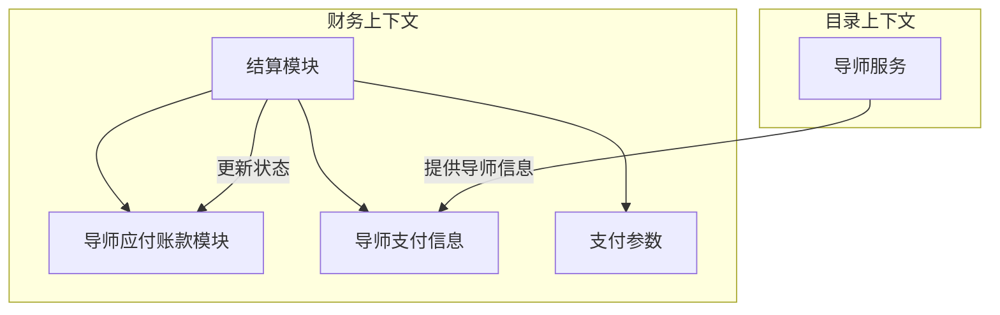
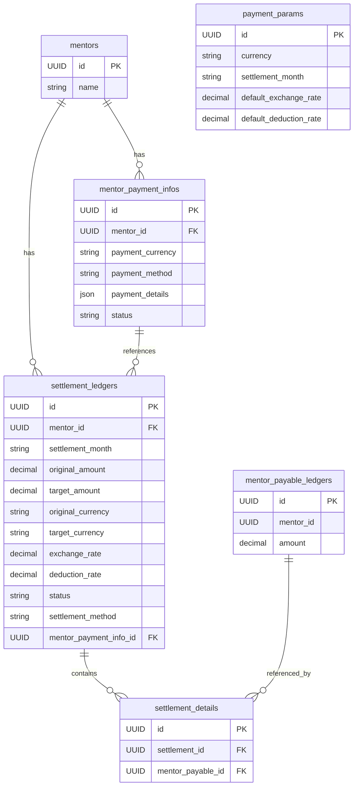
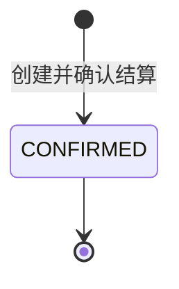
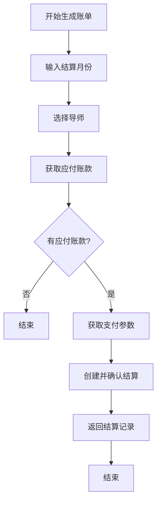
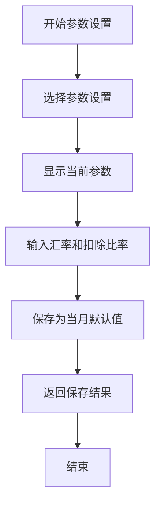
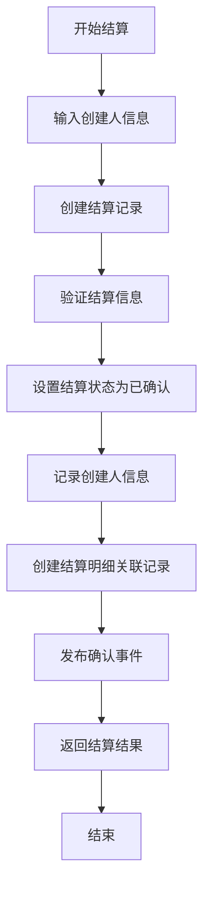

# 结算模块设计文档

## 1. 文档概述

本文档详细描述了在 financial domain 中实现结算模块的设计方案，包括领域模型、数据结构、业务流程、服务接口和事件发布机制。结算模块采用append only设计模式，确保结算记录的不可变性和可追溯性，是连接导师应付账款和实际支付流程的关键环节，提供从账单生成到结算完成的完整业务支持。

## 2. 业务需求分析

### 2.1 核心业务场景

1. **结算账单生成**：每月月初，财务人员读取导师上个月的应付账款记录，生成应付款账单
2. **导师支付信息管理**：维护导师支付信息，包括支付币种、支付方式和支付详情
3. **结算参数设置**：在计算支付金额时，实时输入汇率和扣除比率，并保存为当月默认值，用于分批次或逐个导师结算
4. **结算确认与处理**：财务人员确认账单后生成结算记录，用于线下支付

### 2.2 支付方式支持

- 国内转账
- 渠道一起付
- Gusto（美国薪资服务公司代付）
- Gusto-International
- 支票

### 2.3 关键业务规则

- 汇率和扣除比率需实时输入，并作为当月默认值保存
- 当月的默认参数允许修改，修改后将影响后续批次的结算
- 结算可分批次或逐个导师完成，使用当月的默认参数
- 结算记录采用append only模式，一旦创建，不允许修改，只能通过创建新记录进行调整
- 支持跨币种支付场景的汇率转换

## 3. 领域模型设计

### 3.1 核心领域实体

#### 3.1.1 SettlementLedger（结算记录）

**描述**：代表一次完整的结算事务记录，是结算模块的核心聚合根。采用append only模式，结算记录一旦创建，不允许修改，只允许添加新记录。

**核心属性**：
- id：唯一标识符
- mentorId：导师ID
- settlementMonth：结算月份
- originalAmount：原始金额（应付账款币种）
- targetAmount：目标金额（实际支付币种）
- originalCurrency：原始币种
- targetCurrency：目标币种
- exchangeRate：汇率
- deductionRate：扣除比率
- status：结算状态（仅使用CONFIRMED）
- settlementMethod：结算方式
- mentorPaymentInfoId：关联的导师支付信息ID
- paymentReference：支付参考号（可选）
- remarks：备注信息（可选）
- createdAt、createdBy：创建审计信息（仅保留创建相关字段，移除更新字段）

**主要行为**：
- 创建结算记录
- 查询结算记录

#### 3.1.2 MentorPaymentInfo（导师支付信息）

**描述**：存储导师的支付相关信息，包括支付方式、支付详情等。

**核心属性**：
- id：唯一标识符
- mentorId：导师ID
- paymentCurrency：支付币种
- paymentMethod：支付方式
- paymentDetails：支付详情（JSON格式，根据支付方式不同而不同）
- status：状态（有效/无效）
- createdAt、updatedAt、createdBy、updatedBy：审计信息

**主要行为**：
- 创建支付信息
- 更新支付信息
- 启用/禁用支付信息

#### 3.1.3 MentorPaymentParam（导师支付参数）

**描述**：存储导师的支付计算参数，如默认汇率、扣除比率等。

**核心属性**：
- id：唯一标识符
- mentorId：导师ID
- settlementMonth：结算月份
- defaultExchangeRate：默认汇率
- defaultDeductionRate：默认扣除比率
- createdAt、updatedAt、createdBy、updatedBy：审计信息

**主要行为**：
- 创建支付参数
- 更新支付参数
- 获取最新支付参数

### 3.2 值对象

#### 3.2.1 Money（金额）

**描述**：封装金额和币种的概念，确保金额计算的一致性和正确性。

**属性**：
- amount：数值
- currency：币种代码

**行为**：
- 金额加减乘除操作
- 货币转换
- 格式化显示

#### 3.2.2 PaymentDetail（支付详情）

**描述**：根据支付方式不同，存储不同的支付详情信息。

**属性**：根据支付方式变化，例如：
- 国内转账：银行名称、账号、账户名
- Gusto：员工ID、公司ID
- 支票：抬头、地址

#### 3.2.3 SettlementPeriod（结算周期）

**描述**：定义结算的时间周期，通常为月份。

**属性**：
- year：年份
- month：月份

**行为**：
- 格式化输出（YYYY-MM）
- 获取周期开始和结束日期

### 3.3 领域服务

#### 3.3.1 SettlementService（结算服务）

**描述**：处理结算相关的核心业务逻辑。

**主要职责**：
- 生成结算账单
- 查询结算记录
- 不包含确认结算、完成结算和取消结算功能

#### 3.3.2 MentorPaymentInfoService（导师支付信息服务）

**描述**：管理导师的支付信息。

**主要职责**：
- 创建、更新导师支付信息
- 查询导师支付信息
- 验证支付信息有效性

#### 3.3.3 MentorPaymentParamService（支付参数服务）

**描述**：管理不同币种的支付参数。

**主要职责**：
- 创建、更新支付参数
- 获取默认支付参数
- 验证参数有效性

### 3.4 领域事件

| 事件名称 | 描述 | 触发时机 | 处理器 |
|---------|------|--------|-------|
| financial.settlement.confirmed | 结算记录已创建并确认，用于通知其他模块结算状态变化和更新支付参数 | 成功创建结算记录并进入CONFIRMED状态时 | SettlementConfirmedListener

### 3.5 上下文映射



## 4. 数据结构设计

### 4.1 数据库表结构

#### 4.1.0 数据表关系图



#### 4.1.1 mentor_payment_infos（导师支付信息表）

| 字段名 | 数据类型 | 约束 | 描述 |
|-------|---------|------|------|
| id | UUID | PRIMARY KEY | 唯一标识符 |
| mentor_id | UUID | NOT NULL REFERENCES mentors(id) | 导师ID |
| payment_currency | VARCHAR(3) | NOT NULL | 支付币种（ISO 4217） |
| payment_method | VARCHAR(50) | NOT NULL | 支付方式 |
| payment_details | JSONB | NOT NULL | 支付详情（根据支付方式变化） |
| status | VARCHAR(20) | NOT NULL DEFAULT 'ACTIVE' | 状态（ACTIVE/INACTIVE） |
| created_at | TIMESTAMP | NOT NULL DEFAULT NOW() | 创建时间 |
| updated_at | TIMESTAMP | NOT NULL DEFAULT NOW() | 更新时间 |
| created_by | VARCHAR(100) | NOT NULL | 创建人 |
| updated_by | VARCHAR(100) | NOT NULL | 更新人 |

**索引**：
- 唯一索引：(mentor_id, status) - 确保每个导师只有一条有效支付信息
- 索引：(mentor_id) - 加速查询

#### 4.1.2 settlement_ledgers（结算记录表）

| 字段名 | 数据类型 | 约束 | 描述 |
|-------|---------|------|------|
| id | UUID | PRIMARY KEY | 唯一标识符 |
| mentor_id | UUID | NOT NULL REFERENCES mentors(id) | 导师ID |
| settlement_month | VARCHAR(7) | NOT NULL | 结算月份（YYYY-MM） |
| original_amount | DECIMAL(15,2) | NOT NULL | 原始金额 |
| target_amount | DECIMAL(15,2) | NOT NULL | 目标金额 |
| original_currency | VARCHAR(3) | NOT NULL | 原始币种 |
| target_currency | VARCHAR(3) | NOT NULL | 目标币种 |
| exchange_rate | DECIMAL(10,6) | NOT NULL | 汇率 |
| deduction_rate | DECIMAL(5,4) | NOT NULL | 扣除比率 |
| status | VARCHAR(20) | NOT NULL DEFAULT 'CONFIRMED' | 结算状态：仅使用CONFIRMED |
| settlement_method | VARCHAR(50) | NOT NULL | 结算方式 |
| mentor_payment_info_id | UUID | NOT NULL REFERENCES mentor_payment_infos(id) | 关联的支付信息ID |
| payment_reference | VARCHAR(200) | NULL | 支付参考号 |
| remarks | TEXT | NULL | 备注信息 |
| created_at | TIMESTAMP | NOT NULL DEFAULT NOW() | 创建时间 |
| created_by | VARCHAR(100) | NOT NULL | 创建人 |

> **设计说明**：该表采用append only模式，只允许插入新记录，不允许更新现有记录。因此移除了updated_at和updated_by字段。

**索引**：
- 唯一索引：(mentor_id, settlement_month) - 确保每月每个导师只有一条结算记录
- 索引：(status) - 加速状态查询
- 索引：(created_at) - 加速时间范围查询

#### 4.1.3 settlement_details（结算明细关联表）

| 字段名 | 数据类型 | 约束 | 描述 |
|-------|---------|------|------|
| id | UUID | PRIMARY KEY | 唯一标识符 |
| settlement_id | UUID | NOT NULL REFERENCES settlement_ledgers(id) | 结算记录ID |
| mentor_payable_id | UUID | NOT NULL REFERENCES mentor_payable_ledgers(id) | 导师应付账款流水ID |
| created_at | TIMESTAMP | NOT NULL DEFAULT NOW() | 创建时间 |
| created_by | VARCHAR(100) | NOT NULL | 创建人 |

> **设计说明**：
> 1. 该表用于建立settlement_ledgers与mentor_payable_ledgers之间的关联关系，记录结算记录包含的明细项目
> 2. 通过此表可以追踪每条结算记录是由哪些具体的服务或调整项目组成的
> 3. 采用append only模式，确保数据完整性和审计追踪能力

**索引**：
- 复合唯一索引：(settlement_id, mentor_payable_id) - 确保结算记录与应付明细的关联唯一
- 索引：(settlement_id) - 加速通过结算记录查询其包含的明细
- 索引：(mentor_payable_id) - 加速通过应付明细查询其所属的结算记录
- 索引：(created_at) - 加速时间范围查询

#### 4.1.4 payment_params（支付参数表）

| 字段名 | 数据类型 | 约束 | 描述 |
|-------|---------|------|------|
| id | UUID | PRIMARY KEY | 唯一标识符 |
| currency | VARCHAR(3) | NOT NULL | 币种（ISO 4217） |
| settlement_month | VARCHAR(7) | NOT NULL | 结算月份（YYYY-MM） |
| default_exchange_rate | DECIMAL(10,6) | NOT NULL | 默认汇率 |
| default_deduction_rate | DECIMAL(5,4) | NOT NULL | 默认扣除比率 |
| created_at | TIMESTAMP | NOT NULL DEFAULT NOW() | 创建时间 |
| updated_at | TIMESTAMP | NOT NULL DEFAULT NOW() | 更新时间 |
| created_by | VARCHAR(100) | NOT NULL | 创建人 |
| updated_by | VARCHAR(100) | NOT NULL | 更新人 |

**索引**：
- 唯一索引：(currency, settlement_month) - 确保每月每种币种只有一套支付参数
- 索引：(currency) - 加速查询

### 4.2 数据传输对象（DTOs）

#### 4.2.1 结算相关DTO

```typescript
/**
 * 结算状态枚举 - 仅保留CONFIRMED状态
 */
export enum SettlementStatus {
  CONFIRMED = 'CONFIRMED'
}

/**
 * 结算方式枚举
 */
export enum SettlementMethod {
  DOMESTIC_TRANSFER = 'DOMESTIC_TRANSFER',
  CHANNEL_BATCH_PAY = 'CHANNEL_BATCH_PAY',
  GUSTO = 'GUSTO',
  GUSTO_INTERNATIONAL = 'GUSTO_INTERNATIONAL',
  CHECK = 'CHECK'
}

// 创建结算请求DTO
export interface CreateSettlementRequest {
  mentorId: string;
  settlementMonth: string;
  exchangeRate: number;
  deductionRate: number;
  remarks?: string;
  // 创建人信息将通过服务接口的参数传递，而不是请求DTO的一部分
}

// 结算查询参数
export interface SettlementQuery {
  mentorId?: string;
  settlementMonth?: string;
  startDate?: string;
  endDate?: string;
  page: number;
  pageSize: number;
}

// 结算响应DTO
export interface SettlementResponse {
  id: string;
  mentorId: string;
  settlementMonth: string;
  originalAmount: number;
  targetAmount: number;
  originalCurrency: string;
  targetCurrency: string;
  exchangeRate: number;
  deductionRate: number;
  status: SettlementStatus;
  settlementMethod: SettlementMethod;
  paymentReference?: string;
  remarks?: string;
  createdAt: Date;
  createdBy: string;
}

// 结算详情响应DTO（包含创建人信息）
export interface SettlementDetailResponse {
  id: string;
  mentorId: string;
  settlementMonth: string;
  originalAmount: number;
  targetAmount: number;
  originalCurrency: string;
  targetCurrency: string;
  exchangeRate: number;
  deductionRate: number;
  status: SettlementStatus;
  settlementMethod: SettlementMethod;
  paymentReference?: string;
  remarks?: string;
  createdAt: Date;
  createdBy: string;
}

// 结算明细项DTO
export interface SettlementDetailItem {
  id: string;
  settlementId: string;
  mentorPayableId: string;
  createdAt: Date;
  createdBy: string;
}

// 支付参数更新DTO
export interface PaymentParamUpdate {
  defaultExchangeRate: number;
  defaultDeductionRate: number;
}

// 支付参数响应DTO
export interface PaymentParamResponse {
  mentorId: string;
  settlementMonth: string;
  defaultExchangeRate: number;
  defaultDeductionRate: number;
}
```

#### 4.2.2 导师支付信息DTO

```typescript
// 创建/更新导师支付信息DTO
export interface CreateOrUpdateMentorPaymentInfoRequest {
  mentorId: string;
  paymentCurrency: string;
  paymentMethod: SettlementMethod;
  paymentDetails: Record<string, any>;
}

// 导师支付信息响应DTO
export interface MentorPaymentInfoResponse {
  id: string;
  mentorId: string;
  paymentCurrency: string;
  paymentMethod: SettlementMethod;
  paymentDetails: Record<string, any>;
  status: string;
  createdAt: Date;
  updatedAt: Date;
}
```

## 5. 业务流程设计

### 5.1 结算状态机



**状态定义**：
- CONFIRMED：结算记录已创建并确认，用于线下支付处理

**状态转换规则**：
- 结算记录创建后直接进入CONFIRMED状态
- 系统中只有CONFIRMED一种状态，用于标识已确认的结算记录

### 5.2 结算工作流

#### 5.2.1 账单生成流程



#### 5.2.2 参数设置流程



> 说明：
> - 当月的默认参数允许在任何时间点进行修改，修改后将自动应用于后续批次的结算处理
> - 已创建的结算记录采用append only模式，不允许更新。如需修正已存在的结算记录，应创建新的结算记录，同时可通过备注说明原记录的修正情况

#### 5.2.3 结算处理流程



> 说明：
> - 结算记录采用append only模式，创建后直接进入CONFIRMED状态，用于线下支付处理
> - 不再需要单独的确认、支付和完成步骤
> - 结算记录一旦创建不可修改，如需修正应创建新记录
> - 结算明细关联记录通过settlement_details表将settlement_ledgers与mentor_payable_ledgers表建立对应关系，实现结算记录的明细追踪

### 5.3 异常处理流程

当结算过程中发生异常时，系统应：
1. 记录详细的错误信息
2. 通知相关财务人员
3. 提供错误排查和手动干预机制

## 6. 服务接口设计

### 6.1 SettlementService（结算服务）

**主要职责：**
- 生成结算账单（支持导师月度结算）
- 查询结算记录（支持按ID、导师和月份查询）
- 提供结算记录的分页查询功能
- 不包含完成结算和取消结算功能
- 采用append only模式管理结算记录

```typescript
/**
 * 结算服务接口
 * 注：结算记录采用append only模式，只允许创建和查询，不允许更新
 * 结算服务不包含完成结算和取消结算功能
 */
export interface SettlementService {
  /**
   * 生成结算账单
   * @param request 结算请求参数
   * @param createdBy 创建人
   * @returns 结算记录（直接进入CONFIRMED状态）
   */
  generateSettlement(request: CreateSettlementRequest, createdBy: string): Promise<SettlementDetailResponse>;

  /**
   * 根据ID获取结算记录
   * @param id 结算ID
   * @returns 结算记录详情
   */
  getSettlementById(id: string): Promise<SettlementDetailResponse>;

  /**
   * 根据导师ID和月份获取结算记录
   * @param mentorId 导师ID
   * @param settlementMonth 结算月份
   * @returns 结算记录详情
   */
  getSettlementByMentorAndMonth(mentorId: string, settlementMonth: string): Promise<SettlementDetailResponse>;

  /**
   * 分页查询结算记录
   * @param query 查询参数
   * @returns 分页结果
   */
  findSettlements(query: SettlementQuery): Promise<Page<SettlementResponse>>;
  
  /**
   * 获取结算记录的明细列表
   * @param settlementId 结算记录ID
   * @returns 结算明细列表
   */
  getSettlementDetails(settlementId: string): Promise<SettlementDetailItem[]>;
}
```

### 6.2 MentorPaymentInfoService（导师支付信息服务）

```typescript
/**
 * 导师支付信息服务接口
 */
export interface MentorPaymentInfoService {
  /**
   * 创建或更新导师支付信息
   * @param request 创建/更新请求
   * @returns 导师支付信息
   */
  createOrUpdateMentorPaymentInfo(request: CreateOrUpdateMentorPaymentInfoRequest): Promise<MentorPaymentInfoResponse>;

  /**
   * 根据导师ID获取支付信息
   * @param mentorId 导师ID
   * @returns 导师支付信息
   */
  getMentorPaymentInfo(mentorId: string): Promise<MentorPaymentInfoResponse>;

  /**
   * 启用/禁用导师支付信息
   * @param id 支付信息ID
   * @param status 状态
   * @param updatedBy 更新人
   * @returns 更新后的导师支付信息
   */
  updateStatus(id: string, status: 'ACTIVE' | 'INACTIVE', updatedBy: string): Promise<MentorPaymentInfoResponse>;

  /**
   * 验证导师支付信息
   * @param mentorId 导师ID
   * @returns 是否有效
   */
  validateMentorPaymentInfo(mentorId: string): Promise<boolean>;
}
```

### 6.3 MentorPaymentParamService（导师支付参数服务）

```typescript
/**
 * 支付参数服务接口
 */
export interface MentorPaymentParamService {
  /**
   * 更新或创建支付参数
   * @param currency 币种
   * @param settlementMonth 结算月份
   * @param params 参数
   * @param updatedBy 更新人
   * @returns 更新结果
   */
  updateOrCreateDefaultParams(
    currency: string,
    settlementMonth: string,
    params: PaymentParamUpdate,
    updatedBy: string
  ): Promise<void>;

  /**
   * 修改当月默认支付参数
   * @param currency 币种
   * @param settlementMonth 结算月份
   * @param params 参数
   * @param updatedBy 更新人
   * @returns 更新结果
   */
  modifyDefaultParams(
    currency: string,
    settlementMonth: string,
    params: Partial<PaymentParamUpdate>,
    updatedBy: string
  ): Promise<void>;

  /**
   * 获取默认支付参数
   * @param currency 币种
   * @param settlementMonth 结算月份
   * @returns 支付参数
   */
  getDefaultParams(currency: string, settlementMonth: string): Promise<PaymentParamResponse>;

  /**
   * 验证支付参数
   * @param params 待验证参数
   * @returns 验证结果
   */
  validateParams(params: PaymentParamUpdate): boolean;
}
```

## 7. 事件发布机制

### 7.1 核心事件

| 事件名称 | 描述 | 处理器 |
|---------|------|-------|
| financial.settlement.confirmed | 结算记录已创建并确认 | SettlementConfirmedListener |

### 7.2 事件处理器

#### 7.2.1 SettlementConfirmedListener

**职责**：处理结算已创建并确认事件，创建或更新当月支付参数记录，并处理结算明细关联信息。

**处理逻辑**：
1. 接收结算已创建并确认事件，包含结算ID、币种、结算参数和关联的payableLedgerIds列表
2. 提取币种和结算参数（exchangeRate, deductionRate）
3. 更新或创建当月支付参数记录，供分批次结算使用
4. 确认结算明细关联信息已通过settlement_details表建立
5. 当月的默认参数允许修改，修改后将影响后续批次的结算
6. 注意：支付参数的更新不会影响已创建的结算记录，因为结算记录采用append only模式
7. 记录处理结果日志

### 7.3 事件发布器

```typescript
/**
 * 结算已创建并确认事件数据结构
 */
export interface SettlementConfirmedEvent {
  settlementId: string;
  mentorId: string;
  settlementMonth: string;
  originalAmount: number;
  targetAmount: number;
  originalCurrency: string;
  targetCurrency: string;
  exchangeRate: number;
  deductionRate: number;
  settlementMethod: SettlementMethod;
  createdBy: string;
  createdAt: Date;
  // 关联的结算明细ID列表
  payableLedgerIds: string[];
}

/**
 * 结算事件发布服务
 */
export interface SettlementEventPublisher {
  /**
   * 发布结算已创建并确认事件
   */
  publishSettlementConfirmedEvent(eventData: SettlementConfirmedEvent): void;
}
```

## 8. 集成与扩展点

### 8.1 与其他模块集成

| 集成点 | 集成方式 | 描述 |
|-------|---------|------|
| 导师服务 | 直接调用 | 获取导师基本信息和服务类型配置 |

### 8.2 外部系统集成

| 外部系统 | 集成方式 | 描述 |
|---------|---------|------|
| Gusto | API集成 | 未来可能通过API直接发起支付 |
| 银行系统 | 文件导出 | 生成银行可处理的支付文件 |

### 8.3 扩展点设计

1. **新支付方式支持**：通过抽象支付详情接口，支持轻松添加新的支付方式
2. **自定义计算规则**：支持配置不同的结算计算规则
3. **报表生成**：预留报表生成接口，支持各种财务报表


## 9. 后续优化方向

1. **自动汇率获取**：集成外部汇率API，自动获取实时汇率
2. **支付自动化**：与支付系统集成，实现支付自动化
3. **多币种支持增强**：支持更多币种和复杂的汇率转换规则
4. **报表和数据分析**：增强报表和数据分析功能，支持财务决策
5. **工作流优化**：根据实际使用情况，持续优化业务流程

## 10. 总结

本设计文档详细描述了导师结算模块的完整设计方案，采用领域驱动设计原则，确保系统的可扩展性、可维护性和业务价值。主要设计要点包括：

1. **领域模型设计**：识别了核心领域实体和值对象，明确了聚合边界，建立了清晰的领域模型。

2. **Append Only设计**：结算记录采用append only设计模式，确保结算数据的不可变性和完整审计跟踪，提高了财务数据的可信度。

3. **简化状态管理**：采用单一状态设计，结算记录创建后直接进入CONFIRMED状态，简化了流程复杂度，提高了系统效率。

4. **事件驱动架构**：通过确认事件实现模块间的松耦合，支持业务流程的灵活扩展。

5. **安全性与可扩展性**：考虑了数据安全、权限控制和性能优化，同时设计了良好的扩展点，支持未来业务需求的增长。

本设计不仅满足当前的结算需求，还考虑了未来可能的扩展，如支持更多支付方式、多币种结算等高级功能，为系统的长期发展奠定了坚实的基础。