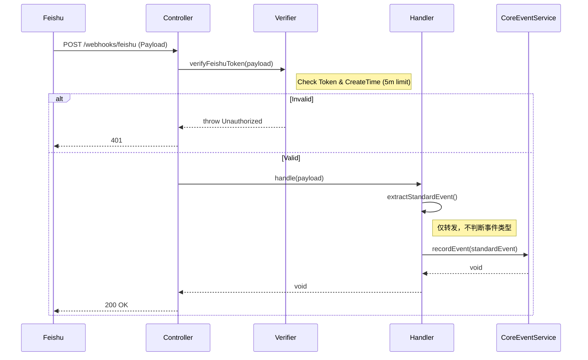

# Webhook Module 设计文档 v4.0

**文档版本**: v4.0  
**更新日期**: 2025-11-19  
**模块路径**: `src/core/webhook`  
**定位**: 纯粹的基础设施网关 (Infrastructure Gateway) - 专注于 HTTP 回调的接收与安全性验证，将原始数据无差别转发给 Core Meeting 模块，不包含任何业务路由逻辑。
**依赖关系**: 依赖 `src/core/meeting` 模块。

---

## 📂 1. 目录结构

```text
src/core/webhook/
├── controllers/
│   └── webhook-gateway.controller.ts    # HTTP入口
├── services/
│   └── webhook-verification.service.ts  # 签名/Token验证服务
├── handlers/
│   ├── feishu-webhook.handler.ts        # 飞书适配器 (极简)
│   ├── zoom-webhook.handler.ts          # Zoom适配器 (极简)
│   └── webhook-handler.registry.ts      # 注册表
├── extractors/
│   ├── feishu-event-extractor.ts        # 字段提取器
│   └── zoom-event-extractor.ts          # 字段提取器
└── dto/
    └── webhook-event.dto.ts             # DTO定义 (含 StandardEventDto)
```

---

## 💾 2. 数据流转

**原则**: Webhook 模块**不读取、不判断、不修改**业务状态。

*   **输入**: 第三方 HTTP POST 请求。
*   **输出**: 调用 `CoreMeeting.MeetingEventService.recordEvent()`。

---

## 🛠️ 3. 核心 Services 设计

### 3.1 WebhookGatewayController
**文件**: `src/core/webhook/controllers/webhook-gateway.controller.ts`  
**职责**: 统一接收端点，执行 Token 校验。

| 方法 | 参数 | 返回值 | 功能说明 |
| :--- | :--- | :--- | :--- |
| `handleFeishuWebhook` | `req, body` | `challenge?` | 1. 处理 `url_verification` 握手。<br>2. 调用 `verifyFeishuToken` 校验合法性。<br>3. 转发给 `FeishuWebhookHandler`。 |
| `handleZoomWebhook` | `req, body` | `void` | 1. 校验 Zoom Token。<br>2. 转发给 `ZoomWebhookHandler`。 |

### 3.2 WebhookVerificationService
**文件**: `src/core/webhook/services/webhook-verification.service.ts`  
**职责**: 安全性验证。

**策略**: 仅支持 **Verification Token** 模式 (更轻量)。

| 方法 | 参数 | 返回值 | 功能说明 |
| :--- | :--- | :--- | :--- |
| `verifyFeishuToken` | `payload` | `boolean` | 1. 检查 `payload.token` 是否匹配环境变量。<br>2. **检查 `payload.create_time`**: 计算当前时间与请求时间的差值，如果超过 300秒 (5分钟)，则拒绝请求以防止重放攻击。 |
| `verifyZoomToken` | `payload` | `boolean` | 检查 Zoom Verification Token。 |

### 3.3 Platform Handlers (Feishu/Zoom)
**文件**: `src/core/webhook/handlers/*.handler.ts`  
**职责**: 协议适配与转发。**不再包含任何 Switch-Case 路由逻辑。**

| 方法 | 参数 | 返回值 | 功能说明 |
| :--- | :--- | :--- | :--- |
| `handle(payload)` | `JSON` | `void` | 1. 调用 Extractor 提取标准字段 (meeting_no, event_type)。<br>2. **直接调用** `MeetingEventService.recordEvent()`。<br>3. 结束。 |

### 3.4 EventExtractor
**文件**: `src/core/webhook/extractors/*.extractor.ts`  
**职责**: 提取关键索引字段。

| 方法 | 参数 | 返回值 | 功能说明 |
| :--- | :--- | :--- | :--- |
| `extractStandardEvent` | `JSON` | `StandardEventDto` | 解析出 `meeting_no` 和 `event_type`，供 Core 模块后续索引使用。 |

---

## 📋 4. DTO 定义

### 4.1 StandardEventDto
**说明**: 这是 Webhook 模块标准化后的输出对象，也是传递给 Core Meeting 模块的唯一契约。

| 字段名 | 类型 | 必填 | 说明 |
| :--- | :--- | :--- | :--- |
| `meetingNo` | String | 是 | 统一的会议号 (e.g., "123456789") |
| `meetingId` | String | 否 | 平台原始 ID (如果 Payload 中有) |
| `eventType` | String | 是 | 原始事件类型 (e.g., "vc.meeting.meeting_ended_v1") |
| `provider` | Enum | 是 | `feishu` \| `zoom` |
| `eventData` | JSON | 是 | 完整的原始数据包 |
| `occurredAt` | Date | 是 | 事件发生时间 (第三方平台时间) |
| `operatorId` | String | 否 | 触发事件的用户ID |

---

## 🔄 5. 关键流程时序 (简化版)

### 5.1 事件接收流程


---

## ⚠️ 6. 架构变更说明 (对比 v3.x)

1.  **路由下沉**: 原 Webhook 中的 `switch (event_type)` 逻辑已全部移除。现在的 Webhook 模块是一个纯粹的“管道”。
2.  **职责单一**: Webhook 模块只负责“把门”（验签）和“翻译”（提取字段）。“进屋之后怎么走”（路由）完全由 Core Meeting 模块决定。
3.  **验证策略**: 统一为 Verification Token 模式，并增加了 **Timestamp Replay Check** (5分钟窗口) 以增强安全性。
