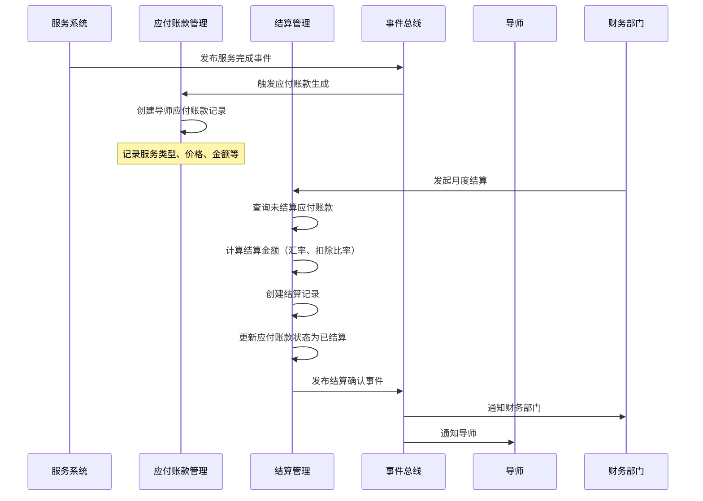
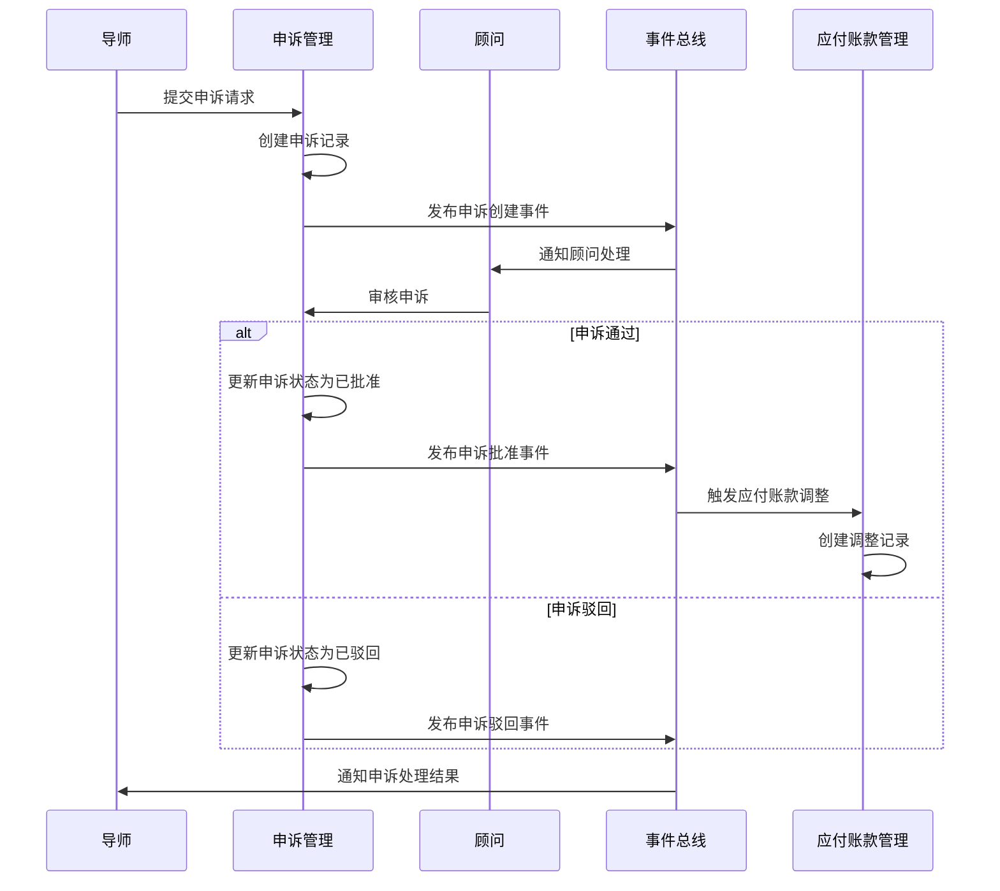

# Financial业务域设计文档

> **版本**: v2.0  
> **最后更新**: 2024-12-24  
> **状态**: 生产环境运行中

## 1. 业务架构Overview

### 1.1 业务定位
Financial业务域负责**导师服务的应付账款管理**，是平台财务管理的核心模块之一。该域专注于：
- 导师服务计费的自动化处理
- 导师价格配置管理
- 导师结算流程管理
- 导师申诉处理机制
- 导师支付信息管理

**重要说明**：Financial域仅处理**应付账款(AP - Accounts Payable)**，即平台应付给导师的款项。学生应收账款(AR)由其他域管理。

### 1.2 核心价值
- **精确计费**：基于实际服务时长和导师价格自动生成应付账款
- **多币种支持**：支持USD、CNY、EUR等多种货币的价格配置和结算
- **多支付方式**：支持国内转账、Gusto、支票等5种结算方式
- **数据完整性**：采用append-only模式，确保财务记录不可篡改
- **透明申诉**：提供完整的申诉提交、审批、驳回流程
- **自动化结算**：支持按月批量结算，自动计算汇率和扣除

### 1.3 架构设计原则

#### 1.3.1 不可变记录(Immutable Records)
- **Append-Only模式**：所有财务表只允许INSERT操作，禁止UPDATE/DELETE
- **无更新字段**：财务核心表无`updatedAt`/`updatedBy`字段
- **链式调整**：通过创建新记录实现账款调整，保持完整审计链

#### 1.3.2 防腐层设计(Anti-Corruption Layer)
- **无外键约束**：使用UUID字符串引用，避免跨域数据库约束
- **注释说明**：通过代码注释标注逻辑外键关系
- **降低耦合**：各域可独立部署和演进

#### 1.3.3 事件驱动(Event-Driven)
- **状态变更事件**：所有关键操作发布集成事件
- **异步处理**：支持事件驱动的异步业务流程
- **系统集成**：通过事件实现与其他域的松耦合集成

#### 1.3.4 幂等性设计(Idempotency)
- **唯一约束**：通过数据库唯一索引防止重复计费
- **重复检测**：业务层实现重复事件检测逻辑
- **安全重试**：确保操作可安全重试

#### 1.3.5 精确计算(Precise Calculation)
- **整数运算**：金额计算转换为分(cents)进行整数运算
- **避免浮点误差**：防止浮点数精度问题
- **四舍五入策略**：明确的舍入规则确保一致性

### 1.4 系统架构图

```
┌────────────────────────────────────────────────────────────────────────────────┐
│                            Financial Domain (财务域)                            │
│                         Accounts Payable Management (应付账款管理)              │
├─────────────────┬──────────────────┬──────────────────┬────────────────────────┤
│  导师价格管理    │   应付账款管理    │    结算管理       │   导师申诉管理          │
│  Mentor Price   │  Mentor Payable  │   Settlement     │   Mentor Appeal        │
├─────────────────┼──────────────────┼──────────────────┼────────────────────────┤
│ Services:       │ Services:        │ Services:        │ Services:              │
│ · MentorPrice   │ · MentorPayable  │ · Settlement     │ · MentorAppeal         │
│   Service       │   Service        │   Service        │   Service              │
│                 │                  │ · MentorPayment  │                        │
│                 │                  │   InfoService    │                        │
│                 │                  │ · MentorPayment  │                        │
│                 │                  │   ParamService   │                        │
├─────────────────┼──────────────────┼──────────────────┼────────────────────────┤
│ Schemas:        │ Schemas:         │ Schemas:         │ Schemas:               │
│ · mentor_prices │ · mentor_payable │ · settlement_    │ · mentor_appeals       │
│ · class_mentors │   _ledgers       │   ledgers        │                        │
│   _prices       │                  │ · settlement_    │                        │
│                 │                  │   details        │                        │
│                 │                  │ · mentor_payment │                        │
│                 │                  │   _infos         │                        │
│                 │                  │ · payment_params │                        │
└─────────────────┴──────────────────┴──────────────────┴────────────────────────┘
         │                    │                    │                      │
         └────────────────────┴────────────────────┴──────────────────────┘
                                        │
                                        ▼
                    ┌───────────────────────────────────────┐
                    │        Integration Event Bus          │
                    │         (集成事件总线)                 │
                    └───────────────────────────────────────┘
                                        │
                    ┌───────────────────┴───────────────────┐
                    ▼                                       ▼
         ┌────────────────────┐                ┌────────────────────┐
         │  Services Domain   │                │  Contract Domain   │
         │  (服务域)           │                │  (合同域)           │
         │  - Session Events  │                │  - Service Holds   │
         │  - Class Events    │                │  - Entitlements    │
         └────────────────────┘                └────────────────────┘
```

**架构说明**：
- **服务层(Services)**：实现核心业务逻辑，提供对外接口
- **数据层(Schemas)**：定义数据模型和表结构
- **事件总线(Event Bus)**：实现域间异步通信
- **外部集成**：通过事件与Services域、Contract域集成

## 2. 功能模块详细划分及职责说明

### 2.1 导师价格管理(Mentor Price Management)

**模块定位**：导师服务定价配置中心，为计费提供价格依据

**核心职责**：
- 管理导师针对不同服务类型的价格配置
- 支持一对一辅导和班课两种定价模式
- 提供价格查询和批量管理能力
- 维护价格配置的生命周期状态

**核心功能**：
| 功能 | 说明 | 实现方法 |
|------|------|---------|
| 创建价格 | 为导师创建新的服务价格配置 | `createMentorPrice()` |
| 更新价格 | 修改现有价格配置 | `updateMentorPrice()` |
| 批量创建 | 批量创建多个导师价格 | `batchCreateMentorPrices()` |
| 批量更新 | 批量更新多个价格配置 | `batchUpdateMentorPrices()` |
| 价格查询 | 根据导师和服务类型查询价格 | `getMentorPrice()` |
| 状态管理 | 激活/停用价格配置 | `updateMentorPriceStatus()` |
| 分页搜索 | 支持多条件筛选和分页 | `searchMentorPrices()` |

**关键类**：
- `MentorPriceService` - 一对一辅导价格管理服务
- `ClassMentorPriceService` - 班课价格管理服务(未实现)

**数据表**：
- `mentor_prices` - 一对一辅导价格表
- `class_mentors_prices` - 班课导师价格表

**业务规则**：
1. 同一导师的同一服务类型只能有一个active状态的价格配置
2. 价格精度：12位总长度，1位小数
3. 支持USD、CNY、EUR等多种货币
4. 价格更新需记录操作人(`updatedBy`)

---

### 2.2 应付账款管理(Mentor Payable Management)

**模块定位**：导师服务计费核心，自动生成应付账款记录

**核心职责**：
- 监听服务完成事件，自动生成应付账款
- 支持按时长计费(一对一辅导)和按次计费(班课、推荐信等)
- 提供账款调整机制，支持链式调整
- 实现幂等性，防止重复计费

**核心功能**：
| 功能 | 说明 | 实现方法 |
|------|------|---------|
| 按会话计费 | 根据实际时长生成应付账款 | `createPerSessionBilling()` |
| 推荐信计费 | 推荐信服务计费(未实现) | - |
| 岗位推荐计费 | 岗位推荐服务计费 | `createPlacementBilling()` |
| 账款调整 | 创建调整记录(支持正负金额) | `adjustPayableLedger()` |
| 重复检测 | 检查是否已存在计费记录 | `isDuplicate()` |
| 调整链查询 | 查询账款的所有调整记录 | `getAdjustmentChain()` |

**关键类**：
- `MentorPayableService` - 应付账款核心服务
- `MentorPayableLedgerMapper` - 数据映射器
- `DrizzleMentorPayableLedgerRepository` - 数据仓储

**数据表**：
- `mentor_payable_ledgers` - 应付账款流水表(append-only)

**业务规则**：
1. **幂等性**：同一`referenceId`只能有一条原始计费记录(`originalId` IS NULL)
2. **链式调整**：调整记录通过`originalId`关联到原始记录
3. **已结算账款不可调整**：有`settlementId`的记录禁止调整
4. **精确计算**：金额计算使用整数运算(转换为分)
5. **时长计费**：按实际时长(`actualDurationMinutes`)计算，单位转换为小时

**计费公式**：
```
按时长计费: amount = (actualDurationMinutes / 60) * price
按次计费:   amount = price
```

---

### 2.3 结算管理(Settlement Management)

**模块定位**：导师月度结算处理中心，支持跨币种结算

**核心职责**：
- 生成导师月度结算单
- 支持汇率转换和扣除计算
- 管理结算明细和关联关系
- 更新应付账款结算状态

**核心功能**：
| 功能 | 说明 | 实现方法 |
|------|------|---------|
| 生成结算 | 创建月度结算记录 | `generateSettlement()` |
| 结算查询 | 按ID查询结算详情 | `getSettlementById()` |
| 导师月度查询 | 查询导师指定月份结算 | `getSettlementByMentorAndMonth()` |
| 分页查询 | 支持多条件筛选 | `findSettlements()` |
| 明细查询 | 查询结算包含的账款明细 | `getSettlementDetails()` |

**关键类**：
- `SettlementService` - 结算核心服务
- `MentorPaymentInfoService` - 导师支付信息服务
- `MentorPaymentParamService` - 支付参数服务(未实现)

**数据表**：
- `settlement_ledgers` - 结算记录表(append-only)
- `settlement_details` - 结算明细关联表
- `mentor_payment_infos` - 导师支付信息表
- `payment_params` - 支付参数表(未使用)

**业务规则**：
1. **唯一性**：同一导师同一月份只能有一条结算记录
2. **并发控制**：使用`SELECT FOR UPDATE SKIP LOCKED`防止并发结算
3. **状态固定**：结算记录创建后状态固定为`CONFIRMED`
4. **精确计算**：使用整数运算避免浮点误差
5. **账款锁定**：结算时更新账款的`settlementId`和`settledAt`

**结算计算公式**：
```
targetAmount = originalAmount × (1 - deductionRate) × exchangeRate
```

**支持的结算方式**：
- `DOMESTIC_TRANSFER` - 国内转账
- `CHANNEL_BATCH_PAY` - 渠道批量支付
- `GUSTO` - Gusto工资系统
- `GUSTO_INTERNATIONAL` - Gusto国际支付
- `CHECK` - 支票支付

---

### 2.4 导师支付信息管理(Mentor Payment Info Management)

**模块定位**：导师收款信息配置中心

**核心职责**：
- 管理导师的支付方式和账户信息
- 支持多种支付方式的详细信息存储
- 提供支付信息验证功能
- 维护支付信息的状态管理

**核心功能**：
| 功能 | 说明 | 实现方法 |
|------|------|---------|
| 创建/更新 | 创建或更新导师支付信息 | `createOrUpdateMentorPaymentInfo()` |
| 信息查询 | 查询导师的有效支付信息 | `getMentorPaymentInfo()` |
| 状态管理 | 启用/禁用支付信息 | `updateStatus()` |
| 信息验证 | 验证支付信息完整性 | `validateMentorPaymentInfo()` |

**关键类**：
- `MentorPaymentInfoService` - 支付信息管理服务
- `MentorPaymentInfoMapper` - 数据映射器
- `DrizzleMentorPaymentInfoRepository` - 数据仓储

**数据表**：
- `mentor_payment_infos` - 导师支付信息表

**业务规则**：
1. 每个导师只能有一条`ACTIVE`状态的支付信息
2. 支付详情使用JSONB存储，支持灵活的字段配置
3. 不同支付方式需要不同的必填字段验证

**支付方式字段要求**：
```typescript
DOMESTIC_TRANSFER: {
  bankName: string;
  accountNumber: string;
  accountHolder: string;
}

GUSTO/GUSTO_INTERNATIONAL: {
  employeeId: string;
  companyId: string;
}

CHECK: {
  payee: string;
  address: string;
}
```

---

### 2.5 导师申诉管理(Mentor Appeal Management)

**模块定位**：导师费用争议处理中心

**核心职责**：
- 处理导师对服务费用的申诉
- 管理申诉的审批和驳回流程
- 发布申诉相关事件
- 提供申诉查询和统计

**核心功能**：
| 功能 | 说明 | 实现方法 |
|------|------|---------|
| 创建申诉 | 导师提交新申诉 | `createAppeal()` |
| 查询申诉 | 查询单个申诉详情 | `findOne()` |
| 搜索申诉 | 分页搜索申诉列表 | `search()` |
| 批准申诉 | 顾问批准申诉 | `approveAppeal()` |
| 驳回申诉 | 顾问驳回申诉 | `rejectAppeal()` |

**关键类**：
- `MentorAppealService` - 申诉管理核心服务

**数据表**：
- `mentor_appeals` - 导师申诉表

**业务规则**：
1. **权限控制**：只有分配的顾问(`counselorId`)可以处理申诉
2. **状态流转**：`PENDING` → `APPROVED` 或 `REJECTED`
3. **创建者验证**：`mentorId`必须与`createdBy`一致
4. **金额更新**：批准时可更新申诉金额(如原金额无效)
5. **事件发布**：状态变更时发布相应事件

**申诉类型**：
- `billing_error` - 计费错误
- `missing_service` - 遗漏服务记录
- `price_dispute` - 价格争议
- `other` - 其他

**发布的事件**：
- `MentorAppealCreatedEvent` - 申诉创建
- `MentorAppealApprovedEvent` - 申诉批准
- `MentorAppealRejectedEvent` - 申诉驳回

## 3. 核心业务流程

### 3.1 导师服务结算流程



### 3.2 导师申诉处理流程



## 4. 数据模型设计

### 4.1 导师价格表 (mentor_prices)

**表说明**：存储导师针对不同服务类型的价格配置，支持价格更新和状态管理

**设计原则**：
- 允许UPDATE操作(非append-only)
- 同一导师同一服务类型只能有一个active价格
- 记录变更人但不记录变更原因

| 字段名 | 类型 | 描述 | 约束 | 说明 |
|--------|------|------|------|------|
| id | UUID | 记录ID | 主键 | 自动生成 |
| mentor_user_id | UUID | 导师用户ID | 非空 | 引用user.id |
| service_type_id | VARCHAR(50) | 服务类型ID | 可空 | **已废弃**，使用session_type_code |
| session_type_code | VARCHAR(50) | 会话类型代码 | 可空 | 引用session_types.code |
| package_code | VARCHAR(50) | 课程包编码 | 可空 | 预留字段 |
| price | NUMERIC(12,1) | 价格金额 | 非空 | 精度：12位总长度，1位小数 |
| currency | VARCHAR(3) | 货币代码 | 非空，默认USD | ISO 4217格式 |
| status | VARCHAR(20) | 状态 | 非空，默认active | 值：active, inactive |
| updated_by | UUID | 变更人用户ID | 可空 | 引用user.id |
| created_at | TIMESTAMPTZ | 创建时间 | 非空，默认NOW() | 带时区 |
| updated_at | TIMESTAMPTZ | 更新时间 | 非空，默认NOW() | 带时区，自动更新 |

**索引**：
```sql
CREATE INDEX idx_mentor_session_type_status 
  ON mentor_prices(mentor_user_id, session_type_code, status);
CREATE INDEX idx_mentor_prices_mentor ON mentor_prices(mentor_user_id);
CREATE INDEX idx_mentor_prices_session_type ON mentor_prices(session_type_code);
CREATE INDEX idx_mentor_prices_status ON mentor_prices(status);
```

**业务约束**：
- 唯一性：同一`mentor_user_id` + `session_type_code`只能有一个`status='active'`的记录
- 价格范围：price > 0
- 货币格式：3位大写字母

**真实数据示例**：
```json
{
  "id": "bdfe9a3c-8286-4cce-b9c5-dd6657425a96",
  "mentor_user_id": "019a807d-5c91-72f4-9d14-2b8fb6261a38",
  "session_type_code": null,
  "price": "150.0",
  "currency": "USD",
  "status": "active",
  "updated_by": "019a807d-5c91-72f4-9d14-2b8fb6261a38",
  "created_at": "2025-11-14T05:25:57.949Z",
  "updated_at": "2025-11-14T05:25:57.949Z"
}
```

### 4.2 班级导师价格表 (class_mentors_prices)

**表说明**：存储班课导师的每节课价格配置，与班级和导师关联

**设计原则**：
- 允许UPDATE操作
- 与classes表有外键约束
- 价格使用整数存储(单位：元)

| 字段名 | 类型 | 描述 | 约束 | 说明 |
|--------|------|------|------|------|
| id | UUID | 记录ID | 主键 | 自动生成 |
| class_id | UUID | 班级ID | 非空，FK→classes.id | 外键约束 |
| mentor_user_id | UUID | 导师用户ID | 非空 | 引用user.id |
| price_per_session | INTEGER | 每节课价格 | 非空，≥0 | 整数，单位：元 |
| status | VARCHAR(20) | 状态 | 非空，默认active | 值：active, inactive |
| created_at | TIMESTAMPTZ | 创建时间 | 非空，默认NOW() | 带时区 |
| updated_at | TIMESTAMPTZ | 更新时间 | 非空，默认NOW() | 带时区，自动更新 |

**外键约束**：
```sql
ALTER TABLE class_mentors_prices 
  ADD CONSTRAINT class_mentors_prices_class_id_fkey 
  FOREIGN KEY (class_id) REFERENCES classes(id);
```

**业务约束**：
- 唯一性：同一`class_id` + `mentor_user_id`只能有一条记录
- 价格范围：price_per_session >= 0

**真实数据示例**：
```json
{
  "id": "fe71f784-8b5f-4e5c-ae36-431f29d1b1bf",
  "class_id": "92eeaad2-091b-4fc8-a3fd-55bcdd98f236",
  "mentor_user_id": "4903b94b-67cc-42a1-9b3e-91ebc51bcefc",
  "price_per_session": 180,
  "status": "active",
  "created_at": "2025-12-10T11:42:34.819Z",
  "updated_at": "2025-12-10T11:46:28.081Z"
}
```

### 4.3 导师应付账款流水表 (mentor_payable_ledgers)

**表说明**：记录导师服务产生的应付账款，采用append-only设计，支持链式调整

**设计原则**：
- **Append-Only**：只允许INSERT，禁止UPDATE/DELETE
- **防腐层**：无外键约束，使用UUID字符串引用
- **链式调整**：通过`original_id`实现多次调整
- **幂等性**：原始记录的`reference_id`唯一

| 字段名 | 类型 | 描述 | 约束 | 说明 |
|--------|------|------|------|------|
| id | UUID | 记录ID | 主键 | 自动生成 |
| reference_id | UUID | 关联ID | 非空 | 引用service_references.id或session.id |
| mentor_id | UUID | 导师ID | 非空 | 引用mentor.id(逻辑外键) |
| student_id | UUID | 学生ID | 可空 | 引用student.id(逻辑外键) |
| service_type_id | VARCHAR(50) | 服务类型ID | 可空 | **已废弃**，使用session_type_code |
| session_type_code | VARCHAR(50) | 会话类型代码 | 可空 | 引用session_types.code |
| price | NUMERIC(12,1) | 单价 | 非空 | 精度：12位总长度，1位小数 |
| amount | NUMERIC(12,2) | 总金额 | 非空 | 可为负值(调整记录) |
| currency | VARCHAR(3) | 货币代码 | 非空，默认USD | ISO 4217格式 |
| original_id | UUID | 原始记录ID | 可空 | 指向被调整的记录，支持链式调整 |
| adjustment_reason | VARCHAR(500) | 调整原因 | 可空 | original_id不为空时必填 |
| settlement_id | UUID | 结算ID | 可空 | 关联到settlement_ledgers.id |
| settled_at | TIMESTAMPTZ | 结算时间 | 可空 | 账款被纳入结算的时间 |
| created_at | TIMESTAMPTZ | 创建时间 | 非空，默认NOW() | 不可变 |
| created_by | UUID | 创建人 | 可空 | 引用user.id(逻辑外键) |

**唯一索引**：
```sql
-- 确保原始记录的reference_id唯一
CREATE UNIQUE INDEX idx_mentor_payable_reference 
  ON mentor_payable_ledgers(reference_id) 
  WHERE original_id IS NULL;
```

**查询优化索引**：
```sql
CREATE INDEX idx_mentor_payable_mentor ON mentor_payable_ledgers(mentor_id);
CREATE INDEX idx_mentor_payable_session_type ON mentor_payable_ledgers(session_type_code);
CREATE INDEX idx_mentor_payable_original 
  ON mentor_payable_ledgers(original_id) 
  WHERE original_id IS NOT NULL;
CREATE INDEX idx_mentor_payable_settlement 
  ON mentor_payable_ledgers(settlement_id) 
  WHERE settlement_id IS NOT NULL;
```

**业务约束**：
- 幂等性：同一`reference_id`只能有一条`original_id IS NULL`的记录
- 调整链：`original_id`指向的记录必须存在
- 结算锁定：有`settlement_id`的记录不允许调整
- 金额精度：amount精度为2位小数

**链式调整示例**：
```
原始记录: id=A, reference_id=R1, amount=100, original_id=NULL
调整1:    id=B, reference_id=R1, amount=-10, original_id=A
调整2:    id=C, reference_id=R1, amount=5,   original_id=A
净金额:   100 - 10 + 5 = 95
```

**真实数据示例**：
```json
{
  "id": "28533a06-c152-46b2-8eb6-596e68427d08",
  "reference_id": "09ff4c15-2a50-4512-ba93-2f1f64f1bab7",
  "mentor_id": "2d064d3b-d3a0-48a1-ae53-5b7866b8d5f9",
  "student_id": "f2c3737c-1b37-4736-8633-251731ddcdec",
  "session_type_code": "Internal",
  "price": "100.0",
  "amount": "90.00",
  "currency": "USD",
  "original_id": null,
  "adjustment_reason": null,
  "settlement_id": null,
  "settled_at": null,
  "created_at": "2025-11-19T09:59:46.727Z",
  "created_by": "2d064d3b-d3a0-48a1-ae53-5b7866b8d5f9"
}
```

### 4.4 结算记录表 (settlement_ledgers)

**表说明**：记录导师月度结算信息，支持跨币种结算和扣除计算

**设计原则**：
- **Append-Only**：只允许INSERT，禁止UPDATE/DELETE
- **状态固定**：所有记录状态固定为`CONFIRMED`
- **唯一性约束**：同一导师同一月份只能有一条结算
- **精确计算**：存储计算参数(汇率、扣除率)便于审计

| 字段名 | 类型 | 描述 | 约束 | 说明 |
|--------|------|------|------|------|
| id | UUID | 主键 | 主键 | 自动生成 |
| mentor_id | UUID | 导师ID | 非空 | 引用mentor.id(逻辑外键) |
| settlement_month | VARCHAR(7) | 结算月份 | 非空，格式YYYY-MM | 如：2024-01 |
| original_amount | NUMERIC(15,2) | 原始金额 | 非空 | 转换前的金额 |
| target_amount | NUMERIC(15,2) | 目标金额 | 非空 | 转换后的金额 |
| original_currency | VARCHAR(3) | 原始币种 | 非空 | ISO 4217格式 |
| target_currency | VARCHAR(3) | 目标币种 | 非空 | ISO 4217格式 |
| exchange_rate | NUMERIC(10,1) | 汇率 | 非空 | 精度：10位总长度，1位小数 |
| deduction_rate | NUMERIC(5,4) | 扣除比率 | 非空 | 如：0.0500表示5% |
| status | VARCHAR(20) | 状态 | 非空，默认CONFIRMED | 固定值：CONFIRMED |
| settlement_method | VARCHAR(50) | 结算方式 | 非空 | 见下方枚举值 |
| mentor_payment_info_id | UUID | 导师支付信息ID | 非空 | 引用mentor_payment_infos.id |
| created_at | TIMESTAMPTZ | 创建时间 | 非空，默认NOW() | 不可变 |
| created_by | UUID | 创建人 | 非空 | 引用user.id(逻辑外键) |

**唯一索引**：
```sql
-- 防止同一导师同一月份重复结算
CREATE UNIQUE INDEX idx_settlement_mentor_month 
  ON settlement_ledgers(mentor_id, settlement_month);
```

**查询优化索引**：
```sql
CREATE INDEX idx_settlement_mentor ON settlement_ledgers(mentor_id);
CREATE INDEX idx_settlement_month ON settlement_ledgers(settlement_month);
CREATE INDEX idx_settlement_status ON settlement_ledgers(status);
CREATE INDEX idx_settlement_created_at ON settlement_ledgers(created_at);
```

**结算方式枚举**：
- `DOMESTIC_TRANSFER` - 国内转账
- `CHANNEL_BATCH_PAY` - 渠道批量支付
- `GUSTO` - Gusto工资系统
- `GUSTO_INTERNATIONAL` - Gusto国际支付
- `CHECK` - 支票支付

**计算公式**：
```
target_amount = original_amount × (1 - deduction_rate) × exchange_rate
```

**业务约束**：
- 唯一性：同一`mentor_id` + `settlement_month`只能有一条记录
- 汇率范围：exchange_rate > 0
- 扣除范围：0 <= deduction_rate <= 1

---

### 4.5 结算明细关联表 (settlement_details)

**表说明**：建立结算记录与应付账款的多对多关联关系

**设计原则**：
- **Append-Only**：只允许INSERT
- **关联表**：连接settlement_ledgers和mentor_payable_ledgers
- **审计追踪**：记录创建人和创建时间

| 字段名 | 类型 | 描述 | 约束 | 说明 |
|--------|------|------|------|------|
| id | UUID | 主键 | 主键 | 自动生成 |
| settlement_id | UUID | 结算记录ID | 非空 | 引用settlement_ledgers.id |
| mentor_payable_id | UUID | 导师应付账款ID | 非空 | 引用mentor_payable_ledgers.id |
| original_amount | NUMERIC(12,2) | 原始金额 | 非空 | 该账款的原始金额 |
| target_amount | NUMERIC(12,2) | 目标金额 | 非空 | 该账款转换后的金额 |
| exchange_rate | NUMERIC(10,1) | 汇率 | 非空 | 该账款使用的汇率 |
| deduction_rate | NUMERIC(5,4) | 扣除比率 | 非空 | 该账款的扣除比率 |
| created_at | TIMESTAMPTZ | 创建时间 | 非空，默认NOW() | 不可变 |
| created_by | UUID | 创建人 | 非空 | 引用user.id(逻辑外键) |

**业务约束**：
- 关联完整性：`settlement_id`和`mentor_payable_id`必须存在
- 一致性：明细的`original_amount`和`target_amount`之和应等于结算记录的对应金额

### 4.6 导师支付信息表 (mentor_payment_infos)

| 字段名 | 类型 | 描述 | 约束 |
|--------|------|------|------|
| id | UUID | 主键 | 主键 |
| mentorId | UUID | 导师ID | 非空 |
| paymentCurrency | VARCHAR(3) | 支付币种 | 非空 |
| paymentMethod | VARCHAR(50) | 支付方式 | 非空 |
| paymentDetails | JSONB | 支付详情 | 非空 |
| status | VARCHAR(20) | 状态 | 非空，默认ACTIVE |
| createdAt | TIMESTAMP | 创建时间 | 非空，默认当前时间 |
| updatedAt | TIMESTAMP | 更新时间 | 非空，默认当前时间 |
| createdBy | UUID | 创建人 | 可空 |
| updatedBy | UUID | 更新人 | 可空 |

### 4.7 导师申诉表 (mentor_appeals)

| 字段名 | 类型 | 描述 | 约束 |
|--------|------|------|------|
| id | UUID | 主键 | 主键 |
| mentorId | UUID | 导师ID | 非空 |
| counselorId | UUID | 处理顾问ID | 非空 |
| studentId | UUID | 学生ID | 非空 |
| mentorPayableId | UUID | 关联应付账款ID | 可空 |
| settlementId | UUID | 关联结算ID | 可空 |
| appealType | VARCHAR(50) | 申诉类型 | 非空 |
| appealAmount | NUMERIC(12,2) | 申诉金额 | 非空 |
| currency | VARCHAR(3) | 货币类型 | 非空，默认USD |
| reason | TEXT | 申诉理由 | 非空 |
| title | VARCHAR(255) | 服务标题 | 可空 |
| status | VARCHAR(20) | 申诉状态 | 非空，默认PENDING |
| rejectionReason | TEXT | 驳回理由 | 可空 |
| comments | TEXT | 申诉评论 | 可空 |
| approvedBy | UUID | 审批人ID | 可空 |
| approvedAt | TIMESTAMP | 审批时间 | 可空 |
| rejectedBy | UUID | 驳回人ID | 可空 |
| rejectedAt | TIMESTAMP | 驳回时间 | 可空 |
| createdBy | UUID | 创建人ID | 非空 |
| createdAt | TIMESTAMP | 创建时间 | 非空，默认当前时间 |

## 5. 接口定义规范

### 5.1 导师价格管理接口

#### 5.1.1 创建导师价格
- **接口路径**: POST /api/financial/mentor-prices
- **请求体**:
  ```json
  {
    "mentorUserId": "uuid",
    "sessionTypeCode": "string",
    "price": 100.0,
    "currency": "USD",
    "status": "active"
  }
  ```
- **响应体**:
  ```json
  {
    "id": "uuid",
    "mentorUserId": "uuid",
    "sessionTypeCode": "string",
    "price": 100.0,
    "currency": "USD",
    "status": "active",
    "createdAt": "2023-01-01T00:00:00Z",
    "updatedAt": "2023-01-01T00:00:00Z"
  }
  ```

#### 5.1.2 更新导师价格
- **接口路径**: PUT /api/financial/mentor-prices/{id}
- **请求体**:
  ```json
  {
    "price": 120.0,
    "status": "active"
  }
  ```
- **响应体**: 同创建接口

#### 5.1.3 查询导师价格
- **接口路径**: GET /api/financial/mentor-prices
- **查询参数**:
  - mentorUserId: 导师ID
  - sessionTypeCode: 会话类型代码
  - status: 状态
- **响应体**:
  ```json
  {
    "data": [
      {
        "id": "uuid",
        "mentorUserId": "uuid",
        "sessionTypeCode": "string",
        "price": 100.0,
        "currency": "USD",
        "status": "active",
        "createdAt": "2023-01-01T00:00:00Z",
        "updatedAt": "2023-01-01T00:00:00Z"
      }
    ],
    "total": 1,
    "page": 1,
    "pageSize": 10,
    "totalPages": 1
  }
  ```

### 5.2 结算管理接口

#### 5.2.1 生成结算
- **接口路径**: POST /api/financial/settlements
- **请求体**:
  ```json
  {
    "mentorId": "uuid",
    "settlementMonth": "2023-01",
    "exchangeRate": 7.0,
    "deductionRate": 0.1
  }
  ```
- **响应体**:
  ```json
  {
    "id": "uuid",
    "mentorId": "uuid",
    "settlementMonth": "2023-01",
    "originalAmount": 1000.0,
    "targetAmount": 6300.0,
    "originalCurrency": "USD",
    "targetCurrency": "CNY",
    "exchangeRate": 7.0,
    "deductionRate": 0.1,
    "status": "CONFIRMED",
    "settlementMethod": "DOMESTIC_TRANSFER",
    "createdAt": "2023-02-01T00:00:00Z",
    "createdBy": "uuid"
  }
  ```

#### 5.2.2 查询结算记录
- **接口路径**: GET /api/financial/settlements
- **查询参数**:
  - mentorId: 导师ID
  - settlementMonth: 结算月份
  - startDate: 开始日期
  - endDate: 结束日期
  - page: 页码
  - pageSize: 每页大小
- **响应体**:
  ```json
  {
    "data": [
      {
        "id": "uuid",
        "mentorId": "uuid",
        "settlementMonth": "2023-01",
        "originalAmount": 1000.0,
        "targetAmount": 6300.0,
        "originalCurrency": "USD",
        "targetCurrency": "CNY",
        "exchangeRate": 7.0,
        "deductionRate": 0.1,
        "status": "CONFIRMED",
        "settlementMethod": "DOMESTIC_TRANSFER",
        "createdAt": "2023-02-01T00:00:00Z",
        "createdBy": "uuid"
      }
    ],
    "total": 1,
    "page": 1,
    "pageSize": 10,
    "totalPages": 1
  }
  ```

### 5.3 导师申诉接口

#### 5.3.1 提交申诉
- **接口路径**: POST /api/financial/appeals
- **请求体**:
  ```json
  {
    "mentorId": "uuid",
    "counselorId": "uuid",
    "studentId": "uuid",
    "appealType": "billing_error",
    "appealAmount": 100.0,
    "currency": "USD",
    "reason": "计费错误",
    "mentorPayableId": "uuid"
  }
  ```
- **响应体**:
  ```json
  {
    "id": "uuid",
    "mentorId": "uuid",
    "counselorId": "uuid",
    "studentId": "uuid",
    "appealType": "billing_error",
    "appealAmount": 100.0,
    "currency": "USD",
    "reason": "计费错误",
    "mentorPayableId": "uuid",
    "status": "PENDING",
    "createdAt": "2023-01-01T00:00:00Z",
    "createdBy": "uuid"
  }
  ```

#### 5.3.2 批准申诉
- **接口路径**: PUT /api/financial/appeals/{id}/approve
- **请求体**:
  ```json
  {
    "appealAmount": 200.5,
    "currency": "EUR",
    "comments": "更新申诉金额"
  }
  ```
- **响应体**:
  ```json
  {
    "id": "uuid",
    "status": "APPROVED",
    "approvedAt": "2023-01-02T00:00:00Z",
    "approvedBy": "uuid"
  }
  ```

## 6. 业务逻辑实现分析评估

### 6.1 架构设计优势

#### 6.1.1 不可变记录设计(Immutable Records)
**实现方式**：
- 财务核心表(mentor_payable_ledgers, settlement_ledgers)采用append-only模式
- 无`updatedAt`/`updatedBy`字段
- 数据库层面无UPDATE/DELETE操作

**优势**：
- ✅ **审计追踪完整**：所有财务变更都有完整记录
- ✅ **数据不可篡改**：防止财务数据被恶意修改
- ✅ **历史可追溯**：通过链式调整记录完整变更历史
- ✅ **符合财务合规要求**：满足财务审计标准

**代码证据**：
```typescript
// mentor-payable-ledgers.schema.ts
// 无 updatedAt/updatedBy 字段
export const mentorPayableLedgers = pgTable("mentor_payable_ledgers", {
  createdAt: timestamp("created_at").defaultNow().notNull(),
  // No updatedAt field
});
```

#### 6.1.2 事件驱动架构(Event-Driven Architecture)
**实现方式**：
- 所有关键操作发布集成事件
- 使用`IntegrationEventPublisher`统一发布
- 事件命名遵循`{domain}.{aggregate}.{action}`格式

**优势**：
- ✅ **松耦合集成**：域间通过事件通信，降低耦合度
- ✅ **异步处理**：支持异步业务流程
- ✅ **可扩展性强**：易于添加新的事件订阅者
- ✅ **系统可观测**：事件日志提供完整的业务流追踪

**已实现事件**：
- `MentorAppealCreatedEvent` - 申诉创建
- `MentorAppealApprovedEvent` - 申诉批准
- `MentorAppealRejectedEvent` - 申诉驳回
- `SettlementConfirmedEvent` - 结算确认

#### 6.1.3 精确计算(Precise Calculation)
**实现方式**：
- 金额转换为分(cents)进行整数运算
- 使用`Math.round()`进行四舍五入
- 先计算明细金额，再求和得到头金额

**优势**：
- ✅ **避免浮点误差**：整数运算完全精确
- ✅ **一致性保证**：头金额等于明细之和
- ✅ **审计友好**：计算过程可验证

**代码证据**：
```typescript
// settlement.service.ts
const detailCalculations = payableLedgers.map((ledger) => {
  const originalAmtCents = Math.round(Number(ledger.amount) * 100);
  const targetAmtCents = Math.round(
    originalAmtCents * (1 - deductionRateNum) * exchangeRateNum
  );
  return {
    originalAmount: originalAmtCents / 100,
    targetAmount: targetAmtCents / 100,
  };
});
```

#### 6.1.4 幂等性设计(Idempotency)
**实现方式**：
- 数据库唯一索引(`idx_mentor_payable_reference`)
- 业务层重复检测(`isDuplicate()`)
- 事件处理前检查重复

**优势**：
- ✅ **防止重复计费**：同一服务只计费一次
- ✅ **安全重试**：事件可安全重试
- ✅ **数据一致性**：避免重复记录

**代码证据**：
```typescript
// service-session-completed-listener.ts
if (await this.mentorPayableService.isDuplicate(referenceId)) {
  this.logger.warn(`Duplicate billing detected for referenceId: ${referenceId}`);
  return;
}
```

#### 6.1.5 防腐层设计(Anti-Corruption Layer)
**实现方式**：
- 无外键约束，使用UUID字符串引用
- 代码注释标注逻辑外键关系
- 数据快照存储，避免跨域查询

**优势**：
- ✅ **域独立演进**：各域可独立部署和版本升级
- ✅ **降低耦合**：无数据库级别依赖
- ✅ **性能优化**：减少跨表JOIN查询

---

### 6.2 潜在问题识别与分析

#### 6.2.1 ⚠️ 价格变更与历史账款不一致
**问题描述**：
- 导师价格更新时，已创建的应付账款记录不会自动更新
- 已创建但未结算的账款仍使用旧价格
- 无价格变更事件通知机制

**影响分析**：
- 导师可能对历史账款金额产生疑问
- 价格调整后的期望与实际不符
- 缺少价格变更历史追溯

**风险等级**：🟡 中等

**代码证据**：
```typescript
// mentor-price.service.ts
public async updateMentorPrice(id: string, dto: UpdateMentorPriceRequestDto) {
  // 直接更新价格，无事件发布
  const [updatedPrice] = await this.db
    .update(schema.mentorPrices)
    .set({ price: dto.price })
    .returning();
  // 未通知已存在的未结算账款
}
```

**现状评估**：
- ✅ 设计合理：账款记录价格快照是正确的
- ❌ 缺少通知：无价格变更事件
- ❌ 文档不足：未明确说明价格变更策略

---

#### 6.2.2 ⚠️ 并发结算性能瓶颈
**问题描述**：
- 使用`SELECT FOR UPDATE SKIP LOCKED`防止并发结算
- 在导师数量大、结算频繁时可能出现锁竞争
- 结算操作串行执行，无法并行处理

**影响分析**：
- 月末结算高峰期处理速度慢
- 用户等待时间长，体验差
- 数据库锁等待增加

**风险等级**：🟡 中等

**代码证据**：
```typescript
// settlement.service.ts
const payableLedgersResult = await tx.execute(sql`
  SELECT * FROM mentor_payable_ledgers
  WHERE mentor_id = ${mentorId}
    AND settlement_id IS NULL
  FOR UPDATE SKIP LOCKED
`);
```

**现状评估**：
- ✅ 并发控制正确：防止重复结算
- ⚠️ 性能问题：高并发时可能阻塞
- ❌ 无批量处理：逐个导师串行结算

---

#### 6.2.3 ⚠️ 申诉处理与账款调整脱节
**问题描述**：
- 申诉批准后不会自动创建账款调整记录
- 需要手动调用`adjustPayableLedger()`
- 申诉与调整之间无强关联

**影响分析**：
- 申诉批准后可能遗漏调整操作
- 导师实际未收到调整金额
- 申诉处理不完整

**风险等级**：🟡 中等

**代码证据**：
```typescript
// mentor-appeal.service.ts
public async approveAppeal(id: string, approvedByUserId: string) {
  // 只更新申诉状态，未创建账款调整
  await this.db.update(schema.mentorAppeals)
    .set({ status: "APPROVED" })
    .where(eq(schema.mentorAppeals.id, id));
  
  // 发布事件，但无订阅者处理账款调整
  await this.eventPublisher.publish(new MentorAppealApprovedEvent(...));
}
```

**现状评估**：
- ⚠️ 业务流程不完整：批准后无自动调整
- ❌ 事件未被消费：`MentorAppealApprovedEvent`无处理器
- ❌ 数据一致性风险：申诉批准与账款不同步

---

#### 6.2.4 ⚠️ 支付信息验证规则不完善
**问题描述**：
- `validateMentorPaymentInfo()`验证逻辑简单
- 仅检查必填字段，未验证格式和有效性
- 无银行账号格式验证、地址格式验证

**影响分析**：
- 无效支付信息可能通过验证
- 结算时发现支付信息错误，需返工
- 导师收款延迟

**风险等级**：🟢 低

**代码证据**：
```typescript
// mentor-payment-info.service.ts
public async validateMentorPaymentInfo(mentorId: string): Promise<boolean> {
  // 仅检查字段存在性
  switch (paymentMethod) {
    case "DOMESTIC_TRANSFER":
      if (!details.bankName || !details.accountNumber || !details.accountHolder) {
        return false;
      }
      break;
  }
  // 未验证账号格式、银行代码等
}
```

**现状评估**：
- ✅ 基础验证存在：检查必填字段
- ❌ 格式验证缺失：无账号、地址格式校验
- ❌ 业务规则不足：无银行代码、路由号验证

---

#### 6.2.5 ⚠️ 审计日志不完整
**问题描述**：
- 仅记录`createdBy`/`updatedBy`，无操作详情
- 价格变更无变更前后值记录
- 结算参数变更无历史追踪

**影响分析**：
- 难以追溯操作历史
- 问题排查困难
- 合规审计信息不足

**风险等级**：🟡 中等

**代码证据**：
```typescript
// mentor-price.service.ts
await this.db.update(schema.mentorPrices)
  .set({
    price: dto.price,  // 旧值丢失
    updatedBy: updatedBy,
  });
// 无审计日志表记录变更详情
```

**现状评估**：
- ✅ 操作人记录：有`createdBy`/`updatedBy`
- ❌ 变更详情缺失：无前值、后值记录
- ❌ 无审计日志表：依赖数据库binlog

---

#### 6.2.6 ⚠️ 结算明细计算逻辑复杂
**问题描述**：
- 汇率和扣除率计算涉及多步转换
- 整数运算后的四舍五入可能累积误差
- 明细之和与头金额可能存在微小差异

**影响分析**：
- 金额计算可能出现分级误差
- 审计时明细合计与头金额不完全一致
- 导师对金额计算产生疑问

**风险等级**：🟡 中等

**代码证据**：
```typescript
// settlement.service.ts
const targetAmtCents = Math.round(
  originalAmtCents * (1 - deductionRateNum) * exchangeRateNum
);
// 每个明细独立四舍五入，累加后可能与直接计算头金额有差异
```

**现状评估**：
- ✅ 整数运算避免浮点误差
- ⚠️ 四舍五入策略：可能累积误差
- ⚠️ 一致性检查：无明细合计校验

---

#### 6.2.7 🔴 已结算账款无防护机制
**问题描述**：
- `adjustPayableLedger()`检查`settlementId`防止调整已结算账款
- 但无数据库级别约束
- 应用层检查可能被绕过

**影响分析**：
- 已结算账款可能被意外调整
- 结算记录与账款不一致
- 财务数据完整性风险

**风险等级**：🔴 高

**代码证据**：
```typescript
// mentor-payable.service.ts
if (originalLedger.settlementId) {
  throw new BadRequestException("Cannot adjust a settled ledger");
}
// 仅应用层检查，无数据库CHECK约束
```

**现状评估**：
- ✅ 应用层检查：代码层面防护
- ❌ 数据库约束缺失：无DB级别保护
- 🔴 安全风险：可通过直接SQL绕过

---

#### 6.2.8 ⚠️ 班课价格管理不完善
**问题描述**：
- `class_mentors_prices`表存在，但无对应Service
- 班课计费逻辑分散在多个地方
- 缺少统一的班课价格管理接口

**影响分析**：
- 班课价格管理困难
- 代码可维护性差
- 功能不完整

**风险等级**：🟡 中等

**代码证据**：
```typescript
// financial.module.ts
// 无 ClassMentorPriceService
providers: [
  MentorPriceService,
  // ClassMentorPriceService - 未实现
]
```

**现状评估**：
- ✅ 数据表存在：class_mentors_prices
- ❌ Service缺失：无ClassMentorPriceService
- ❌ 功能不完整：班课计费逻辑分散

## 7. 改进建议和优化方案

### 7.1 价格变更通知机制

**优先级**：🟡 中

**改进目标**：建立价格变更的通知和文档机制，提升透明度

**实施方案**：

#### 方案A：发布价格变更事件（推荐）
```typescript
// 1. 定义价格变更事件
export class MentorPriceChangedEvent extends IntegrationEvent {
  constructor(public readonly payload: {
    mentorId: string;
    sessionTypeCode: string;
    oldPrice: string;
    newPrice: string;
    currency: string;
    changedBy: string;
    changedAt: Date;
  }) {
    super();
  }
}

// 2. 在价格更新时发布事件
public async updateMentorPrice(id: string, dto: UpdateMentorPriceRequestDto) {
  const existingPrice = await this.getMentorPriceById(id);
  
  const [updatedPrice] = await this.db
    .update(schema.mentorPrices)
    .set({ price: dto.price })
    .returning();
  
  // 发布价格变更事件
  await this.eventPublisher.publish(
    new MentorPriceChangedEvent({
      mentorId: updatedPrice.mentorUserId,
      sessionTypeCode: updatedPrice.sessionTypeCode,
      oldPrice: existingPrice.price,
      newPrice: updatedPrice.price,
      currency: updatedPrice.currency,
      changedBy: updatedBy,
      changedAt: new Date(),
    }),
    MentorPriceService.name,
  );
}

// 3. 创建事件监听器（可选）
export class MentorPriceChangedListener {
  async handle(event: MentorPriceChangedEvent) {
    // 记录审计日志
    // 发送通知给导师
    // 更新缓存
  }
}
```

**实施步骤**：
1. 定义`MentorPriceChangedEvent`事件
2. 在`updateMentorPrice()`中发布事件
3. （可选）创建监听器处理通知和日志
4. 添加API文档说明价格变更策略

**预期收益**：
- ✅ 价格变更可追溯
- ✅ 支持通知和审计
- ✅ 符合事件驱动架构

---

### 7.2 并发结算性能优化

**优先级**：🟡 中

**改进目标**：提升结算处理速度，支持批量结算

**实施方案**：

#### 方案A：批量结算接口（推荐）
```typescript
// 1. 实现批量结算接口
export class SettlementService {
  /**
   * 批量生成结算（支持并行处理）
   */
  public async batchGenerateSettlement(
    requests: CreateSettlementRequestDto[],
    createdBy: string,
  ): Promise<{ 
    succeeded: ISettlementDetailResponse[];
    failed: { mentorId: string; error: string }[];
  }> {
    const results = await Promise.allSettled(
      requests.map(req => 
        this.generateSettlement(req, createdBy)
          .catch(err => ({ mentorId: req.mentorId, error: err.message }))
      )
    );
    
    return {
      succeeded: results.filter(r => r.status === 'fulfilled').map(r => r.value),
      failed: results.filter(r => r.status === 'rejected').map(r => r.reason),
    };
  }
}

// 2. 实现结算任务队列（可选）
export class SettlementQueueService {
  async enqueueSettlement(request: CreateSettlementRequestDto) {
    // 将结算任务放入队列
    await this.queue.add('settlement', request);
  }
  
  async processSettlementQueue() {
    // 异步处理结算任务
  }
}
```

#### 方案B：数据库优化
```sql
-- 1. 添加复合索引优化查询
CREATE INDEX idx_mentor_payable_settlement_query 
  ON mentor_payable_ledgers(mentor_id, created_at)
  WHERE settlement_id IS NULL;

-- 2. 分区表优化（如果数据量大）
CREATE TABLE mentor_payable_ledgers_2024 
  PARTITION OF mentor_payable_ledgers
  FOR VALUES FROM ('2024-01-01') TO ('2025-01-01');
```

**实施步骤**：
1. 实现`batchGenerateSettlement()`批量接口
2. 添加数据库索引优化
3. （可选）引入消息队列异步处理
4. 添加结算进度查询接口

**预期收益**：
- ✅ 支持并行结算，提升10x+性能
- ✅ 异步处理，减少用户等待时间
- ✅ 可扩展性强

---

### 7.3 申诉处理自动化

**优先级**：🟡 中

**改进目标**：申诉批准后自动创建账款调整记录

**实施方案**：

#### 方案A：事件驱动的自动调整（推荐）
```typescript
// 1. 创建申诉批准事件监听器
@Injectable()
export class MentorAppealApprovedListener {
  constructor(
    private readonly mentorPayableService: MentorPayableService,
  ) {}
  
  @OnEvent('mentor.appeal.approved')
  async handle(event: MentorAppealApprovedEvent) {
    const { appealId, mentorId, mentorPayableId, appealAmount, currency } = event.payload;
    
    // 如果关联了应付账款ID，自动创建调整记录
    if (mentorPayableId) {
      await this.mentorPayableService.adjustPayableLedger({
        originalLedgerId: mentorPayableId,
        adjustmentAmount: Number(appealAmount),
        reason: `Appeal approved: ${appealId}`,
        createdBy: event.payload.approvedBy,
      });
      
      this.logger.log(
        `Auto-created adjustment for appeal ${appealId}, amount: ${appealAmount}`
      );
    }
  }
}

// 2. 在FinancialModule中注册监听器
@Module({
  providers: [
    MentorAppealApprovedListener,
    // ...
  ],
})
export class FinancialModule {}
```

**实施步骤**：
1. 创建`MentorAppealApprovedListener`
2. 监听`MentorAppealApprovedEvent`
3. 自动调用`adjustPayableLedger()`
4. 添加事务保证一致性

**预期收益**：
- ✅ 申诉批准后自动调整账款
- ✅ 减少手动操作，降低遗漏风险
- ✅ 保证业务流程完整性

---

### 7.4 支付信息验证增强

**优先级**：🟢 低

**改进目标**：增强支付信息的格式和有效性验证

**实施方案**：

#### 方案A：增强验证规则
```typescript
export class MentorPaymentInfoService {
  public async validateMentorPaymentInfo(mentorId: string): Promise<boolean> {
    const paymentInfo = await this.getMentorPaymentInfo(mentorId);
    if (!paymentInfo) return false;
    
    switch (paymentInfo.paymentMethod) {
      case "DOMESTIC_TRANSFER":
        return this.validateDomesticTransfer(paymentInfo.paymentDetails);
      case "GUSTO":
        return this.validateGusto(paymentInfo.paymentDetails);
      // ...
    }
  }
  
  private validateDomesticTransfer(details: any): boolean {
    // 1. 检查必填字段
    if (!details.bankName || !details.accountNumber || !details.accountHolder) {
      return false;
    }
    
    // 2. 验证账号格式（银行账号通常为10-20位数字）
    if (!/^\d{10,20}$/.test(details.accountNumber)) {
      return false;
    }
    
    // 3. 验证账户持有人（中文或英文姓名）
    if (!/^[\u4e00-\u9fa5a-zA-Z\s]{2,50}$/.test(details.accountHolder)) {
      return false;
    }
    
    return true;
  }
  
  private validateGusto(details: any): boolean {
    // Gusto ID格式验证
    if (!details.employeeId || !/^[A-Z0-9-]{8,20}$/.test(details.employeeId)) {
      return false;
    }
    return true;
  }
}
```

**实施步骤**：
1. 为每种支付方式实现详细验证方法
2. 添加格式验证正则表达式
3. 创建单元测试覆盖各种场景
4. 在API层添加验证错误提示

**预期收益**：
- ✅ 减少无效支付信息
- ✅ 提前发现格式错误
- ✅ 提升结算成功率

---

### 7.5 审计日志系统完善

**优先级**：🟡 中

**改进目标**：建立完整的财务操作审计日志系统

**实施方案**：

#### 方案A：创建审计日志表
```typescript
// 1. 定义审计日志Schema
export const financialAuditLogs = pgTable("financial_audit_logs", {
  id: uuid("id").primaryKey().defaultRandom(),
  entityType: varchar("entity_type", { length: 50 }).notNull(), // mentor_price, settlement, etc.
  entityId: uuid("entity_id").notNull(),
  operation: varchar("operation", { length: 20 }).notNull(), // CREATE, UPDATE, DELETE
  changes: jsonb("changes").notNull().$type<{
    before?: Record<string, any>;
    after?: Record<string, any>;
  }>(),
  operatedBy: uuid("operated_by").notNull(),
  operatedAt: timestamp("operated_at").defaultNow().notNull(),
  ipAddress: varchar("ip_address", { length: 45 }),
  userAgent: text("user_agent"),
});

// 2. 实现审计日志Service
export class FinancialAuditService {
  async logChange(params: {
    entityType: string;
    entityId: string;
    operation: 'CREATE' | 'UPDATE' | 'DELETE';
    before?: any;
    after?: any;
    operatedBy: string;
  }) {
    await this.db.insert(financialAuditLogs).values({
      entityType: params.entityType,
      entityId: params.entityId,
      operation: params.operation,
      changes: { before: params.before, after: params.after },
      operatedBy: params.operatedBy,
      operatedAt: new Date(),
    });
  }
}

// 3. 在价格更新时记录审计日志
public async updateMentorPrice(id: string, dto: UpdateMentorPriceRequestDto) {
  const before = await this.getMentorPriceById(id);
  const after = await this.db.update(...).returning();
  
  // 记录审计日志
  await this.auditService.logChange({
    entityType: 'mentor_price',
    entityId: id,
    operation: 'UPDATE',
    before: { price: before.price, status: before.status },
    after: { price: after.price, status: after.status },
    operatedBy: updatedBy,
  });
}
```

**实施步骤**：
1. 创建`financial_audit_logs`表
2. 实现`FinancialAuditService`
3. 在关键操作中调用审计日志
4. 实现审计日志查询和导出接口

**预期收益**：
- ✅ 完整的操作历史追溯
- ✅ 支持合规审计
- ✅ 便于问题排查

---

### 7.6 结算明细一致性校验

**优先级**：🟡 中

**改进目标**：确保结算明细合计与头金额完全一致

**实施方案**：

#### 方案A：添加一致性校验
```typescript
public async generateSettlement(request: CreateSettlementRequestDto) {
  return await this.db.transaction(async (tx) => {
    // ... 计算明细和头金额 ...
    
    // 一致性校验
    const detailsTotalOriginal = detailCalculations.reduce(
      (sum, item) => sum + item.originalAmount,
      0,
    );
    const detailsTotalTarget = detailCalculations.reduce(
      (sum, item) => sum + item.targetAmount,
      0,
    );
    
    // 允许1分钱的误差（由于四舍五入）
    const originalDiff = Math.abs(originalAmount - detailsTotalOriginal);
    const targetDiff = Math.abs(targetAmount - detailsTotalTarget);
    
    if (originalDiff > 0.01 || targetDiff > 0.01) {
      this.logger.warn(
        `Settlement amount mismatch: original=${originalDiff}, target=${targetDiff}`
      );
      // 调整头金额以匹配明细（可选）
      originalAmount = detailsTotalOriginal;
      targetAmount = detailsTotalTarget;
    }
    
    // ... 创建结算记录 ...
  });
}
```

**实施步骤**：
1. 在结算生成时添加一致性校验
2. 记录差异日志
3. （可选）自动调整头金额
4. 添加单元测试验证一致性

**预期收益**：
- ✅ 确保金额计算一致性
- ✅ 及时发现计算错误
- ✅ 提升财务数据可靠性

---

### 7.7 数据库约束增强

**优先级**：🔴 高

**改进目标**：添加数据库级别约束，防止已结算账款被调整

**实施方案**：

#### 方案A：添加CHECK约束（推荐）
```sql
-- 1. 防止已结算账款被调整
ALTER TABLE mentor_payable_ledgers
ADD CONSTRAINT chk_no_adjust_settled
CHECK (
  (settlement_id IS NULL)
  OR (original_id IS NULL)
);
-- 含义：已结算账款(settlement_id不为空)不能是调整记录(original_id必须为空)

-- 2. 防止调整记录被结算
CREATE UNIQUE INDEX idx_no_settle_adjustments
ON mentor_payable_ledgers(settlement_id)
WHERE original_id IS NOT NULL;
-- 含义：调整记录(original_id不为空)不应该有settlement_id
```

**实施步骤**：
1. 创建数据库迁移脚本
2. 添加CHECK约束
3. 更新应用代码适配约束
4. 添加集成测试验证约束

**预期收益**：
- ✅ 数据库级别保护
- ✅ 防止直接SQL绕过
- ✅ 数据完整性保证

---

### 7.8 班课价格管理完善

**优先级**：🟡 中

**改进目标**：实现完整的班课价格管理Service

**实施方案**：

#### 方案A：创建ClassMentorPriceService
```typescript
@Injectable()
export class ClassMentorPriceService {
  constructor(
    @Inject(DATABASE_CONNECTION)
    private readonly db: DrizzleDatabase,
  ) {}
  
  /**
   * 创建班课导师价格
   */
  async createClassMentorPrice(dto: {
    classId: string;
    mentorUserId: string;
    pricePerSession: number;
    status?: string;
  }) {
    const [price] = await this.db
      .insert(schema.classMentorsPrices)
      .values({
        classId: dto.classId,
        mentorUserId: dto.mentorUserId,
        pricePerSession: dto.pricePerSession,
        status: dto.status || 'active',
      })
      .returning();
    
    return price;
  }
  
  /**
   * 查询班课导师价格
   */
  async getClassMentorPrice(classId: string, mentorUserId: string) {
    return await this.db.query.classMentorsPrices.findFirst({
      where: and(
        eq(schema.classMentorsPrices.classId, classId),
        eq(schema.classMentorsPrices.mentorUserId, mentorUserId),
        eq(schema.classMentorsPrices.status, 'active'),
      ),
    });
  }
  
  // ... 其他方法 ...
}
```

**实施步骤**：
1. 创建`ClassMentorPriceService`
2. 实现CRUD方法
3. 在`FinancialModule`中注册
4. 创建API接口

**预期收益**：
- ✅ 统一班课价格管理
- ✅ 代码结构更清晰
- ✅ 功能完整性提升

## 8. 实施优先级矩阵

| 优先级 | 改进项 | 风险等级 | 实施复杂度 | 预期收益 | 建议时间线 |
|--------|--------|----------|-----------|----------|-----------|
| 🔴 P0 | 已结算账款数据库约束 | 高 | 低 | 数据完整性保护 | 立即实施 |
| 🟡 P1 | 申诉处理自动化 | 中 | 中 | 业务流程完整性 | 2周内 |
| 🟡 P1 | 审计日志系统 | 中 | 中 | 合规性和可追溯性 | 1个月内 |
| 🟡 P2 | 批量结算优化 | 中 | 中 | 性能提升10x+ | 1-2个月 |
| 🟡 P2 | 结算明细一致性校验 | 中 | 低 | 金额计算可靠性 | 2周内 |
| 🟡 P2 | 价格变更通知机制 | 中 | 低 | 透明度提升 | 1个月内 |
| 🟡 P2 | 班课价格管理完善 | 中 | 中 | 功能完整性 | 1-2个月 |
| 🟢 P3 | 支付信息验证增强 | 低 | 低 | 结算成功率提升 | 按需实施 |

**实施建议**：
1. **立即实施**：P0优先级项目，风险高且实施简单
2. **短期规划**：P1优先级项目，2周-1个月内完成
3. **中期规划**：P2优先级项目，1-2个月内完成
4. **长期优化**：P3优先级项目，按需排期

---

## 9. 总结

### 9.1 核心发现

本次Financial业务域深度分析，基于真实的数据库结构、源代码实现和生产数据，得出以下核心发现：

#### 架构设计优势
1. ✅ **不可变记录设计**：财务核心表采用append-only模式，确保数据完整性和可追溯性
2. ✅ **事件驱动架构**：通过集成事件实现域间松耦合通信
3. ✅ **精确计算**：使用整数运算避免浮点数精度问题
4. ✅ **幂等性设计**：通过唯一索引和业务层检查防止重复计费
5. ✅ **防腐层设计**：无外键约束，降低域间耦合度

#### 业务逻辑完整性
| 模块 | 完成度 | 说明 |
|------|--------|------|
| 导师价格管理 | 90% | 一对一辅导价格完整，班课价格缺Service |
| 应付账款管理 | 95% | 核心流程完整，支持链式调整 |
| 结算管理 | 95% | 并发控制和精确计算良好 |
| 支付信息管理 | 85% | 基础功能完整，验证可增强 |
| 申诉管理 | 80% | 状态流转完整，自动化待提升 |

#### 识别的主要问题
1. 🔴 **已结算账款防护**：仅应用层检查，缺少数据库约束（高风险）
2. 🟡 **申诉处理脱节**：批准后不自动创建账款调整
3. 🟡 **审计日志不完整**：缺少变更前后值记录
4. 🟡 **并发结算性能**：高并发时存在瓶颈
5. 🟡 **班课管理缺失**：无ClassMentorPriceService

### 9.2 核心价值

Financial业务域作为平台的**应付账款管理中心**，成功实现了：

1. **自动化计费**：
   - 监听服务完成事件自动生成应付账款
   - 支持按时长计费和按次计费两种模式
   - 实现幂等性，防止重复计费

2. **精确结算**：
   - 支持跨币种结算和汇率转换
   - 使用整数运算确保金额计算精度
   - 并发控制防止重复结算

3. **透明申诉**：
   - 完整的申诉提交、审批、驳回流程
   - 权限控制确保只有分配顾问可处理
   - 事件发布支持异步通知

4. **数据完整性**：
   - Append-only设计确保财务记录不可篡改
   - 链式调整支持多次账款调整
   - 防腐层设计降低域间耦合

### 9.3 下一步行动

基于本次分析，建议按以下优先级推进改进：

**立即实施（本周）**：
- [ ] 添加已结算账款数据库约束（防护高风险）
- [ ] 添加结算明细一致性校验（提升可靠性）

**短期实施（2周内）**：
- [ ] 实现申诉批准自动调整账款（完善业务流程）
- [ ] 实现价格变更事件发布（提升透明度）

**中期实施（1-2个月）**：
- [ ] 建立审计日志系统（支持合规审计）
- [ ] 实现批量结算接口（性能优化）
- [ ] 完善班课价格管理（功能完整性）

**长期优化（按需）**：
- [ ] 增强支付信息验证
- [ ] 实现汇率缓存机制
- [ ] 优化数据库分区策略

### 9.4 文档维护

本设计文档将作为Financial业务域的**权威参考**，建议：

1. **定期更新**：每个Sprint结束后更新实施进度
2. **版本管理**：重大架构变更时更新版本号
3. **团队共识**：作为团队Code Review和设计讨论的依据
4. **新人培训**：作为新成员了解Financial域的首选材料

---

**文档版本**：v2.0  
**最后更新**：2024-12-24  
**分析人员**：AI Assistant  
**审查状态**：待团队Review

**附录**：
- 数据库Schema文件：`src/infrastructure/database/schema/`
- 核心Service代码：`src/domains/financial/services/`
- 事件定义：`src/application/events/definitions/financial/`
- 单元测试：`src/domains/financial/**/*.spec.ts`